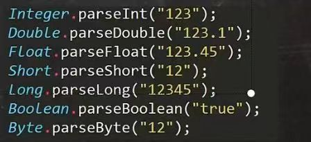
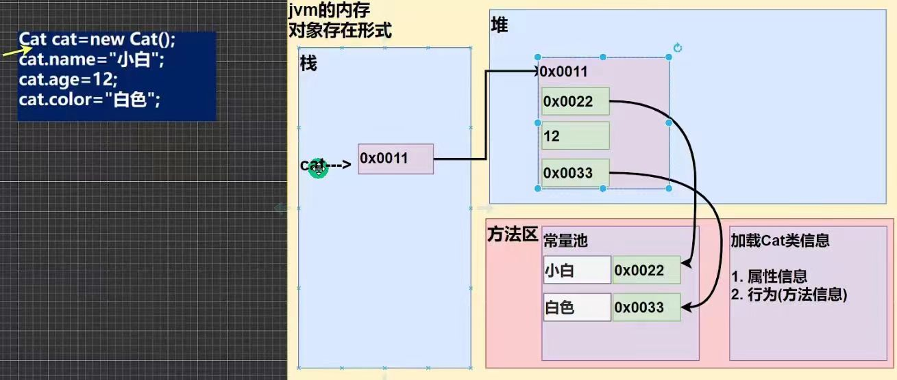

# Java基础


## 什么是JDK,JRE

JDK=JRE+Java开发工具(各种可执行程序，如javac.exe编译，java.exe运行)
用法:javac 类名.java,java 类名(不带class或java),注意大小写，以及文本与运行终端编码格式保持一致
JRE =JVM +java的核心类库

JDK:Java Development kit,java开发工具包
JRE:Java Runtime Environment,java运行环境
JVM:Java virtual machine,java虚拟机
如果想要运行一个开发好的Java程序，计算机只需要安装JRE即可

### Java转义字符

```java
\t, \n, \\, \", \', \r
```

回车\r:光标定位行开头，不换行，==idea实测“hello\r”依然输出hello,"hello\r3"却只输出3==
网址都是https://www.baidu.com/
linux系统文件路径也是斜杠'/'
windows文件路径都是C:\App\commom app\，但大多数情况正反斜杠并不严格区分

我们在平时使用电脑时，已经习惯了回车和换行一次搞定，敲一个回车键，即是回车，又是换行。

### 注释

单行注释://  Ctrl+/
多行注释:/*  Ctrl+shift+/  */
文档注释~


## 数据类型

==细节==：浮点型数据的精度要注意，通常在计算中是近似值，与实际结果有误差,可以使用==Math.abs(num1-num2)==来限制精度


字符和码值的对应关系是通过字符编码表决定的
==常见的字符编码表==
ASCII码:占一个字节，一共128个字符，实际可以表示256个字符，只用128个
Unicode字符集:其中字符的码点基本与`utf-16编码`基本一一对应(超过BMP的使用`代理对`)；字母和汉字都是占用两个字节(BMP内是两字节,超过BMP就是四字节的),

​			编码0-127的字符是与ASCII的编码一样.比如‘a'在ASCII码是0x61，在unicode码是0x0061，都对应97.因此Unicode码兼容ASCII码.

utf-8编码:大小可变得编码，字母使用1个字节，汉字使用3个字节，是使用最广的一种对Unicode字符集的编码实现方式(改进)
gbk编码:可以表示汉字，而且范围广，字母使用1个字节，汉字2个字节

### 数据类型转换


==细节==:(byte,short)和char之间不会自动转换
==细节==:byte,short,char三者可以参与计算，在计算时首先转为int类型(或者可以理解为当做int类型处理)

```java
byte b1=1;
byte b2=2;
byte b3=b1+b2;//错误，应是int类型
short s1=1;
s1=s1+2;  //错误，同理
short s2=b1+s1;//错误，应是int类型
```

==细节==:boolean类型不参与转换
==思考==:byte,short,char在初始化赋值时，右侧可以是数字，这时数字算是什么类型呢

**强制类型转换**:自动类型转换的逆过程，将容量大的数据类型转换为容量小的数据类型。使用时要加上强制转换符()，但可能造成精度降低或溢出，格外要注意
int n =(int)1.9;//结果n=1

***基本数据类型和String类型转换**：*

基本类型转String:将基本类型的值+""即可
String s1=100+"";//中间无空格
***String类型转基本数据类型:***

通过基本类型的包装类调用parseXX方法



==细节==：怎么把字符串转字符char->通常指得到某一个字符
char c1="123".charAt(0)//结果c1='1'，注意不是c1=1

### String字符串:

#### java中容易混淆的空字符串和null

“”是一个长度为 0 且占内存的空字符串，在内存中分配一个空间，可以使用 Object 对象中的方法。例如：“”.toString() 等

null 是==空引用==，表示一个对象的值，没有分配内存，调用 ==null 的字符串的方法会抛出空指针异常==。例如如下代码

```java
String str = null;
System.out.println(str.length());
```

new String(); 创建一个字符串对象的默认值为 ""，String 类型成员变量的初始值为 null。

空字符串 "" 是长度为 0 的字符串。可以调用以下代码检查一个字符串是否为空：

```java
if (str.length() == 0)  //或
```

空字符串是一个 Java 对象，有自己的串长度（0）和内容（空）。不过，String 变量还可以存放一个特殊的值，名为 null，这==表示目前没有任何对象与该变量关联==。要检查一个字符串是否为 null，要使用以下条件：

```java
 if (str == null)
```

有时要检查一个字符串既不是 null 也不为空串，这种情况下就需要使用以下条件：

```java
if (str ！= null && str.length() ！= 0)
```

注意：首先要检查 str 不为 null。如果在一个 null 值上调用方法，会出现错误。


### 算数运算符

==细节==:在%运算的本质:a%b==a-a/b*b

```java
-10%3=-10-(-10)/3*3=-1
10%-3=10-10/(-3)*(-3)=1
```


### 关系运算符

instanceof:检查是否是类的对象
"hsp" instanceof String :结果为true
==细节==:Java中的关系运算符的结果都是boolean型，要么是true，要么是false
所以C语言里面while(1)是不可行的

### 逻辑运算符

(1)短路与&&，短路或||
如果第一个条件成立，则第二个条件不会判断，效率高
(2)逻辑与&，逻辑或|
如果第一个条件成立，第二个条件也会判断
(3)!a取反; a^b逻辑异或，相同为假，不同为真
(4)用于连接多个条件(多个关系表达式)，最终的结果也是一个boolean值

### 赋值运算符

==细节==:复合赋值运算符会进行类型转换

```Java
byte b=2;
b+=3;	//相当于b=(byte)(b+3)
b++;	//相当于b=(byte)(b+1)
b=b+3;	//错误
```

### 三元运算符

```java
int result = a>b?a:b;  //表达式a,b要为可以赋给接受变量的类型（或可以自动转换）

//案例：实现三个数的最大值
int n1=55,n2=45,n3=65;

int max1 = n1>n2?n1:n2;
int max2 = max1>n3?max1:n3;

int max = (n1>n2?n1:n2) >n3? (n1>n2?n1:n2) : n3;
```

### 键盘输入语句

```java
import java.util.Scanner;   //需要导入对应包名.类名
public class 临时 {
    public static void main(String[] args) {
        //1.引入Scanner所在的包，把java.util下的Scanner类导入
        //2.创建Scanner对象
        //3.接受用户输入
        Scanner scanner = new Scanner(System.in);
        System.out.println("请输入");
        String name = scanner.next();  //next方法返回字符串
        int age = scanner.nextInt();
        double salary = scanner.nextDouble();
        System.out.println(name +" "+ age +" "+salary);
    }
}
```


### 进制转换


(1)八进制转义字符的格式为 `\` 后跟 **1-3 位八进制数字**（0-7）,限制在\000-377之间（即0-255），如果有多余的0可以省略不写，但是为了规范最好带上

(2)在 Java 中，**十六进制转义字符**`不能使用\x`后跟1-2个十六进制数字这种格式，而是使用**Unicode转义格式**，即`\u后跟4个十六进制数字`来表示十六进制字符。

​	且十六进制转义字符的`前导零不可省略`，(并不限制在0-255之间，这一点和八进制不一样)。

(3)在转义字符中，八进制被限制为1个字节，而十六进制则可以为2个字节

(3)八进制前缀0，十六进制前缀0x。八进制：int octal = 0123;  十六进制：int hex = 0x1A;

```java
//八进制
printf("\1234"); // 解析为 `\123`（字符 'S'） + `4`
printf("\23"); //可以省略0
printf("\0234");//这种就必须带上0
//十六进制
System.out.println("\u0041");//正常
System.out.println("\u45"); //错误
```


==十进制转2进制，8进制，16进制==


### 原码，反码，补码

对于有符号的而言：
1.二进制的最高位是符号位：0表示正数，1表示负数

2. 正数的原码，反码，补码都一样(三码合一)
3. ==负数的反码=它的原码符号位不变，其它位取反==
4. ==负数的补码=它的反码+1，负数的反码=负数的补码-1==
5. 0的反码，补码都是0
6. java没有无符号数，换言之，java中的数都是有符号的
7. ==在计算机运算的时候，都是以补码的方式来运算的.==
8. ==当我们看运算结果的时候，要看他的原码==

### 位运算符

Java中有7个位运算符
(1)按位与&，按位或|，按位异或^，按位取反~(注意以补码形式计算)
正数计算比较简单


负数计算要特别注意，原码->补码->原码


(2)还有3个位运算符>>、<<和>>>，运算规则：
1.算术右移>>：低位溢出，符号位不变，==本质是n/2==
2.算术左移<<：符号位不变，低位补0,==本质是n*2==
3.>>>逻辑右移也叫无符号右移，运算规则是：低位溢出，高位补0
4.特别说明：没有<<<符号

### switch分支结构

```java
switch(表达式){
       case 常量1:
        语句块;
        break;
       default:
        语句块;
        break;
}
```

1.表达式数据类型，应和case 后的常量类型一致，或者是可以自动转成可以相互比较的类型，比如输入的是字符，而常量是int

2. switch(表达式)中表达式的返回值必须是：(byte，short，int，char，enum[枚举］.String)，==注意没有浮点数==
3. case子句中的值必须是常量(或者是常量表达式)，而==不能是变量==，switch中的值是变量
4. break语句用来在执行完一个case分支后使程序跳出switch语句块；如果没有写break，程序会顺序执行到switch结尾，除非遇到break，这就会导致穿透；

理解下==switch穿透==，假如所有分支都没有break语句，如果常量1与表达式匹配，那么后续的所有语句块都会被执行，而不需要进行判断


### break与continue

break一旦执行，跳出当前switch，if，for，while语句块

break语句出现在多层嵌套的语句块中，可以通过标签指明要终止的是哪一层语句块


continue执行，用于循环语句跳出本次循环，继续执行下一次循环continue语句出现在多层嵌套的循环语句体中时，

可以通过标签指明要跳过的是哪一层循环，这个和前面的标签的使用的规则一样.


### 定义数组

### 一维数组:

使用方式1-动态初始化
int a[]=new int[5];
a[0]=1;

使用方式2-动态初始化
int a[];  //先声明再分配
a=new int[5];

使用方式3-静态初始化
int a[]={1,2,3};

==注意：==这里int[] a 与int a[]都行

==静态初始化和动态初始化的区别：==

1. 动态初始化–指定长度：在创建数组的时候，直接指定数组当中的数据元素个数

2. 静态初始化–指定内容：在创建数组的时候，不直接指定数据个数多少，而是直接将具体的数据内容进行指定

3. 虽然静态初始化是没有定义长度的，但是根据大括号里面的内容，也可以推出数组的长度，静态初始化的数组==不是没有长度的==

4. 静态初始化的定义可以拆分成两个步骤

   int[] array;
   array = new int[] {1, 2, 3};

### 二维数组:

​            

使用方式1-动态初始化

int a[] []=new int[2] [3];
a[0] [0]=1;

使用方式2-动态初始化
int a[] [];//先声明再分配
a=new int[2] [3];
==使用方式3-动态初始化，列数不确定==
int  a[] []=new int [3] [];
arr[0]=new int[1];
arr[1]=new int[2];
arr[2]=new int[3];
使用方式4-静态初始化==,列数可以不同==
int[] [] arr ={{1,2,3},{4,5},{6}};
==必须是一维数组，且数据类型相同==

#### 二位数组内存布局


#### 细节:

1.一维数组的声明方式有：
int[] x或者int x[]
2.二维数组的声明方式有：
int[] [] y或者 int[] y[] 或者 int y[] []
可以通过==数组名.length==得到数组的长度，注意length==不带括号==，==字符串长度带括号==

3.在处理基本类型数据时，比如`int [] array=new int[3];`这时候并没有为数组中的元素赋值，但是数组会把这些变量的值初始化为`int [] array=new int[]{0,0,0};`

 在处理引用类型数据时，如果程序员未提供初始值，数组会把这些变量的值初始化为null，比如`String[] strings = new String[2];`默认初始化`String[] strings = new String[]{null,null};`


4.虽然==string==底层是基于char类型的数组实现的，但他本身是一个对象==，属于引用类型，不是基本数据类型==
数组也属于引用类型，数组型数据本质是对象
==数组在默认情况下是引用传递，赋的值是地址==
int[] arr1={1,2,3};
int[] arr2=arr1;
改变任一个数组的值，另一个数组也会同时改变
还有一点，如果arr2=null,则不会影响arr1,因为arr2只是把自己的地址清空了，并没有影响堆中的数组

```java
课堂练习
    
int a[] ={1,2,3};
//a={4,5,6};  错误写法，需要重新创建对象，和字符串不同，修改的话需要用下标a[0],a[1]...
a = new int[]{4, 5, 6，7，8};
a[0]=1;

String str = "test";
str = "hahah";
//str[0]=y;  错误写法，String本质是类，不是数组,可以用str.charAt(0)获取值，但也不能修改
String[] str2 ={"abc","def"}; //字符串数组
str2[0]="aaa";
```


## 类与对象

### 创建对象的两种方式

1. 先声明再创建
Cat cat;
cat = new Cat();
2. 直接创建
Cat cat = new Cat();

#### Java内存的结构分析

1.栈：一般存放基本数据类型(局部变量)
2.堆：存放对象(Cat cat，数组等)
3.方法区：常量池(常量，比如字符串)，类加载信息

#### Java创建对象的流程简单分析

Person p = new Person();
p.name ="jack"；
p.age = 10
1.先加载Person类信息(属性和方法信息，只会加载一次)
2.在堆中分配空间，进行默认初始化(看规则)
3.把地址赋给p，p就指向对象
4.进行指定初始化，比如 p.name="jack"Ip.age=10

#### 对象内存布局



#### 方法的调用机制分析


#### 细节:

属性/成员变量/field(字段)
属性是类的组成部分，一般是基本数据类型，也可以是引用类型(对象，数组)

==对象赋值也是引用传递，赋的值是地址，同数组一样==
==方法中引用数据类型(对象，数组)的传参机制实际也是传地址==

类名为大驼峰，属性名和方法名为小驼峰
一个class文件可以有很多普通类，但只能有一个public类
如果方法是void,则方法体中可以没有return语句，或者只写return
类不带()，方法带(),
跨类调用方法时:对象名.方法名()
同一个类中方法直接调用:方法名()
如class Person{}
public void speak(){}


### 方法的使用

在方法上面”==/**+回车==“，会生成传入方法参数的注释

#### 方法的递归调用

执行一个方法时，就创建一个新的受保护的独立空间(栈空间)方法的局部变量是独立的，不会相互影响，比如n变量
==如果方法中使用的是引用类型变量(比如数组，对象)，就会共享该引用类型的数据.==
递归必须向退出递归的条件逼近，否则就是无限递归
当一个方法执行完毕，或者遇到return，就会返回，遵守谁调用，就将结果返回给谁，同时当方法执行完毕或者返回时，该方法也就执行完毕。


#### 方法重载

Java中允许同一个类中，多个同名方法的存在，但要求==形参列表不一致==(参数类型或个数或顺序，至少有一样不同，参数名无要求)，==返回类型无要求==

##### 方法签名

1）方法的签名（Method Signature） 是用来==唯一标识==一个方法的元素集合，方法签名是==区分重载方法的唯一依据。==因为它包括方法名和参数列表，这些信息在编译	时就可以唯一确定一个方法。如果两个方法具有相同的名字但参数列表不同，则它们是合法的重载。

2）方法签名的组成部分包括方法名和参数列表（包括参数的类型和顺序；但不包括参数名称，返回类型，方法修饰符，抛出的异常）

3）在调用一个方法时，编译器根据方法的签名来匹配合适的方法。

4）在接口或抽象类中，方法签名是接口方法的唯一标识。如果方法签名不匹配（例如参数类型不同），编译器会报错，因为它认为你没有正确实现接口方法。

```java
void exampleMethod(int a, String b) { }
//该方法的签名为：
exampleMethod(int, String)
------------------------------------
//在泛型方法中，签名包括泛型参数的类型定义，但泛型参数本身不影响签名。
<T> void exampleMethod(T t) { }
//方法签名为
exampleMethod(Object)
```


##### 可变参数

Java中允许将同一个类中多个同名同功能但参数个数不同的方法，封装成一个方法

形参格式为(数据类型... 形参名)

```java
public int sum(int... nums){
    //System.out.println("接收的参数个数="+ nums.length);
int res=0；
for(int i=0；i<nums.length; i++) {   
res+=nums[i];
}
return res;
}

```

##### 细节:

1)可变参数的实参可以为0个或任意多个。
2)可变参数的==实参可以为数组。==
3)可变参数的==本质就是数组.==
4)可变参数可以和普通类型的参数一起放在形参列表，但必须保证==可变参数在最后==
5)==一个形参列表中只能出现一个可变参数==

##### 作用域

全局变量：也就是属性，作用域为整个类体
局部变量：也就是除了属性之外的其他变量，作用域为定义它的代码块中!

全局变量可以不赋值，直接使用，因为有默认值，
==局部变量必须赋值后==才能使用，因为没有默认值。

属性和局部变量可以重名，访问时遵循==就近原则。==
在同一个作用域中，比如在同一个成员方法中，两个局部变量，不能重名。
属性生命周期较长，伴随着对象的创建而创建，伴随着对象的销毁而销毁。局部变量，生命周期较短，伴随着它的代码块的执行而创建，伴随着代码块的结束而销毁即在一次方法调用过程中。

全局变量/属性：可以被本类使用，或其他类使用(通过对象调用)，可以加修饰符
局部变量：只能在本类中对应的方法中使用，==不可以加修饰符==


##### 构造方法/构造器

```java
public Person(int a,int b){}
```

是类的一种特殊方法，==方法名和类名相同==，==没有返回值(也不能写void)==,在创建对象时，系统会自动的调用该类的构造器完成对对象的初始化，不能通过对象.方法名来调用。

一个类中可以定义多个不同的构造器，即==构造器重载==；如果程序员没有定义构造器，==系统会自动给类生成一个默认无参构造器==，比如==Person(){}==，使用javap指令 反编译看看 javap test.class；一旦定义了自己的构造器，默认的构造器就覆盖了，就不能再使用默认的无参构造器，除非显式的定义一下，即：Person(){}


##### this关键字

java虚拟机会给每个对象分配this,代表当前对象，两者指向地址相同，但是this不能在类定义的外部使用，对象则可以


this关键字可以用来访问本类的属性，方法，构造器

访问成员的语法：this.属性名/方法名（参数列表）

访问构造器语法：==this（参数列表）==，只能在构造器中使用（只能在构造器中访问另一个构造器），必须在构造器的第一行，不能与super同时出现在同一构造器


### 包基本语法

包的本质实际上就是创建不同的文件夹来保存类文件

命名规范：com.公司名.项目名.业务模块名


一个包下，包含很多的类，java中常用的包有：
java.lang.*/lang包是基本包，默认引入，不需要再引入，

java.util.* //util包，系统提供的工具包，工具类，使用Scanner

java.net.* //网络包，网络开发
java.awt.* //是做java的界面开发，GUI

```java
package com.hsp;  //首先表示打包，放在第一个行，

import com.xiaoqiang.Dog;
//import com.xiaoming.Dog;
//不能同时导入两个相同类名的类

public class Test{
    public void static main(String[] args){
        Dog dog =new Dog();			//由于导入了com.xiaoqiang.Dog可以不用写出完整包名.类名
        System.out.println(dog);	//com.xaioqiang.Dog@123
        com.xiaoqiang.Dog dog1 = new com.xiaoming.Dog();
        //com.xiaoqiang.Dog dog1 = new Dog();
        System.out.println(dog1);	//com.xiaoming.Dog@456
    }
}
```


#### 访问修饰符

java提供四种访问控制修饰符号，用于控制方法和属性(成员变量)的访问权限(范围)
1.公开级别：用public修饰，对外公开

2.受保护级别：用protected修饰，对子类和同一个包中的类公开
3.默认级别：没有修饰符号，向同一个包的类公开，
4.私有级别：用private修饰，只有类本身可以访问，不对外公开。


修饰符可以用来修饰类中的属性，成员方法以及类,==但是局部变量不可以==
==只有默认的和public才能修饰类==!，并且遵循上述访问权限的特点。
成员方法的访问规则和属性完全一样，

#### 封装的实现步骤

1）将属性进行私有化private 【不能直接修改属性）
2)提供一个公共的set方法，用于对属性判断并赋值

3)提供一个公共的get方法，用于获取属性的值

```java
public void setXxx(类型 参数名){}//Xxx表示某个属性//加入数据验证的业务逻辑属性=参数名；
```

```java
public XX getXxx(){ return xx; }//权限判断
```


自动生成属性的set方法，get方法的快捷键：==alt+insert,选择setter或getter==，选中相应属性

```java
class Person{
    private String name;
    private int age;
    private double salary;
    
    //构造器与set方法结合
    public Person(String name, int age, double salary){
        steName(name);
        //setAge(age);
        //setSalary(salsry);
    }
    
    public void setName(String name){
        this.name=name;
    }
    public String getName(){
        return name;
    }
}
```


#### 继承的基本语法

父类又叫超类，基类；  子类又叫派生类

==一个类只能继承一个类但能继承很多接口==

```java
public class 子类 extends 父类{}
```

1.子类继承了所有的属性和方法，public和protected都可以直接访问，==默认的需要看子类与父类是否在同一包下，private属性和方法不能在子类中直接访问，==需要通过父类提供的公共的方法去访问，

2.只要是类都需要通过构造器初始化，子类构造器一般只管自己的属性初始化，因此子类在对自己进行构造前，会先调用父类的构造器把父类那一块的内存初始化，

3.子类必须调用父类的构造器，完成父类的初始化，super()语句放在构造器第一行，所以总是先进行父类初始化后进行子类初始化,方法区的类加载和堆中内存分配顺序也是如此(注意:创建子类对象时，==父类并没有单独分配内存空间==，父类的私有属性也会在子类对象的内存中加载，但是不能访问)


```java
Son son = new Son()；//内存的布局
//-> 这时请大家注意，要按照查找关系来返回信息，可以理解为就近原则,方法与属性查找规则一样
//(1)首先看子类是否有该属性
//(2)如果子类有这个属性，并且可以访问，则返回信息；
//如果找到但是private属性，不能访问则会直接报错，不会继续往上一级父类查找，每一次查找都是如此
//(3)如果子类没有这个属性，就看父类有没有这个属性(如果父类有该属性，并且可以访问，就返回信息..)
//(4)如果父类没有就按照(3)的规则，继续找上级父类，直到Object...
System.out.println(son.name)；//返回就是大头儿子
System.out.println(son.age)；//返回的就是39
System.out.println(son.hobby);//返回的就是”旅游“
```


##### 细节

1）当创建子类对象时，不管使用子类的哪个构造器，默认情况下总会去调用父类的无参构造器(==相当于super();可以不用显示写出==)；如果==父类没有提供无参构造器==，则必须在子类的构造器中用==super去指定==使用父类的哪个构造器完成对父类的初始化工作，否则，编译不会通过

2）如果希望指定去调用父类的某个构造器，则显式的调用一下：==super(参数列表)==
super()在使用时，需要放在构造器第一行(且只能在构造器中使用，super不带括号的可以在成员方法中使用，和this一样)
super()和this()都只能放在构造器第一行，因此这两个人方法不能共存在一个构诰器(那么隐式调用super()并显示调用this()呢？)

3）==Java中所有类都是Object类的子类==，Object是所有类的基类
父类构造器的调用不限于直接父类，将一直往上追溯到Object类(顶级父类)

4）子类最多只能继承一个父类（指直接继承），即java中是单继承机制，

##### super

1.访问父类的属性，但不能访问父类的private属性
super.属性名；
2.访问父类的方法，不能访问父类的private方法
super.方法名(参数列表)；
3.访问父类的构造器(这点前面用过)：
super(参数列表)；只能放在构造器的第一句，只能出现一句!

```java
方法名();//从本类开始查找，就近原则
this.方法名();//等价于方法名
super.方法名();//跳过子类，从父类开始查找，就近原则，属性同样的规则
```

##### 方法重写/覆盖

简单的说：方法覆盖（重写）就是子类有一个方法，和父类的某个方法的==名称==，==返回类型==(方法重载对返回类型无要求)、==参数==一样，那么我们就说子类的这个方法覆盖了父类的方法

1) 子类的方法的参数，方法名称，要和父类方法的参数，方法名称完全一样。
2) 子类方法的返回类型和父类方法返回类型一样，或者是父类返回类型的子类比如 父类 返回类型是Object，子类方法返回类型是String
3) 子类方法不能缩小父类方法的访问权限，public >protected>默认>private


#### 多态

方法或对象具有多种形态，多态是建立在封装和继承基础之上的

##### 多态的具体体现

1. 方法的多态:重载和重写

2. 对象的多态（重点）

(1)一个对象的编译类型和运行类型可以不一致
(2)编译类型在定义对象时，就确定了，不能改变
(3)运行类型是可以变化的.
(4)==编译类型看定义时=号的左边，运行类型看=号的右边==

(5)多态的前提是，两个对象(类)存在继承关系

```java
Animal animal = new Dog();	//animal的编译类型是Animal，运行类型是Dog
animal = new Cat();			//animal的运行类型变成了Cat,编译类型仍然是Animal
```

```java
public void feed(Animal animal,Food food){    //这里用到了多态参数
	System.out.println("主人"+name+"给"+animal.getName()+"吃"+good.getName())
}
//形参是父类，实参是子类
//Dog dog=new Dog();
//Bone bone = new Bone();
//feed(dog,bone);  
//feed(cat,fish);
```

##### 多态的向上转型

本质：父类的引用指向了子类的对象
语法：父类类型 引用名=new 子类类型()；
特点：
1.编译类型看左边，运行类型看右边
2.==可以调用父类中的所有成员(需遵守访问权限)，不能调用子类中特有成员==；(在编译阶段，能调用那些成员，是由编译类型来决定的)
3.最终运行效果看子类的具体实现!(即==调用方法==时，按照从子类开始查找方法，这点与编译阶段不同，可以理解为运行阶段按运行类型来处理)
4.属性没有重写之说，==属性的值看编译类型==，与方法不同

```java
Base base=new Sub();//向上转型
System.out.println(base.count);// 看编译类型 10
Sub sub = new Sub();
System.out.println(sub.count);// 20

class Base {父类
int count = 10;//属性
}
class Sub extends Base {//子类
int count =20；//属性
}
```


##### 多态的向下转型

1)语法：子类类型 引用名= (子类类型)父类引用；
2)只能强转父类的引用，不能强转父类的对象
3)要求父类的引用必须指向的是当前目标子类类型的对象
4)当向下转型后，可以调用子类类型中所有的成员
5)instanceOf比较操作符，用于判断对象的==运行类型==是否为==XX类型==，或==XX类型的的子类型==，返回布尔值

测试 布尔值与int值转换

##### 动态绑定机制

1.当调用对象方法的时候，该方法会和该对象的==内存地址==/==运行类型==绑定(==重难点==)

2. 当调用对象属性时，没有动态绑定机制，哪里声明，那里使用

```java
A a = new B()；//向上转型
System.out.println(a.sum());// 30，特别注意该行代码查找方法过程
System.out.println(a.sum1());// 20
class A{
    public int i=10;

    public int sum(){
   		return getI()+10;//a.sum()时，由于方法动态绑定，会跳转B类的getI方法 返回值20+10=30，这点不好理解
	}
    public int getI(){
        return i;
	}
	public int sum1(){
		return i+10;//a.sum1()时，属性无动态绑定，返回的就是A类的i
	}
}
class B extends A{
    public int i=20;
    
//    public int sum(){
//   		return getI()+10;
//	}
    
	public int getI(){
		return i;
	}
    
//    public int sum1(){
//		return i+10;
//	}
}
```


##### 多态数组

数组的定义类型为父类类型，里面保存的实际对象为父类或子类类型

如果引用对象要使用子类的特有方法，就要用向下转型

```java
Person[] persons = new Person[5];
persons[0] = new Person("jack", 20);
persons[1] = new Student("jack", 18, 100)；
persons[2] = new Student("smith", 19, 30.1);
persons[3] = new Teacher("scott", 30, 20000);
persons[4] = new Teacher("king", 50, 25000)；
/循环遍历多态数组，调用say
for (int i = 0; i < persons.length; i++) {
	//老师提示：person[i]编译类型是 Person，运行类型是是根据实际情况有JVM来判断
    System.out.println(persons[i].say());//动态绑定机制
    
    //person[i].teach();  //直接使用编译器会报错
    //person[i].study;
    
    if(persons[i] instanceof Student) {//判断person[i]的运行类型是不是Student
        Student student=(Student)persons[i];向下转型
		student.study();
		//小伙伴也可以使用一条语句((Student)persons[i]).studyO;
	} else if(persons[i] instanceof Teacher) {
		Teacher teacher = (Teacher)persons[i];
		teacher.teach();
    }else {
	System.out.println("你的类型有误，请自己检查..");
    }
    
}
```


##### 多态参数

方法定义的形参类型为父类类型，实参类型为子类类型，前面总结多态的具体体现中的例子有用到。


#### Object类详解

##### ==和equals()方法的对比

==是一个比较运算符

1. ==：既可以判断基本类型，又可以判断引用类型

2. ==：如果判断基本类型，判断的是值是否相等。示例：int i=10；double d=10.0；i= =d 结果为true

3. \==：如果判断==引用类型==，判断的是==地址==是否相等，即判定是不是同一个对象
4. equals:是Object类中的方法，只能判断引用类型
5. equals:默认判断的是地址是否相等，但子类往往重写该方法，用于判断内容是否相等，比如Integer，String,集合类

```java
//Object中源码
public boolean equals(Object obj) {
        return (this == obj);
    }
//Intrger中源码，不常用
public boolean equals(Object obj) {
        if (obj instanceof Integer) {
            return value == ((Integer)obj).intValue();      //注意此处为 向下转型
        }
        return false;
    }
public int intValue() {
        return value;
    }


//String中equals的源码
public boolean equals(Object anObject) {
        if (this == anObject) {      //先判断对象是否相同
            return true;
        }
        return (anObject instanceof String aString)  //如果不是同一对象，就一个个字符进行比较
                && (!COMPACT_STRINGS || this.coder == aString.coder)
                && StringLatin1.equals(value, aString.value);
 }
//测试
Integer integer1=new Integer(1000)；//实际这种写法已过时
Integer integer2 =10;               //也可以这样写,这种叫做自动装箱，先简单了解
int i=10;
System.out.println(i == integer1);		//true,涉及到int与Integer自动拆包装，先简单了解
System.out.println(integer1 == integer2);		//false
System.out.println(integer1.equals(integer2));	//true


//测试		
String str1="123";
String str2=new String("123");
System.out.println(str1.equals(str2));  //true
System.out.println(str1.equals("123")); //true
```

==知识拓展==

Java为每个基本数据类型提供了封装类
为了编程的方便还是引入了基本数据类型，但是为了能够将这些基本数据类型当成对象操作，Java为每 一个基本数据类型都引入了对应的包装类型（wrapper class），int的包装类就是Integer，从Java 5开始引入了自动装箱/拆箱机制，使得二者可以相互转换。

基本数据类型: boolean，char，byte，short，int，long，float，double
封装类类型：Boolean，Character，Byte，Short，Integer，Long，Float，Double


##### hashCode()方法

返回该对象的哈希码值，两次调用同一个对象返回的哈希码值相同，不同对象哈希码值不同

哈希码值主要是根据对象地址号计算来的，不能完全将哈希值等价于地址

后面在集合中，根据需要hashCode也会重写


在 Java 中，字符串对象（`String`）的哈希值计算方式确实与其他对象有所不同。具体来说，`String` 类通过 **内容** 来计算哈希值，而不是对象的内存地址（这通常是其他类的哈希值计算方式）。这是因为在 Java 中，`String` 是不可变的，并且字符串比较是一个常见操作，因此 Java 对其进行了优化。

```java
//String 类的 hashCode() 方法是基于字符串的内容（即字符序列）来计算的，而不是基于内存地址。Java 的 String 类的 hashCode() 方法是通过
//下面公式来计算的：
public int hashCode() {
    int h = 0;
    for (int i = 0; i < value.length; i++) {
        h = 31 * h + value[i];  // value[i] 是字符数组，h 是一个逐步积累的哈希值
    }
    return h;
}

```


##### toString()方法

默认返回：全类名+@+哈希值的十六进制，不过子类往往会重写toString()方法，用于返回对象的属性信息

==getClass()== 返回此 Object 的==运行时==类型

```java
//Object中源码
public String toString(){
    return getClass().getName()+'@'+Integer.toHexString(hashCode());//全类名（包名+类名）
}
```

当==直接输出一个对象==时，toString()方法会被==默认调用==,即便重写后也一样调用

```java
System.out.println(monster);//等价于System.out.println(monster.toString());		
```

##### finalize()方法

1. 当对象被回收时，系统自动调用该对象的finalize()方法。子类可以重写该方法，做一些释放资源的操作
2. 什么时候被回收：当某个对象没有任何引用时（不会立即销毁），则jvm就认为这个对象是一个垃圾对象，就会使用垃圾回收机制来销毁该对象，在销毁该对象前，会先调用finalize()方法。
3. 垃圾回收机制的调用，是由系统来决定(即有自己的GC算法)，也可以通过System.gc()==主动触发==垃圾回收机制

```java
public class test {
    public static void main(String[] args)  {
        Car bmw = new Car("宝马");
        //这时 car对象就是一个垃圾，垃圾回收器就会回收(销毁)对象，在销毁对象前，会调用该对象的finalize方法
        //，程序员就可以在finalize中，写自己的业务逻辑代码(比如释放资源：数据库连接，或者打开文件..)
        //，如果程序员不重写 finalize，那么就会调用 Object类的 finalize，即默认处理
        //，如果程序员重写了Finalize，就可以实现自己的逻辑

        bmw = null;
        System.gc();   //主动调用垃圾回收器，但不是百分百触发,调用后不会阻塞，程序继续往下执行
        System.out.println("程序退出了");
    }
}

class Car{
    private String name;
    //属性，资源，数据库连接...
    public Car(String name) {
        this.name = name;
    }
    //重写finalize
    @Override
    protected void finalize() throws Throwable {    //jdk17等高版本版本不推荐使用，jdk1.8还能用用
        System.out.println("我们销毁汽车" + name );
        System.out.println("释放了某些资源");
    }

}
```


### 类变量(static)

定义语法:
访问修饰符 static 数据类型 变量名；[推荐]
static 访问修饰符 数据类型 变量名；
使用方式:
类名.类变量名[推荐]； 或者 对象名.类变量名 


类变量也叫静态变量/==静态属性==

1. 类变量内存布局：可以简单理解为jdk7之前在方法区，新版本jdk的在堆中,简单了解
2. ==类变量是随着类的加载而创建==，==所以即使没有创建对象实例也能通过类名.类变量名也可以访问==
3. 类变量的访问，也必须遵守相关访问权限
4. 类变量是该类所有对象共享的，而实例变量(普通属性)是每个对象独享的
5. 类变量和普通属性一样，可以不用初始化有默认值
6. 静态变量可以被继承，然后可以通过==父类类名.属性名==、==子类类名.属性名==，子类对象名.属性名三种方式来调用，同样是共享的

细节：

(1)static变量是同一个类创建的所有对象共享

(2)在类加载的时候就生成了

```java
public class test {
    public static void main(String[] args)  {
        Child child1 = new Child("小埋");
        Child child2 = new Child("小明");
        Child child3 = new Child("小李");
        //类变量，可以通过类名来访问，当然也可以通过对象名而且所有对象的类变量都共享

        System.out.println("共有"+ Person.count+"小孩加入了游戏..");   //以下都是3个小孩
        System.out.println("共有"+ Child.count+"小孩加入了游戏..");
        System.out.println("共有"+ child1.count+"小孩加入了游戏..");
        System.out.println("共有"+ child2.count+"小孩加入了游戏..");
        System.out.println("共有"+ child3.count+"小孩加入了游戏..");
    }
}
class Person{
    public static int count = 0;  //测试静态变量继承即使用方式
}
class Child extends Person{
    private String name;
    //定义一个count,是一个类变量(静态变量) static静态
    //该变量的最大最大特点就是会被Child类的所有的对象实例共享
    //public static int count = 0;
    public Child(String name){
        this.name=name;
        join();
    }
    public void join(){
        System.out.println(name+"加入了游戏..");
        count++;
    }
}

```


#### 类方法(静态方法)

定义语法：

访问修饰符 static 数据返回类型 方法名()；[推荐]
static 访问修饰符 数据返回类型 方法名()；
使用方式:

类名.类变量名[推荐]； 或者 对象名.类变量名 ，前提是满足访问修饰符的访问权限和范围


1. 类方法和普通方法都是随着类的加载而加载，将结构信息存储在方法区：

   ==类方法中无this的参数==；普通方法中隐含着this的参数

2. ==类方法中不允许使用和对象有关的关键字==，比如this和super。普通方法(成员方法)可以。

3. ==类方法(静态方法)中 只能访问 静态变量 或静态方法== 。

4. 普通成员方法，既可以访问 普通变量(方法)，也可以访问静态变量(方法)。

```java
class Child{
    public  int count = getN1();  //ok，普通属性可以引用普通方法和静态方法
    public  int count1 = getN2();  //ok
    public static int count2;
   // public static int count2 = getN1();  //报错，静态属性无法引用非静态方法
    public static int count3 = getN2();   //ok

    public int getN1(){
        return 100;
    }
    public static int getN2(){
        return 200;
    }
}
```


#### main方法

解释main方法的形式：public static void main(String[] args)

1. ==main方法是虚拟机调用==

2. java虚拟机需要调用类的main()方法，所以该方法的访问权限==必须是public==
3. java虚拟机在执行main()方法时不必创建对象，所以该方法==必须是static==
4. 该方法接收String类型的数组参数，该数组中保存执行java命令时传递给所运行的类的参数
5. java 执行的程序 参数1 参数2 参数3


细节：

1)在main()方法中，我们可以直接调用main方法所在类的静态方法或静态属性，
2)但是，不能直接访问该类中的非静态成员，必须创建该类的一个实例对象后，才能通过这个对象去访问类中的非静态成员，

==idea中配置main方法传参，点开编辑配置，在该java文件的的程序实参一栏填入参数即可==

```java
public class Test {		
        private static String name “韩顺平教育"; //静态的变量/属性
        private int n1 10000;        			//非静态的变量/属性
    
        public static void hi(） {           	//静态方法
        	System.out.println("Test的 hi方法")；
        }
                              
        public void cry() {        				//非静态方法	
        	System.out.println("Test的 cry方法”)；
        }

        public static void main(String[] args) {
        //1. 静态方法main 可以访问本类的静态成员
        System.out.println("name=" + name);
        hi();
        //2.静态方法main 不可以访问本类的非静态成员
        //System.out.printn("n1=" + n1);//错误
        //cry()；//错误
        //3.静态方法main 要访问本类的非静态成员，需要先创建对象 ，再调用即可
        Test test = new Test();
        System.out.println(test.n1);//ok
        test.cry();
        }
}
```


#### 代码块

代码化块又称为初始化块，属于类中的成员「即是类的一部分]，类似于方法，将逻辑语句封装在方法体中，通过{}包围起来。
但和方法不同，==没有方法名，没有返回，没有参数==，只有方法体，而且==不用通过对象或类显式调用==，而是==加载类时==，==或创建对象时====隐式调用==。

基本语法·
[修饰符]{
代码
}；

注意：
1)修饰符 可选，要写的话，==也只能写static==
2)代码块分为两类，使用static 修饰的叫静态代码块，没有static修饰的，叫普通代码块。
3)逻辑语句可以为任何逻辑语句(输入、输出、方法调用、循环、判断等)
4）==；==号可以写上，==也可以省略==。


##### 普通代码块 ：

1)普通代码块相当于另外一种形式的构造器(对构造器的补充机制)，可以做初始化的操作
2)场景：如果多个构造器中都有重复的语句，可以抽取到初始化块中，提高代码的重用性

类中有多个构造器时，不管调用哪个构造器，创建对象，都会先调用普通代码块的内容，即==普通代码块调用的顺序优先于构造器中的代码==(==super()除外==)


##### static代码块：

static代码块也叫静态代码块，作用就是对类进行初始化，而且它==随着类的加载而执行==，==并且只会执行一次==。如果是普通代码块，==每创建一个对象，就执行一次==。

==静态代码块，只能调用静态成员==；普通代码块可以调用任意成员，这里与类方法和普通方法是一样的

##### 类什么时候被加载

1)创建对象实例时(new) 
2)创建子类对象实例，父类也会被加载，==此时父类的静态代码块先于子类执行==
3)使用类的静态成员时（静态属性，静态方法）

普通的代码块，在创建对象实例时，或创建子类对象实例时，会被隐式的调用。被创建一次，就会调用一次。
如果只是使用类的静态成员时，普通代码块并不会执行。可以简单理解，普通代码块是构造器的补充


##### 创建一个对象时，在一个类调用顺序是：

1. 调用静态代码块和静态属性初始化（注意：静态代码块和静态属性初始化调用的优先级一样，如果有多个静态代码块和多个静态变量初始化，则按他们定义的顺序调用)

2. 调用普通代码块和普通属性的初始化(注意：普通代码块和普通属性初始化调用的优先级一样，如果有多个普通代码块和多个普通属性初始化，则按定义顺序调用

3. 调用构造方法中代码。

4. 构造器的最前面其实==隐含了super()和普通代码块的调用==；==静态相关的属性初始化、代码块，在类加载的时候就执行完毕了==，因此是优先于普通代码块和构造器执行的

5. 我们看一下创建一个子类时(继承关系)，他们的静态代码块，静态属性初始化，普通代码块，普通属性初始化，构造方法的调用顺序如下：
   1.父类的静态代码块和静态属性(优先级一样，按定义顺序执行)
   2.子类的静态代码块和静态属性(优先级一样，按定义顺序执行)
   3.父类的普通代码块和普通属性初始化（优先级一样，按定义顺序执行）

   4.父类的构造方法
   5.子类的普通代码块和普通属性初始化(优先级一样，按定义顺序执行)

   6.子类的构造方法//面试题

```java
class A{
    public A(){
        //1. super(); 在普通代码块和属性之前执行
        //2. 调用普通代码块，或属性初始化
        //3. this();  在普通代码块和属性之后执行
        //4. 构造器中代码
    }
}

```


```java
public class test {
    public static void main(String[] args)  {
        Child x = new Child();
//        1.父类静态代码块执行
//        2.静态代码块执行
//        3.父类普通代码块执行
//        4.父类构造器被调用
//        5.普通代码块执行
//        6.普通属性初始化
//        7.int构造器调用
//        8.无参构造器调用
    }
}
class Person{
    static{
        System.out.println("父类静态代码块执行");
    }
    
    {
        System.out.println("父类普通代码块执行");
    }
    public Person() {
        //隐藏普通代码块调用
        System.out.println("父类构造器被调用");
    }
}
class Child extends Person{
     static{
        System.out.println("静态代码块执行");
    }
    
    {
        System.out.println("普通代码块执行");
    }
    
    public int a =getN1();
    
    public Child() {
        //隐藏super();
        //隐藏普通代码块调用和普通属性初始化
        this(10);     	//在普通代码块和属性之后执行
        System.out.println("无参构造器调用");
    }
    public Child(int a) {
        System.out.println("int构造器调用");
    }
    public int getN1(){
        System.out.println("普通属性初始化");
        return 10;
    }
}
```


#### 单例设计模式

所谓类的单例设计模式，就是采取一定的方法保证在整个的软件系统中，对某个类只能存在一个对象实例，并且该类的方法只提供一个取得其对象实例化的方法

##### 单例模式饿汉式

步骤如下：

1. 构造器私有化,防止直接new
2. 类的内部创建对象
3. 向外暴露一个静态的公共方法getInstance

```java
public class test {
    public static void main(String[] args)  {
    //通过方法可以获取对象
    GirlFriend instance = GirlFriend.getInstance();
    //int n1 = GirlFriend.num;这样也创建了对象，但是没有使用
    }
}
class GirlFriend {
    private String name;
    private static int num;
    //将构造器私有化
    private GirlFriend(String name){
        this.name = name;
    }
    //在类的内部直接创建
    //为了能在静态方法中返回实例对象，需要将实例对象修饰为static，另一方面也可以避免无限递归导致堆栈溢出
    private static GirlFriend girl = new GirlFriend("双儿");   //由于定义了静态属性，创建对象时不会进行递归
    //提供一个公共的static方法，可以返回对象
    public static GirlFriend getInstance(){
        return girl;
    }
}
```


##### 关于在类的定义中实例化自己的问题分析

```java
1.为什么可以在类的定义中实例化自己而不会编译出错？
答：因为类A加载到JVM上，自己当然是和自己同包，所以A必然可以访问到A。
    
    原问题： 在JAVA中为什么可以在一个类当中New自己类 例如： public class A{ A a = new A();//为什么可以new自己 }
    回答：
    public class A{}
	这个是对类的一个定义，此时，A只是一个“概念”，在电脑里并没有实体存在，但是java的虚拟机（jvm）已经得知了该类的所有定义，就是说，该类被加载	 进jvm的类加载器（class loader）了，其他的类有可能访问到该A类。此时A本身就是jvm中的一个类，它自己当然是和自己同包，对不对？
	所以A必然可以访问到A
    那么public class A{ A a=new A();}
	这句话，编译期是正确的，不存在错误，所以可以声明也（被jvm认为）可以实例化。但是到了运行期，真正的跑起来的时候，它是错误的
	因为这是个迭代的死循环。

参考：https://zhidao.baidu.com/question/363152743.html

2.为什么在方法中可以实例化对象而不会递归出错？
class A {
    public A funA(){
        A a = new A();//a为局部变量
        return a;
    }
}
...main(...){
    A aa = new A();
    A bb = aa.funA();//相当于利用方法funA造了一个对象
}

答：方法是等到被调用时才去执行的、才去new对象的。同理这时可以找到类A而不会编译出错，而方法中new完后就返回a，没有其他操作了，里面的对象虽然也有此方法，但没有去调用。如果要递归，那应该是要不断用对象去调用此方法才会递归。

3.为什么属性为类自己的对象时就递归出错了？
class A {
    
    A a = new A();
}
...main(...){
    A aa = new A();//此时堆溢出
}

答：此时类A有一个属性是a ，而a是A类的，则属性a作为对象，也有一个属性a，所以当类A实例化后，每个属性a都会包含属性a，这样不断递归下去，直到堆溢出。

4.为什么属性为类自己的对象时，声明为static就不出错了？
class A {
    static A a = new A();//a为静态的属性
}
...main(...){
    A aa = new A();//完全可以
}

答：因为static随着类的加载而加载，只会加载一次，之后再造对象是共享之前的static属性的，所以就不会再去new对象了。（类似单例模式的饿汉式）

原文链接：https://blog.csdn.net/xiyangwusheng/article/details/108015626
```


##### 单例模式懒汉式


步骤如下：

1. 仍然构造器私有化,防止直接new
2. 定义一个静态属性对象
3. 向外暴露一个静态的公共方法getInstance，可以返回对象，并在方法内创建对象

```java
public class test {
    public static void main(String[] args)  {
    //通过方法可以获取对象
    GirlFriend instance = GirlFriend.getInstance();
    //int n1 = GirlFriend.num;不会创建对象
    }
}
class GirlFriend {
    private String name;
    private static int num;
    //定义一个静态属性对象
    private static GirlFriend girl;
    //将构造器私有化
    private GirlFriend(String name){
        this.name = name;
    }

    //提供一个公共的static方法，可以返回对象
    public static GirlFriend getInstance(){
        if (girl==null){
            //在类的方法创建对象
            girl = new GirlFriend("双儿");
        }
        return girl;
    }
}
```


##### 饿汉式VS懒汉式

1. 二者最主要的区别在于创建对象的时机不同：饿汉式是在类加载就创建了对象实例，而懒汉式是在使用时才创建。
2. 饿汉式不存在线程安全问题，懒汉式存在线程安全问题。(后面学习线程后，会完善一把)
3. 饿汉式存在浪费资源的可能。因为如果程序员一个对象实例都没有使用，那么饿汉式创建的对象就浪费了，懒汉式是使用时才创建，就不存在这个问题。
4. 在我们javaSE标准类中，java.lang.Runtime就是经典的单例模式。

```java
public class Runtime {
    private static Runtime currentRuntime = new Runtime();

    /**
     * Returns the runtime object associated with the current Java application.
     * Most of the methods of class <code>Runtime</code> are instance
     * methods and must be invoked with respect to the current runtime object.
     *
     * @return  the <code>Runtime</code> object associated with the current
     *          Java application.
     */
    public static Runtime getRuntime() {
        return currentRuntime;
    }

    /** Don't let anyone else instantiate this class */
    private Runtime() {}
```


#### final关键字

final可以修饰类、属性、方法和局部变量，
在某些情况下，程序员可能有以下需求，就会使用到final:

1. 当不希望类被继承时，可以用final修饰.(final修饰一个类时，表示该类不能继承)

2. 当不希望父类的某个方法被子类覆盖/重写(override)时，可以用final关键字修饰。

   (此处需要注意的一点是：因为重写的前提是子类可以从父类中继承此方法，==如果父类中final修饰的方法同时访问控制权限为private==，将会导致子类中不能直接继承到此方法，因此，此时可以在子类中定义相同的方法名和参数，此时不再产生重写与final的矛盾，而是在子类中重新定义了新的方法。（注：类的private方法会隐式地被指定为final方法）
   
3. 当不希望类的的某个属性的值被修改，可以用final修饰.

   (当final修饰一个基本数据类型时，表示该基本数据类型的值一旦在初始化后便不能发生变化；如果final修饰一个引用类型时，则在对其初始化之后便不能再让其指向其他对象了，但该引用所指向的对象的==内容是可以发生变化的==。本质上是一回事，因为引用的值是一个地址，final要求值，即地址的值不发生变化。
   
4. 当不希望某个局部变量被修改，可以使用final修饰【案例演示：final double TAX_RATE=0.08】


细节：

1. final修饰的属性又叫常量，一般用==XX_XX_XX来命名==

2. final的属性在定义时必须付初值，并且以后不能再修改，赋值可以在如下三个位置：(1)定义时；(2)构造器中；(3)代码块中

   (**final修饰一个成员变量（属性），必须要显示初始化**。这里有两种初始化方式，一种是在变量声明的时候初始化；第二种方法是在声明变量的时候不赋初值，但是要在这个变量所在的类的==所有的构造函数中==对这个变量赋初值。)

3. 如果final修饰的属性是==静态的==，那么初始化的位置==只能==是在==定义时==和在==静态代码块中==

4. final类不能继承，但是可以实例化对象

5. 如果类不是final类，但是含有final方法，则该方法虽然不能重写，但是==可以继承==

6. ==fianl不能修饰构造方法==

7. ==final和static往往搭配使用，效率更高，不会导致类加载==，底层编译器做了优化处理

8. 包装类(Integer,Double等都是final类)，String也是final类，都不能被继承

```java
class A {   
    public  static final double TAX_RATE1=0.1;  //定义时赋值
    public  final double TAX_RATE2;
    public  static final double TAX_RATE3;
    

    public A() {    //在构造器中赋值
        TAX_RATE2=0.2;
    }
    static{
        TAX_RATE3=0.3;//在代码块中赋值
    }
}
```

```java
public class test {
    public static void main(String[] args)  {
        System.out.println(A.num1);  //不会调用静态代码块
        System.out.println(A.num1);
        System.out.println(A.num2);   //会调用静态代码块
        System.out.println(A.num2);  //静态代码块只会执行一次，所以不再执行
//        结果：
//        10
//        10
//        静态代码块执行
//        20
//        20
    }
}
class A {
    public static final int num1 =10;
    public static  int num2 =20;

    static{
        System.out.println("静态代码块执行");
    }
}
```


### 抽象类

抽象类的介绍：

1. 用abstract关键字来修饰一个类时，这个类就叫抽象类。      用法： 访问修饰符 abstract class 类名{}
2. 用abstract关键字来修饰一个方法时，这个方法就是抽象方法 。用法： 访问修饰符 abstract 返回类型 方法名(参数列表)==；==//==没有方法体==
3. 抽象类的价值更多作用是在于设计，是设计者设计好后，让子类继承并实现抽象类()，==即重写抽象类==


细节：

1. 抽象类==不能被实例化==
2. 抽象类==不一定要包含abstract方法==。也就是说，抽象类可以没有abstract方法；==一旦类包含了abstract方法，则这个类必须声明为abstract== 
3. abstract==只能==修饰==类和方法==，不能修饰属性和其它的。
4. 抽象类可以有任意成员[抽象类本质还是类]，比如非抽象方法，构造器，静态属性
5. 抽象方法没有主体，即没有方法体{}
6. ==如果一个类继承了抽象类，则它必须实现抽象类的所有抽象方法==(所谓实现方法，就是有方法体，而且==要满足重写方法的条件==)，除非它自己也==声明为abstract类==
7. 抽象方法==不能使用private，final，static==来修饰（即abstract不能与private，final，static在定义方法时同时使用），因为这些关键字都是和重写相违背的。private是因为子类无法继承，自然也就不能重写；java中static方法不能被覆盖，因为方法覆盖是基于运行时动态绑定的，而static方法是编译时静态绑定的，static方法跟类的任何实例都不相关
8. 如何实现(重写)抽象方法：把抽象方法的abstract去掉，其他访问修饰符，返回类型，方法名，参数类型和个数都不能改变


#### 关于static方法不能被子类覆盖的分析

1. static方法是可以继承的，父类中的static方法，子类也可以调用
2. 子类中允许定义和父类static==方法同名，返回类型一致，并且参数类型和个数都一致==的==static方法==，并且子类对象在调用时，使用的是子类自身的。
3. static,final、private的方法也都是静态绑定,即看编译类型(动态绑定看运行类型)
4. 方法覆盖是在java继承和多态的机制下实现的，static方法不能实现动态绑定，它是静态绑定的。满足不了java多态的定义，不能称之为覆盖。
5. 静态绑定使用的是类信息，而动态绑定使用的是对象信息，即类的实例

```java
首先，static方法是可以继承的，父类中的static方法，子类也可以调用。
其次，子类中允许定义和父类static方法同名，返回类型一致并且参数类型和个数都一致的static方法，并且子类对象在调用时，使用的是子类自身的。例如：

public class Son extends Father{
    static void print(){
        System.out.println("son");
    }

    public static void main(String[] args) {
        Son son=new Son();
        son.print();
    }
}
class Father {
    static void print() {
        System.out.println("father");
    }
}

该程序结果显示为“son"，代表了son对象调用的print方法是Son类自身的，可能在这里看起来和方法覆盖一样，再来做个实验

Father son=new Son();
son.print();

此时，运行程序结果为”father"，这意味着此时的son对象调用的print方法是Father类的，表示print方法是静态绑定。

	总结：static方法，子类可以继承，也可以定义一个一模一样的方法，调用时是调用自身的。但是并不能称之为覆盖，方法覆盖是在java继承和多态的机制下实现的，而当我们将子类对象转换为父类时再次调用static方法，发现该对象调用的变为了父类自身的。这意味着static方法不能实现动态绑定，它是静态绑定的。满足不了java多态的定义，不能称之为覆盖。
    类似的，final、private的方法也都是静态绑定，二者一个不能重写，一个不能继承。

                        
原文链接：https://blog.csdn.net/qq_41286138/article/details/104619145
```


#### abstract、static、final都不能用于修饰构造方法

abstract：抽象方法只有方法的声明，没有方法的实现，实现部分让子类完成；但是构造方法是不能被子类继承，如果构造方法被abstract修饰，则子类无法完成构造方法的实现内容。
static：static和对象没有关系，但是构造方法是用于创建对象的，相互矛盾；同时static修饰的方法可以直接通过类名.静态方法名(实参)；调用，但是构造方法不允许手动调用。

final：final方法是约束子类不能覆盖，但是构造方法本身不允许子类继承。谈不上覆盖。（构造方法不是通过覆盖得到的，所以没必要用final修饰）


#### 模板设计模式

```java
public class test {
    public static void main(String[] args)  {

        A a = new A();
        B b = new B();
        a.calculateTime();
        b.calculateTime();
    }
}
abstract class  TestTemplate {
   public abstract void job();//抽象方法
   public void calculateTime(){
       long start = System.currentTimeMillis(); //得到时间(ms)
       job();  //动态绑定机制
       long end = System.currentTimeMillis();
       System.out.println("任务执行时间"+(end-start));
   }

}
class B extends TestTemplate{
    //计算任务1+......+n
    @Override
    public void job() {
        long num=0;
        for (int i = 0; i < 1000000; i++) {
            num+=i;
        }
    }
}
class A extends TestTemplate{
    @Override
    public void job() {
        long num=0;
        for (int i = 0; i < 8000000; i++) {
            num+=i;
        }
    }
}

```


### 接口

接口就是给出一些没有实现的方法，封装到一起

接口语法： interface 接口名{}，接口中可以有属性，方法；补充：在jdk7前，接口里的所有方法都没有方法体，只能是抽象方法；jdk8后接口类可以有静态方法，默		  认方法，也就是接口中可以有方法的具体实现，默认方法需要使用==default==关键字修饰

使用方法： class 类名 implements 接口名{}，里面有自己的属性和方法，以及必须实现的接口的抽象方法


细节：

1. 接口中所有的方法都是public，抽象方法的abstract可以省略，public也可以省略。接口中抽象方法void say()；，在类中应该是==public== void say(){}
2. 接口不能被实例化
3. 一个普通类实现接口，就必须把接口的所有抽象类都实现
4. 抽象类实现接口，可以不实现接口的抽象方法
5. 一个类可以同时实现多个接口，但必须实现所有接口中的抽象方法
6. ==接口中的属性只能是final，而且是public static final修饰符==。比如：int a=1;实际上是public static final int a=1;因此必须初始化
7. 接口中属性的访问形式：接口名.属性名
8. 接口不能继承其他的类，但是可以继承多个别的接口   interfacce IA ==extends== IB,IC{};类和接口之间是实现，接口与接口之间是继承
9. ==接口的修饰符只能是public和默认==，这点和类的修饰符是一样的

```java
//接口简单使用，快速入门
public class test {
    public static void main(String[] args)  {
        Phone phone = new Phone();
        Camera camera = new Camera();
        Computer computer = new Computer();
        computer.work(phone);
        System.out.println(UsbInterface.a) //接口名.属性名访问

    }
}

interface UsbInterface {  //定义接口
    int a=1; //实际上是public static final int a=1
    void  start();  
    public abstract void stop();
}

class Computer{
    //编写一个方法，类似多态继承的向上转型
    public void work(UsbInterface usbInterface){  //接口的多态特性
        usbInterface.start();
        usbInterface.stop();
    }
}

class Phone implements UsbInterface{
    @Override
    public void start() {
        System.out.println("手机开始工作");

    }

    @Override
    public void stop() {
        System.out.println("手机停止工作");
    }
}
class Camera implements UsbInterface{
    @Override
    public void start() {
        System.out.println("相机开始工作");
    }

    @Override
    public void stop() {
        System.out.println("相机停止工作");
    }
}
```

```java
课堂练习

interface A{
int a=23;//等价 public static final int a = 23;
}
class B implements A{//正确
}
main中：
B b=new B()://ok
System.out.println(b.a);//23
System.out.println(A.a);//23
System.out.println(B.a);//23
语法是否正确，如果正确，输出什么?
```

==接口的多态==

1. 多态参数，如上面代码的 public void work(UsbInterface usbInterface){...},既可以接受手机对象，又可以接受相机对象
2. 多态数组
3. 接口的多态传递，与接口的继承有关，==类必须实现所有接口的抽象方法==

```java
//接口简单使用，快速入门
public class test {
    public static void main(String[] args)  {
        //1.多态参数，向上转型
       Usb usb = new Phone();
       usb = new Camera();

       //2.多态数组
       Usb usbs[] = new Usb[2];
       usbs[0]=new Phone();
       usbs[1]=new Camera();
       //usbs[0].call;和类的向上转型一样，无法访问子类特有的方法
       Phone phone = (Phone)usbs[0];
       phone.call();   //向下转型后就可以访问到了
        
        //3.多态传递
        TI ti = new Phone();  //接口Usb传递给TI，如果TI中有抽象方法，Phone和Camera都必须要实现
        
    }
}
interface TI{}  //测试多态传递定义的接口
interface Usb extends TI { } //定义接口，注意是继承

class Phone implements Usb{
    public void call(){
        System.out.println("手机可以打电话");
    }
}
class Camera implements Usb{}
```

```java
课堂练习
    
interface A{
    int x = 0；//想到 等价public static final int x = 0;
} 
class B{
    int x =1; //普通属性
}
class C extends B implements A {
    public void pX() {
        //System.out.println(x);//错误，原因不明确X
        //可以明确指定，访问接口的x就用A.x;访问父类的x就用super.x
        System.out.println(A.x +""+super.x);
    }
    public static void main(String[] args) {
        new C().pX(); //对于普通方法，通过实例化对象调用
    }
}
```


### 内部类

基本介绍
一个类的内部又完整的嵌套了另一个类结构。被嵌套的类称为内部类(inner class)嵌套其他类的类称为外部类(outer class)。是我们类的第五大成员【思考：类的五大成员是哪些?[属性、方法、构造器、代码块、内部类]】，==内部类最大的特点就是可以直接访问私有属性==，并且可以体现类与类之间的包含关系

基本语法
class Outer{ //外部类

​	class Inner{//内部类

​	} 

}

class Other{//外部其他类

} 

```java
快速入门
    
class Outer{
    private int n1 = 100;  //属性
    public Outer (int n1){  //构造器
        this.n1=n1;
    }
    public void m1(){  //方法
        System.out.println("m1()");
    }
    {  //代码块
        System.out.println("代码块");
    }
    class Inner{   //内部类
    }
}
```


#### 内部类的分类

定义在外部类局部位置上 比如方法，代码块内：
1)局部内部类(有类名)
2)匿名内部类(没有类名，重点)

定义在外部类的成员位置上：
1)成员内部类(没用static修饰)
2)静态内部类(使用static修饰)


#### 局部内部类

说明：局部内部类是定义在外部类的局部位置，比如方法中，代码块中并且有类名。

1. 局部内部类可以直接访问外部类的所有成员，包含私有的

2. 不能添加访问修饰符，因为它的地位就是一个局部变量。局部变量是不能使用修饰符的。但是可以使用final 修饰，因为局部变量也可以使用final

3. 作用域：仅仅在定义它的方法或代码块中。==在方法内先创建对象，再访问局部内部类的成员，==必须在作用域内

4. 如果外部类和局部内部类的成员重名时，默认遵循就近原则，如果想访问外部类的成员，则可以使用（外部类.this.成员）去访问,==那如果方法的局部变量与局部内部类的成员重名时，有该怎么处理呢？==

5. 局部内部类中除了可以访问外部类的所有成员，还可以访问==所在方法的final变量==或参数，但是==局部内部类无法访问同名局部变量==

   JDK1.7之前要访问的局部变量必须用final修饰——即变为常量
   JDK1.8及以后将自动添加final——即编程序时可以不写final==，编译自动添加==

   


```java

public class test {
    public static void main(String[] args)  {
        Outer outer = new Outer();
        outer.m1();
        System.out.println("outer的hashcode="+outer);
    }
}

class Outer{
    private int n1 = 100;
    private void m2(){
        System.out.println("m2()执行");
    }
    public void m1(){
       int n1 = 300;
       final class Inner{
            private int n1 = 200;
            public void f1(){
                System.out.println("n1="+n1); 
                //如果外部类和局部成员类的成员重名时，默认遵循就近原则，如果想访问外部类的成员，则可以使用（外部类.this.成员）去访问
                //Outer.this本质就是外部类的对象，即哪个对象调用了m1(),Outer.this就是哪个对象
                System.out.println("外部类的n1="+Outer.this.n1);
                System.out.println("Outer.this的hashcode="+Outer.this);
                m2();  //局部内部类可以直接访问外部类的所有成员，包含私有的
            }
        }
        //class A extends Inner{};如果Inner不加final修饰符，可以被继承
        //外部类中，可以创建Inner对象,然后调用方法即可
        Inner inner = new Inner();
        inner.f1();
    }
}
```


#### 匿名内部类

匿名内部类基本语法，返回值为一个对象 ==接口能接收参数吗？==

new 接口或类(参数列表){    

​	类体

}；==注意分号==，这里只是语句的分号

```java
//1.基于接口的匿名内部类
//2.基于类的匿名内部类，注意这里用的不是抽象类，当然抽象类也是一样的，只是必须去实现抽象类所有的抽象方法
public class test {
    public static void main(String[] args)  {
        Outer outer = new Outer();
        outer.method();
    }
}

class Outer{
    private int n1 = 100;
    public void method(){
        //传统方法，写一个类实现该接口，并创建对象
        //IA tiger = new Tiger();
        //tiger.cry();

        //需求:Tiger类只使用一次，后面不再使用，可以使用匿名内部类来简化
     
        /*
             我们看底层,系统实现匿名内部类，并分配类名Outer$1
             class XXXX implements IA{
                     @Override
                    public void cry() {
                    System.out.println("老虎叫唤...");
                    }
             }
        */
		 //tiger的编译类型: IA , tiger的运行类型:匿名内部类 XXXX=>Outer$1
        //jdk底层在创建了匿名内部类Outer$1后就立即马上创建了Outer$1的实例，并且把地址返回给tiger
        //基于接口的匿名内部类
        IA tiger = new IA(){
            @Override
            public void cry() {
                System.out.println("老虎叫唤...");
            }
        };  //注意要加分号，相当于一条语句 IA tiger = 返回值；
        System.out.println("tiger的运行类型="+tiger.getClass());
        tiger.cry();


        
        /*
            底层会创建匿名内部类 XXXX=>Outer$2A
            class XXXX extents Father{
            	 public XXXX(String name){
                      super(name);
                }
                 @Override
                public void test() {
                    System.out.println("匿名内部类重写了test方法");
                }
            }
        */
        //编译类型Father，运行类型是匿名内部类Outer$2
        //基于非抽象类的匿名内部类
        //参数列表传递给Father的构造器，相当于 Father father = new 子类("jack")；
        Father father = new Father("jack"){
			//应该会有子类的构造器，只是没显示
            @Override
            public void test() {
                System.out.println("匿名内部类重写了test方法");
            }
        };
        //Father father = new Father("jack");//编译和运行类型都是Father
        System.out.println("father对象的运行类型="+father.getClass());
        father.test();  //动态绑定
    }
}
interface IA{
    public void cry();
}
class Tiger implements IA{
    @Override
    public void cry() {
        System.out.println("老虎叫唤...");
    }
}
class Father {
    public  Father(String name){
        System.out.println("接收到name="+name);
    } //构造器
    public  void test(){} //方法
    public  void test2(){} //方法
}
```


#### 成员内部类

说明：成员内部类是定义在外部类的成员位置，并且没有static修饰

1. 可以直接访问外部类的所有成员，包括私有的
2. 可以添加任意的访问修饰符，因为它本身就是一个成员
3. 作用域：和外部类的其他成员一样，在外部类的成员方法中创建成员内部类对象，再调用内部类的方法或属性，==同样包括私有属性和方法==
4. 外部其他类，==使用成员内部类的三种方式==看代码
5. 如果外部类和内部类的成员重名时，内部类访问遵循就近原则，如果想访问外部类的成员，可以使用(外部类.this.成员)访问

```java
public class test {
    public static void main(String[] args)  {
        Outer outer = new Outer();
        
        //外部其他类，使用成员内部类的三种方式
        // Outer.Inner inner = new Outer.Inner(); 不能这样使用，这是静态内部类的使用方式
         //Outer.Inner inner = Outer.new Inner();显然也是错误的

        //第一种方式
        //相当于把new Inner()当做是outer的成员，这就是个语法不用特别纠结
        Outer.Inner inner = outer.new Inner();

        //第二种方式，在外部类中，编写一个方法可以返回Inner对象
        Outer.Inner inner2 = outer.getInner();
        inner.say();
        //第三种方式,本质上和第一种一样
        Outer.Inner inner3 = new Outer().new Inner();

    }
}

class Outer{
    private int n1 = 100;
    public  String name = "张三";
    public class Inner{
        private int num=20;
        public void say(){
            System.out.println("n1="+n1+"  name="+name);
        }
    }
    public void t1(){
        //使用内部成员类
        Inner inner = new Inner();
        inner.say();
        System.out.println(inner.num); //外部类可以访问内部类的私有成员
    }
    public Inner getInner(){
        return new Inner();
    }
}
```


#### 静态内部类

说明：成员内部类是定义在外部类的成员位置，有static修饰

1. 可以直接访问外部类的所静态有成员，包括私有的，但不能直接访问非静态成员
2. 外部其他类使用内部类,三种方式
3. 如果外部类和内部类的成员重名时，内部类访问遵循就近原则，如果想访问外部类的成员，可以使用(==外部类.成员==)访问，毕竟能在静态内部类被直接访问的外部类成员都是静态成员

```java
public class test {
    public static void main(String[] args)  {
        Outer outer = new Outer();
        //Outer.Inner inner = outer.new Inner();//不能这样使用，这是成员内部类的使用方式、
        //Outer.Inner inner = Outer.new Inner(); 这个为什么不行？？？
        
        //第一种方式
        //静态内部类类可以通过外部类名直接访问(前提满足访问权限)
        Outer.Inner inner1 = new Outer.Inner();
        inner1.say();
        //第二种方式，在外部类中，编写一个方法可以返回Inner对象
        Outer.Inner inner2 = outer.getInner();
        inner2.say();
        //第三种方式，在外部类中，编写一个静态方法可以返回Inner对象,静态方法只能返回静态对象
        Outer.Inner inner3 = Outer.getInner2();
        inner3.say();
    }
}

class Outer{
    private static int n1 = 100;
    public static String name = "张三";
    public static class Inner{
        private int n1=200;
        public void say(){
            System.out.println("n1="+n1+"  name="+name);
            System.out.println("外部类n1="+Outer.n1); //外部类名.成员名
        }
    }
    public Inner getInner(){
        return new Inner();
    }
    public static Inner getInner2(){  //静态方法只能返回静态对象
        return new Inner();
    }
}
```


### 泛型类

1. 泛型又称参数化类型，是Jdk5.0出现的新特性。解决数据类型的安全性问题。在类声明或实例化时只要指定好需要的具体的类型即可。
2. Java泛型可以保证如果程序在编译时没有发出警告，运行时就不会产生ClassCastException异常。同时，代码更加简洁、健壮
3. 泛型的作用是：可以在类声明时通过一个标识表示类中某个属性的类型，或者是某个方法的返回值的类型，或者是参数类型。


泛型的声明:

interface 接口\<T>{} 和class 类<K,V>{}

其中，T，K，V不代表值，而是表示类型

任意字母都可以，常用T表示，是Type的缩写


泛型的实例化：

要在类名后面指定类型参数的值(类型)。如：
1) List\<String> strList = new ArrayList\<String>(); 
2) Iterator\<Customer> iterator = customers.iterator();

```java
定义一个泛型类
    
public class test {
    public static void main(String[] args) {

        //注意，特别强调： E具体的数据类型在定义Person对象的时候指定,即在编译期间，就确定E是什么类型
        Person<String> person = new Person<String>("韩顺平教育");
        person.show(); //String

        Person<Integer> person2 = new Person<Integer>(100);
        person2.show();//Integer
    }
}
//泛型的作用是：可以在类声明时通过一个标识表示类中某个属性的类型，
// 或者是某个方法的返回值的类型，或者是参数类型
class Person<E> {
    E s ;//E表示 s的数据类型, 该数据类型在定义Person对象的时候指定,即在编译期间，就确定E是什么类型

    public Person(E s) {//E也可以是参数类型
        this.s = s;
    }

    public E f() {//返回类型使用E
        return s;
    }

    public void show() {
        System.out.println(s.getClass());//显示s的运行类型
    }
}
```

```java
泛型入门

public class test {
    public static void main(String[] args) {

        //使用传统的方法来解决===> 使用泛型
        //老韩解读
        //1. 当我们 ArrayList<Dog> 表示存放到 ArrayList 集合中的元素是Dog类型 (细节后面说...)
        //2. 如果编译器发现添加的类型，不满足要求，就会报错
        //3. 在遍历的时候，可以直接取出 Dog 类型而不是 Object
        //4. public class ArrayList<E> {} E称为泛型,那么 Dog->E
        ArrayList<Dog> arrayList = new ArrayList<Dog>();
        arrayList.add(new Dog("旺财", 10));
        arrayList.add(new Dog("发财", 1));
        arrayList.add(new Dog("小黄", 5));
        //假如我们的程序员，不小心，添加了一只猫,就会报错
        //arrayList.add(new Cat("招财猫", 8));
        System.out.println("===使用泛型====");
        for (Dog dog : arrayList) {
            System.out.println(dog.getName() + "-" + dog.getAge());
        }
  }
}

class Dog {
    private String name;
    private int age;
    public Dog(String name, int age) {
        this.name = name;
        this.age = age;
    }

    public String getName() {
        return name;
    }

    public int getAge() {
        return age;
    }
}

class Cat { //Cat类
    private String name;
    private int age;
    public Cat(String name, int age) {
        this.name = name;
        this.age = age;
    }
}
```


#### 泛型细节：

1. interface List<T>,public class HashSet<E>..等等说明：==T，E只能是引用类型==,泛型只能接受类，所有的基本数据类型必须使用包装类 
   List<Integer> list=newArrayList<Integer>(0://OK

   list.add(new Integer("10"));

   list.add(10) //ok,自动装箱

   List<int> list2=newArrayList<int>(0;//错误

2. 在给泛型指定具体类型后，可以传入==该类型==或者其==子类类型==

3. 泛型使用形式
   List<Integer>list1=newArrayList<Integer>();
   List<Integer>list2=newArrayList<>();  //右边可以省略，但是有<>

4. 如果我们这样写List list3=new ArrayList()；默认给它的泛型是[<E>E就是Object]

5. 泛型类型参数是用尖括号 `< >` 包裹的符号，泛型类型参数是 Java 泛型编程的一部分，用于在定义类、接口或方法时引入 **类型参数**

   泛型类型参数声明在类名或接口名之后、声明在方法的返回类型之前

   ```java
   //泛型类或接口
   public class Box<T>
   //在 Box<T> 中，T 是泛型类型参数，在运行时会被具体的类型（如 String 或 Integer）替代。
   ------------------------
   //泛型方法
   public static <T> void printArray(T[] array)
   //在方法 printArray(T[] array) 中，T 是方法的泛型类型参数，用于表示数组中元素的类型
   ```

   


#### 自定义泛型类

基本语法：class 类名<T,R，M...>{成员}

1. 普通成员可以使用泛型(属性、方法),方法的参数和返回类型都可以使用泛型
2. ==使用泛型的数组，不能初始化==，具体看后面的《泛型擦除》
3. 静态方法中不能使用类的泛型
4. 泛型类的类型，是在创建对象时确定的(因为创建对象时，需要指定确定类型)
5. 如果在创建对象时，没有指定类型，默认为Obiect


```java
T[] arr = new T[10]; // 错误：不能创建泛型数组

T[] arr = (T[]) Array.newInstance(T.class, 10);//可以， 使用反射机制创建一个类型为 T 的数组，长度为 10

```


为什么不能创建泛型化数组呢？

[参考博客]: https://blog.csdn.net/codejas/article/details/89705168	"涉及到反射，泛型擦除"


#### 自定义泛型接口

基本语法：interface 接口名<T,R,M...>{}

1. 接口中，静态成员也不能使用泛型(这个和泛型类规定一样)，注意接口中的属性都为public static final；

2. 泛型接口的类型，在==继承接口==(接口之间)或者==实现接口==(接口与类之间)时确定

   ```java
   interface IA extends IUsb<String,Double>{}
   class AA implements IA{
       //实现方法
   }
   class BB implements IUsb<Integer,Float>{
       //实现方法
   }
   class CC implements IUsb{} //默认Object类型，最好用IUsb<Object,Object>
   interface IUsb<U,R>{}
   ```

3. 没有指定类型，默认为Object


#### 自定义泛型方法

基本语法：修饰符==<T,R,M...>== 返回类型 方法名（参数列表）{}

1. 泛型方法，可以定义在普通类中，也可以定义在泛型类中
2. 当泛型方法被调用时，类型会确定 //当调用方法时，传入参数，编译器就会自动确定类型，如car(10,1.9);car("book",123)
3. public void eat(E e)，修饰符后没有<T，R..>，eat方法==不是泛型方法，而是使用了泛型==，使用的是类声明的泛型
4. 泛型方法，可以使用类声明的泛型，也可以使用自己声明的泛型
   public <k> void hello(R r,K k){}  //这里R就是类声明的泛型，K就是自己声明的泛型

```java
public class Example<E> { // 类级别声明 E 为泛型
    public void eat(E e) {
        System.out.println("Eating: " + e);
    }
}
//使用
Example<String> example = new Example<>();

example.eat("Apple"); // 输出：Eating: Apple
-------------------------------------------------------

public class Example {   //方法级别的声明泛型参数
    public <E> void eat(E e) {
        System.out.println("Eating: " + e);
    }
}
//使用
Example example = new Example();
example.eat("Apple"); // 输出：Eating: Apple
example.eat(123);     // 输出：Eating: 123
```


参考：

[深入理解泛型(经典详解)：＜T＞ T 和 T的使用以及public ＜E＞ List＜E＞ get()泛型方法详解、类型擦除、通配符的使用、泛型类的应用、泛型之间的继承_泛型t-CSDN博客](https://blog.csdn.net/Sunshineoe/article/details/110162807)


#### 泛型的继承和通配符

1)==泛型不具备继承性==  

  	List<Object> list=new ArrayList<String>();//错误
  	List<String> list1=new ArrayList<String>();//ok


2)<?>：支持任意泛型类型  // ?通配符，取出时，就只能是Object

3)<?extendsA>：支持A类以及A类的子类，规定了泛型的上限   //取出时可以是AA或Object

4)<?superA>：支持A类以及A类的父类，不限于直接父类，规定了泛型的下限    //取出时，就只能是Object

5)原始类型 List：`List 是没有泛型参数的，可以容纳任何类型的对象`,`并不和List<Object>等价`，通过这种方式，可以绕过编译时的类型检查，但丧失了类型安全性。

6）Junit单元测试框架:使用==@Test来测试非静态方法== 选择org.junit.jupiter.api.Test;==在main方法之外==

​	注意添加下面这两个库文件，默认是没有的，需要先import org.junit.jupiter.api.Test; 然后手动导入


```java

public class test{
    public static void main(String[] args) {

        //举例说明下面三个方法的使用
        List<Object> list1 = new ArrayList<>();
        List<String> list2 = new ArrayList<>();
        List<AA> list3 = new ArrayList<>();
        List<BB> list4 = new ArrayList<>();
		
        //List<Object> list6 = list4;  //no
        List<Object> list6 = (List) list4; //ok，
        List list7 = list4;    //ok
        List list =new ArrayList<AA>();  //ok
        //List<Object> list0 =new ArrayList<AA>();//no

        //如果是 List<?> c ，可以接受任意的泛型类型
        printCollection1(list1);
        printCollection1(list2);
        printCollection1(list3);
           
    }
    
    @Test  //使用@Test来测试非静态方法 选择org.junit.jupiter.api.Test;
    public  void m1(){
        System.out.println("hahahhahha");
    }
    @Test
    public  void m23(){
        System.out.println("hahahhahha");
    }


    //说明: List<?> 表示 任意的泛型类型都可以接受,  
    //(list c)也行啊，但是list<Object> c就不行，具体看后面的《通配符细节》
    public static void printCollection1(List<?> c) {
        System.out.println("类型"+c.getClass());
        for (Object object : c) { // ?通配符，取出时，就只能是Object
            //System.out.println(object);

        }
    }

    //说明： ? extends AA 表示 上限，可以接受 AA或者AA子类
    public static void printCollection2(List<? extends AA> c) {
        for (AA object : c) {      //取出时可以是AA或Object
            //System.out.println(object);
        }
    }

    //说明：? super 子类类名AA:支持AA类以及AA类的父类，不限于直接父类，规定了泛型的下限
    public static void printCollection3(List<? super AA> c) {
        for (Object object : c) {   //取出时，就只能是Object
            //System.out.println(object);
        }
    }
}
class AA {
}

class BB extends AA {
}

class CC extends BB {
}

```

#### 通配符细节

**List、List<Object>、List<?>** 的三者的区别

**List、List<Object>、List<?>**

- **List** ：完全没有类型限制和赋值限定。
- **List<Object>** ：看似用法与List一样，但是在**接受其他泛型赋值时**会出现编译错误。
- **List<?>**：是一个泛型，在没有赋值前，表示可以接受任何类型的集合赋值，但赋值之后不能往里面随便添加元素，但可以remove和clear，并非**immutable(不可变)集合**。List<?>一般作为参数来接收外部集合，或者返回一个具体元素类型的集合，也称为**通配符集合**。

代码验证：    

```java

public class TestArrayList {
    public static void main(String[] args) {
    
        //第一段：泛型出现之前集合定义方式
        List a1 =new ArrayList();
        a1.add(new Object());
        a1.add(new Integer(10));
        a1.add(new String("string"));
        
        //第二段：把a1引用赋值给a2,(a2与a1的区别是增加了泛型限制)
        List<Object> a2 =a1;
        a2.add(new Object());
        a2.add(new Integer(20));
        a2.add(new String("string2"));
        a2.add(25);
        //List<Object> 接受其他泛型赋值时,会报异常（因为在下面例子中List<Integer>不能转为List<Object>）
        List<Integer> aint = new ArrayList<Integer>();
        List<Object> a22 =aint;//error：Type mismatch: cannot convert from List<Integer> to List<Object>
        
        //第三段：把a1引用赋值给a3,（a3与a1的区别是增加了泛型<Integer>）
        //此时如果遍历a3则会报类型转换异常ClassCastException
        List<Integer> a3 = a1; 
        a3.add(new Integer(20));
        //下面两行编译出错，不允许增加非Integer类型进入集合
        a3.add(new Object());//error
        a3.add(new String("string2"));//error
        //The method add(Integer) in the type List<Integer> is not applicable for the arguments (Object)
        
        //第四段：把a1引用赋值给a4,a4与a1的区别是增加了通配符
        List<?> a4 = a1;
        //允许删除和清除元素
        a4.remove(0);
        a4.clear();
        //下面编译错误，不允许添加任何元素
        a4.add(new Object());
        a4.add(new Integer(20));
        a4.add(new String("string2"));
        //The method add(capture#3-of ?) in the type List<capture#3-of ?> is not applicable for the arguments (Object)
    }
}
```

#### 上下限通配符细节1


> 上界通配符（`<? extends T>`）
>
> - **定义**：表示类型为T或T的子类。
> - **读操作**：允许读取数据为T类型，因为类型安全，读取的元素必定是T或其子类，可以安全地赋值给T类型的变量。
> - **写操作**：不允许写入数据（`null`除外），因为具体类型未知，可能是T的任何子类，无法确保类型安全。
>
> ---
>
> 下界通配符（`<? super T>`）
>
> - **定义**：表示类型为T或T的父类。
> - **写操作**：允许写入T类型或其子类的对象，因为类型为T或T的父类，可以安全地接受T类型的对象。
> - **读操作**：读取时只能确保是`Object`类型，因为具体类型未知，可能是T的任何父类，无法安全地转换为更具体的类型。

**上限通配符<? extends T>与下限通配符<? super T>** 

**List** 最大的问题是只能放置一种类型，如果随意转变类型的话，就是**破窗理论**，泛型就失去了意义。为了放置多种受泛型约束的类型，出现了 **<? extends T>与<? super T>** 两种语法。简单来说， **<? extends T> 是Get First，适用于，消费集合元素的场景；<? super T>是Put First，适用于，生产集合元素为主的场景。**

- **<? extends T>** ：可以==赋值给任意==T及T的子类集合，上界为T，取出来的类型带有泛型限制，向上强制转型为T。null 可以表示任何类型，所以除null外，任何元素都**不得添加**进<? extends T>集合内。

  （原因分析：当你声明 `<? extends T>` 时，编译器并不知道具体的类型参数到底是什么。它只是知道该类型是 `T` 或 `T` 的子类。因此，向其中添加元素可能会导致 **类型不匹配的错误**）
- **<? super T>** : 可以==赋值任意==T及任何T的父类集合，下界为T。再生活中，投票选举类似于<? super T>的操作。选举投票时，你只能往里投票，取数据时，根本不知道时是谁的票，相当于**泛型丢失**。

<? extends T>的场景是**==put功能受限==**，而<? super T>的场景是**==get功能受限==**。

```java
import java.util.ArrayList;
import java.util.List;
class Animal{}
class Cat extends Animal{}
class Garfield extends Cat{}
 
//用动物，猫，加菲猫的继承关系说明extends与super在集合中的意义
public class AnimalCatGarfield {
    public static void main(String[] args) {
        //第一段：声明第三个依次继承的集合：Object>动物>猫>加菲猫  三个泛型集合可以理解为三个不同的笼子
        List<Animal> animal = new ArrayList<Animal>();        //动物
        List<Cat> cat = new ArrayList<Cat>();                 //猫
        List<Garfield> garfield = new ArrayList<Garfield>();  //加菲猫
        
        animal.add(new Animal());
        cat.add(new Cat());
        garfield.add(new Garfield());
        
        //第二段：测试赋值操作  以Cat为核心，因为它既有子类又有父类
        List<? extends Cat> extendsCatFromAnimal = animal;//error,编译出错。只能赋值Cat或Cat子类集合
        List<? super Cat> superCatFromAnimal = animal;//ok
        
        List<? extends Cat> extendsCatFromCat = cat;//ok
        List<? super Cat> superCatFromCat = cat;//ok
        
        List<? extends Cat> extendsCatFromGarfield = garfield;//ok
        List<? super Cat> superCatFromGarfield = garfield;//error,编译出错。只能赋值Cat或着Cat父类集合
        
        //第三段：测试add方法，因为没有类型下限，多态行不通
        //下面三行中所有的<? extends T>都无法进行add操作，编译出错
        extendsCatFromCat.add(new Animal());//error
        extendsCatFromCat.add(new Cat());//error
        extendsCatFromCat.add(new Garfield());//error
        extendsCatFromCat.add(null);//ok
        
        //下行编译出错。只能添加Cat或者Cat的子类集合。因为类型下限是List<Cat>
        superCatFromCat.add(new Animal()); //error
        superCatFromCat.add(new Cat());    //ok
        superCatFromCat.add(new Garfield());//ok
        
        //第四段：测试get方法
        //所有的super操作能够返回元素，但是泛型丢失，只能返回object对象
        Object object1 = superCatFromCat.get(0);//ok
        Animal object = superCatFromCat.get(0); //error
        Cat object3 = superCatFromCat.get(0);   //error
        //Type mismatch: cannot convert from capture#8-of ? super Cat to Animal
        
        //以下extends操作能够返回元素
        Animal catExtends3 = extendsCatFromCat.get(0);
        Object catExtends2 = extendsCatFromCat.get(0);
        Cat catExtends1 = extendsCatFromCat.get(0);
        
        //下行编译错误。虽然Cat集合从Garfield赋值而来，但类型擦除后，是不知道的
        Garfield cat2 = extendsCatFromGarfield.get(0);//error,只能返回Cat自身及其父类对象
        Cat cat3 = extendsCatFromGarfield.get(0);  //ok
    }
}
```

#### 上下限通配符细节2

| 特性         | `<? extends Cat>`                     | `<M extends Cat>`                     |
| ------------ | ------------------------------------- | ------------------------------------- |
| **含义**     | 一个未知类型，是 `Cat` 或其子类       | 一个具体的类型参数，是 `Cat` 或其子类 |
| **使用场景** | 只读操作，不关心具体类型              | 声明具体类型变量，用于明确类型的操作  |
| **能否写入** | 不能写入（除了 `null`）               | 可以写入具体的类型                    |
| **能否读取** | 可以读取，返回类型为 `Cat` 或其父类型 | 可以读取，返回具体的类型 `M`          |
| **定义位置** | 通常用在方法参数、字段中              | 用于泛型类或泛型方法的类型参数        |
| 声明         | 不需要显式声明类型                    | 需要在方法签名中声明类型参数          |


**泛型类参数不能是上下限通配符**。通配符（如 `? extends T` 和 `? super T`）只能在 **泛型方法** 或 **泛型方法参数** 中使用，而不能直接作为泛型类的类型参数。泛型类的类型参数需要在类声明时明确指定类型，而不是使用通配符。

```java
//因为通配符不是显式的泛型类型参数，所以这个方法是不需要在返回类型之前额外声明泛型类型参数的
//? extends Number 是一种通配符类型，它本身已经包含了类型参数约束。因此，方法签名中 <?> 并不需要额外声明，因为 ? 表示一个未知的类型
public void processAnimals(List<? extends Cat> cats) {
    for (Cat cat : cats) {
        System.out.println(cat);
    }
}
-----------------------------------------
//泛型方法：声明类型参数 <T>    
public <T> void printList(List<T> list) {
    for (T item : list) {
        System.out.println(item);
    }
}
//使用通配符的泛型方法：
public void printList(List<? extends Number> list) {
    for (Number num : list) {
        System.out.println(num);
    }
}

//也需要声明，暂时不太理解
public <M extends Cat> void processCats(List<M> cats, M newCat) {
    cats.add(newCat); // 可以写入
    for (M cat : cats) {
        System.out.println(cat);
    }
}
```


#### 泛型擦除

Java泛型的实现方法：类型擦除

javac 编译器在把java文件编译成计算机识别的二进制字节码文件时， 会首先进行类型检查，检查通过后进行类型擦除 JVM并不知道泛型的存在，因为泛型在编译阶段就已经被处理成普通的类和方法；这也就是为什么==不能创建泛型数组或对象==的原因

> 擦除规则：
>
> 若泛型类型没有指定具体类型，用Object作为原始类型；
> 若有限定类型< T exnteds XClass >，使用XClass作为原始类型；
> 若有多个限定< T exnteds XClass1 & XClass2 >，使用第一个边界类型XClass1作为原始类型；

**例1.原始类型相等**

```java
public class Test {
    public static void main(String[] args) {
        ArrayList<String> list1 = new ArrayList<String>();
        list1.add("abc");
        ArrayList<Integer> list2 = new ArrayList<Integer>();
        list2.add(123);
        System.out.println(list1.getClass() == list2.getClass());//true,说明泛型类型String和Integer都被擦除掉，只剩下原始类型。
    }
}
```

**例2.通过反射添加其它类型元素**

```java
public class Test {

    public static void main(String[] args) throws Exception {

        //静态加载，编译时检查
        ArrayList<Integer> list = new ArrayList<Integer>();
        list.add(1);  //这样调用 add 方法只能存储整形，因为泛型类型的实例为 Integer

        //动态加载，编译时不会检查
        list.getClass().getMethod("add", Object.class).invoke(list, "asd");
        //在程序中定义了一个ArrayList泛型类型实例化为Integer对象，如果直接调用add()方法，那么只能存储整数数据，不过当我们利用反射调用			//add()方法的时候，却可以存储字符串，这说明了Integer泛型实例在编译之后被擦除掉了，只保留了原始类型。
        for (int i = 0; i < list.size(); i++) {
            System.out.println(list.get(i));
        }
    }
}
```


泛型擦除带来的问题:

1. 继承问题

   考虑以下代码：

   ```java
   public class MyInterface<T> {
       public void test(T obj) {
           // do sth
       }
   }
   
   public class MainTest extends MyInterface<String> 
       @Override
       public void test(String obj) {
           // do sth
       }
   }
   ```

   注意，在泛型擦除后，子类`MainTest`中的`test`方法和父类中的`test`方法并不属于重载关系，不具有多态性，父类中的`test`方法为：

   ```java
   public void test(Object obj) { ... }
   ```

   而子类中的方法为：

   ```java
   public void test(String obj) { ... }
   ```

   这种情况下，编译器会在子类`MainTest`中自动生成一个桥方法：

   ```java
   public void test(Object obj) {
     test((String)obj);
   }
   ```

   在继承中需要注意这个点。

2. 不能创建泛型数组或对象，可是擦除后不还有Object类型吗？？？可能因为这样就和原类型不一样了吧，所以不支持这样写

3. 由于基本类型不继承自`Object`类，也不属于任何类，所以不能转换为`Object`类型，我们可以写：`List<Integer>`，但是不能写`List<int>`。

4. 泛型在静态方法和静态类中的问题

   （1）泛型类中的静态方法和静态变量不可以使用泛型类所声明的泛型类型参数；

   ​	因为泛型类中的泛型参数的实例化是在定义对象的时候指定的，而静态变量和静态方法不需要使用对象来调用。对象都没有创建，如何确定这个泛型参数是何种类	型，所以当然是错误的。

   ```java
   public class Test2<T> {    
       public static T one;   //编译错误    
       public static  T show(T one){ //编译错误    
           return null;    
       }    
   }
   ```

   （2）但是要注意区分下面的一种情况：

   ​	因为这是一个泛型方法，在泛型方法中使用的T是自己在方法中定义的 T，而不是泛型类中的T。

   ```java
   public class Test2<T> {    
       public static <T >T show(T one){ //这是正确的    
           return null;    
       }    
   }
   ```

   


#### 字符串与集合的哈希值和equals方法

```java
List list1 = new ArrayList();
List list2 = new ArrayList();
list1.add(1);
list2.add(1);
String str1 = new String();
String str2 = new String();
System.out.println(list1.hashCode() == list2.hashCode()); //true,根据列表元素计算哈希值
System.out.println(str1.hashCode() == str2.hashCode());   //true。根据字符串元素计算哈希值
System.out.println(str1==str2);  //false   ，直接比较地址引用
System.out.println(list1==list2);  //false， 直接比较地址引用
System.out.println(str1.equals(str2));//true   ，比较字符串内容
System.out.println(list1.equals(list2));//true ， 比较列表元素内容
```


### 反射

#### 1.反射快速入门

//如果方法或属性被==static==修饰,那么也可以用 method1.invoke(null，“test”),nameField.get(null),nameField.set(null ,"test")

//在反射中，如果方法有的返回值，编译类型统一返回Object,运行类型不变

```java


  //使用反射机制解决
	
	String classfullPath = "com.hspedu.Car";
    //(1)加载类，返回Class类型的对象cls
    Class cls=Class.forName(classfullpath);  //参数为类完整路径名
    //(2)通过cls得到你加载的类com.hspedu.Cat的对象实例
    Object obj=cls.newInstance();
    System.out.println("o的运行类型="+obj.getClass())；//运行类型
    //(3)通过cls得到你加载的类com.hspedu.Cat的methodName"hi"的方法对象即：在反射中，可以把方法视为对象(万物皆对象)
    Method method1=cls.getMethod("method");  //参数为类中的方法名称
    //通过method1调用无参方法：即通过方法对象来实现调用方法
    method1.invoke(obj)；//传统方法对象.方法()，反射机制方法.invoke(对象)   
    /*调用有参方法
    Method m2 =cls.getMethod("method", String.class);//带一个参的方法调用
            m2.invoke(obj,"Hello");//传递一个参数
    */

     //(4)getField不能得到私有的属性
    Field nameField=cls.getField("age")；
    System.out.printtn(nameField.get(obj));//传统写法对象.成员,变量反射：成员变量对象.get(对象)
    //(5)Constructor对象表示构造器,
	//使用与普通方法不同，不是.invoke(),而是.newInstance()来创建对象
    Constructor constructor=cls.getConstructor()；//（）中可以指定构造器参数类型，返回无参构造器
    System.out.println(constructor); //Cat()构造器

    Constructor constructor2=cls.getConstructor(String.class)；//这里老师传入的String.class就String类的Class对象
    System.out.println(constructor2);//Cat(Java.lang.String)构造器
```

#### 2.反射原理图


#### 3.Class常用方法

```java
		String classAllPath = "com.hspedu.Car";
        //1 . 获取到Car类 对应的 Class对象
        //<?> 表示不确定的Java类型,也可以不写
        Class<?> cls = Class.forName(classAllPath);
 		//Class cls =  Class.forName(classAllPath);
        Object o = cls.newInstance();
        Car car1 = (Car) cls.newInstance();
	
        Class<Car> cls2 = (Class<Car>) Class.forName(classAllPath);//注意要加上 (Class<Car>) 强制转换
        Car car2 = cls2.newInstance();
        //2. 输出cls
        System.out.println(cls); //显示cls对象, 是哪个类的Class对象:class com.hspedu.Car
        System.out.println(cls.getClass());//输出cls运行类型: java.lang.Class


        //3. 得到包名
        System.out.println(cls.getPackage().getName());//包名:com.hspedu
        //4. 得到全类名
        System.out.println(cls.getName());//com.hspedu.Car
        //5. 通过cls创建对象实例
        Car car = (Car) cls.newInstance();
        System.out.println(car);//输出car.toString()返回字符串
        //6. 通过反射获取属性 brand，不能直接获取私有属性
        Field brand = cls.getField("brand");
        System.out.println(brand.get(car));//宝马
        //7. 通过反射给属性赋值
        brand.set(car, "奔驰");
        System.out.println(brand.get(car));//奔驰
        //8 我希望大家可以得到所有的属性(字段)
        System.out.println("=======所有的字段属性====");
        Field[] fields = cls.getFields();
        for (Field f : fields) {
            System.out.println(f.getName());//名称
        }
```

#### 4.获取Class类对象6种方式规

```java
 //1. Class.forName,编译阶段可用
        String classAllPath = "com.hspedu.Car"; //通过读取配置文件获取
        Class<?> cls1 = Class.forName(classAllPath);
        System.out.println(cls1); //class com.hspedu.Car

        //2. 类名.class , 加载阶段可用，应用场景: 用于参数传递
        Class cls2 = Car.class;
        // Class<Car> cls2 = Car.class;
        System.out.println(cls2); //class com.hspedu.Car

        //3. 对象.getClass(), 运行阶段可用，应用场景，有对象实例
        Car car = new Car();
        Class cls3 = car.getClass();
        System.out.println(cls3); //class com.hspedu.Car

        //4. 通过类加载器【4种】来获取到类的Class对象
        //(1)先得到类加载器 car
        ClassLoader classLoader = car.getClass().getClassLoader();
        //(2)通过类加载器得到Class对象
        Class cls4 = classLoader.loadClass(classAllPath);
        System.out.println(cls4);  //class com.hspedu.Car

        //cls1 , cls2 , cls3 , cls4 其实是同一个对象
        System.out.println(cls1.hashCode());
        System.out.println(cls2.hashCode());
        System.out.println(cls3.hashCode());
        System.out.println(cls4.hashCode());

        //5. 基本数据(int, char,boolean,float,double,byte,long,short) 按如下方式得到Class类对象
  		//6. 基本数据类型对应的包装类，可以通过 .TYPE 得到Class类对象
        Class<Integer> a = int.class;
        //Class<int>没有这种写法
        Class<Integer> b = Integer.TYPE;  //其实就是int.class
        Class<Integer> c = Integer.class;

        System.out.println(a == b);   //true
        System.out.println(a == c);   //false
        System.out.println(System.identityHashCode(a)); //1163157884
        System.out.println(System.identityHashCode(b)); //1163157884
        System.out.println(System.identityHashCode(c)); //1956725890
        System.out.println(a+" ; "+c); // int ; class java.lang.Integer
        System.out.println(a.getName()+" ; "+c.getName()); //int ; java.lang.Integer
```

#### 5.哪些类型有Class对象

外部类，内部类，接口，数组，枚举，注解，基本数据类型，void

```java
	    Class<String> cls1 = String.class;//外部类:class java.lang.String
        Class<Serializable> cls2 = Serializable.class;//接口:interface java.io.Serializable
        Class<Integer[]> cls3 = Integer[].class;//数组:class [Ljava.lang.Integer;
        Class<float[][]> cls4 = float[][].class;//二维数组:class [[F
        Class<Deprecated> cls5 = Deprecated.class;//注解:interface java.lang.Deprecated
												//也遇到过这样的：@java.lang.Deprecated()

        Class<Thread.State> cls6 = Thread.State.class; //枚举:class java.lang.Thread$State
        Class<Long> cls7 = long.class;//基本数据类型:long
        Class<Void> cls8 = void.class;//void数据类型:void
        Class<Class> cls9 = Class.class;//class java.lang.Class
```

#### 6.类加载

类加载时机

1.当创建对象时(new)

2.当子类被加载时

3.调用类中的静态成员时通过反射


反射机制是java实现动态语言的关键，也就是通过==反射实现类动态加载==。

1.静态加载：==编译时加载==相关的类，如果没有则报错，依赖性太强

2.动态加载：==运行时加载==需要的类，如果运行时不用该类，则不报错，降低了依赖性

3.举例说明

```java
switch (key){
            case 1:
                Dog dog = new Dog(); //静态加载
                dog.cry();
                break;
            case 2:
                Class cls = Class.forName("Person");    //反射->动态加载
                Object o = cls.newInstance();
                Method hi = cls.getMethod("hi");
                hi.invoke(o);
                break;
            default:
                System.out.println("do nothing...");
        }
```


类加载的5个阶段


(1)准备阶段，JVM会在该阶段对==静态变量==分配内存并默认初始化

(2)解析阶段，虚拟机将常量池内的符号引用替换为直接引用

(3)初始化阶段：

​	到初始化阶段，才真正开始执行类中定义的Java程序代码，此阶段是执行\<clinit>()方法的过程。

​	\<clinit>()方法是由编译器==按语句在源文件中出现的顺序==，依次自动收集类中的所有==静态变量的赋值动作和静态代码块中的语句==，并==进行合并==。

​	虚拟机会保证一个类的<clinit>()方法在多线程环境中被正确地加锁、同步，如果多个线程同时去初始化一个类，那么只会有一个线程去执行这个类的<clinit>0方法，其他线程都需要阻塞等待，直到活动线程执行<clinit>()方法完毕==，正因为有这个机制，才能保证某个类在内存中, 只有一份Class对象==

```java
 	//分析类加载的链接阶段-==准备== 属性是如何处理
    //1. n1 是实例属性, 不是静态变量，因此在准备阶段，是不会分配内存
    //2. n2 是静态变量，分配内存 n2 是默认初始化 0 ,而不是20
    //3. n3 是static final 是常量, 他和静态变量不一样, 因为一旦赋值就不变 n3 = 30
    public int n1 = 10;
    public static  int n2 = 20;
    public static final  int n3 = 30;
```


扩展：==深入理解JVM-init和clinit区别==
(1)init和clinit方法执行时机不同

init是对象构造器方法，也就是说在程序执行 new 一个对象调用该对象类的 constructor 方法时才会执行init方法，

而clinit是类构造器方法，也就是在jvm进行类加载—–验证—-解析—–初始化，中的初始化阶段jvm会调用clinit方法。

(2)init和clinit方法执行目的不同

init is the (or one of the) constructor(s) for the instance, and non-static field initialization.
clinit are the static initialization blocks for the class, and static field initialization.
上面这两句是Stack Overflow上的解析，很清楚==init是instance实例构造器==，对==非静态变量==解析初始化，

而clinit是==class类构造器对静态变量，静态代码块==进行初始化。看看下面的这段程序就很清楚了。


#### 7.获取类结构信息方法

```java
public class ReflectionUtils {
    public static void main(String[] args) {

    }

    @Test
    public void api_02() throws ClassNotFoundException, NoSuchMethodException {
        //得到Class对象
        Class<?> personCls = Class.forName("com.hspedu.reflection.Person");
        //getDeclaredFields:获取本类中所有属性
        //规定 getModifiers()说明: 默认修饰符 是0 ， public  是1 ，private 是 2 ，protected 是 4 , static 是 8 ，
        // final 是 16 ,如public+static=9
        Field[] declaredFields = personCls.getDeclaredFields();  //区别是getFields所有公共字段
        for (Field declaredField : declaredFields) {   
            System.out.println("本类中所有属性=" + declaredField.getName()
                    + " 该属性的修饰符值=" + declaredField.getModifiers()
                    + " 该属性的类型=" + declaredField.getType());
        }

        //getDeclaredMethods:获取本类中所有方法
        Method[] declaredMethods = personCls.getDeclaredMethods();
        for (Method declaredMethod : declaredMethods) {
            System.out.println("本类中所有方法=" + declaredMethod.getName()
                    + " 该方法的访问修饰符值=" + declaredMethod.getModifiers()
                    + " 该方法返回类型" + declaredMethod.getReturnType());

            //输出当前这个方法的形参数组情况  getParameterTypes()以Class[]返回参数类型数组
            Class<?>[] parameterTypes  = declaredMethod.getParameterTypes();
            for (Class<?> parameterType : parameterTypes) {
                System.out.println("该方法的形参类型=" + parameterType);
            }
        }

        //getDeclaredConstructors:获取本类中所有构造器
        Constructor<?>[] declaredConstructors = personCls.getDeclaredConstructors();
        for (Constructor<?> declaredConstructor : declaredConstructors) {
            System.out.println("====================");
            System.out.println("本类中所有构造器=" + declaredConstructor.getName());//这里老师只是输出名

            Class<?>[] parameterTypes = declaredConstructor.getParameterTypes();
            for (Class<?> parameterType : parameterTypes) {
                System.out.println("该构造器的形参类型=" + parameterType);
            }
        }
    }

    //第一组方法API
    @Test
    public void api_01() throws ClassNotFoundException, NoSuchMethodException {

        //得到Class对象
        Class<?> personCls = Class.forName("com.hspedu.reflection.Person");
        //getName:获取全类名
        System.out.println(personCls.getName());//com.hspedu.reflection.Person
        //getSimpleName:获取简单类名
        System.out.println(personCls.getSimpleName());//Person
        //getFields:获取所有public修饰的属性，包含本类以及父类的
        Field[] fields = personCls.getFields();
        for (Field field : fields) {//增强for
            System.out.println("本类以及父类的属性=" + field.getName());
        }
        //getDeclaredFields:获取本类中所有属性
        Field[] declaredFields = personCls.getDeclaredFields();
        for (Field declaredField : declaredFields) {
            System.out.println("本类中所有属性=" + declaredField.getName());
        }
        //getMethods:获取所有public修饰的方法，包含本类以及父类的
        Method[] methods = personCls.getMethods();
        for (Method method : methods) {
            System.out.println("本类以及父类的方法=" + method.getName());
        }
        //getDeclaredMethods:获取本类中所有方法
        Method[] declaredMethods = personCls.getDeclaredMethods();
        for (Method declaredMethod : declaredMethods) {
            System.out.println("本类中所有方法=" + declaredMethod.getName());
        }
        //getConstructors: 获取所有public修饰的构造器，包含本类
        Constructor<?>[] constructors = personCls.getConstructors();
        for (Constructor<?> constructor : constructors) {
            System.out.println("本类的构造器=" + constructor.getName());
        }
        //getDeclaredConstructors:获取本类中所有构造器
        Constructor<?>[] declaredConstructors = personCls.getDeclaredConstructors();
        for (Constructor<?> declaredConstructor : declaredConstructors) {
            System.out.println("本类中所有构造器=" + declaredConstructor.getName());//这里老师只是输出名
        }
        //getPackage:以Package形式返回 包信息
        System.out.println(personCls.getPackage());//com.hspedu.reflection
        //getSuperClass:以Class[]形式返回父类信息
        Class<?> superclass = personCls.getSuperclass();
        System.out.println("父类的class对象=" + superclass);//
        //getInterfaces:以Class[]形式返回接口信息
        Class<?>[] interfaces = personCls.getInterfaces();
        for (Class<?> anInterface : interfaces) {
            System.out.println("接口信息=" + anInterface);
        }
        //getAnnotations:以Annotation[] 形式返回注解信息
        Annotation[] annotations = personCls.getAnnotations();
        for (Annotation annotation : annotations) {
            System.out.println("注解信息=" + annotation);//注解信息=@java.lang.Deprecated()
        }
    }
}
```


#### 8.反射爆破，

使用反射可以访问private构造器/方法/属性 ==setAccessible(true)==

```java
//反射爆破创建实例演示：       
		//1. 先获取到User类的Class对象
        Class<?> userClass = Class.forName("com.hspedu.reflection.User");
        //2. 通过public的无参构造器创建实例
        Object o = userClass.newInstance();
        System.out.println(o);
        //3. 通过public的有参构造器创建实例
        //3.1 先得到对应构造器
        Constructor<?> constructor = userClass.getConstructor(String.class);
        //3.2 创建实例，并传入实参
        Object hsp = constructor.newInstance("hsp");
        System.out.println("hsp=" + hsp);
        //4. 通过非public的有参构造器创建实例
        //4.1 得到private的构造器对象
        Constructor<?> constructor1 = userClass.getDeclaredConstructor(int.class, String.class);
        //4.2 创建实例
        //暴破【暴力破解】 , 使用反射可以访问private构造器/方法/属性, 反射面前，都是纸老虎
        constructor1.setAccessible(true);  //方法属性也一样
        Object user2 = constructor1.newInstance(100, "张三丰");
        System.out.println("user2=" + user2);
```


