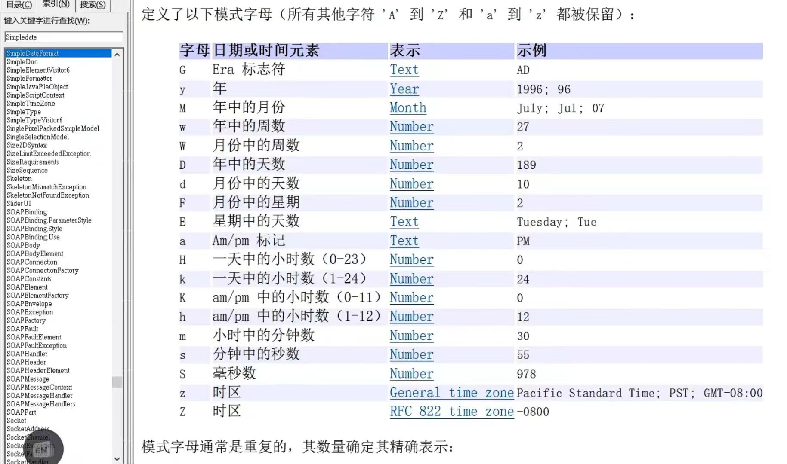
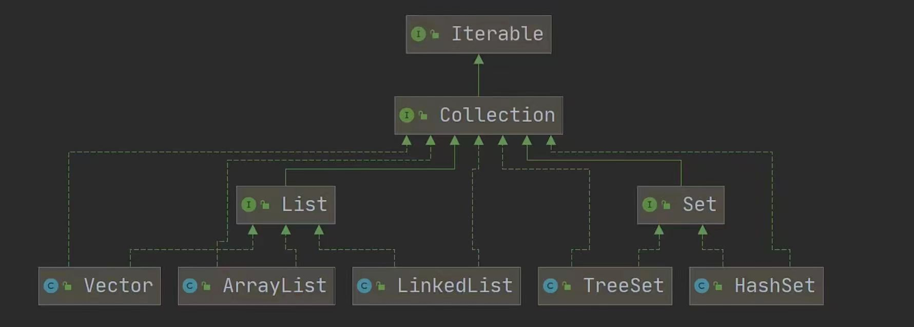

# java基础2


## 枚举、注解和异常

### 枚举

枚举(enum)是一组常量的集合，可以这样理解：枚举属于一种特殊的类，里面只包含一组有限的特定的对象

枚举的两种实现方式

1. 自定义类实现枚举
2. 使用enum关键字实现枚举


#### 普通枚举类型与嵌套枚举类型对比

```java
// 普通枚举类型
public enum SEX_TYPE {
    MAN, WOMAN;
}
// 使用，普通枚举定义在顶层，适用于全局使用场景：
SEX_TYPE type = SEX_TYPE.MAN;

---------------------------------------------

// 定义在类中的嵌套枚举
public class User {
    public enum SEX_TYPE {
        MAN, WOMAN;
    }
}

// 使用嵌套枚举，嵌套枚举被定义在另一个类型内部，表示只与该类型相关的值集合：
User.SEX_TYPE type = User.SEX_TYPE.MAN;
---------------------------------------------
// 定义在注解中的嵌套枚举
public @interface InitSex {
    enum SEX_TYPE {
        MAN, WOMAN;
    }
    
    SEX_TYPE sex() default SEX_TYPE.MAN;
}

// 使用注解和嵌套枚举
@InitSex(sex = InitSex.SEX_TYPE.WOMAN)
private String gender;

```


#### 自定义类实现枚举步骤

1. 构造器私有化
2. 本类内部创建一组对象
3. 对外暴露对象(通过为对象添加public final static修饰符)
4. 可以提供 get方法，但是不要提供set

细节：

1. 不需要提供setXxx方法，因为枚举对象值通常为只读，
2. 对枚举对象/属性使用 final + static共同修饰，实现底层优化，
3. 枚举对象名通常使用全部大写，常量的命名规范。
4. 枚举对象根据需要，也可以有多个属性

```java
public class test {
    public static void main(String[] args)  {
        System.out.println(Season.AUTUMN);  
    }
}
class  Season{
    private String name;
    private String desc;

    //定义四个静态对象,也是静态属性，可以通过类名.属性名来访问
    public static final Season SPRING = new Season("春天","温暖");
    public static final Season SUMMER = new Season("夏天","炎热");
    public static final Season AUTUMN = new Season("秋天","凉爽");
    public static final Season WINNER = new Season("冬天","寒冷");

    //1.将构造器私有化，防止直接new
    //2.去掉setXxx方法，防止属性被修改
    //3.在Season直接创建固定的静态对象,
    //4.为了优化，不加载类和防止修改，加入final修饰符
    private Season(String name,String desc){
        this.name = name;
        this.desc =desc;
    }
    public String getName() {
        return name;
    }

    public String getDesc() {
        return desc;
    }

    @Override
    public String toString() {
        return "Season{" +
                "name='" + name + '\'' +
                ", desc='" + desc + '\'' +
                '}';
    }
}
```


#### enum关键字实现枚举

1. 当我们使用enum关键字开发一个枚举类时，默认会继承Enum类,所以不能再继承其他类，但是可以和普通类一样实现接口，而且是一个final 类「如何证明：老师使用javap反编译工具来演示

2. 传统的public static final Season SPRING=new Season("春天"，"温暖")；简化成SPRING("春天"，"温暖”)，这里必须知道，它调用的是哪个构造器。

3. 如果使用无参构造器 创建枚举对象，则实参列表和小括号都可以省略

4. 当有多个枚举对象时，==使用','间隔==，最后有一个==分号结尾==

5. 枚举对象必须放在枚举类的==行首==，如果没有枚举对象，首行也要写个'==;==',

6. 如果枚举中 **只定义了枚举常量**，则分号是 **可选的**。enum SEX_TYPE {MAN, WOMAN}  // 没有分号，也合法

   如果在枚举常量后面有 **其他代码（如字段、方法、构造函数等）**，则 **必须使用分号** 来分隔枚举常量和其他部分。

```java
public class test {
    public static void main(String[] args)  {
        System.out.println(Season.AUTUMN);
    }
}
enum  Season{
    
    //如果使用了enum来实现枚举类
    //1.使用关键字 enum 替代 class
    //2.定义静态对象 替换为 SPRING("春天","温暖"),解读 常量名(实参列表),
    //本质也是public static final Season对象
    //3.如果有多个常量，使用','间隔
    //4.如果用enum来实现枚举，要求将定义常量对象写在最前面
    //5.如果使用无参构造器创建常量对象，可以省略()
    SPRING("春天","温暖"),SUMMER("夏天","炎热"),
    AUTUMN("秋天","凉爽"),WINNER("冬天","寒冷"),WHAT,WHY();

    private String name;
    private String desc;
    private Season(){}//无参构造器

    private Season(String name,String desc){
        this.name = name;
        this.desc =desc;
    }
    public String getName() {
        return name;
    }
    public String getDesc() {
        return desc;
    }

    @Override
    public String toString() {
        return "Season{" +
                "name='" + name + '\'' +
                ", desc='" + desc + '\'' +
                '}';
    }
}
```

```java
课堂练习
public class test {
    public static void main(String[] args)  {
        Gender boy = Gender.BOY;
        Gender girl = Gender.GIRL;
        System.out.println(boy);       //输出BOY，调用toString
        System.out.println(boy.name());//输出BOY，可是为什么不是boy呢？暂时还没看明白Enum类源码中返回的name含义
    }
}
enum  Gender{
    BOY,GIRL;//默认调用无参构造器

/*  Enum类默认的toString方法，返回枚举对象常量名称，简单了解
    public String toString() {
        return name;
    }
    */

//    @Override
//    public String toString() {
//        return "测试";
//}
}

```


#### enum常用方法

1. toString:Enum类已经重写过了，返回的是当前对象的==枚举对象名==，子类可以重写该方法，用于返回对象的属性信息
2. name：返回当前对象的==枚举对象名==(常量名)，子类中不能重写
3. ordinal：返回当前对象的==枚举对象在枚举类中==的位置号，==默认从0开始==，和数组下标一样
4. values：以数组形式==返回当前枚举类中==所有的常量==
5. valueOf：==将字符串转换成枚举对象==，要求字符串必须为已有的常量名，否则报异常!
6. compareTo：比较两个枚举常量，比较的就是位置号!

```java
public class test {
    public static void main(String[] args) {
        //System.out.println(Season.AUTUMN);
        Season autumn = Season.AUTUMN;
        Season summer = Season.SUMMER;

        System.out.println(autumn.name());
        System.out.println("--------------------------------------------");
        System.out.println(autumn.ordinal());
        System.out.println("--------------------------------------------");
        System.out.println(Season.AUTUMN.compareTo(Season.SUMMER));
        System.out.println(autumn.ordinal()-summer.ordinal());
        System.out.println("--------------------------------------------");

        Season[] values = Season.values();
        for (Season value : values) { //增强for循环
            System.out.println(value);
        }
        System.out.println("--------------------------------------------");
        // 下面等价于Season autumn = Season.AUTUMN;
        Season autumn1 = Season.valueOf("AUTUMN");
        System.out.println(autumn1);
        System.out.println(autumn1==autumn);  //true
    }
}
enum  Season{

    SPRING(),SUMMER(),
    AUTUMN(),WINNER(),WHAT,WHY();
}
```


### 注解

1. 注解(Annotation)也被称为元数据(Metadata)，用于修饰解释包，类、方法、属性、构造器、局部变量等数据信息。
2. 和注释一样，注解不影响程序逻辑，但注解可以被编译或运行，相当于嵌入在代码中的补充信息。
3. 在JavaSE中，注解的使用目的比较简单，例如标记过时的功能，忽略警告等。在JavaEE中注解占据了更重要的角色，例如用来配置应用程序的任何切面，代替java EE旧版中所遗留的繁冗代码和XML配置等。


使用 Annotation 时要在其前面增加@符号，并把该Annotation 当成一个修饰符使用。用于修饰它支持的程序元素

> 三个基本的Annotation:
> 1)@Override：限定某个方法，是重写父类方法，该注解只能用于方法。方法重写也可以不写@Override，如果写了@Override注解，编译器就会去检查该方法是否			真的重写了父类的方法，如果的确重写了则编译通过，否则编译错误
> 2)@Deprecated：用于表示某个程序元素(类，方法，属性，单条语句等)已过时，过时不代表不能用，只是不推荐使用
> 3)@SuppressWarnings:抑制编译器警告，用于某个程序元素(类，方法，属性，单条语句等)，比如@SuppressWarnings({"all"})抑制所有警告


元注解

用于修饰注解的注解，元注解是专门用来注解其他注解的注解，听起来有些绕口，实际上就是专门为自定义注解提供的注解

> 四种核心元注解
>
> 1)Retention//指定注解的作用范围，三种SOURCE,CLASS,RUNTIME
>
> - RetentionPolicy.SOURCE : 仅存在于源代码中，编译阶段会被丢弃，不会包含于class字节码文件,@Override, @SuppressWarnings都属于这类注解。
> - RetentionPolicy.CLASS : 默认策略，在class字节码文件中存在，在类加载的时被丢弃，运行时无法获取到。
> - RetentionPolicy.RUNTIME : 始终不会丢弃，可以使用反射获得该注解的信息。自定义的注解最常用的使用方式。
>
> 2)Target//指定注解可以在哪些地方使用,比如作用于类、属性、或方法等，默认可用于任何地方
>
> - ElementType.TYPE: 类、接口、注解、enum
> - ElementType.METHOD: 方法
> - ElementType.FIELD: 成员变量、对象、属性、枚举的常量
>
> 3)Documented//指定该注解是否会在javadoc体现
> 4)Inherited//子类会继承父类注解,使用此注解声明出来的自定义注解，在使用在类上面时，==子类会自动继承此注解==，否则，子类不会继承此注解。注意，使用       
>
>   Inherited声明出来的注解，只有在类上使用时才会有效，对方法，属性等其他无效。

其他元注解：

（1） @AliasFor，用于标记其他注解中的属性间的关联关系，`@AliasFor` 是 Spring 框架提供的一种特性，用于在 Spring 注解中创建属性别名。

```java
public @interface AliasFor {
    @AliasFor("attribute")
    String value() default "";

    @AliasFor("value")
    String attribute() default "";

    Class<? extends Annotation> annotation() default Annotation.class;
}
//至于为什么能在注解中使用自己的注解？
// @AliasFor 作为一个元注解存在，它本身不需要执行任何具体的逻辑。开发者定义时，@AliasFor 仅仅是标记，
// 注解的处理逻辑会在框架（例如 Spring）中处理这些属性的相互关联。
--------------------------------------------

public @interface MyAlias {
    @AliasFor("other")
    String value() default "";  // value 和 other 是互为别名的

    @AliasFor("value")
    String other() default "";
}
```


自定义注解：

(1)注解的定义通过@interface表示，所有的注解会自动继承java.lang.Annotation接口,且不能再继承别的类或是接口

(2)注解的成员参数只能用public或默认(default) 访问权修饰来进行修饰。

(3)注解的属性可以是以下类型之一：8种原始数据类型：`int`, `float`, `double`, `boolean`, `char`, `byte`, `short`, `long`；String类型，枚举类型，类类型 (`Class`)，其他注解类型，以及这些类的数组类型

(4)注解的本质是接口 , 接口中可以定义常量和方法 ;==在注解中定义接口方法 , 就是注解的属性== ;为注解添加属性:接口中的方法都是抽象方法,其中public abstract可以省略 ;注解中的==方法返回值类型==就是注解==属性的类型==。当你使用注解时，==提供的值==会用来作为这些==方法的返回值==。

(5)注解本质是接口，但它是 **编译器和 JVM** 特殊支持的接口，因此注解实例的创建方式与普通接口不同，==实例的创建==由编译器和 JVM 自动完成。

​	注解本身不能直接用 `new` 来创建实例，注解实例是通过==动态代理==生成的，属性值来源于注解定义时的元数据或默认值。

​	运行时可以通过反射 API（如 `getAnnotation()`）在运行时访问注解实例。

(6)注解是接口，之所以选择用抽象方法来做注解的属性，是因为接口中的属性只能是常量，不能是变量

(7)如果注解中只有一个属性，并且该属性的名称为"==value=="，或者注解中的其他属性都有默认值，那么在使用注解时，

​	可以省略"value"属性的名称，直接写属性值即可

示例1：

```java
//反编译后的代码，注解的本质是一个 interface 接口 , 注解接口默认继承了 java.lang.annotation.Annotation 接口 ;
public interface MyAnnotation extends java.lang.annotation.Annotation {...}

//示例
public @interface MyAnnotation {
    // 定义属性，类似于方法，但没有方法体，且可以有默认值。
    String value();  // 必须提供的属性
    int number() default 10;  // 带有默认值的属性
}
```

示例2：

```java

@Retention(RetentionPolicy.RUNTIME) // 注解保留到运行时,
public @interface MyAnnotation {
    String value();
}
-----------------------------------------------------
@MyAnnotation(value = "Hello")//编译器会在编译时生成注解的元数据，并将其与 MyClass 绑定。注解的实例会在运行时通过反射动态生成并提供访问
public class MyClass {...}
-----------------------------------------------------
public class Main {
    public static void main(String[] args) throws Exception {
        // 获取类的注解实例，当你通过 getAnnotation() 方法获取注解时，JVM 动态生成一个实现了注解接口的代理类（类似于 Java 的动态代理）。		   //这个代理类会根据注解元数据，返回属性的值或默认值。
        MyAnnotation annotation = MyClass.class.getAnnotation(MyAnnotation.class);
        if (annotation != null) {
            System.out.println(annotation.value()); // 输出: Hello
        }
    }
}
```

示例3（）：

```java
@Target(ElementType.METHOD)
@Retention(RetentionPolicy.RUNTIME)
@Documented
public @interface IgnoreAuth {
    /**
     * 用于忽略Token验证，在不需要被拦截的控制器方法上使用
     */
}
------------------------------------
@IgnoreAuth  //在方法上使用
@RequestMapping(value = "/login")
public R login(String username, String password, String captcha, HttpServletRequest request) {...}

-----------------------------------------------
//拦截器
public boolean preHandle(HttpServletRequest request, HttpServletResponse response, Object handler) throws Exception {
    
        IgnoreAuth annotation;//自定义注解
        if (handler instanceof HandlerMethod) {   //HandlerMethod是SpringMVC的一个类，只要是请求映射到控制器方法就算是
            annotation = ((HandlerMethod) handler).getMethodAnnotation(IgnoreAuth.class); 
            //查看方法上是否有IgnoreAuth注解，没有返回空
            //也可以用.getAnnotation方法，可以获取 类级别 或 方法级别 的指定注解
        }
 		if(annotation!=null) {
        	return true;
        }   
}
```


### 异常

==快捷键，选中代码块，ctrl+alt+t==

Java语言中，将程序执行中发生的不正常情况称为“异常”。(开发过程中的语法错误和逻辑错误不是异常)

  语法错误会导致编译器无法将源代码编译成字节码。在编译阶段，编译器会给出错误信息，告诉你具体哪里有语法问题。因为编译器没有通过代码的编译过程，代码根本无法运行。因此，语法错误并不会成为“异常”。

  逻辑错误是指程序的逻辑设计存在问题，导致程序在运行时没有达到预期的行为。通常，程序会成功编译并运行，但结果是错误的，通常是由于开发者在编写代码时的思维错误。


执行过程中所发生的异常事件可分为两大类:
1)Error(错误)：==是程序中无法处理的错误==，Java虚拟机无法解决的严重问题。如：JVM系统内部错误、资源耗尽等严重情况。比如：StackOverflowError[栈溢出]和OOM(outofmemory)，Error是严重错误，程序会崩溃。
2)Exception： ==是程序本身可以捕获并且可以处理的异常==，分为两大类：==运行时异常==和==编译时异常==。是因编程错误或偶然的外在因素导致的一般性问题，可以使用针对性的代码进行处理。例如空指针访问，试图读取不存在的文件，网络连接中断等等。

> 常见的运行时异常包括:
>
> 1. NullPointerException空指针异常
> 2. ArithmeticException数学运算异常
> 3. ArrayIndexOutOfBoundsException数组下标越界异常
> 4. ClassCastException类型转换异常
> 5. NumberFormatException数字格式不正确异常[】

> 编译异常是指在编译期间，就必须处理的异常，否则代码不能通过编译。
> 常见的编译异常:
>
> 1. SQLException//操作数据库时，查询表可能发生异常
> 2. IOException//操作文件时，发生的异常
> 3. FileNotFoundException//当操作一个不存在的文件时，发生异常
> 4. ClassNotFoundException//加载类，而该类不存在时，异常
> 5. EOFException//操作文件，到文件末尾，发生异常
> 6. IllegalArguementException//参数异常

#### 异常体系图：


#### 异常处理方式

1. ==try-catch-finally处理方式== 

   程序员在代码捕获中发生的异常，自行处理

   ```java
   try {
   //代码/可能有异常，如果异常发生了，则异常后面的代码不会执行，直接进入到catch块
   }catch(Exception e){
   //捕获到异常执行
   //1.当异常发生时，系统将异常封装成Exception对象e，传递给catch
   //2.得到异常对象后，程序员自己处理
   //3.注意，如果没有发生异常catch代码块不执行
   //4.可以有多个catch语句，捕获不同的异常，要求父类异常在子类异常后面，比如NullPointerException在前，Exception在后，如果发生异常，
   //	只会匹配一个catch，后面的就不再匹配
   //5.可以进行try-finally配合使用，这种方法相当于没有捕获异常，因此程序会直接崩掉
   }finally{
   //1.不管try代码块是否有异常发生，始终要执行finally
   //2.所以，通常将释放资源的代码，放在finally
   }
   
   
   ```

   ```java
   课堂练习: try-catch异常处理 
       
   public class test {
       public static void main(String[] args)  {
           System.out.println(method1());  //输出4
           System.out.println(method2());  //输出3
       }
       public static int method1(){
           int i=1;
           try {
               i++;
               String[] str = new String[3];
               System.out.println(str[1].equals("123"));
               return 0;
           } catch (Exception e) {
               System.out.println("catch中的i="+(i+1));
               return ++i;  //i=3,->保存临时变量temp=3,优先返回final中的值
           } finally {
               return ++i;  //i=4
           }
       }
   
       public static int method2(){
           int i=1;
           try {
               i++;
               String[] str = new String[3];
               System.out.println(str[1].equals("123"));
               return 0;
           } catch (Exception e) {
               return ++i;  //i=3 ->保存临时变量temp=3,然后执行完final语句后return temp;
           } finally {
               ++i;  //i=4
               System.out.println("i="+i);
           }
       }
   }
   ```

   

2. ==throws处理方式==

   将发生的异常抛出，交给调用者(方法)来处理，最顶级的处理者就是JVM

   细节：

   1. 如果一个方法(中的语句执行时)可能生成某种异常，但是并不能确定如何处理这种异常，则此方法应显示地声明抛出异常，表明该方法将不对这些异常进行处理，而由该方法的调用者负责处理。

   2. 在方法声明中用throws语句可以声明抛出异常的列表，throws后面的异常类型可以是方法中产生的异常类型，==也可以是异常类型的父类==。throws关键字后可以是==异常列表==，中间用','隔开，即可以抛出多个异常

   3. 对于==编译异常==，程序中==必须显式处理==，比如 try-catch或者 throws

   4. 对于==运行时异常==，程序中如果没有显式处理，==默认就是throws的方式处理==，比如main方法

   5. 子类重写父类的方法时，对抛出异常的规定：子类重写的方法，所抛出的异常类型要么和父类抛出的异常一致，==要么为父类抛出的异常的类型的子类型==

   6. 在throws过程中，如果有方法try-catch，就相当于处理异常，就可以不必throws

      

      ```java
      public class test {
          public static void main(String[] args) {  //默认有throws NullPointerException
              f3();  //由于f3()抛出的是运行异常，默认是throws的处理方式
              //f1(); 因为f1()抛出的是编译异常，如果调用f1()，main方法也要显式的使用try-catch或throws
          }
          
          //编译异常，如果不用try-catch,必须显示使用throws异常处理
          public static void f1() throws FileNotFoundException,NullPointerException{
              FileInputStream file = new FileInputStream("d://a.txt");
          }
          public void f2() throws Exception{
              FileInputStream file = new FileInputStream("d://a.txt");
          }
          
          //运行异常
          public static void f3() { //默认有throws NullPointerException
              String[] str = new String[3];
              System.out.println(str[1].equals("123")); //由于抛出的是运行异常，默认是throws的处理方式，写不写throws都行
          }
      }
      class Father{
          public void method() throws RuntimeException{}
      }
      class Son extends Father{
          @Override
          public void method() throws NullPointerException {}
      }
      
      ```

      


#### 自定义异常的步骤

1. 定义类：自定义异常类名(程序员自己写)继承Exception或RuntimeException
2. 如果继承Exception，属于编译异常
3. 如果继承RuntimeException，属于运行异常(一般来说，继承RuntimeException)

```java
public class test {
    public static void main(String[] args) {   //如果AgeException是继承Exception,那么这里需要
        int age = 180;                         //显式 throws AgeException，无法使用默认的处理机制
        if (!(age>=18 && age<=120)){
            //这里我们可以通过构造器设置信息
            throw new AgeException("年龄需要在18~120之间");
            }
        }
}
//自定义一个异常
//1.一般情况下，我们自定义异常是继承RuntimeException
//2.即把自定义异常做成 运行时异常，好处是，我们可以使用默认的处理机制
class AgeException extends RuntimeException{
    public AgeException(String message){
        super(message);
    }
}
```

> throw与throws的区别：
>
> |        | 意义                     | 位置       | 后跟的东西 |
> | ------ | ------------------------ | ---------- | ---------- |
> | throws | 异常处理的一种方式       | 方法声明处 | 异常类型   |
> | throw  | 手动生成异常对象的关键字 | 方法体中   | 异常对象   |


```java
课堂练习
public class test {
    public static void main(String[] args) {
        try {
            if (args.length !=2){
                throw new ArrayIndexOutOfBoundsException("参数个数不对");  //手动抛出异常，自定义message
            }
            int n1 = Integer.parseInt(args[0]);
            int n2 = Integer.parseInt(args[1]);
            double res = cal(n1,n2);    //该方法可能抛出ArithmeticException
            System.out.println("计算结果="+res);
        } catch (ArrayIndexOutOfBoundsException e) {
            //throw new RuntimeException(e);
            System.out.println(e.getMessage());  //输出 参数个数不对
        } catch (NumberFormatException e) {
            //throw new RuntimeException(e);
            System.out.println("参数格式不正确，需要输出整数");
        } catch (ArithmeticException e){
            System.out.println("出现了除0的异常");
        }

    }

    public static  double cal(int n1,int n2){
        return n1/n2;
    }

}
```


## 常用类

### 包装类

针对八种基本数据类型相应的引用类型——包装类(Wrapper)

| 基本数据类型 |      包装类      | 父类   |
| :----------: | :--------------: | ------ |
|   boolean    |     Boolean      |        |
|     char     | Character,有变化 |        |
|     byte     |       Byte       | Number |
|    short     |      Short       | Number |
|     int      | Integer，有变化  | Number |
|     long     |       Long       | Number |
|    float     |      Float       | Number |
|    double    |      Double      | Number |


#### 包装类和基本数据类型的转换

1. jdk5以前手动装箱和拆箱方式，装箱：基本类型->包装类型，反之，拆箱
2. jdk5以后(含idk5)的自动装箱和拆箱方式
3. 自动装箱底层调用的是valueOf方法，比如Integer.valueOf，其他包装类用法一致

```java
public class test {
    public static void main(String[] args) {
        //jdk5之前手动装箱和拆箱
        //手动装箱int -> Integer
        int n1 =10;
        Integer integer = new Integer(n1);
        Integer integer1 = Integer.valueOf(n1);
        //手动拆箱 Integer->int
        int i = integer.intValue();

        //jdk5之后，就可以自动装箱和自动拆箱
        int  n2 = 10;
        //自动装箱
        Integer integer2 = n2;  //底层使用的是Integer.valueof(n2);
        //自动拆箱
        int n3 = integer2;  //底层使用的是 integer.intValue();
    }
}
```

```java
课堂练习
Object obj = true? new Integer(1):new Double(2.0); //三元运算符是一个整体
System.out.println(obj);  //结果：1.0
Object obj2 = true? 3 : 2.0 ; 
System.out.println(obj2);  //结果：3.0

Object obj3;
if (true) {    //if-else是分别独立的语句，不像三元运算符是一个整体
    obj3=new Integer(1);
}else{
    obj3 = new Double(2.0);
}
System.out.println(obj3);  //输出：1 ，分别计算
```


#### 包装类和String类型的相互转换

```java
public class test {
    public static void main(String[] args) {
        //包装类(Integer)->String
        Integer integer = 10;
        //方式1
        String  str1 = integer + "";
        //方式2
        String  str2 = integer.toString();  //包装类都有toString方法 ,创建对象
        //方式3
        String  str3 = String.valueOf(integer);  //其实也是 integer.toString(); 

        //String->包装类(Integer)
        String str4 = "123";
        Integer int1 = Integer.parseInt(str4); //使用自动装箱
        Integer int2 = new Integer(str4);       //构造器
    }
}
```


#### Integer类和Character类的常用方法

```java
System.out.println(Integer.MAX_VALUE); //返回最大值
System.out.println(Integer.MIN_VALUE); //返回最小值
System.out.println(Character.isDigit('a')); //判断是不是数字
System.out.println(Character.isLetter('a')); //判断是不是字母
System.out.println(Character.isUpperCase('a'));//判断是不是大写
System.out.println(Character.isLowerCase('a'));//判断是不是小写
System.out.println(Character.isWhitespace('a'));//判断是不是空格
System.out.println(Character.toUpperCase('a'));//转成大写
System.out.println(Character.toLowerCase('A'));//转成小写
```


```java
Integer中valueof()的源码
    
public static Integer valueOf(int i) {
        if (i >= IntegerCache.low && i <= IntegerCache.high)  //范围-128~127 ，输入同一个整数，返回的是同一个对象
            return IntegerCache.cache[i + (-IntegerCache.low)];    //cache对象数组在类加载时就创建好了，返回缓存数组
        return new Integer(i);   //超出范围才会创建新对象
    }
```

```java
课堂练习
public class test {
    public static void main(String[] args) {
        Integer i = new Integer(1);
        Integer j = new Integer(1);
        System.out.println(i==j);  //false

        Integer m = 1;   //底层 Integer.valueof(1)
        Integer n = 1;
        System.out.println(m==n);  //true  ->阅读源码

        Integer x = 128;  //底层 Integer.valueof(128)
        Integer y = 128;
        System.out.println(x==y);   //false  ->阅读源码

        Integer a = 128;       //基本数据类型和包装类比较，会先把包拆箱
        int b = 128;
        System.out.println(a==b);//true,只要有基本数据类型，就是值比较
    }
}

```


### String类

1. String对象用于保存字符串，也就是一组字符序列

2. ==字符串常量====对象==是用双引号括起的字符序列。例如："你好”、"12.97"、"boy"等

3. 字符串的字符使用==Unicode==字符编码，一个字符(不区分字母还是汉字)占==两个==字节。

4. String类较常用构造器(其它看手册)：

   ```java
    String str1 = new String();
   String str2 = new String("abc");
   char[] ch = {'a','b','c','d','e'};  //静态初始化
   String str3 = new String(ch);
   String str4 = new String(ch,1,4);  //使用数组下标指定开始(包括)，后面数字指定几个字符
   System.out.println(str3);  //abcde
   System.out.println(str4);  //bcde,
   ```

5. String类实现了接口Serializable,表示String可以串行化：可以在网络上传输；也实现了接口Comparable,表明String类可以比较大小

6. String 是final类，不能被其他的类继承

7. String 有属性private final char value[];用于存放字符串内容。

8. 注意value[]是==final类型，对于数组来说==：但是这里不可修改指的，value不能指向新的地址，value==数组的单个字符内容是可以改的==

   ```java
   String  str= "abcd";
   //str[0] = 'b'; 不能这样使用
   str = "efg";  //这样修改可以
   System.out.println(str);
   ```

9. 字符串对象的哈希码

   注意：`字符串和数组的equals方法都是比较内容是否相同而不是地址`；

   ```java
   //String类的hashCode源码，进行了重写，如果字符串内容一样，则返回哈希码值也一样
   
   //Integer类的hashCode：返回的哈希码就是Integer对象里所包含的那个整数的数值，例如Integer i1=new Integer(100),
   //i1.hashCode的值就是100 。由此可见，2个一样大小的Integer对象，返回的哈希码也一样
   
   public int hashCode() {
           int h = hash;
           if (h == 0 && value.length > 0) {
               char val[] = value;
   
               for (int i = 0; i < value.length; i++) {
                   h = 31 * h + val[i];
               }
               hash = h;
           }
           return h;
       
   //测试
   System.out.println((new String("hsp")).hashCode());
   System.out.println((new String("hsp")).hashCode());
   System.out.println("hsp".hashCode());  //三者结果一样
   ```


#### 两种创建String对象的区别

方式一：直接赋值String s="hsp"；
方式二：调用构造器 String s2= new String("hsp")；

1. 方式一：先从常量池查看是否有"hsp"数据空间，如果有，直接指向；如果没有则重新创建，然后指向。s最终指向的是==常量池==的空间地址

2. 方式二：先在堆中创建空间，里面维护了value属性，指向常量池的hsp空间，如果常量池没有"hsp"重新创建，如果有直接通过value指向。最终指向的是==堆中==的空间地址。

3. 当调用==intern==方法时，返回该字符串对象value在常量池中指向的地址

   ```java
   String a = "hsp";
   String b = new String("hsp");
   System.out.println(a==b.intern());  //true
   System.out.println(b==b.intern());  //false
   ```

4. 画出两种方式的内存分布图

   

```java
课堂练习
Person p1 = new Person();
p1.name = "hspedu";   //指向常量池中的地址
System.out.println(p1.name=="hspedu");//true  ，依然是地址比较，"hspedu"本身就在常量池中
```


```java
课堂练习
    
String s1="hello";
s1="abc";   //s1重新指向常量池中的"abc",引用地址改变，原来的"hello"仍然在常量池中，只是不再被引用    ???final value[] 常量池中"hello"能被修改吗

String a = "hello";
String b = "abc";
Stribg c = a+b;  //最后其实是c指向堆中新创建的对象，value[]指向常量池中的"helloabc",通过调试看底层执行过程
String d = "helloabc";   //常量相加，看的是池;变量相加，是在堆中; 常量和变量相加呢?? 也是堆中，指向堆中地址空间
String e = "hello"+"abc";
sout(c==d)  //false
sout(d==e)  //true

```


这个例子很好解释了为什么字符串作为实参传值时，明明是地址传递但是无法修改原来的值的问题。这点和数组很不一样，可以看到在对数组元素进行修改时，局部变量ch指向的地址没有改变，但是对字符串对象进行重新赋值，局部变量str就重新指向了一个新地址，原来str指向的内容没有任何改变


#### String类的常用方法

1. equals//区分大小写 判断内容是否相等
2. equalslgnoreCase//忽略大小写的判断内容是否相等
3. length//获取字符的个数，字符串的长度
4. indexOf//获取字符在字符串中第1次出现的索引，索引从0开始，如果找不到。返回-1
5. lastlndexOf//获取字符在字符串中最后1次出现的索引，索引从0开始，如找不到，返回-1
6. substring//截取指定范围的子串
7. trim//去前后空格
8. charAt：获取某索引处的字符，注意不能使用Str[index]这种方式.
9. toUpperCase  //转成大写
10. toLowerCase
11. concat    //拼接字符串
12. replace 替换字符串中的字符
13. split分割字符串，对于某些分割字符，我们需要 转义比如\等
    案例：String poem="锄禾日当午，汗滴禾下土，谁知盘中餐，粒粒皆辛苦"；和文件路径.
14. compareTo //比较两个字符串的大小，可用于文件夹排序
15. toCharArray//转换成字符数组
16. format//格式字符串，%s字符串%c字符%d整型 %.2f浮点型

```java
 //indexof()方法
String str = "testabc";
int index1 = str.indexOf('e');  //输出 1
int index2 = str.indexOf("est");  //输出 1
System.out.println(index1);
System.out.println(index2);
System.out.println(str.lastIndexOf("abc"));//输出 4

//substring()方法
System.out.println(str.substring(4));   //abc ，包括索引4
System.out.println(str.substring(1,4));   //est,包括索引1，不包括索引4，左闭右开
//trim()方法
str = "    abc def ";
System.out.println(str.trim());
System.out.println(str);   //本身没有变化，和下面的replace方法一样

//concat()方法
String s1 = "宝玉和";
s1 = s1.concat("林黛玉").concat("together,林黛玉");
System.out.println(s1);      //同样s1.concat()方法执行后，返回的结果才是被替换过的，s1本身不发生变化
//replace()方法
String s2 = s1.replace("林黛玉","薛宝钗");
System.out.println(s1);  //s1.replace()方法执行后，返回的结果才是被替换过的，s1本身不发生变化
System.out.println(s2);  //将所有的"林黛玉"替换成"薛宝钗"
System.out.println("bba".compareTo("aaaaaa"));

//format()方法
String name = "john";
int age = 18;
double score = 98.3;  //%.2f会四舍五入
char gender = '男';
String info = String.format("我的姓名是%s年龄是%d,成绩是%.2f性别是%c",name,age,score,gender);
System.out.println(info); 
```


> ==split()扩展，因为这里用到了正则表达式(regex),先简单了解==
>
> split() 方法根据匹配给定的正则表达式来拆分字符串。
>
> **注意：** **.** 、 **$**、 **|** 和 ***** 等特殊字符，必须得加 **\\\\**。
>
> **注意：**多个分隔符，可以用 **|** 作为连字符。
>
> 
>
> **split("\\\\.")是什么意思**
>
> \\\\会转义成反斜杠，反斜杠本身就是转义符，所有就成了“\\.”，在进行转义就是.，所以\\\\.实际上是“.”。
>
> 
>
> 所以正常的写法是这样的：
>
> 1. 如果用“.”作为分隔的话，必须是如下写法：String.split("\\\\."),这样才能正确的分隔开，不能用String.split(".");
>
> 2. 如果用“|”作为分隔的话，必须是如下写法：String.split("\\\\|"),这样才能正确的分隔开，不能用String.split("|");
>
>    “.”和“|”都是转义字符，必须得加"\\\\";
>
> 3. 如果在一个字符串中有多个分隔符，可以用“|”作为连字符，比如：“a=1 and b =2 or c=3”,把三个都分隔出来，可以用String.split("and|or");
>
> 
>
> split分隔符总结
>
> 1. 字符==|==,==*==,==+==，==.==,==$==都得加上转义符，前面加上"\\\\"。
>
> 2.字符==,==,==&==,==-==,==/==,=='==,=="==不用加转义符，不过加了也不出错，所以只要看见特殊字符都加上"\\\\"就可以
>
> 1. 而如果是"\\\\"，那么就得写成"\\\\\\\\"。
> 2. 如果一个字符串中有多个分隔符，可以用"|"作为连字符。 
>
> 
>
> ```java
> String poem = "锄禾日当午\\汗滴禾下土,谁知盘中餐,粒粒皆辛苦";
> String[] split = poem.split("\\\\");
> //split = poem.split("\\");  //这个就不能直接用转义字符了，不像"\'","\""能直接匹配
> //split = poem.split("\");   //这样也不行
> 
> 
> poem = "锄禾日当午\'汗滴禾下土,谁知盘中餐,粒粒皆辛苦";
> split = poem.split("\'");  //相当于转义字符，可以直接匹配
> split = poem.split("'");    //也可以
> split = poem.split("\\'");  //也可以
> poem = "锄禾日当午\t汗滴禾下土\n谁知盘中餐,粒粒皆辛苦";
> split = poem.split("\t|\n");  //相当于转义字符，可以直接匹配
> split = poem.split("\\t|\\n");  //这样也行
> 
> 
> poem = "锄禾日当午and汗滴禾下土or谁知盘中餐,粒粒皆辛苦";
> split = poem.split("and|or");
> //split = poem.split("and\\|or");//这样不行
> 
> for (int i = 0; i < split.length; i++) {
>     System.out.println(split[i]);
> }
> 
> 
> 
> ```
>
> 


#### StringBuffer类

StringBuffer代表可变的字符序列，可以对字符内容进行增删，很多方法与String相同，但StringBuffer是可变长度的，可看作是一个容器，StringBuffer也是一个final类不能被继承

String与StringBuffer区别：

1. String保存的是字符串==常量==，里面的值不能更改，每次String类的更新实际上就是更改地址，效率较低//private final char value[];

2. StringBuffer保存的是字符串==变量==，里面的值可以更改，每次StringBuffer的更新实际上可以更新内容，不用每次更新地址，==父类有属性char[] value==;

   ==不是final，这个放在堆中.== 

3. `String类调用方法时，实参不会改变，StringBuffer实参会改变`，探究原因？？？常量变量？？？

​	猜测，可能是string类指向新的地址空间，原来没变；stringbuffer依旧在原来地址空间上对数据进行修改

```java
//1.创建一个 大小为 16的 char[]，用于存放字符内容
StringBuffer stringBuffer = new StringBuffer();
//2 通过构造器指定 char[]大小
StringBuffer stringBuffer1 = new StringBuffer(100);
//3. 通过 给一个String 创建 StringBuffer, char[] 大小就是 str.length() + 16
StringBuffer hello = new StringBuffer("hello");
```


String与StringBuffer的转换

```java
//看 String—>StringBuffer
String str = "hello tom";
//方式1 使用构造器
//注意： 返回的才是StrinqBuffer对象，对str 本身没有影响
StringBuffer stringBuffer= new StringBuffer(str);
// 方式2 使用的是append方法
StringBuffer stringBuffer1 = new StringBuffer();
stringBuffer1= stringBuffer1.append(str);
  
//看 StringBuffer ->String
StringBuffer stringBuffer3 = new StringBuffer("韩顺平教育");
//StringBuffer stringBuffer4 = "韩顺平教育";  //错误，这样创建的是String类型对象

//方式1 使用StringBuffer提供的 toString方法
String str1 = stringBuffer3.toString();
//方式2：使用构造器来搞定
String str2 = new String(stringBuffer3);
```

```java
StringBuffer常用方法
//增
StringBuffer stb = new StringBuffer("hello");
stb.append(",").append("world");
System.out.println(stb);   //hello,world
//删
stb.delete(2,5);   //[2,5) 左开右闭
System.out.println(stb);  //he,world
//插，原来索引为2的内容自动后移
stb.insert(2,"llo");
System.out.println(stb);   //hello,world
//改
stb.replace(0,5,"你好");
System.out.println(stb);    //你好,world
//查
int index = stb.indexOf("world");
System.out.println(index);   //输出 3
//长度
System.out.println(stb.length());  //输出 8
```

```java
课堂练习
String str = null;
StringBuffer  stb = new StringBuffer();
stb.append(str); //底层代码 如果str==null,底层调用的是AbstractStringBuilder的appendNull(),会创建一个大小为4的"null"字符串
System.out.println(stb);    //""值为空不显示
System.out.println(stb.length());  //4
System.out.println(stb);    //null

//看底层源码 super(str.length() + 16);
StringBuffer stb1 = new StringBuffer(str); //抛出空指针异常
//String str1 = new String(null);//同样也不行，抛出空指针异常
System.out.println(stb1);
```


#### StringBulider类

1. 一个可变的字符序列。此类提供一个与StringBuffer兼容的API，但不保证同步(StringBuilder不是线程安全的)。该类被设计用作StringBuffer的一个简易替换，用在字符串缓冲区被单个线程使用的时候。如果可能，建议优先采用该类。因为在大多数实现中，它比StringBuffer要快 [后面测]
2. 在StringBuilder 上的主要操作是append和insert方法，可重载这些方法，以接受任意类型的数据。
3. StringBuilder和StringBuffer均代表可变的字符序列，方法是一样的，所以使用方式和StringBuffer一样，也是final类


### Math类

常用方法

> //abs绝对值
> System.*out*.println(Math.*abs*(-9.1)); //-9.1 ,可取整数也可以是小数
> //pow求幂
> System.*out*.println(Math.*pow*(2,4));  // 16.0  返回double类型
> //ceil 向上取整，返回>=该参数的最小整数
> System.*out*.println(Math.*ceil*(-3.1)); //-3.0  返回double类型
> //floor 向下取整，返回<=该参数的最大整数
> System.*out*.println(Math.*floor*(-3.1)); //-4.0  返回double类型
> //round 四舍五入
> System.*out*.println(Math.*round*(3.5));  //4  返回long类型
> //sqrt 求开方
> System.*out*.println(Math.*sqrt*(9));    //3.0 返回double类型
> System.*out*.println(Math.*sqrt*(-9));   //NaN
> //random  返回的是0-1之间的随机小数[0，1） Math.random();
> //max  Math.max(1,2);
> //min  Math.min(1,2);


### Arrays类 

==获取数组长度arr.length   ，获取字符串长度str.length()==


```java
常用方法
    
import java.util.Arrays;
import java.util.Comparator;
import java.util.List;

public class test {
    public static void main(String[] args) {

        //1.toString，返回数组的字符串形式 "[1,2,3]"
        Integer[] b = {1,2,3};
        //int[] a = {1,2,3}; 这样也可以，只不过方法传参的时候用了自动装箱 
        System.out.println(Arrays.toString(b));

        //2.sort方法的使用,因为数组是引用类型，所以使用sort排序后会直接影响到实参arr
        Integer arr[] = {5,1,3,9,8,6,7}; //
        Arrays.sort(arr);
        System.out.println(Arrays.toString(arr));  //1,3,5...

        //sort重载的，也可以通过传入一个接口Comparator实现定制排序
        //调用定制排序时，传入两个参数：（1）排序的数组 (2)实现Comparator接口的匿名内部类，要求实现compare方法
        //体现了接口编程的方式
        //暂时有点懵？？？ 看后面代码帮助理解
        Arrays.sort(arr, new Comparator<Integer>() {
            @Override
            public int compare(Integer o1, Integer o2) {
                return o2-o1;
            }
        });
        System.out.println(Arrays.toString(arr));   //9,8,7...

        //3.binarySearch,通过二分搜索法进行查找，要求必须排序好
        //查找到返回索引,如果数组中不存在该元素就返回 return -(low +1);
        Integer[] bs = {1,2,3,4,5,6,9} ;
        int index = Arrays.binarySearch(bs,10);  //如果有应该在索引为7的位置上 low+1 =7+1=8
        System.out.println(index);  //输出 -8；


        //4.copyOf 数组元素的复制
        //(1) 从 arr 数组中，拷贝 arr.length个元素到 newArr数组中
        //(2) 如果拷贝的长度 > arr.length 就在新数组的后面 增加 null
        //(3) 如果拷贝长度 < 0 就抛出异常NegativeArraySizeException
        //(4) 该方法的底层使用的是 System.arraycopy()
        Integer[] newArr = Arrays.copyOf(arr, arr.length);
        System.out.println("==拷贝执行完毕后==");
        System.out.println(Arrays.toString(newArr));


        //5.fill 数组元素的填充
        //使用 99 去填充 num数组，可以理解成是替换原来的所有元素
        Integer[] num = new Integer[]{9,3,2};
        Arrays.fill(num, 99);
        System.out.println("==num数组填充后==");
        System.out.println(Arrays.toString(num));

        //6. equals 比较两个数组元素内容是否完全一致
        //(1)如果arr 和 arr2 数组的元素一样，则返回true;
        //(2) 如果不是完全一样，就返回 false
        Integer[] arr2 = {1, 2, 90, 123};
        boolean equals = Arrays.equals(arr, arr2);
        System.out.println("equals=" + equals);

        //7. asList 将一组值，转换成list
        //(1) asList方法，会将 (2,3,4,5,6,1)数据转成一个List集合
        //(2) 返回的 asList 编译类型 List(接口)
        //(3) asList 运行类型 java.util.Arrays#ArrayList, 是Arrays类的
        //   静态内部类 private static class ArrayList<E> extends AbstractList<E>
        //              implements RandomAccess, java.io.Serializable
        List asList = Arrays.asList(2,3,4,5,6,1);
        System.out.println("asList=" + asList);
        System.out.println("asList的运行类型" + asList.getClass());

    }
}

```


```java
下面代码帮助理解Arrays类中sort定制排序的实现原理

public class ArraysSortCustom {
    public static void main(String[] args) {

        int[] arr = {1, -1, 8, 0, 20};
        //bubble01(arr);

        
        /* 
        	bubble02(arr, new Comparator<Integer>() {
            	@Override
            	public int compare(Integer o1, Integer o2) {
                return o2-o1;
            	}*/
        //和上面代码等价，sort源码用的就是泛型
        bubble02(arr, new Comparator() {
            @Override
            public int compare(Object o1, Object o2) {
                int i1 = (Integer) o1;
                int i2 = (Integer) o2;
                return i2 - i1;// return i2 - i1;
            }
        });

        System.out.println("==定制排序后的情况==");
        System.out.println(Arrays.toString(arr));

    }

    //使用冒泡完成排序
    public static void bubble01(int[] arr) {
        int temp = 0;
        for (int i = 0; i < arr.length - 1; i++) {
            for (int j = 0; j < arr.length - 1 - i; j++) {
                //从小到大
                if (arr[j] > arr[j + 1]) {
                    temp = arr[j];
                    arr[j] = arr[j + 1];
                    arr[j + 1] = temp;
                }
            }
        }
    }

    //结合冒泡 + 定制
    public static void bubble02(int[] arr, Comparator c) {
        int temp = 0;
        for (int i = 0; i < arr.length - 1; i++) {
            for (int j = 0; j < arr.length - 1 - i; j++) {
                //数组排序由 c.compare(arr[j], arr[j + 1])返回的值决定
                if (c.compare(arr[j], arr[j + 1]) > 0) {
                    temp = arr[j];
                    arr[j] = arr[j + 1];
                    arr[j + 1] = temp;
                }
            }
        }
    }
}
```

```java
课堂练习
为什么返回值用价格就是价格的排序，返回值是名字长度就是名字长度排序？？？  将对象数组进行交换
有空仔细看看源码，有点复杂
    
public class ArrayExercise {
    public static void main(String[] args) {
        /*
        案例：自定义Book类，里面包含name和price，按price排序(从大到小)。
        要求使用两种方式排序 , 有一个 Book[] books = 4本书对象.

        使用前面学习过的传递 实现Comparator接口匿名内部类，也称为定制排序。
        [同学们完成这个即可 10min  ],
        可以按照 price (1)从大到小 (2)从小到大 (3) 按照书名长度从大到小

         */

        Book[] books = new Book[4];
        books[0] = new Book("红楼梦", 100);
        books[1] = new Book("金瓶梅新", 90);
        books[2] = new Book("青年文摘20年", 5);
        books[3] = new Book("java从入门到放弃~", 300);

        //(1)price从大到小

//        Arrays.sort(books, new Comparator() {
//            //这里是对Book数组排序，因此  o1 和 o2 就是Book对象
//            @Override
//            public int compare(Object o1, Object o2) {
//                Book book1 = (Book) o1;
//                Book book2 = (Book) o2;
//                double priceVal = book2.getPrice() - book1.getPrice();
//                //这里老师进行了一个转换
//                //如果发现返回结果和我们输出的不一致，就修改一下返回的 1 和 -1
//                if(priceVal > 0) {
//                    return  1;
//                } else  if(priceVal < 0) {
//                    return -1;
//                } else {
//                    return 0;
//                }
//            }
//        });

        //(2)price从小到大
//        Arrays.sort(books, new Comparator() {
//            //这里是对Book数组排序，因此  o1 和 o2 就是Book对象
//            @Override
//            public int compare(Object o1, Object o2) {
//                Book book1 = (Book) o1;
//                Book book2 = (Book) o2;
//                double priceVal = book2.getPrice() - book1.getPrice();
//                //这里老师进行了一个转换
//                //如果发现返回结果和我们输出的不一致，就修改一下返回的 1 和 -1
//                if(priceVal > 0) {
//                    return  -1;
//                } else  if(priceVal < 0) {
//                    return 1;
//                } else {
//                    return 0;
//                }
//            }
//        });

        //(3)按照书名长度从大到小

        Arrays.sort(books, new Comparator() {
            //这里是对Book数组排序，因此  o1 和 o2 就是Book对象
            @Override
            public int compare(Object o1, Object o2) {
                Book book1 = (Book) o1;
                Book book2 = (Book) o2;
                //要求按照书名的长度来进行排序
                return book2.getName().length() - book1.getName().length();
            }
        });


        System.out.println(Arrays.toString(books));
        //为什么会这样格式输出，看Arrays.toString代码：  b.append(String.valueOf(a[i]));
        //[Book{name='java从入门到放弃~', price=300.0}, Book{name='青年文摘20年', price=5.0}, Book{name='金瓶梅新',     			//					price=90.0}, Book{name='红楼梦', price=100.0}]

    }
}

class Book {
    private String name;
    private double price;

    public Book(String name, double price) {
        this.name = name;
        this.price = price;
    }

    public String getName() {
        return name;
    }

    public void setName(String name) {
        this.name = name;
    }

    public double getPrice() {
        return price;
    }

    public void setPrice(double price) {
        this.price = price;
    }

    @Override
    public String toString() {
        return "Book{" +
                "name='" + name + '\'' +
                ", price=" + price +
                '}';
    }
}
```


### System类

```java
//1.exit 退出当前程序  exit(0) 表示程序正常退出

//2.arraycopy ：复制数组元素，比较适合底层调用，
// 一般使用Arrays.copyOf完成复制数组
int[] src={1,2,3};
int[] dest = new int[3];// dest 当前是 {0,0,0}
System.arraycopy(src, 0, dest, 0, src.length);
System.out.println("dest=" + Arrays.toString(dest));//[1, 2, 3]

//3.currentTimeMills:返回当前时间距离1970-1-1 的毫秒数
System.out.println(System.currentTimeMillis());

//4.gc,运行垃圾回收机制 System,gc();
```


### BigInteger类与BigDecimal类

```java
//当我们编程中，需要处理很大的整数，long 不够用
//可以使用BigInteger的类来搞定
//long l = 23788888899999999999999999999l;  太大了超出范围
//System.out.println("l=" + l);

BigInteger bigInteger = new BigInteger("23788888899999999999999999999");
BigInteger bigInteger2 = new BigInteger("10099999999999999999999999999999999999999999999999999999999999999999999999999999999");
System.out.println(bigInteger);
//1. 在对 BigInteger 进行加减乘除的时候，需要使用对应的方法，不能直接进行 + - * /
//2. 可以创建一个 要操作的 BigInteger 然后进行相应操作
BigInteger add = bigInteger.add(bigInteger2);
System.out.println(add);//
BigInteger subtract = bigInteger.subtract(bigInteger2);
System.out.println(subtract);//减
BigInteger multiply = bigInteger.multiply(bigInteger2);
System.out.println(multiply);//乘
BigInteger divide = bigInteger.divide(bigInteger2);
System.out.println(divide);//除，依然是整数，就像整数除法运算一样


//当我们需要保存一个精度很高的数时，double 不够用
//可以是 BigDecimal
//double d = 1999.11111111111999999999999977788d;
//System.out.println(d);
BigDecimal bigDecimal = new BigDecimal("1999.11");
BigDecimal bigDecimal2 = new BigDecimal("3");
System.out.println(bigDecimal);

//老韩解读
//1. 如果对 BigDecimal进行运算，比如加减乘除，需要使用对应的方法
//2. 创建一个需要操作的 BigDecimal 然后调用相应的方法即可
System.out.println(bigDecimal.add(bigDecimal2));
System.out.println(bigDecimal.subtract(bigDecimal2));
System.out.println(bigDecimal.multiply(bigDecimal2));
//System.out.println(bigDecimal.divide(bigDecimal2));//可能抛出异常ArithmeticException，无限循环小数
//在调用divide 方法时，指定精度即可. BigDecimal.ROUND_CEILING
//如果有无限循环小数，就会保留 分子 的精度
System.out.println(bigDecimal.divide(bigDecimal2, BigDecimal.ROUND_CEILING));
```


### 日期类

#### 第一代日期类Date类

```java
//import java.text.ParseException;
//import java.text.SimpleDateFormat;
//import java.util.Date;
public class test {
    public static void main(String[] args) throws ParseException {

        //老韩解读
            //1. 获取当前系统时间
            //2. 这里的Date 类是在java.util包
            //3. 默认输出的日期格式是国外的方式, 因此通常需要对格式进行转换
            Date d1 = new Date(); //获取当前系统时间
            System.out.println("当前日期=" + d1);
            //当前日期=Sun Nov 24 16:43:58 CST 2024
        
            Date d2 = new Date(0); //通过指定毫秒数得到时间
            System.out.println("d2=" + d2); //获取某个时间对应的毫秒数
            //d2=Thu Jan 01 08:00:00 CST 1970

            //1. 创建 SimpleDateFormat对象，可以指定相应的格式
            //2. 这里的格式使用的字母是规定好，不能乱写
            SimpleDateFormat sdf = new SimpleDateFormat("yyyy年MM月dd日 hh:mm:ss E");
            String format = sdf.format(d1); // format:将日期转换成指定格式的字符串
            System.out.println("当前日期=" + format);
            //当前日期=2024年11月24日 04:43:58 星期日

            //老韩解读
            //1. 可以把一个格式化的String 转成对应的 Date
            //2. 得到Date 仍然在输出时，还是按照国外的形式，如果希望指定格式输出，需要转换
            //3. 在把String -> Date ， 使用的 sdf 格式需要和你给的String的格式一样，否则会抛出转换异常
            String s = "1996年01月01日 10:20:30 星期一";
            Date parse = sdf.parse(s);  //如果格式不对，这里会抛出 ParseException，属于编译异常
            System.out.println("parse1=" + parse);
            //parse1=Mon Jan 01 10:20:30 CST 1996
            System.out.println("parse2=" + sdf.format(parse));
            // parse2=1996年01月01日 10:20:30 星期一
    }
}
```




#### 第二代日期类Calendar类

```java
//1. Calendar是一个抽象类， 并且构造器是private
//2. 可以通过 getInstance() 来获取实例
//3. 提供大量的方法和字段提供给程序员
//4. Calendar没有提供对应的格式化的类，因此需要程序员自己组合来输出(灵活)
//5. 如果我们需要按照 24小时进制来获取时间， Calendar.HOUR ==改成=> Calendar.HOUR_OF_DAY
Calendar c = Calendar.getInstance(); //创建日历类对象比较简单，自由
System.out.println("c=" + c);

//2.获取日历对象的某个日历字段，要通过c.get()方法来获取  ? ? ?
System.out.println("年：" +c.get( Calendar.YEAR));
// 这里为什么要 + 1, 因为Calendar 返回月时候，是按照 0 开始编号
System.out.println("月：" + (c.get(Calendar.MONTH) + 1));
System.out.println("日：" + c.get(Calendar.DAY_OF_MONTH));
System.out.println("小时：" + c.get(Calendar.HOUR));
System.out.println("分钟：" + c.get(Calendar.MINUTE));
System.out.println("秒：" + c.get(Calendar.SECOND));
//Calender 没有专门的格式化方法，所以需要程序员自己来组合显示
System.out.println(c.get(Calendar.YEAR) + "-" + (c.get(Calendar.MONTH) + 1) + "-" + c.get(Calendar.DAY_OF_MONTH) +
                   " " + c.get(Calendar.HOUR_OF_DAY) + ":" + c.get(Calendar.MINUTE) + ":" + c.get(Calendar.SECOND) );
}
```

#### 第三代日期类

前面两代日期类的不足分析
JDK1.0中包含了一个java.util.Date类，但是它的大多数方法已经在JDK1.1引入Calendar类之后被弃用了。而Calendar也存在问题是：
1)可变性：像日期和时间这样的类应该是不可变的。
2)偏移性：Date中的年份是从1970开始的，而月份都从0开始。
3)格式化：格式化只对Date有用，Calendar则不行。
4）此外，它们也不是线程安全的；不能处理闰秒等（每隔2天，多出1s）。 


第三代日期类更多方法：
LocalDateTime类
MonthDay类：检查重复事件
是否是闰年
增加日期的某个部分
使用plus方法测试增加时间的某个部分
使用minus方法测试查看一年前和一年后的日期

```java
//第三代日期
//老韩解读
//1. 使用now() 返回表示当前日期时间的 对象
LocalDateTime ldt = LocalDateTime.now();   //LocalDate.now();//LocalTime.now()
System.out.println(ldt);

//2. 使用DateTimeFormatter 对象来进行格式化
// 创建 DateTimeFormatter对象
DateTimeFormatter dateTimeFormatter = DateTimeFormatter.ofPattern("yyyy-MM-dd HH:mm:ss");
String format = dateTimeFormatter.format(ldt);
System.out.println("格式化的日期=" + format);

System.out.println("年=" + ldt.getYear());
System.out.println("月=" + ldt.getMonth());
System.out.println("月=" + ldt.getMonthValue());
System.out.println("日=" + ldt.getDayOfMonth());
System.out.println("时=" + ldt.getHour());
System.out.println("分=" + ldt.getMinute());
System.out.println("秒=" + ldt.getSecond());

LocalDate now = LocalDate.now(); //可以获取年月日
LocalTime now2 = LocalTime.now();//获取到时分秒


//提供 plus 和 minus方法可以对当前时间进行加或者减
//看看890天后，是什么时候 把 年月日-时分秒
LocalDateTime localDateTime = ldt.plusDays(890);
System.out.println("890天后=" + dateTimeFormatter.format(localDateTime));

//看看在 3456分钟前是什么时候，把 年月日-时分秒输出
LocalDateTime localDateTime2 = ldt.minusMinutes(3456);
System.out.println("3456分钟前 日期=" + dateTimeFormatter.format(localDateTime2));
```

```java
//instant时间戳。类似与Date
//1.通过 静态方法 now() 获取表示当前时间戳的对象
Instant now = Instant.now();
System.out.println(now);
//2. 通过 from 可以把 Instant转成 Date
Date date = Date.from(now);
//3. 通过 date的toInstant() 可以把 date 转成Instant对象
Instant instant = date.toInstant();
```


## 集合

1)可以动态保存任意多个对象，使用比较方便!
2提供了一系列方便的操作对象的方法：add、remove、set、get等   哪里有get方法？？？
3)使用集合添加，删除新元素的示意代码-简洁了




```java
 //老韩解读
//1. 集合主要是两组(单列集合 , 双列集合)
//2. Collection 接口有两个重要的子接口 List Set , 他们的实现子类都是单列集合
//3. Map 接口的实现子类 是双列集合，存放的 K-V键值对
//4. 把老师梳理的两张图记住
//Collection
//Map
ArrayList arrayList = new ArrayList();
arrayList.add("jack");
arrayList.add("tom");

HashMap hashMap = new HashMap();
hashMap.put("NO1", "北京");
hashMap.put("NO2", "上海");
```


### AbstractCollection类


```java
AbstractCollection重写了toString方法
    
//AbstractCollection中toString源码    
public String toString() {
        Iterator<E> it = iterator();
        if (! it.hasNext())
            return "[]";

        StringBuilder sb = new StringBuilder();
        sb.append('[');
        for (;;) {
            E e = it.next();
            sb.append(e == this ? "(this Collection)" : e);
            if (! it.hasNext())
                return sb.append(']').toString();
            sb.append(',').append(' ');
        }
    }
```

### AbstractMap类

```java
//AbstractMap中toString源码  
public String toString() {
        Iterator<Entry<K,V>> i = entrySet().iterator();
        if (! i.hasNext())
            return "{}";

        StringBuilder sb = new StringBuilder();
        sb.append('{');
        for (;;) {
            Entry<K,V> e = i.next();
            K key = e.getKey();
            V value = e.getValue();
            sb.append(key   == this ? "(this Map)" : key);
            sb.append('=');
            sb.append(value == this ? "(this Map)" : value);
            if (! i.hasNext())
                return sb.append('}').toString();
            sb.append(',').append(' ');
        }
    }
```


### Collection接口

#### 常用方法：

```java
// 说明：以ArrayList实现类来演示.

List list = new ArrayList();
//1.add:添加单个元素
list.add("jack");
list.add(10);  //list.add(new Integer(10)),底层自动装箱
list.add(true);
System.out.println("list=" + list);

//2.remove:删除指定元素
//list.remove(0);//删除第一个元素，优先通过索引查找
list.remove(true);//指定删除某个元素
System.out.println("list=" + list);

//3.contains:查找元素是否存在
System.out.println(list.contains("jack"));//T

//4.size:获取元素个数
System.out.println(list.size());//2

//5.isEmpty:判断是否为空
System.out.println(list.isEmpty());//F

//6.clear:清空
list.clear();
System.out.println("list=" + list);

//7.addAll:添加多个元素
ArrayList list2 = new ArrayList();
list2.add("红楼梦");
list2.add("三国演义");
list.addAll(list2);
System.out.println("list=" + list);

//8.containsAll:查找多个元素是否都存在
System.out.println(list.containsAll(list2));//T

//9.removeAll：删除多个元素
list.add("聊斋");
list.removeAll(list2);
System.out.println("list=" + list);//[聊斋]
```


#### 两种遍历元素方式

Collection接口遍历元素方式1-使用Iterator(迭代器):


1)Iterator对象称为迭代器，主要用于遍历Collection集合中的元素，
2)所有实现了Collection接口的集合类都有一个iterator()方法，用以返回一个==实现了Iterator接口的对象==，即可以返回一个迭代器。
3)Iterator的方法，hasNext():判断是否还有下一个元素；next():指针下移，将下移后集合位置上的元素返回，==返回的类型是Object==
4)Iterator仅用于遍历集合，Iterator本身并不存放对象。

```java
public class test {
    public static void main(String[] args) {
        Collection col = new ArrayList();

        col.add(new Book("三国演义", "罗贯中", 10.1));
        col.add(new Book("小李飞刀", "古龙", 5.1));
        col.add(new Book("红楼梦", "曹雪芹", 34.6));


        //System.out.println("col=" + col);
        //现在老师希望能够遍历 col集合
        //1. 先得到 col 对应的 迭代器
        Iterator iterator = col.iterator();
        //2. 使用while循环遍历
        //        while (iterator.hasNext()) {//判断是否还有数据
        //            //返回下一个元素，类型是Object
        //            Object obj = iterator.next();
        //            System.out.println("obj=" + obj);
        //        }
        //老师教大家一个快捷键，快速生成 while => itit
        //显示所有的快捷键的的快捷键 ctrl + j
        while (iterator.hasNext()) {
            Object obj = iterator.next();
            System.out.println("obj=" + obj);
        }
        //3. 当退出while循环后 , 这时iterator迭代器，指向最后的元素
        //   iterator.next();//NoSuchElementException
        //4. 如果希望再次遍历，需要重置我们的迭代器
        iterator = col.iterator();
        System.out.println("===第二次遍历===");
        while (iterator.hasNext()) {
            Object obj = iterator.next();
            System.out.println("obj=" + obj);

        }


    }
}
class Book {
    private String name;
    private String author;
    private double price;

    public Book(String name, String author, double price) {
        this.name = name;
        this.author = author;
        this.price = price;
    }
    @Override
    public String toString() {
        return "Book{" +
                "name='" + name + '\'' +
                ", author='" + author + '\'' +
                ", price=" + price +
                '}';
    }
}
```

Collection接口遍历对象方式2-for循环

增强for循环，可以代替iterator迭代器，特点：增强for循环就是简化版的iterator，==底层仍然是迭代器==，只能用于遍历集合或数组

```java
Collection col = new ArrayList();
col.add(new Book("三国演义", "罗贯中", 10.1));
col.add(new Book("小李飞刀", "古龙", 5.1));
col.add(new Book("红楼梦", "曹雪芹", 34.6));
//1.使用增强for，在Collection集合
//快捷键方式 iter
for (0bject book: col) {   //注意返回类型是Object
		System.out.println("book=" + book);
//2.增强for，也可以直接在数组使用
int[] nums = {1,8,10, 90};
for (int i : nums) {
      	System.out.println("i=" + i);
    }
```

扩展：

(较少使用，已过时)Enumeration（枚举）接口的作用和Iterator类似，只提供了遍历Vector和HashTable类型集合元素的功能，不支持元素的移除操作

```java
public interface Enumeration<E> {
/**
     * Tests if this enumeration contains more elements.
     *
     * @return  <code>true</code> if and only if this enumeration object
     *           contains at least one more element to provide;
     *          <code>false</code> otherwise.
     */
boolean hasMoreElements();//判断是否包含元素
 
/**
     * Returns the next element of this enumeration if this enumeration
     * object has at least one more element to provide.
     *
     * @return     the next element of this enumeration.
     * @exception  NoSuchElementException  if no more elements exist.
     */
E nextElement();//获得下一个元素
}
```

```java
//简单示例
public class TestEnumeration{
public static void main(String[] args){
        Vector v = new Vector();
        v.addElement("Lisa");
        v.addElement("Billy");
        v.addElement("Mr Brown");
        Enumeration e = v.elements();//返回Enumeration对象
        while(e.hasMoreElements()){
            String value = (String)e.nextElement();//调用nextElement方法获得元素
            System.out.print(value);
        }
    }
}
```


#### 

### List接口

1. List集合类中元素有序(即添加顺序和取出顺序一致)、且可重复
2. List集合中的每个元素都有其对应的顺序索引，即支持索引。
3. List容器中的元素都对应一个整数型的序号记载其在容器中的位置，可以根据序号存取容器中的元素。


```java
常用方法

List list = new ArrayList();
list.add("张三丰");
list.add("贾宝玉");
//1.void add(int index, Object ele):在index位置插入ele元素
//在index = 1的位置插入一个对象
list.add(1, "韩顺平");
System.out.println("list=" + list);

//2.boolean addAll(int index, Collection eles):从index位置开始将eles中的所有元素添加进来
List list2 = new ArrayList();
list2.add("jack");
list2.add("tom");
list.addAll(1, list2);
System.out.println("list=" + list);

//3.Object get(int index):获取指定index位置的元素，返回的是Object对象
System.out.println(list.get(2));//tom

//4.int indexOf(Object obj):返回obj在集合中首次出现的位置
System.out.println(list.indexOf("tom"));//2
//5.int lastIndexOf(Object obj):返回obj在当前集合中末次出现的位置
list.add("韩顺平");
System.out.println("list=" + list);
System.out.println(list.lastIndexOf("韩顺平"));

//6. Object remove(int index):移除指定index位置的元素，并返回原来的值
System.out.println("remove="+list.remove(0));
System.out.println("list=" + list);

//7. Object set(int index, Object ele):设置指定index位置的元素为ele , 相当于是替换.,返回原来的值
System.out.println("set="+ list.set(1, "玛丽"));
System.out.println("list=" + list);

//8.List subList(int fromIndex, int toIndex):返回从fromIndex到toIndex位置的子集合
// 注意返回的子集合 fromIndex <= subList < toIndex
List returnlist = list.subList(0, 2);
System.out.println("returnlist=" + returnlist);
```


#### ArrayList细节：

1. ArravList可以加入null.并且多个

   ```java
    ArrayList arrayList = new ArrayList();
   arrayList.add(null);
   arrayList.add("jack");
   arrayList.add(null);
   arrayList.add("hsp");
   System.out.println(arrayList);  //[null, jack, null, hsp]
   ```

2. ArrayList是==由数组==来实现数据存储的，增删的效率低，改查的效率高

3. ArrayList基本等同于Vector，除了ArrayList是线程不安全(执行效率高)看源码，在多线程情况下，不建议使用ArrayList


ArrayList的底层操作机制源码分析(重点，难点.)

> 1. ArrayList中维护了一个Object类型的数组elementData，所以能接受任何类型的参数； transient Object[] elementData;  //transient,瞬间，短暂的，表示该属性不会被序列化
> 2. 当创建ArrayList对象时，如果使用的是无参构造器，则初始elementData容量为0，第1次添加，则扩容elementData为10，如需要再次扩容，则扩容elementData为1.5倍。
> 3. 如果使用的是指定大小的构造器，则初始elementData容量为指定大小，如果需要扩容，则直接扩容elementData为1.5倍。


#### Vector底层结构和源码剖析

> 1. Vector底层也是一个对象数组，protected Object[] elementData;
> 2. Vector是线程同步的，即线程安全，Vector类的操作方法带有synchronized
> 3. 在开发中，需要线程同步安全时，考虑使用Vector
> 4. 创建Vector对象时，如果是无参构造器，默认10，后面每次满后按2倍扩容；如果是有参构造器，每次满后按两倍扩容


#### LinkedList的细节:

1. LinkedList底层实现了双向链表和双端队列特点
2. 可以添加任意元素(元素可以重复)，包括null
3. 线程不安全，没有实现同步


LinkedList的底层操作机制

> 1. LinkedList底层维护了一个双向链表，增删的效率高，改查的效率低
> 2. LinkedList中维护了两个属性first和last分别指向首节点和尾节点
> 3. 每个节点(Node对象)，里面又维护了prev、next、item三个属性，其中通过prev指向前一个，通过next指向后一个节点。最终实现双向链表，
> 4. 所以LinkedList的元素的添加和删除，不是通过数组完成的，相对来说效率较高，

```java
增删改查案例，有空分析底层代码

LinkedList linkedList = new LinkedList();
linkedList.add(1);
linkedList.add(2);
linkedList.add(3);
System.out.println("linkedList=" + linkedList);

//演示一个删除结点的
linkedList.remove(); // 这里默认删除的是第一个结点
//linkedList.remove(2);

System.out.println("linkedList=" + linkedList);

//修改某个结点对象
linkedList.set(1, 999);
System.out.println("linkedList=" + linkedList);

//得到某个结点对象
//get(1) 是得到双向链表的第二个对象
Object o = linkedList.get(1);
System.out.println(o);//999

//因为LinkedList 是 实现了List接口, 遍历方式
System.out.println("===LinkeList遍历迭代器====");
Iterator iterator = linkedList.iterator();
while (iterator.hasNext()) {
    Object next =  iterator.next();
    System.out.println("next=" + next);

}

System.out.println("===LinkeList遍历增强for====");
for (Object o1 : linkedList) {
    System.out.println("o1=" + o1);
}
System.out.println("===LinkeList遍历普通for====");
for (int i = 0; i < linkedList.size(); i++) {
    System.out.println(linkedList.get(i));
}

```


```java
简单的双向链表,帮助理解

public class LinkedList01 {
    public static void main(String[] args) {
        //模拟一个简单的双向链表

        Node jack = new Node("jack");
        Node tom = new Node("tom");
        Node hsp = new Node("老韩");

        //连接三个结点，形成双向链表
        //jack -> tom -> hsp
        jack.next = tom;
        tom.next = hsp;
        //hsp -> tom -> jack
        hsp.pre = tom;
        tom.pre = jack;

        Node first = jack;//让first引用指向jack,就是双向链表的头结点
        Node last = hsp; //让last引用指向hsp,就是双向链表的尾结点


        //演示，从头到尾进行遍历
        System.out.println("===从头到尾进行遍历===");
        while (true) {
            if(first == null) {
                break;
            }
            //输出first 信息
            System.out.println(first);
            first = first.next;
        }

        //演示，从尾到头的遍历
        System.out.println("====从尾到头的遍历====");
        while (true) {
            if(last == null) {
                break;
            }
            //输出last 信息
            System.out.println(last);
            last = last.pre;
        }

        //演示链表的添加对象/数据，是多么的方便
        //要求，是在 tom --------- 老韩直接，插入一个对象 smith

        //1. 先创建一个 Node 结点，name 就是 smith
        Node smith = new Node("smith");
        //下面就把 smith 加入到双向链表了
        smith.next = hsp;
        smith.pre = tom;
        hsp.pre = smith;
        tom.next = smith;

        //让first 再次指向jack
        first = jack;//让first引用指向jack,就是双向链表的头结点
        last = hsp; //让last 重新指向最后一个结点
        //演示遍历 ...
       
    }
}

//定义一个Node 类，Node 对象 表示双向链表的一个结点
class Node {
    public Object item; //真正存放数据
    public Node next; //指向后一个结点
    public Node pre; //指向前一个结点
    public Node(Object name) {
        this.item = name;
    }
    public String toString() {
        return "Node name=" + item;
    }
}
```


### Set接口

1. 无序(添加和取出的顺序不一致,不过取出的顺序是固定的)，没有索引
2. 不允许重复元素，所以最多出现一个null

```java
public class test {
    public static void main(String[] args) {
        
        //说明
        //1. 在执行add方法后，会返回一个boolean值,如果添加成功，返回 true, 否则返回false
        //2.可以通过 remove 指定删除哪个对象,也会返回一个布尔值
        //3. Hashset 不能添加相同的元素/数据?
        HashSet set = new HashSet();
        set.add("lucy");//添加成功
        set.add("lucy");//加入不了
        set.add(new Dog("tom"));//OK
        set.add(new Dog("tom"));//Ok
        System.out.println("set=" + set);

        //在加深一下. 非常经典的面试题.
        //看源码，做分析， 先给小伙伴留一个坑，以后讲完源码，你就了然
        //去看他的源码，即 add 到底发生了什么?=> 底层机制.
        set.add(new String("hsp"));//ok
        set.add(new String("hsp"));//加入不了.
        System.out.println("set=" + set);
        
        //查看底层源码，由于相同字符串内容的不同对象其哈希码值一样，所以先确定HashMap中的table[]索引，然后在该索引所在的链表对字符串对象进		 //行equals比较，显然这里也相同，所以不再插入。
        //if (p.hash == hash &&((k = p.key) == key || (key != null && key.equals(k)))) 
        //				e = p;

    }
}
class Dog { //定义了Dog类
    private String name;
    public Dog(String name) {
        this.name = name;
    }

    @Override
    public String toString() {
        return "Dog{" +
                "name='" + name + '\'' +
                '}';
    }
}
```


#### HashSet细节：

1. HashSet实际上是HashMap(底层数组+链表/红黑树)

   (1)HashSet底层是HashMap，第一次添加时，table数组扩容到16， 临界值(threshold)是16*加载因子(loadFactor)是0.75=12

   (2)如果table数组使用==超过了临界值12==（即集合中所有元素将要达到13个，就算已写入的12个元素只占用了两个table[],其他14个table[]为空，也会扩容），就会扩容到16\*2=32，新的临界值就是32*0.75=24 依次类推

   (3)扩容后，由于数组table下标也增加，所以通过元素hash值计算得到的索引值也可能会变化，以此来扩大索引值范围

   (4)注意这里的TREEIFY_THRESHOLD(默认值是8)，意思是除了table数组中的那个节点，在后面加入8个节点后才会触发树化算法，所以实际上是加入了9个节点后才触发树化算法。链表长度大于8，table数组长度没到64就会扩容，如果继续增加链表长度，数组table会逐渐扩容到64然后树化，

   (5)如果table数组使用没有到了临界值12，但是一条链表的元素个数已经到达9个，那么table数组会变为32个，继续添加使该链表上元素为10个时，table数组会再次扩容到64，如果继续添加使该链表上元素为11个时，table数组不会继续扩容，该链表结构改为红黑树，10个元素都在该树上

2. HashSet不保证元素是有序的，取决于hash后，再确定索引的结果

3. `HashSet` 使用 `HashMap` 的键来存储集合中的元素。


HashSet存放数据结构：


```java
帮助理解HashMap底层，单向链表
    
public class test {
    public static void main(String[] args) {
        //模拟一个HashSet的底层 (HashMap 的底层结构)

        //1. 创建一个数组，数组的类型是 Node[]
        //2. 有些人，直接把 Node[] 数组称为 表
        Node[] table = new Node[16];

        //3. 创建结点
        Node john = new Node("john", null);

        table[2] = john;
        Node jack = new Node("jack", null);
        john.next = jack;// 将jack 结点挂载到john
        Node rose = new Node("Rose", null);
        jack.next = rose;// 将rose 结点挂载到jack

        Node lucy = new Node("lucy", null);
        table[3] = lucy; // 把lucy 放到 table表的索引为3的位置.
        System.out.println("table=" + table);


    }
}
class Node { //结点, 存储数据, 可以指向下一个结点，从而形成链表
    Object item; //存放数据
    Node next; // 指向下一个结点

    public Node(Object item, Node next) {
        this.item = item;
        this.next = next;
    }
}
```

```java
课堂练习

public class test {
    public static void main(String[] args) {
        
        /**
         定义一个Employee类，该类包含：private成员属性name,age 要求:
         创建3个Employee 对象放入 HashSet中
         当 name和age的值相同时，认为是相同员工, 不能添加到HashSet集合中
         */
        HashSet hashSet = new HashSet();
        hashSet.add(new Employee("milan", 18));//ok
        hashSet.add(new Employee("smith", 28));//ok
        hashSet.add(new Employee("milan", 18));//加入不成功.
        System.out.println("hashSet=" + hashSet);
    }
}

//创建Employee
class Employee {
    private String name;
    private int age;
    public Employee(String name, int age) {
        this.name = name;
        this.age = age;
    }

    @Override
    public String toString() {
        return "Employee{" +
                "name='" + name + '\'' +
                ", age=" + age +
                '}';
    }
    
    //如果name 和 age 值相同，则返回相同的hash值，
    //调用模板hashCode()和equals()，选中name和ageS属性，重写hashCode和equals方法
    @Override
    public boolean equals(Object o) {
        if (this == o) return true;
        if (o == null || getClass() != o.getClass()) return false;
        Employee employee = (Employee) o;
        return age == employee.age && Objects.equals(name, employee.name);
    }

    @Override
    public int hashCode() {
        return Objects.hash(name, age); //如果name 和 age 值相同，则返回相同的hash值
    }
}
```


#### LinkedHashSet说明：

1. LinkHashSet是HashSet的子类
2. LinkedHashSet底层是一个 LinkedHashMap，底层维护了一个(数组table+链表)+双向链表
3. LinkedHashSet 根据元素的hashCode 值来决定元素的存储位置，同时使用链表维护元素的次序(图)，这使得元素看起来是以插入顺序保存的。即加入顺序和取出元素/数据的顺序一致
4. LinkedHashSet 同样不允许添重复元素


数组table+双向链表结构图：

注意table数组是HashMap\$Node ,里面存放的元素是LinkedHashMap$Entry,  和TreeSet很相似


```java
public class test {
    public static void main(String[] args) {
        //分析一下LinkedHashSet的底层机制
        Set set = new LinkedHashSet();
        set.add(new String("AA"));
        set.add(456);
        set.add(456);
        set.add(123);
        set.add("HSP");

        System.out.println("set=" + set);
        //1. 添加第一次时，直接将 数组table 扩容到 16 ,存放的结点类型是 LinkedHashMap$Entry
        //2. 数组table是 HashMap$Node[]类型， 存放的元素/数据是 LinkedHashMap$Entry类型
        /*
                //继承关系是在内部类完成.
                static class Entry<K,V> extends HashMap.Node<K,V> {
                    Entry<K,V> before, after;
                    Entry(int hash, K key, V value, Node<K,V> next) {
                        super(hash, key, value, next);
                    }
                }
         */
    }
}
```


#### TreeSet说明

1. TreeSet底层是TreeMap，底层维护的是树，根节点root ，类型TreeMap$Entry
2. 可以认为是==有序的==，可以进行排序(这里不是指添加和取出的顺序一致,不过可以指定取出的顺序)
3. 元素没有重复值，也不能为null否则抛出异常NullPointerException
4. 使用无参构造器，创建TreeSet时， 默认调用String的 compareTo方法进行字符串大小比较；也可以使用TreeSet 提供的一个构造器，可以传入一个比较器(匿名内部类)，并指定排序规则

TreeSet底层结构，


```java
public class TreeSet_ {
    public static void main(String[] args) {

        //TreeSet treeSet = new TreeSet();
        TreeSet treeSet = new TreeSet(new Comparator() {
            @Override
            public int compare(Object o1, Object o2) {
                //下面 调用String的 compareTo方法进行字符串大小比较
                //如果老韩要求加入的元素，按照长度大小排序
                //return ((String) o1).compareTo((String) o2); 与默认的无参构造器顺序一样
                return ((String) o1).length() - ((String) o2).length();
            }
        });
        //添加数据.
        treeSet.add("jack");
        treeSet.add("tom");//
        treeSet.add("tom");//无论使用无参构造器，或指定比较器对象进行比较，都不会被再次添加，这里看下面源码可以明白
        treeSet.add("sp");
        treeSet.add("a");
        treeSet.add("abc");//如果按照长度大小排序，也不会被再次添加
        System.out.println("treeSet=" + treeSet);

        //老韩解读
        //1. 当我们使用无参构造器，创建TreeSet时，仍然是无序的，也不存在重复值
        //   cmp = k.compareTo(t.key); 默认调用String的 compareTo方法进行字符串大小比较
        //2. 老师希望添加的元素，按照字符串大小来排序
        //3. 使用TreeSet 提供的一个构造器，可以传入一个比较器(匿名内部类)
        //   并指定排序规则
        //4. 简单看看源码
        //老韩解读
        /*
        1. 构造器把传入的比较器对象，赋给了 TreeSet的底层的 TreeMap的属性this.comparator

         public TreeMap(Comparator<? super K> comparator) {
                this.comparator = comparator;
            }
         2. 在 调用 treeSet.add("tom"), 在底层会执行到

             if (cpr != null) {//cpr 就是我们的匿名内部类(对象)
                do {
                    parent = t;
                    //动态绑定到我们的匿名内部类(对象)compare
                    cmp = cpr.compare(key, t.key);
                    if (cmp < 0)
                        t = t.left;
                    else if (cmp > 0)
                        t = t.right;
                    else //如果相等，即返回0,这个Key就没有加入
                        return t.setValue(value);
                } while (t != null);
            }
            else {          //没有传入的比较器对象
            if (key == null)
                throw new NullPointerException();
            @SuppressWarnings("unchecked")
                Comparable<? super K> k = (Comparable<? super K>) key;
            do {
                parent = t;
                cmp = k.compareTo(t.key);//默认调用String的 compareTo方法进行字符串大小比较，所以相同的字符串不会被再次添加
                if (cmp < 0)
                    t = t.left;
                else if (cmp > 0)
                    t = t.right;
                else
                    return t.setValue(value);
            } while (t != null);
        }
         */

    }
}
```


### Map接口

1. Map用于保存具有映射关系的数据:Key-Value(双列元素)
2. Map 中的 key 和  value 可以是任何引用类型的数据，会封装到HashMap$Node 对象中,常用String类作为Map的 key
3. Map 中的 key 不允许重复，原因和HashSet 一样，前面分析过源码; Map 中的 value 可以重复
4. Map 的key 可以为 null, value 也可以为null ，注意 key 为null,只能有一个，value 为null ,可以多个
5. key 和 value 之间存在单向一对一关系，即通过指定的 key 总能找到对应的 value
6. 对于已经存在的键值对，再次输入一个key值一样的键值对，value值会被新的替换

```java
演示map接口常用方法

Map map = new HashMap();
//put添加
map.put("邓超", null);//OK
map.put("邓超", "孙俪");//替换-> 一会分析源码
map.put("王宝强", "马蓉");//OK
map.put("宋喆", "马蓉");//OK
map.put("刘令博", null);//OK
map.put(null, "刘亦菲");//OK
map.put("鹿晗", "关晓彤");//OK
map.put("hsp", "hsp的老婆");

System.out.println("map=" + map);

//1.remove:根据键删除映射关系
map.remove(null);
System.out.println("map=" + map);
//2.get：根据键获取值
Object val = map.get("鹿晗");
System.out.println("val=" + val);
//3.size:获取元素个数
System.out.println("k-v=" + map.size());
//4.isEmpty:判断个数是否为0
System.out.println(map.isEmpty());//F
//5.clear:清除k-v,  map.clear();
System.out.println("map=" + map);
//6.containsKey:查找键是否存在
System.out.println("结果=" + map.containsKey("hsp"));//T
```


EntrySet,最迷幻的一集，先简单了解算了


```java
public class MapSource_ {
    public static void main(String[] args) {
        Map map = new HashMap();
        map.put("no1", "韩顺平");//k-v
        map.put("no2", "张无忌");//k-v
        map.put(new Car(), new Person());//k-v

        //老韩解读
        //1. k-v 最后是 HashMap$Node node = newNode(hash, key, value, null)
        //2. k-v 为了方便程序员的遍历，还会 创建 EntrySet 集合 ，该集合存放的元素的类型 Entry, 而一个Entry
        //   对象就有k,v EntrySet<Entry<K,V>> 即： transient Set<Map.Entry<K,V>> entrySet;
        //3. entrySet 中， 定义的类型是 Map.Entry ，但是实际上存放的还是 HashMap$Node
        //   这时因为 static class Node<K,V> implements Map.Entry<K,V>
        //4. 当把 HashMap$Node 对象 存放到 entrySet 就方便我们的遍历, 因为 Map.Entry 提供了重要方法
        //   K： getKey(); V： getValue();

        Set set = map.entrySet();
        System.out.println("aaaaaaaaaaaaa:"+set);
        System.out.println(set.getClass());// HashMap$EntrySet
        for (Object obj : set) {

            //System.out.println(obj.getClass()); //HashMap$Node
            //为了从 HashMap$Node 取出k-v
            //1. 先做一个向下转型

            Map.Entry entry = (Map.Entry) obj;  //既然Node是静态成员类，为什么右边不能是=(HashMap.Node)obj;
            //System.out.println(entry.getClass()); //HashMap$Node
            System.out.println(entry.getKey() + "-" + entry.getValue() );
        }

       	Set set1 = map.keySet();
        System.out.println(set1);
        System.out.println(set1.getClass());
        
        Collection values = map.values();
        System.out.println(values);
        System.out.println(values.getClass());
    }
}

class Car {
}

class Person{
}
```


Map遍历方式

1. containsKey：查找键是否存在

2) keySet：获取所有的键 ,返回值Set类型
3) entrySet:获取所有关系k-v，返回值Set类型
4) values：获取所有的值,返回值Collection类型

```java
public class test {
    public static void main(String[] args) {

        Map map = new HashMap();
        map.put("邓超", "孙俪");
        map.put("王宝强", "马蓉");
        map.put("宋喆", "马蓉");
        map.put("刘令博", null);
        map.put(null, "刘亦菲");
        map.put("鹿晗", "关晓彤");

        //第一组: 先取出 所有的Key , 通过Key 取出对应的Value
        Set keyset = map.keySet();
        //(1) 增强for
        System.out.println("-----第一种方式-------");
        for (Object key : keyset) {
            System.out.println(key + "-" + map.get(key));
        }
        //(2) 迭代器
        System.out.println("----第二种方式--------");
        Iterator iterator = keyset.iterator();
        while (iterator.hasNext()) {
            Object key =  iterator.next();
            System.out.println(key + "-" + map.get(key));
        }

        //第二组: 把所有的values取出
        Collection values = map.values();
        //这里可以使用所有的Collections使用的遍历方法
        //(1) 增强for
        System.out.println("---取出所有的value 增强for----");
        for (Object value : values) {
            System.out.println(value);
        }
        //(2) 迭代器
        System.out.println("---取出所有的value 迭代器----");
        Iterator iterator2 = values.iterator();
        while (iterator2.hasNext()) {
            Object value =  iterator2.next();
            System.out.println(value);

        }

        //第三组: 通过EntrySet 来获取 k-v
        Set entrySet = map.entrySet();// EntrySet<Map.Entry<K,V>>
        //(1) 增强for
        System.out.println("----使用EntrySet 的 for增强(第3种)----");
        for (Object entry : entrySet) {
            //将entry 转成 Map.Entry
            Map.Entry m = (Map.Entry) entry;
            System.out.println(m.getKey() + "-" + m.getValue());
        }
        //(2) 迭代器
        System.out.println("----使用EntrySet 的 迭代器(第4种)----");
        Iterator iterator3 = entrySet.iterator();
        while (iterator3.hasNext()) {
            Object entry =  iterator3.next();
            //System.out.println(entry.getClass());//HashMap$Node -实现-> Map.Entry (getKey,getValue)
            //向下转型 Map.Entry
            Map.Entry m = (Map.Entry) entry;
            System.out.println(m.getKey() + "-" + m.getValue());
        }
    }
}v
```


#### HashMap细节：

1. HashMap底层没有实现同步，线程不安全
2. 与HashSet一样，不保证映射的顺序，底层都是以hash表的方式来存储的（数组+链表+红黑树）
3. 扩容机制也与HashSet相同,同样也是无序的
4. LinkedHashMap参考LinkedHashSet,都差不多，键插入与取出顺序一样


#### HashTable介绍：

1. HashTable的==键和值都不能为nul，==否则会抛出NullPointerException
2. HashTable使用方法基本上和HashMap一样
3. HashTable是线程安全的，hashMap是线程不安全的


HashTable底层分析：

1. 底层有数组 Hashtable$Entry[] 初始化大小为 11
2. 临界值 int threshold 8 = 11 * 0.75
3. 当 if (count >= threshold) 满足时，就进行扩容。在插入第9个元素时 这里count=8。执行 方法 addEntry(hash, key, value, index); 
4. 按照 int newCapacity = (oldCapacity << 1) + 1; 的大小扩容.


#### Properties类介绍

1. Properties类继承自Hashtable类并且实现了Map接口，也是使用一种键值对的形式来保存数据。
2. 他的使用特点和Hashtable类似
3. Properties还可以用于 从xxx.properties文件中，加载数据到Properties类对象，并进行读取和修改
4. 说明：工作后 xxx.properties文件通常作为配置文件，这个知识点在IO流举例，

```java
Properties演示
    
public class Properties_ {
    public static void main(String[] args) {

        //1. Properties 继承  Hashtable
        //2. 可以通过 k-v 存放数据，当然key 和 value 不能为 null
        Properties properties = new Properties();
        //properties.put(null, "abc");//抛出 空指针异常
        //properties.put("abc", null); //抛出 空指针异常
        properties.put("john", 100);//k-v
        properties.put("lucy", 100);
        properties.put("lic", 100);
        properties.put("lic", 88);//如果有相同的key ， value被替换

        System.out.println("properties=" + properties);
        //通过k 获取对应值
        System.out.println(properties.get("lic"));//88
        //删除
        properties.remove("lic");
        System.out.println("properties=" + properties);
        //修改
        properties.put("john", "约翰");
        System.out.println("properties=" + properties);
    }
}
```


#### TreeMap说明：

1. 具体内容和TreeSet差不多，
2. 使用比较器时，只根据键值进行排序，根据键值进行判断元素是否能加入的规则也一样


### Collections工具类

```java
 //创建ArrayList 集合，用于测试.
List list = new ArrayList();
list.add("tom");
list.add("smith");
list.add("king");
list.add("milan");
list.add("tom");

//1. reverse(List)：反转 List 中元素的顺序
Collections.reverse(list);
System.out.println("list=" + list);

//2. shuffle(List)：对 List 集合元素进行随机排序
//        for (int i = 0; i < 5; i++) {
//            Collections.shuffle(list);
//            System.out.println("list=" + list);
//        }

//3. sort(List)：根据元素的自然顺序对指定 List 集合元素,默认按升序排序
Collections.sort(list);
System.out.println("自然排序后");
System.out.println("list=" + list);
// sort(List，Comparator)：根据指定的 Comparator 产生的顺序对 List 集合元素进行排序
//我们希望按照 字符串的长度大小排序，    与Arrays.sort相同
Collections.sort(list, new Comparator() {
    @Override
    public int compare(Object o1, Object o2) {
        //可以加入校验代码.
        return ((String) o2).length() - ((String) o1).length();
    }
});
System.out.println("字符串长度大小排序=" + list);

//4.swap(List，int， int)：将指定 list 集合中的 i 处元素和 j 处元素进行交换
Collections.swap(list, 0, 1);
System.out.println("交换后的情况");
System.out.println("list=" + list);

//5. Object max(Collection)：根据元素的自然顺序，返回给定集合中的最大元素
System.out.println("自然顺序最大元素=" + Collections.max(list));
//Object max(Collection，Comparator)：根据 Comparator 指定的顺序，返回给定集合中的最大元素
//比如，我们要返回长度最大的元素
Object maxObject = Collections.max(list, new Comparator() {
    @Override
    public int compare(Object o1, Object o2) {
        return ((String)o1).length() - ((String)o2).length();
    }
});
System.out.println("长度最大的元素=" + maxObject);


//6. Object min(Collection)
//Object min(Collection，Comparator)
//上面的两个方法，参考max即可

//7. int frequency(Collection，Object)：返回指定集合中指定元素的出现次数
System.out.println("tom出现的次数=" + Collections.frequency(list, "tom"));

//8. void copy(List dest,List src)：将src中的内容复制到dest中，对于相同的位置进行覆盖，其他地方不变
ArrayList dest = new ArrayList();
//为了完成一个完整拷贝，我们需要先给dest 赋值，大小和list.size()一样
for(int i = 0; i < list.size(); i++) {
    dest.add("");
}
//拷贝
Collections.copy(dest, list);
System.out.println("dest=" + dest);

//9. boolean replaceAll(List list，Object oldVal，Object newVal)：使用新值替换 List 对象的所有旧值
//如果list中，有tom 就替换成 汤姆
Collections.replaceAll(list, "tom", "汤姆");
System.out.println("list替换后=" + list);
```


### Stream API


`Stream API` 是 Java 8 引入的一套 **基于函数式编程** 的数据处理工具，提供了一系列 **流式操作**（如 `filter`、`map`、`sorted`、`collect` 等）来处理集合、数组等数据结构。

主要特点：

1.**支持链式操作**（像 SQL 语句一样处理数据）

2.**支持并行计算**（`parallelStream()`）

3.**不修改原数据结构**（`Stream` 只是一个视图）


Stream API 的操作分为两类：中间操作和终止操作

中间操作是 **惰性求值** 的，返回一个新的 Stream。它们不会立即执行，只有在终止操作被调用时才会触发实际的计算。

终止操作会触发流的实际计算，并产生一个结果。终止操作执行后，流将不再可用。

常见的中间操作：

**`filter()`**：根据给定的条件过滤流中的元素。传入参数`Predicate接口`，如 filter（student -> student.getAge() > 18)

**`map()`**：将流中的元素通过函数转换为另一种类型的元素。传入参数`Function接口`,如 map（(student)->(student.getName())）

**`sorted()`**：对流中的元素进行排序。传入参数`Comparator接口`

常见的终止操作：

**`collect()`**：将流的元素收集到集合中。 常用工具类`Collectors.toList()`将收集结果转为列表

**`forEach()`**：遍历流中的每个元素。 传入参数`Consumer接口`

​			forEach也可以==直接作用于集合==，而不需要先将集合转换为流，因为forEach是Iterable接口的一部分,而Collection接口实现了Iterable接口

**`reduce()`**：对流中的元素进行聚合操作。传入参数`BinaryOperator接口`，如 reduce（0,(a,b)->a+b）

**`count()`**：返回流中元素的数量。无参数

`sum()、min()、max()`:与count()用法一样

Stream常见几种创建方式

```java
//1.通过集合创建：
List<String> list = Arrays.asList("a", "b", "c", "d", "e");
Stream<String> stream = list.stream();  // 获取集合的顺序流

//2.通过数组创建：
String[] array = {"a", "b", "c", "d", "e"};
Stream<String> stream = Arrays.stream(array);

//3.通过 Stream.of() 方法创建：
Stream<String> stream = Stream.of("a", "b", "c", "d", "e");

```

Stream常见操作

```java
//1. 过滤与映射（filter, map），假设有一个包含学生对象的列表，我们想要获取所有年龄大于 18 的学生的姓名：
List<Student> students = Arrays.asList(
    new Student("Alice", 20),
    new Student("Bob", 17),
    new Student("Charlie", 22),
    new Student("David", 19)
);

List<String> names = students.stream()
    .filter(student -> student.getAge() > 18)  // 过滤出年龄大于 18 的学生 ，
    .map(Student::getName)  // 获取学生的姓名
    .collect(Collectors.toList());  // 收集结果为列表

-------------------------------------------------------------------------
//2.排序（sorted），假设我们想按学生的年龄排序：
List<Student> sortedStudents = students.stream()
    .sorted(Comparator.comparingInt(Student::getAge))  // 按年龄升序排序，也可以用通用方法Comparator.comparing
    .collect(Collectors.toList());

sortedStudents.forEach(student -> System.out.println(student.getName()));

--------------------------------------------------------------------------
//3. 聚合（reduce），通过 reduce 可以对流中的元素进行聚合，例如计算所有学生的总年龄：
int totalAge = students.stream()
    .mapToInt(Student::getAge)  // 转换为 IntStream，mapToInt 返回 IntStream，可以更高效处理基本类型
    .reduce(0, Integer::sum);  // 聚合所有学生的年龄,也可以传入(0,(a,b)->a+b)

/**
int totalAge = students.stream()
    .map(student -> student.getAge())  // map 返回 Stream<Integer>
    .reduce(0, Integer::sum);  // 无法直接求和
//其实使用map也可以，只不过麻烦点涉及到拆箱操作

//T reduce(T identity, BinaryOperator<T> accumulator);
//identity：初始值，会作为计算的起点。
//accumulator：累积器函数，用来根据某种规则将流中的每个元素和当前的累计结果合并。


*/
---------------------------------------------------------------------------
//4. 并行流（parallelStream）,Stream 默认是串行的，但我们可以通过 parallelStream() 将其转换为并行流，从而在多核处理器上加速计算。
List<String> result = students.parallelStream()
    .map(Student::getName)
    .collect(Collectors.toList());

System.out.println(result);  // 由于是并行流，输出的顺序可能不同

```


### 函数式接口：

#### 常用的函数式接口：

1.Comparator

```java
@FunctionalInterface
public interface Comparator<T> {
   
    int compare(T o1, T o2);
    //，，，
}

返回值 > 0：表示 o1 应该排在 o2 后面。     对应升序(1,2,3,4,5)
返回值 < 0：表示 o1 应该排在 o2 前面。     对应降序(5,4,3,2,1)
返回值 == 0：表示 o1 和 o2 相等，顺序不变。
升序：当你想要按升序排序时，compare() 方法返回的值应该是 o1 和 o2 的比较结果，如果 o1 小于 o2，则返回负值；如果 o1 大于 o2，则返回正值。
降序：降序排序则正好相反，如果 o1 大于 o2，返回负值；如果 o1 小于 o2，返回正值。
```


2.Function

```java
@FunctionalInterface
public interface Function<T, R> {
    R apply(T t);
    //...
}
---------------------------------------
//用法，相当于Function<Integer, Integer> square = (x) -> MathUtility.square(x);
Function<Integer, Integer> square = MathUtility::square;
System.out.println(square.apply(5));  // 输出 25

// 类方法引用
class MathUtility {
    static int square(int x) {
        return x * x;
    }
}
```

3.Consumer

```java
@FunctionalInterface
public interface Consumer<T> {

    void accept(T t);
    //...
}
---------------------------------------------------------------

//forEach方法有用到
default void forEach(Consumer<? super T> action) {
    Objects.requireNonNull(action);
    for (T t : this) {
        action.accept(t);
    }
}
---------------------------------------------------------------
//具体用法,可以用来便利集合， 使用 forEach 遍历 List
list.forEach(element -> { 
    // 操作每个元素
});
```

4.Supplier

```java
@FunctionalInterface
public interface Supplier<T> {
    T get();
}
-------------------------------

// 创建一个 Supplier，返回一个固定字符串
Supplier<String> greetSupplier = () -> "Hello, Supplier!";

// 获取并打印结果
System.out.println(greetSupplier.get());

```

5.Runnable

```java
@FunctionalInterface
public interface Runnable {
    
    public abstract void run();
}
------------------------------------
//创建线程时用到，主要执行run()方法里的代码
public Thread(Runnable target) {
    init(null, target, "Thread-" + nextThreadNum(), 0);
}

public Thread(Runnable target, String name) {
    init(null, target, name, 0);  
}
-----------------------------------
//具体用法1，模拟死锁的部分代码
A a = new A();
B b = new B();

new Thread(() -> a.methodA(b)).start();
new Thread(() -> b.methodB(a)).start();
//具体用法2，直接使用方法引用创建接口实例对象，本质是jvm底层创建了一个实现类，并不是代理
Person person = new Person();
Runnable r = person::sayHello;  // 引用 person 对象的 sayHello 方法
//也可以Runnable r = Person::sayHello; 这样写
r.run();  // 输出 "Hello"

// 对象方法引用，通过具体对象
class Person {
    void sayHello() {
        System.out.println("Hello");
    }
}
```


6.BinaryOperator二元操作符

```java
//BinaryOperator<T> 接口要求实现 apply(T t, T u) 方法，该方法接受两个相同类型的参数并返回相同类型的结果。
//方法参数并没有规定需要相同类型，不过BinaryOperator作为二元操作符，处理的一般都是相同类型的
@FunctionalInterface
public interface BinaryOperator<T> extends BiFunction<T, T, T> {
    // 这里没有额外的方法，继承了 BiFunction<T, T, T> 接口
}

@FunctionalInterface
public interface BiFunction<T, U, R> {
    R apply(T t, U u);
    //...
}
-----------------------------------------------
//用法
// 定义一个 BinaryOperator 来执行加法操作
BinaryOperator<Integer> accumulator = (a, b) -> a + b;
// 使用 accumulator 执行加法操作
int result = accumulator.apply(5, 10);  // 5 + 10 = 15
```

7.Predicate布尔值函数

```java
@FunctionalInterface
public interface Predicate<T> {
    boolean test(T t);  // 判断条件
}

-------------------------------------
//
Predicate<String> isNotEmpty = str -> !str.isEmpty();  // 判断字符串是否非空

System.out.println(isNotEmpty.test("Hello"));  // 输出 true
System.out.println(isNotEmpty.test(""));  // 输出 false
```


#### 方法引用详细分析：

1.通过某个实例来引用方法：instance::instanceMethodName

```java
Person person = new Person("John");

// 使用特定的 Person 对象来创建 Supplier  
//这里不能直接将 Person::getName 赋给 Supplier<String>，因为 Supplier需要一个具体的对象，且get方法不需要参数。

Supplier<String> nameSupplier = person::getName;//相当于()->person.getName()

System.out.println(nameSupplier.get());  // 输出 John
```

2.通过任意对象的实例方法引用：ClassName::instanceMethodName

```java
List<Person> people = Arrays.asList(new Person("John"), new Person("Jane"));

// 使用任意对象引用实例方法
//由于需要两个方法，这样无法转换成方法引用
people.forEach(person -> System.out.println(person.getName()));  // 输出 John 和 Jane
--------------------------------------------------------------

// 使用实例方法引用，通过任意对象引用
//Person::getName 相当于(person) -> person.getName()，
Comparator<Person> nameComparator = Comparator.comparing(Person::getName);
```


3.静态方法引用：ClassName::staticMethodName

4.构造方法引用：ClassName::new

```java
// 自定函数式接口
interface PersonFactory {
    Person create(String name);
}

class Person {
    private String name;
    public Person(String name) {
        this.name = name;
    }
    public String getName() {
        return name;
    }
}

public class ConstructorReferenceExample {
    public static void main(String[] args) {
        PersonFactory factory = Person::new;
        Person person = factory.create("John");
        //Person person = factory.create();//如果有无参构造器，就不用传值
        System.out.println(person.getName());  // 输出 "John"
    }
}
```


#### Comparator与Comparable接口

1.Comparator常用于sort方法和之前讲过的TreeSet

2.Comparable常用于重写compareTo方法，类似String类的compareTo方法

3.注意：使用区别，一个是 集合对象.sort(Comparator对象) ，也可以Colllections.sort(集合对象，Comparator对象)

​	   另一个是集合对象.sort(null),Colllections.sort(集合对象)

> list.sort(Comparator对象),它的内部实现是`Collections.sort(list,比较器对象)`,需要提供一个比较器Comparator`
>
> list.sort(null);` 等价于`list.sort(Comparator.naturalOrder());默认按照 自然顺序（`Comparable`接口）排序
>
> ​				list.sort(Comparator.reverseOrder());与默认排序相反，一般默认排序都是升序

```java
ArrayList<Employee> employees = new ArrayList<>();
//添加元素...
employees.sort(new Comparator<Employee>() {
            @Override
            public int compare(Employee emp1, Employee emp2) {
               // return emp1.num-emp2.num;
            }
}

//Comparator接口源码           
public interface Comparator<T> {
     int compare(T o1, T o2);
    //....
}

```

```java
public class Student implements Comparable<Student>{
    @Override
    public int compareTo(Student s) {
        return Integer.compare(this.score, s.score);  // 按分数升序  return (x < y) ? -1 : ((x == y) ? 0 : 1);
        //return this.name.compareTo(other.name);  // 按名字排序
    }
    
}

//Comparable接口源码
public interface Comparable<T> {
    public int compareTo(T o);
}
```


示例：

> `Comparator.reverseOrder()` 本质上是 一个通用的比较器，适用于 ==Comparable 类型==的数据（如 Integer、String、Double 等）。
>
> 不能完全等同于lamda表达式，仅适用于**==可比较的类型==**，注意暂且理解为仅适用于在comparing方法中用，其他地方感觉用处不大，其实在list对象.sort()方法中也能使用
>
> ---
>
> 在经过对Comparator.reverseOrder()的进一步探究后，好像也对这个 Comparator.comparing()方法有了更清楚的理解，
>
> 在不传入Comparator比较器时，这个方法本质就是使用==Comparable类型对象==的compareTo方法来返回一个默认排序方式一样的comparator比较器对象，
>
> 在传入Comparator比较器时，就是用比较器中的排序规则来返回一个新的comparator比较器对象
>
> 而Comparator.reverseOrder()也是利用了使用Comparable类型对象的compareTo方法来返回一个排序方式相反的comparator比较器对象
>
> ```java
> public int compare(Comparable<Object> c1, Comparable<Object> c2) {
>             return c2.compareTo(c1);
>         }
> ```
>
> 注意：`Comparator.comparing()`也 要求 `Function<T, U>` 接口返回的对象 **必须是 `Comparable` 类型**，这里`Function<T, U>` 作用是**提取排序字段**，但提取的字段**必须支持 `compareTo()` 方法**
>
> ---
>
> 
>
> 但如果你用 (o1, o2) -> (o2 - o1)，要确保 o1 和 o2 是 整数类型（int、Integer），否则会有问题。
>
> `(o1, o2) -> (o2 - o1)` **也不适用于小数类型（`Double`、`Float`、`Long`）**，因为 Java **不允许直接对 `Double`、`Float` 或 `Long` 进行减法并返回 `int` 类型**。


```java
// 定义多个比较器
Comparator<Person> ageDescComparator = (o1,o2) -> o2.getAge() - o1.getAge();
// 按年龄降序排序
Collections.sort(persons, ageDescComparator);
//也可以直接persons.sort( (o1, o2) -> o2.getAge() - o1.getAge())，泛型可以省略

------------------------------------------------------------------------------------------------
    
//Person::getName 相当于(person) -> person.getName()， 接受Function 类型的参数，Function也是一个函数式接口，不太容易理解
Comparator<Person> nameComparator = Comparator.comparing(Person::getName); 
 // 先按姓名，再按分数（支持链式调用），在 Java 的 Comparator 接口中，默认的 comparing 方法会按照 升序 排序。
persons.sort(nameComparator.thenComparing(Person::getScore)); 


//降序使用Comparator.reverseOrder(),或者直接传入一个lamda表达式：
//按姓名降序，分数降序
Comparator<Person> comparator = Comparator.comparing(Person::getName, Comparator.reverseOrder())
                                .thenComparing(Person::getScore, Comparator.reverseOrder());
//用lamda表达式
Comparator<Person> comparator = Comparator.comparing(Person::getName, (o1,o2)->(o2.getName().compareTo(o1.getName())
                                .thenComparing(Person::getScore, (o1,o2)->(o2.getScore()-o1.getScore()));

//----------------------------------------------------------------------------------
  //public static <T extends Comparable<? super T>> Comparator<T> reverseOrder() {
  //     return Collections.reverseOrder();
  // }


/**
-------------------------------------------------
public static <T, U> Comparator<T> comparing( Function<? super T, ? extends U> keyExtractor,
            Comparator<? super U> keyComparator)
    {
        Objects.requireNonNull(keyExtractor);
        Objects.requireNonNull(keyComparator);
        return (Comparator<T> & Serializable)
            (c1, c2) -> keyComparator.compare(keyExtractor.apply(c1),
                                              keyExtractor.apply(c2));
    }

---------------------------------------------------------


public static <T, U extends Comparable<? super U>> Comparator<T> comparing(
            Function<? super T, ? extends U> keyExtractor)
    {
        Objects.requireNonNull(keyExtractor);
        return (Comparator<T> & Serializable)
            (c1, c2) -> keyExtractor.apply(c1).compareTo(keyExtractor.apply(c2));
    }
-------------------------------------------------------

default <U extends Comparable<? super U>> Comparator<T> thenComparing(
            Function<? super T, ? extends U> keyExtractor)
    {
        return thenComparing(comparing(keyExtractor));
    }
*/

```

> ==Lambda 表达式 和 方法引用 可以用来简化代码==，使得创建和传递实现接口（特别是==函数式接口==）变得更加简洁。
>
> Comparator<Person> 是一个函数式接口，包含一个抽象方法 int compare(T o1, T o2)。
> (o1, o2) -> o2.getAge() - o1.getAge() 这个 Lambda 表达式实现了 compare 方法
>
> 
>
> Comparator.comparing 和 thenComparing 是 Comparator 接口中的静态方法，它们支持==链式调用==，使得多个比较规则可以组合在一起，从而对对象进行多维度的排序。
>
> Comparator.comparing 是一个静态方法，它的作用是根据某个属性生成一个 Comparator 对象
> thenComparing 方法是用来在已有比较器基础上追加更多的排序条件。它会在当前排序规则结果相等时，按照新的规则进行排序。通过 thenComparing，我们可以实现多级排序（如先按年龄排序，如果年龄相同则按名字排序）。


```java
// 类实现 Comparable 接口
public class Student implements Comparable<Student> {
    private String name;
    private int score;
    
    @Override
    public int compareTo(Student s) {
        return Integer.compare(this.score, s.score);  // 按分数升序  return (x < y) ? -1 : ((x == y) ? 0 : 1);
        //return this.name.compareTo(other.name);  // 按名字排序
    }
}
// 调用排序
List<Student> students = new ArrayList<>();
Collections.sort(students);  // 自动使用 compareTo 方法
```


#### Comparable类型数据

`Comparable<T>` 类型的数据，指的是 **实现了 `Comparable<T>` 接口** 的类的对象。这些类具有"自然顺序"（Natural Ordering），可以直接进行排序，比如 `Integer`、`String`、`Double` ，`Character`等，默认compateTo方法都是==升序==。**实现了 `Comparable<T>` 的类，可以使用 `Collections.sort()` 或 `Arrays.sort()` 直接排序**，不用再传入COmparator比较器，因为 Java 知道如何比较这些对象。

如果是**自定义类**（如 `Person`），默认情况下 Java **不知道如何排序**，需要**实现 `Comparable<T>`**,指定compareTo排序规则，也可以使用 `Collections.sort()` 或 `Arrays.sort()` 直接排序，不用再传入COmparator比较器


`Comparator.reverseOrder()` 只适用于实现 `Comparable<T>` 接口的对象，因为`Comparator.reverseOrder()` **只能反转 `compareTo()` 方法的比较逻辑**。如果 `compareTo()` 的实现方式不规范，可能导致 `Comparator.reverseOrder()` 不能正确保证降序。

```java
List<Integer> numbers = Arrays.asList(5, 2, 8, 1, 3);
Collections.sort(numbers, Comparator.reverseOrder());  // 降序排序
System.out.println(numbers);  // [8, 5, 3, 2, 1]

//如果 Person 没有实现 Comparable<Person>，就不能用 reverseOrder()
Collections.sort(people, Comparator.reverseOrder());  // ❌ 报错
//解决方案（用 Comparator.comparing()），通用的比较方式，或者直接用lamda: (o1,o2)->(o2,getAge()-o1,getAge())
Collections.sort(people, Comparator.comparing(Person::getAge).reversed());  // 降序,方式一
Collections.sort(people, Comparator.comparing(Person::getAge,Comparator.reverseOrder()));  // 降序，方式二


```


当你在调用 `Collections.sort()` 时，如果你传入了一个 `Comparator`，即使数据实现了 `Comparable` 接口，**它会优先使用你提供的 `Comparator` 来进行排序**，而不是使用数据本身实现的 `compareTo()` 方法。


> **`Comparator` 方式 (`sort(List<T> list, Comparator<? super T> c)`) 不需要 `T` 实现 `Comparable`**，因为 `Comparator` **可以提供自定义的排序规则**，完全**不依赖 `T` 的 `compareTo()` 方法**。
>
> **如果 `T` 本身就有合理的默认排序（比如 `Integer`、`String`），并且你想使用它的 `compareTo()` 方法，直接用 `sort(List<T> list)`**。
>
> **如果 `T` 没有 `Comparable`，或者你需要不同的排序方式（比如按年龄、按姓名排序），用 `sort(List<T> list, Comparator<T> c)`**。


尽可能使用 `Comparator.comparing()`，更灵活，代码更清晰！

**使用 `Comparator` 处理灵活排序**：

persons.sort(Comparator.comparingInt(p -> p.age));  // 按年龄升序
persons.sort(Comparator.comparing(p -> p.name));    // 按姓名字典序
persons.sort(Comparator.comparingInt(p -> p.age).reversed());  // 按年龄降序

`reversed()` 方法 `Comparator` 实例方法,`reversed()`只能作用于已经存在的 `Comparator` 实例，它返回一个相反顺序的比较器。


```java
//public static <T> void sort(List<T> list, Comparator<? super T> c){...}
//适用范围更广，不要求 T 必须实现 Comparable。
//需要传入一个 Comparator<? super T> 作为排序规则。
//只要 Comparator 能比较 T 类型的对象，就可以对 list 进行排序。

List<String> list = Arrays.asList("Banana", "Apple", "Cherry");
// 按字符串长度排序
Collections.sort(list, Comparator.comparing(String::length));
System.out.println(list);  // [Apple, Banana, Cherry] （按长度升序）
//这里 `String` 本身实现了 `Comparable`，但我们使用了自定义的 `Comparator`，**所以 `Comparable` 不是必须的**。
```


```java
//public static <T extends Comparable<? super T>> void sort(List<T> list){...}
//要求 T 必须实现 Comparable<T>，否则无法编译通过。
//使用 T 自己的 compareTo() 方法来排序，不能传 Comparator。
//T extends Comparable<? super T> 允许 T 及其父类的 compareTo() 方法比较当前类型。
    
List<Integer> list = Arrays.asList(5, 3, 8, 1);
Collections.sort(list);  // 直接使用 Integer 的 compareTo 方法
System.out.println(list);  // [1, 3, 5, 8]
//这里 Integer 实现了 Comparable<Integer>，所以 Collections.sort(list) 可以直接使用 compareTo() 排序。
//--------------------------------------------------------------

//这里 Integer 实现了 Comparable<Integer>，`reversed()`作用于已经存在的 `Comparator` 实例，它返回一个相反顺序的比较器
Comparator<Integer> descendingOrder = Comparator.reverseOrder();
List<Integer> numbers = Arrays.asList(5, 1, 9, 3);
numbers.sort(descendingOrder);   //使用降序
numbers.sort(Comparator.naturalOrder());  //使用默认排序，升序
System.out.println(numbers); // [9, 5, 3, 1]

```

