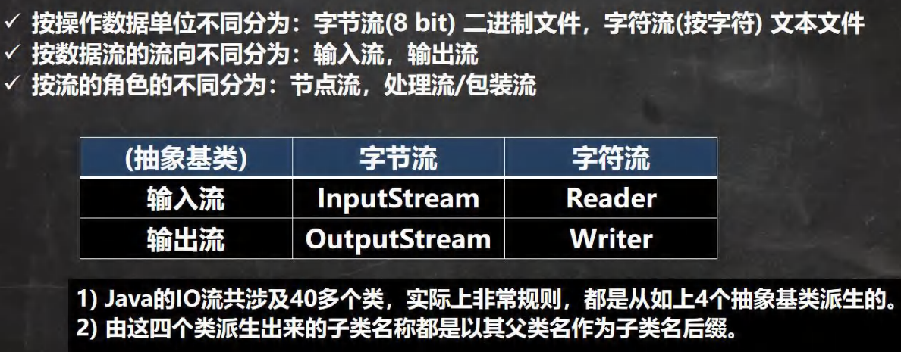
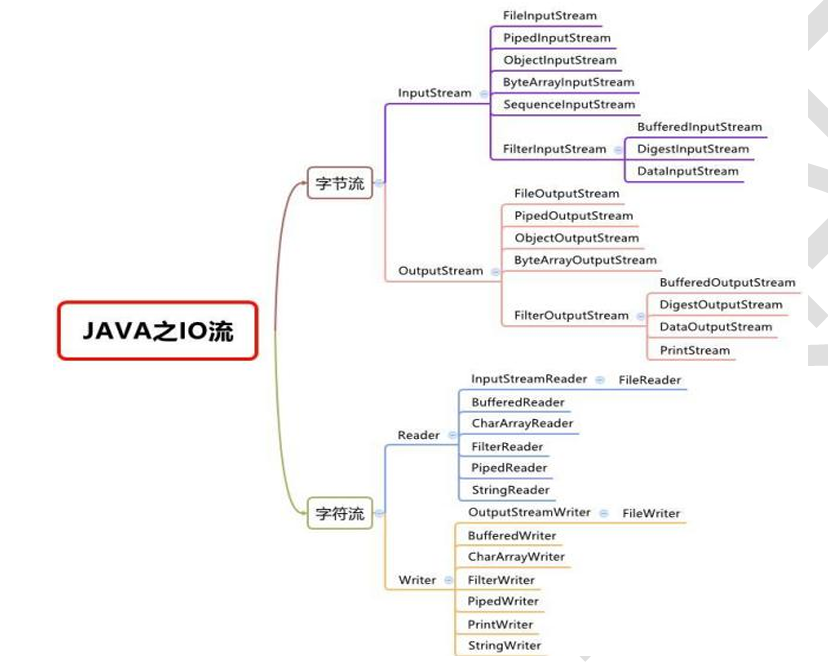
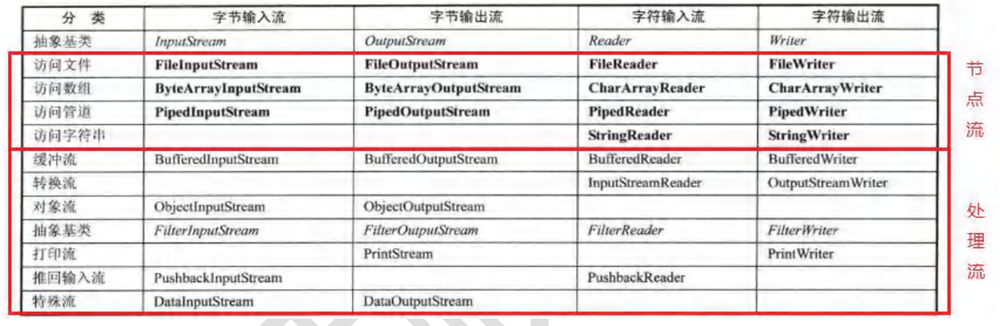

# java基础

## 文件操作


### 创建文件对象：

`File` 类是 Java IO 库中的一个核心类，它用于表示文件和目录的抽象。通过 `File` 对象，你可以操作文件或目录的路径、名称、创建、删除、读取和修改权限等属性，但它本身并不包含文件的内容。

`new File` 是 Java 中用于创建文件或目录对象的构造方法，用于表示文件系统中的一个文件或目录。`它并不直接读取或写入文件的内容`，而是提供文件的路径和属性信息，通常与 I/O 流操作结合使用，来执行文件的读写操作。

```java
 //先创建文件对象
File file = new File("e:\\news1.txt");    //最简单的一种构造方法，其他的几种可以先不用了解
 //调用相应的方法，得到对应信息
 //getName、getAbsolutePath、getParent、length、exists、isFile、isDirectory
System.out.println("文件名字=" + file.getName());
 System.out.println("文件绝对路径=" + file.getAbsolutePath());
 System.out.println("文件父级目录=" + file.getParent());
 System.out.println("文件大小(字节)=" + file.length());
 System.out.println("文件是否存在=" + file.exists());//T
 System.out.println("是不是一个文件=" + file.isFile());//T
 System.out.println("是不是一个目录=" + file.isDirectory());//F
```

与文件操作流结合的实际例子

```java
import java.io.*;

public class FileExample {
    public static void main(String[] args) {
        // 创建一个文件对象
        File file = new File("example.txt");

        // 检查文件是否存在
        if (!file.exists()) {
            try {
                // 创建新文件
                //file.createNewFile(); 是 Java 中 File 类的一个方法，用于创建一个新文件。如果文件不存在，调用该方法会在指定路径创建				//一个新的空文件；如果文件已经存在，则不会做任何操作，返回 false。
                file.createNewFile();
                System.out.println("文件创建成功");
            } catch (IOException e) {
                e.printStackTrace();
            }
        }

        // 使用 FileInputStream 读取文件内容
        try (FileInputStream fis = new FileInputStream(file)) {
            int data;  //注意是int类型
            while ((data = fis.read()) != -1) {
                System.out.print((char) data);
            }
        } catch (IOException e) {
            e.printStackTrace();
        }

        // 使用 FileOutputStream 写入数据到文件
        try (FileOutputStream fos = new FileOutputStream(file)) {
            String content = "Hello, File!";
            fos.write(content.getBytes()); //字符串-> 字节数组 str.getBytes()
        } catch (IOException e) {
            e.printStackTrace();
        }
    }
}

```


在 Java 中，`FileInputStream.read()` 和`FileReader.read()`方法返回的是 **int 类型**，而不是 `byte` 或 `char` 类型。这个 `int` 类型的值表示文件中读取的一个字节的数据，但它的范围是 0 到 255（或者 -1，表示到达文件末尾）。

`byte` 类型是有符号的，范围是从 -128 到 127，字节数据本身（文件内容、图像数据等）通常是 **无符号的**，值在 `0` 到 `255` 之间。

**字符**（`char`）是用于表示 Unicode 字符的 16 位无符号整数类型，范围是 `0` 到 `65535`，不能够表示文件结束标志（-1）


### IO流：









### 标准输入输出流

### 序列化与反序列化


**序列化** 是将对象转化为字节流或其他可以存储或传输的格式。

**反序列化** 是将存储或传输的字节流还原为原始对象。

Java 提供了 `Serializable` 接口，使用 `ObjectOutputStream` 和 `ObjectInputStream` 实现序列化和反序列化。 `serialVersionUID` 用于确保类的版本兼容性，`transient` 关键字可以防止某些字段被序列化。


细节：

1.序列化具备可继承性，也就是说如果某类已经实现序列化，则他的所有子类也已经默认实现了序列化


```java
//Transient 关键字：
//如果某些字段不希望被序列化，可以在字段上加 `transient` 关键字。被 `transient` 标记的字段不会被序列化。
public class Person implements Serializable {
    private static final long serialVersionUID = 1L;  // 保证序列化版本兼容性
    private String name;
    private transient int age;  // 不会被序列化
    // ...
}
```


### try-with-resources语法


```java
//核心要求：所有需要在 try-with-resources 中自动关闭的资源必须实现 java.lang.AutoCloseable 接口
//自动关闭资源，避免内存泄漏 
try (FileInputStream fis = new FileInputStream("file.txt")) {
    // 操作流
} catch (IOException e) {
    e.printStackTrace();
}
```

传统 try-catch-finally：

```java

FileInputStream fis = null;
try {
    fis = new FileInputStream("file.txt");
    // 操作流
} catch (IOException e) {
    e.printStackTrace();
} finally {
    if (fis != null) {
        try {
            fis.close();
        } catch (IOException e) {
            e.printStackTrace();
        }
    }
}
```


## 多线程


### 线程的生命周期：

1. **新建（New）**：线程对象被创建，但尚未启动。
2. **就绪（Runnable）**：线程被启动，并等待操作系统分配时间片来执行。
3. **运行中（Running）**：线程获得CPU时间片并执行任务。
4. **阻塞（Blocked）**：线程被挂起，等待某些条件（如I/O操作完成）。
5. **等待（Waiting）**：线程由于调用 `wait()`、`join()` 或 `sleep()` 等方法进入等待状态，直到其他线程唤醒它。
6. **结束（Terminated）**：线程执行完毕或者因异常等原因终止。


### 常用方法：


Thread.sleep :静态方法，直接可以使用


#### (1)wait和notify方法

使用方式：Object.wait()和Object.notify()/notifyAll() ：实例方法


`wait` 方法是 `Object` 类中的方法，作用在对象的 **监视器锁（==锁对象==）上**。当线程调用 `wait` 方法时，它会释放当前的锁，并使线程进入 **等待队列**，直到被其他线程通过 `notify` 或 `notifyAll` 唤醒。

`wait` 是和 `notify` 或 `notifyAll` 配合使用的。`notify`(如果有多个等待线程随机唤醒一个) 或 `notifyAll` 会唤醒在该对象的监视器上等待的线程。


> 多线程打印奇偶数，怎么控制打印的顺序
>
> 可以利用wait()和notify()来控制线程的执行顺序。
>
> 其实示例1中的lock.notify()和示例2中的notify()使用上本质是一样的，都是使用对象的继承自Object类的notify()方法
>
> 
>
> **`wait()`**：消费者线程在没有数据的情况下应该进入等待状态，直到生产者生产完数据。
>
> **`notify()`**：在生产者线程成功生产数据之后，调用 `notify()` 来唤醒消费者线程，通知它可以开始消费。
>
> ```java
> //生产者不能这样改，因为在最后一次生产后就退出循环了，无法执行notify()方法，造成消费者一直等待，程序无法退出
> //消费者可以修改，但也只是功能上刚好没有错误，逻辑还是不对
> public synchronized void produce(int data) throws InterruptedException {
>         while (isProduced) {
>             notify();
>             wait();  // 数据已经生产，等待消费者消费
>         }
>         this.data = data;  // 生产数据
>         System.out.println("Produced: " + data);
>         isProduced = true;  // 标记数据已被生产
>         //notify();  // 通知消费者数据已生产，可以消费
>     }
> ```

```java
//示例1：打印奇偶数
public class Test {
    private static final Object lock = new Object();  //不同线程使用同一个对象锁
    private static int count = 1;
    private static final int MAX_COUNT = 10;

    public static void main(String[] args) {
        Runnable printOdd = () -> {
            synchronized (lock) {
                while (count <= MAX_COUNT) {
                    if (count % 2 != 0) {
                        System.out.println(Thread.currentThread().getName() + ": " + count++);
                        lock.notify();
                    } else {
                        try {
                            lock.wait();
                        } catch (InterruptedException e) {
                            e.printStackTrace();
                        }
                    }
                }
            }
        };

        Runnable printEven = () -> {
            synchronized (lock) {
                while (count <= MAX_COUNT) {
                    if (count % 2 == 0) {
                        System.out.println(Thread.currentThread().getName() + ": " + count++);
                        lock.notify();
                    } else {
                        try {
                            lock.wait();

                        } catch (InterruptedException e) {
                            e.printStackTrace();
                        }
                    }
                }
            }
        };

        Thread oddThread = new Thread(printOdd, "OddThread");
        Thread evenThread = new Thread(printEven, "EvenThread");

        oddThread.start();
        evenThread.start();
    }
}

```


```java
//示例2：生产者消费者
public class Test {
    public static void main(String[] args) {
        SharedResource resource = new SharedResource();

        // 生产者线程
        Thread producer = new Thread(() -> {
            try {
                for (int i = 0; i < 5; i++) {
                    resource.produce(i);
                    Thread.sleep(500);  // 模拟生产间隔,不是必要的
                }
            } catch (InterruptedException e) {
                e.printStackTrace();
            }
        });

        // 消费者线程
        Thread consumer = new Thread(() -> {
            try {
                for (int i = 0; i < 5; i++) {
                    resource.consume();
                    Thread.sleep(1000);  // 模拟消费间隔
                }
            } catch (InterruptedException e) {
                e.printStackTrace();
            }
        });

        producer.start();
        consumer.start();
    }
}

class SharedResource {
    private int data;
    private boolean isProduced = false; // 标记数据是否已经被生产

    // 生产者方法
    public synchronized void produce(int data) throws InterruptedException {
        while (isProduced) {
            wait();  // 数据已经生产，等待消费者消费
        }
        this.data = data;  // 生产数据
        System.out.println("Produced: " + data);
        isProduced = true;  // 标记数据已被生产
        notify();  // 通知消费者数据已生产，可以消费
    }

    // 消费者方法
    public synchronized void consume() throws InterruptedException {
        while (!isProduced) {
            wait();  // 数据没有生产，等待生产者生产数据
        }
        System.out.println("Consumed: " + data);  // 消费数据
        isProduced = false;  // 标记数据已被消费
        notify();  // 通知生产者可以继续生产
    }
}

```


#### (2)join方法

使用方法：thread.join()

当一个线程调用另一个线程的`join`方法时，当前线程会等待该线程执行完毕之后再继续执行。

join会让==调用它的线程== 等待==另一个线程==的执行结果。调用 `join` 的线程和被调用的线程是两个不同的线程。


`join` 是 `Thread` 类的一个方法，它使得 **当前线程等待另一个线程完成**，即当前线程会 **阻塞**，直到调用 `join` 的目标线程 **执行完成**。可以把 `join` 看作是“主线程等子线程完成”的一种机制。

```java
class MyThread extends Thread {
    public void run() {
        try {
            Thread.sleep(1000);  // 模拟任务
            System.out.println(Thread.currentThread().getName() + " finished.");
        } catch (InterruptedException e) {
            e.printStackTrace();  //线程内部没有继续响应中断信号，那么就不需要恢复中断标志。
        }
    }
}

public class JoinExample {
    public static void main(String[] args) throws InterruptedException {
        MyThread t1 = new MyThread();
        t1.start();
        
        // 主线程等待 t1 执行完毕
        t1.join();  // 当前线程（主线程）会等待 t1 执行完再继续
        
        System.out.println("Main thread continues.");
    }
}

```


#### (3)interrupt方法

**线程中断的基本概念**：

- 在 Java 中，线程并不会被强制终止。我们可以通过调用 thread.interrupt()来中断一个线程(`调用intrrrupt方法的线程对象被中断`)。
- 线程的中断机制是通过设置线程的中断标志来通知线程停止当前的工作。线程自身需要检查这个中断标志，并根据需要响应。
- `interrupt()` 方法并不会直接终止线程，而是设置线程的中断标志。线程必须定期检查这个标志，才能决定是否需要终止或中断自己。
- 线程可以通过 `isInterrupted()` 方法检查是否被中断，通常是==Thread.currentThread().isInterrupted()==


1)当线程调用sleep()、join()或wait()等方法并被中断时`InterruptedException`会被抛出，并且中断标志会自动被清除。这意味着线程不再记得它曾经被中断。

2)捕获`InterruptedException`后，如果希望继续响应后续的中断请求时，通常需要手动恢复中断标志，通常是调用==Thread.currentThread().interrupt()==。

3)如果捕获异常后，如果不重新设置中断标志，那么其他代码将无法检测到线程已经被中断;线程内部没有继续响应中断信号，那么就不需要恢复中断标志。

4)等待==同步锁==的线程处于`BLOCKED`状态，而`sleep()`或`wait()`中的线程处于`WAITING`或`TIMED_WAITING`状态。JVM对不同状态的线程中断处理逻辑不同

5)与sleep()和wait()不同，等待同步锁的阻塞不会因`interrupt()`方法直接抛出`InterruptedException`,线程会**继续阻塞在锁池中**，直到成功获取锁或锁被释 	放。此时，线程的中断标志位会被设置为`true`，但线程本身并不会主动响应中断

```java
public class InterruptExample {
    public static void main(String[] args) throws InterruptedException {
        Thread thread = new Thread(() -> {
            try {
                // 线程任务：模拟执行一项操作
                while (!Thread.currentThread().isInterrupted()) {
                    System.out.println("Task running...");
                    Thread.sleep(1000);  // 模拟休眠操作，线程会被中断
                }
            } catch (InterruptedException e) {
                // 捕获 InterruptedException 后，线程可以进行清理工作
                System.out.println("Thread was interrupted during sleep.");
                // 恢复中断状态，如果继续做中断处理，如果不处理跳不出循环
                Thread.currentThread().interrupt();
            }
            System.out.println("Thread finished.");
        });

        // 启动线程
        thread.start();

        // 主线程等待 3 秒钟后中断子线程
        Thread.sleep(3000);
        //Thread.currentThread.interrupt和thread.interrupt本质上是一样的
        thread.interrupt();  // 中断子线程
    }
}

```


####  (4)await方法

//CountDownLatch 初始化时传入一个计数值 count，表示有多少个线程需要等待。每当一个线程执行完成时，它会调用 countDown() 方法，减少计数值。
//主线程或其它等待线程调用 await() 方法，当计数值为零时，await() 会返回，表示所有任务都已完成。

```java
//示例3


//创建一个 CountDownLatch 实例，初始化计数值。
//启动多个线程执行任务，每个线程执行完后调用 countDown()。
//调用 await() 来等待线程执行完毕。
public class CountDownLatchExample {
    public static void main(String[] args) throws InterruptedException {
        // 创建一个 CountDownLatch，初始值为 3
        CountDownLatch latch = new CountDownLatch(3);

        // 创建并启动 3 个线程
        for (int i = 0; i < 3; i++) {
            final int taskId = i;
            new Thread(() -> {
                try {
                    // 模拟任务执行
                    System.out.println("Task " + taskId + " is executing.");
                    Thread.sleep(1000);  // 假设任务执行了 1 秒
                } catch (InterruptedException e) {
                    Thread.currentThread().interrupt();
                } finally {
                    // 完成任务后调用 countDown()
                    System.out.println("Task " + taskId + " is finished.");
                    latch.countDown();  // 每完成一个任务，计数器减 1
                }
            }).start();
        }

        // 主线程等待直到计数器变为 0
        latch.await();

        // 所有任务完成后，继续执行主线程
        System.out.println("All tasks are completed, main thread continues.");
    }
}

```


### Java 提供了两种创建和使用线程的方法：

(1)通过继承 `Thread` 类并重写 `run()` 方法来创建一个线程。

```java
class MyThread extends Thread {
    @Override
    public void run() {
        System.out.println("Thread is running!");
    }
}

public class ThreadExample {
    public static void main(String[] args) {
        MyThread thread = new MyThread();
        thread.start();  // 启动线程
    }
}

```

(2)通过实现 `Runnable` 接口并重写 `run()` 方法来创建一个线程。推荐这种方式，因为它允许多重继承。

```java
class MyRunnable implements Runnable {
    @Override
    public void run() {
        System.out.println("Runnable thread is running!");
    }
}

public class RunnableExample {
    public static void main(String[] args) {
        MyRunnable myRunnable = new MyRunnable();
        Thread thread = new Thread(myRunnable);  // 将Runnable传给Thread,其实这里可以用lamda表达式来赋值给函数式接口Runable
        thread.start();  // 启动线程
    }
}

```

(3)Java 通过 `ExecutorService` 提供了线程池（Thread Pool）功能，使得线程管理更加高效。线程池允许预先创建一定数量的线程，并且线程可以复用，而不是每次都创建新的线程。

```java
import java.util.concurrent.*;

public class ThreadPoolExample {
    public static void main(String[] args) {
        ExecutorService executorService = Executors.newFixedThreadPool(3);  // 创建一个固定大小的线程池

        // 提交多个任务到线程池
        for (int i = 0; i < 5; i++) {
            executorService.submit(() -> {
                System.out.println(Thread.currentThread().getName() + " is executing task");
                try {
                    Thread.sleep(1000);  // 模拟任务执行
                } catch (InterruptedException e) {
                    e.printStackTrace();
                }
            });
        }

        executorService.shutdown();  // 关闭线程池
    }
}

```


### 同步机制：

CAS 主要用于实现无锁的 **乐观锁**，而 `synchronized` 属于 **悲观锁**。

其实synchronized实际上是互斥锁，不过同时也体现出一部分同步作用，`synchronized` ==关键字==是一种内置的互斥锁（Mutex）实现


(1)当 synchronized 修饰`非静态方法`时，==锁的粒度是该对象实例==，`而非方法本身`。这意味着：调用该方法的实例对象(如 a.method()中的a对象)会被隐式锁定。同一时间，只有持有该对象锁的线程才可以访问该对象的任意 synchronized 方法或代码块。其他线程若尝试访问`该对象`的其他synchronized方法，会被阻塞

(2)当 synchronized修饰`静态方法`时，**锁的粒度是类对象**（即`MyClass.class`），而非实例对象。这意味着同一时间其他线程若尝试访问`该类的所有实例`的其他synchronized方法，会被阻塞

(3)`synchronized` 代码块允许显式指定锁对象(可以是实例和类对象)，灵活性更高，可缩小锁范围（仅同步关键代码），提升并发性能

(4)**锁的粒度**：`synchronized`锁定的是整个对象(或类对象),而非单个方法;==同步方法==隐式锁定 `this` 或类对象，而==同步代码块==可自定义锁对象


### volatile实现单例模式

`volatile`是Java中的一个关键字，用来修饰类的字段。它的作用是确保一个变量在多线程环境下的`可见性`和`禁止指令重排`，确保多线程操作共享变量时的一致性。

==可见性==：当一个线程修改了volatile修饰的变量的值时，其他线程能立即看到这个变化。如果没有使用 volatile，可能会存在线程缓存的问题（每个线程有自己的工    

​         作内存），其他线程可能不能看到修改后的值。`volatile` 关键字修饰的变量会强制每次都从主内存读取数据，而不是从线程的本地缓存读取。同时，所有对

​        volatile 变量的写操作，都会直接写入主内存，不会保留在局部缓存中。

==禁止指令重排==：Java 虚拟机为了优化性能，可能会对指令进行重排，但对于 `volatile` 变量，JVM 会保证对 `volatile` 变量的读写操作不允许发生重排，即保		证其操作的顺序性。由于 volatile 禁止对象创建时指令之间重排序，所以其他线程不会访问到一个`未初始化的对象`，从而保证安全性


在创建单例模式时使用 **双重检查锁定**（Double-Checked Locking）的目的是为了在`确保线程安全`的同时提高性能，`避免不必要的同步开销`。

**第一次检查**：主要是为了在`对象已经创建后`，跳过同步块，直接返回实例。这样避免了每次调用 `getInstance()` 都进入 `synchronized` 块，减少了性能开销。

**第二次检查**：在进入同步代码块后，必须再次检查 `instance == null`，因为在第一个检查之后，可能有其他线程已经在同步代码块中创建了 `instance`，我们需要确保只有一个线程能够进入同步块并初始化 `instance`。

```java
public class SingleTon {

	//volatile关键字修饰变量 防止指令重排序和保证可见性，
    //感觉这里主要是保证可见性，初始化对象和对象引用都在同步代码块里，就算指令重排应该也不会影响
    private static volatile SingleTon instance = null;
    private SingleTon(){}
     
    public static  SingleTon getInstance(){
        if(instance == null){  // 第一次检查，快速路径，不会造成同步阻塞，减少了性能开销。
            //同步代码块 只有在第一次获取对象的时候会执行到 ，第二次及以后访问时 instance变量均非null故不会往下执行了 直接返回啦
            synchronized(SingleTon.class){
                if(instance == null){  // 第二次检查，确保只有第一次创建时才会进行同步
                    instance = new SingleTon();
                }
            }
        }
        return instance;
    }
}
```


> #### **指令重排的关键问题**
>
> 指令重排是 JVM 和处理器为了优化性能而可能做的一种优化。当你在创建对象时进行同步操作时，尽管同步代码块确保了原子性，但指令重排仍然可能发生，特别是在对象的初始化过程中。以下是指令重排可能带来的问题：
>
> - **对象初始化过程**：
>   1. **内存分配**：为 `Singleton` 对象分配内存。
>   2. **构造函数调用**：执行 `Singleton()` 构造函数，初始化对象。
>   3. **引用赋值**：将 `instance` 引用指向新创建的对象。
> - **重排的问题**：假设执行顺序是这样的：
>   1. JVM 可能会将步骤 1（内存分配）和步骤 3（引用赋值）重排，即在完成对象初始化之前就将 `instance` 指向这个内存地址。
>   2. 这时，另一个线程可能在 `instance` 引用被设置之后访问这个对象，但它看到的对象并不是完全初始化过的对象，从而导致潜在的问题。


### 死锁：

死锁的四个必要条件：

1. **互斥条件**：至少有一个资源被一个线程占有，并且该资源不能被其他线程占用。
2. **请求与保持条件**：一个线程在占有一个资源的同时，提出对其他资源的请求，但又不释放自己已占有的资源。
3. **不剥夺条件**：已获得的资源不能强制剥夺，只能通过线程自己释放。
4. **循环等待条件**：多个线程之间形成一种头尾相接的等待关系，即线程 A 等待线程 B 持有的资源，线程 B 等待线程 C 持有的资源，...，直到最后线程 D 又等待线程 A 持有的资源


==简单说：==死锁是指多个线程在运行过程中，因竞争资源而造成互相等待的情况，导致线程无法继续执行

```java
//死锁案例：
class A {
    synchronized void methodA(B b) {
        System.out.println("Thread 1: Locked A, trying to lock B");
        b.last();
    }

    synchronized void last() {
        System.out.println("Inside A's last method");
    }
}

class B {
    synchronized void methodB(A a) {
        System.out.println("Thread 2: Locked B, trying to lock A");
        a.last();
    }

    synchronized void last() {
        System.out.println("Inside B's last method");
    }
}

public class DeadlockExample {
    public static void main(String[] args) {
        A a = new A();
        B b = new B();

        // Thread 1: Locks A and tries to lock B
        new Thread(() -> a.methodA(b)).start();  

        // Thread 2: Locks B and tries to lock A
        new Thread(() -> b.methodB(a)).start();
    }
}

```

 

解决方案：==统一锁获取顺序==

强制所有线程按 **固定顺序**（如先 `A` 后 `B`）获取锁，避免循环等待。

**`last()` 方法无需调整顺序**：由于外层方法已按固定顺序加锁，`last()` 只需使用对应的锁保护自身资源。

假设将 `A.last()` 和 `B.last()` 都改为使用 `LOCK_A`，那么锁粒度扩大：所有操作依赖单一锁，导致不必要的线程竞争，降低并发性能。

```java
class A {
    // 公共锁对象，用于全局控制锁顺序
    public static final Object LOCK_A = new Object();
    public static final Object LOCK_B = new Object();

    void methodA(B b) {
        synchronized (LOCK_A) {    // 先锁 A
            System.out.println("Thread 1: Locked A, trying to lock B");
            synchronized (LOCK_B) {  // 再锁 B
                b.last();
            }
        }
    }

    void last() {
        synchronized (LOCK_A) {  // 使用统一锁
            System.out.println("Inside A's last method");
        }
    }
}

class B {
    void methodB(A a) {
        synchronized (A.LOCK_A) {  // 先锁 A（与线程1顺序一致）
            System.out.println("Thread 2: Locked A, trying to lock B");
            synchronized (A.LOCK_B) {  // 再锁 B
                a.last();
            }
        }
    }

    void last() {
        synchronized (A.LOCK_B) {  // 使用统一锁
            System.out.println("Inside B's last method");
        }
    }
}

public class DeadlockExample {
    public static void main(String[] args) {
        A a = new A();
        B b = new B();

        new Thread(() -> a.methodA(b)).start();
        new Thread(() -> b.methodB(a)).start();
    }
}
```


死锁的检测：

(1)使用jstack

1.**找到 Java 进程的 PID** ,在控制台使用 `jps` 命令可以查看正在运行的 Java 进程以及它们的 PID（进程 ID）。

2.使用 `jstack` 打印线程栈：jstack <pid> 

3.**输出死锁信息** 如果检测到死锁，`jstack` 会自动输出死锁的线程信息，显示哪些线程处于死锁状态，以及它们在等待哪些资源。

(2)使用jconsole

1.在终端中直接运行 `jconsole` 命令（需要 Java 环境变量配置正确）,然后自动会打开一个图形化工具

2.选择要监控的进程后，点击 `Connect` 连接到目标 Java 应用程序。

3.在新窗口的Threads标签下，可以查看当前所有线程状态，如果有死锁会显示出来


### 异步操作：

感觉本质就是使用一个新线程，

Java 提供了多种方式来实现异步编程，最常见的方式之一是通过 `CompletableFuture` 类来处理异步任务。

```java
 public static void main(String[] args) throws Exception {
       
       // 异步执行任务,使用默认的线程池
        CompletableFuture.supplyAsync(() -> {
            return "Hello";
        }).thenApply(result -> {
            return result + " World";
        }).thenAccept(System.out::println);

        System.out.println(Thread.currentThread().getName());
        System.out.println("Main thread continues...");
    }


//其实感觉根本没必要链式调用，只使用下面这一个方法就行了
CompletableFuture.supplyAsync(() -> {
            //需要异步操作的代码...
            return "";
        })；
```


### Reentrantlock


`synchronized` 是非公平锁

`ReentrantLock` 类，它支持 **公平锁** 和 **非公平锁**。`ReentrantLock` 可以通过构造函数指定是否采用公平锁：

> ReentrantLock lock = new ReentrantLock(true);  // 公平锁,确保线程按照请求的顺序获得锁。
> ReentrantLock lock = new ReentrantLock(false); // 非公平锁，默认值;允许线程在锁释放后立即争抢锁。


常用方法：

(1) lock()与unlock()

**`lock()`**：获取锁，如果锁已经被其他线程持有，则当前线程会被阻塞，直到锁可用。

**`unlock()`**：释放锁，通常应该在 `finally` 块中调用，确保锁的释放。

```java
public class ReentrantLockExample {
    private final ReentrantLock lock = new ReentrantLock();

    public void methodWithLock() {
        lock.lock();  // 获取锁
        try {
            // 临界区
            System.out.println(Thread.currentThread().getName() + " is executing method.");
        } finally {
            lock.unlock();  // 释放锁
        }
    }

    public static void main(String[] args) {//.... }
}
```


(2) trylock()

`tryLock()` 允许尝试获取锁而不阻塞，如果锁不可用，可以采取其他措施避免死锁。

**`tryLock(long time, TimeUnit unit)`**：尝试在指定的时间内获取锁，如果在给定时间内没有获取到锁，则返回 `false`。

> // 尝试在 3 秒内获取锁
>
>  if (lock.tryLock(3, TimeUnit.SECONDS))

```java
public class TryLockExample {
    private final ReentrantLock lock = new ReentrantLock();

    public void tryLockMethod() {
        if (lock.tryLock()) {  // 尝试获取锁
            try {
                // 临界区
                System.out.println(Thread.currentThread().getName() + " successfully acquired lock.");
            } finally {
                lock.unlock();  // 释放锁
            }
        } else {
            System.out.println(Thread.currentThread().getName() + " could not acquire lock.");
        }
    }

    public static void main(String[] args) {//...}
}
```

(3) lockInterruptibly()

`lockInterruptibly()` 使得线程在等待锁时，如果被中断，可以抛出 `InterruptedException`，从而让线程能够响应中断请求。


```java

public class LockInterruptiblyExample {
    private final ReentrantLock lock = new ReentrantLock();

    public void methodWithLockInterruptibly() {
        try {
            lock.lockInterruptibly();  // 获取锁，支持中断
            try {
                // 临界区
                System.out.println(Thread.currentThread().getName() + " acquired lock.");
                Thread.sleep(1000);  // 模拟工作
            } finally {
                lock.unlock();  // 释放锁
            }
        } catch (InterruptedException e) {
            System.out.println(Thread.currentThread().getName() + " was interrupted while waiting for lock.");
        }
    }

    public static void main(String[] args) throws InterruptedException {
        LockInterruptiblyExample example = new LockInterruptiblyExample();
        Runnable task = example::methodWithLockInterruptibly;

        Thread t1 = new Thread(task);
        Thread t2 = new Thread(task);
        t1.start();
        t2.start();

        // 主线程中断 t2
        Thread.sleep(500);
        t2.interrupt();  // 中断 t2 线程
    }
}

```

(4) newCondition()

`Condition` 可以用来代替 `Object` 的 `wait()` 和 `notify()` 方法，在 `ReentrantLock` 上进行条件等待和通知。

Condition的`await()和signal()`分别对应Object类的`wait和notify`方法，且效果一样,signalAll()与notifyAll()也一样

```java
//生产者与消费者的例子
public class ConditionExample {
    private final ReentrantLock lock = new ReentrantLock();
    private final Condition condition = lock.newCondition();
    private boolean ready = false;  // 表示是否准备好数据

    // 生产者方法
    public void producer() throws InterruptedException {
        for (int i = 1; i <= 5; i++) {  // 生产5个数据
            lock.lock();
            try {
                // 模拟生产数据
                Thread.sleep(1000);  
                ready = true;
                System.out.println("Producer produced data: " + i);
                condition.signal();  // 唤醒消费者
                while (ready) { // 防止连续生产时消费者消费不及时，生产者可以适当等待
                    condition.await();
                }
            } finally {
                lock.unlock();
            }
        }
    }

    // 消费者方法
    public void consumer() throws InterruptedException {
        for (int i = 1; i <= 5; i++) {  // 消费5个数据
            lock.lock();
            try {
                while (!ready) {  // 如果数据未准备好，消费者等待
                    System.out.println("Consumer waiting for data...");
                    condition.await();  // 等待生产者的信号
                }
                // 消费数据
                System.out.println("Consumer consumed the data: " + i);
                ready = false;
                condition.signal();  // 唤醒生产者准备下一个数据
            } finally {
                lock.unlock();
            }
        }
    }

    public static void main(String[] args) throws InterruptedException {
        ConditionExample example = new ConditionExample();

        // 创建生产者线程
        Thread producer = new Thread(() -> {
            try {
                example.producer();
            } catch (InterruptedException e) {
                e.printStackTrace();
            }
        });

        // 创建消费者线程
        Thread consumer = new Thread(() -> {
            try {
                example.consumer();
            } catch (InterruptedException e) {
                e.printStackTrace();
            }
        });

        consumer.start();
        producer.start();

        //等待两个线程执行完毕，主线程会等待生产者和消费者线程完全执行完之后，再输出"haha"
        producer.join();
        consumer.join();
        System.out.println("hahha");
    }
}

```


## sql语句

**DML（数据操作语言）**,用于对 **数据库表中的数据** 进行 **增、删、改、查** 操作。事务中操作后可以回滚

**DDL（数据定义语言）**，它**直接修改数据库的元数据**（例如删除表结构、索引等。事务中操作后无法回滚


> ==DML（数据操作语言）:==
>
> 常见的增删改查操作通常被简称为 **CRUD**，即 **Create (增)**，**Read (查)**，**Update (改)** 和 **Delete (删)**

> ==DDL(数据定义语言):==
>
> **CREATE**：用于创建数据库、表、视图、索引等。
>
> - 例如：`CREATE TABLE`, `CREATE DATABASE`, `CREATE INDEX` 等。
>
> **ALTER**：用于修改数据库对象的结构。
>
> - 例如：`ALTER TABLE` 用于修改表的结构（如增加列、修改列类型等）。
>
> **DROP**：用于删除数据库对象。
>
> - 例如：`DROP TABLE`, `DROP DATABASE`, `DROP INDEX` 等。
>
> **TRUNCATE**：用于删除表中的所有数据，但保留表的结构。
>
> - 例如：`TRUNCATE TABLE`。
>
> **RENAME**：用于重命名数据库对象。
>
> - 例如：`RENAME TABLE`。


> //添加新列
>
> ALTER TABLE employees ADD COLUMN age INT;
>
> //删除列
>
> ALTER TABLE employees DROP COLUMN age;
>
> //修改列的表名
>
> ALTER TABLE employees CHANGE COLUMN age employee_age INT;
>
> //修改表名，把 `employees` 表重命名为 `staff`。
>
> ALTER TABLE employees RENAME TO staff;
>
> ------
>
> //修改表名
>
> RENAME TABLE old_table_name TO new_table_name;
>
> ---
>
> //TRUNCATE用法
>
> TRUNCATE TABLE table_name;//用法和DROP相似,仅清空数据，保留表结构
>
> DROP TABLE employees;  -- 彻底删除表
>
> `TRUNCATE` 语句用于**快速删除表中的所有数据**，但**不会删除表结构**。它的执行速度比 `DELETE` 更快，因为它不会逐行删除数据，而是直接清空整个表。
>
> (1)**不会触发 `DELETE` 触发器**: 如果表上有 `DELETE` 触发器，`TRUNCATE` 不会触发它们，而 `DELETE` 会触发。
>
> (2)**`AUTO_INCREMENT` 会重置**： 如果表有 `AUTO_INCREMENT` 自增主键，`TRUNCATE` 之后，自增值会从 `1` 开始重新计算：
>
> (3)MySQL InnoDB存储引擎支持回滚: 在事务中，InnoDB 的`TRUNCATE`不能回滚，因为它相当于`DROP TABLE`+`CREATE TABLE`。但`DELETE`在事务中可以回滚


​						   

### 1.插入

> INSERT INTO table_name (column1, column2, column3, ...)
> VALUES (value1, value2, value3, ...);
>
> 


### 2.查询


常用的查询操作：

- `WHERE` 子句：用来指定查询条件。
- `ORDER BY` 子句：按指定的列排序结果。，默认是升序(ASC),降序是DESC,全称是Ascending与Descending
- `LIMIT`：限制返回的记录数。`LIMIT` 可以与 `OFFSET` 一起使用来实现分页查询。`OFFSET` 用来指定查询结果从哪一行开始返回。
- `GROUP BY`：对结果进行分组。
- `JOIN`：联合多个表查询。
- `模糊查询`：常用于`LIKE`操作符，配合`通配符`进行查询，可以将 `NOT LIKE` 与模糊查询结合，排除某些模式的数据。


> 去重查询：
>
> SELECT DISTINCT column1
> FROM table_name;
>
> ---
>
> SELECT name, age
> FROM employees
> WHERE department = 'HR'
> ORDER BY age DESC
> LIMIT 5;
>
> -------
>
> 注意：`LIMIT 5 OFFSET 10` 表示跳过前 510行，然后返回接下来的 5 行数据（即从第 11 行开始返回）
>
> SELECT name, department
> FROM employees
> LIMIT 5 OFFSET 10;
>
> -----
>
> `范围`查询：
>
> SELECT * FROM employees
> WHERE age BETWEEN 25 AND 40;
>
> -----
>
> `多个条件`：
>
> SELECT * FROM employees
> WHERE department = 'IT' AND age > 30;
>
> ----
>
> `非等值`查询：! = 或者 <>
>
> SELECT * FROM employees
> WHERE age <> 30;
>
> ---
>
> `IN` 条件：**`NOT IN`**：与 `IN` 相反，表示列的值不在指定的集合中。
>
> SELECT * FROM employees
> WHERE department IN ('HR', 'IT');
>
> ---
>
> `IS NULL`：
>
> SELECT * FROM employees
> WHERE manager_id IS NULL;

非等值操作符包括：

1. **`! =`** 或 **`<>`**：表示不等于。
2. **`>`**、**`<`**、**`>=`**、**`<=`**：表示大于、小于、大于等于、小于等于。
3. **`BETWEEN`**：表示在两个值之间，不包括端点（或包括端点，根据具体情况）。
4. **`IN`**：检查某列的值是否在指定的集合中，通常用于替代多个 `OR` 条件。
5. **`NOT IN`**：与 `IN` 相反，表示列的值不在指定的集合中。


#### GROUP BY详细用法：

- **`GROUP BY`** 用于按某些列进行分组。

- ==聚合函数==（如 `COUNT()`、`SUM()`、`AVG()`、`MAX()`、`MIN()`）通常与 `GROUP BY` 一起使用，以便对每个分组进行统计。

- **`HAVING`** 子句用来过滤分组后的数据，通常用于过滤聚合结果。HAVING类似于WHERE，但WHERE只能用于过滤行，而HAVING是用来过滤分组后的结果。

- 可以结合 **`ORDER BY`** 对分组后的结果进行排序。

> 示例 1：按部门分组并计算每个部门的平均薪资（`AVG()`）
>
> SELECT department, AVG(salary) AS avg_salary
> FROM employees
> GROUP BY department;
>
> | department | avg_salary |
> | ---------- | ---------- |
> | IT         | 62500.00   |
> | HR         | 55000.00   |
> | Finance    | 61000.00   |

> ---------------------------------------------------------
>
> 示例 2：按部门分组并计算每个部门的员工数量（`COUNT()`）
>
> SELECT department, COUNT(*) AS employee_count
> FROM employees
> GROUP BY department;
>
> ----------------------------------
>
> 示例 3：按部门和性别分组并计算每组的员工数量（`COUNT()`）
>
> SELECT department, gender, COUNT(*) AS employee_count
> FROM employees
> GROUP BY department, gender;
>
> | department | gender | employee_count |
> | ---------- | ------ | -------------- |
> | IT         | M      | 3              |
> | IT         | F      | 1              |
> | HR         | F      | 3              |
> | Finance    | M      | 2              |
> | Finance    | F      | 1              |
>
> --------
>
> 示例 4：按部门分组并筛选薪资总和大于 200000 的部门（`SUM()` 和 `HAVING`）
>
> SELECT department, SUM(salary) AS total_salary
> FROM employees
> GROUP BY department
> HAVING SUM(salary) > 200000;
>
> ---
>
> 示例 5：按部门分组并按总薪资排序（`ORDER BY`）
>
> SELECT department, SUM(salary) AS total_salary
> FROM employees
> GROUP BY department
> ORDER BY total_salary DESC;


#### 内连接与外连接

`内连接`：是最常见的连接类型。它返回两个表中**满足连接条件**的行。如果某行在两个表中没有匹配，则该行不会出现在结果集中。

`外连接`:会返回左表和右表中所有的行，即使它们没有匹配的行。在外连接中，如果某个表没有匹配的行，结果中该表的列会显示为 NULL。

外连接可以分为三种类型：

- 左外连（LEFT OUTER JOIN:左外连接会返回**左表**中的所有行，即使它们在**右表**中没有匹配的行。对于没有匹配的右表行，会返回 `NULL`。
- **右外连接（RIGHT OUTER JOIN）**:与左连接相反
- **全外连接（FULL OUTER JOIN）**：全外连接会返回**左表**和**右表**中的所有行。如果某行在一个表中没有匹配，结果中该表的列会显示为

- **左连接**和**右连接**本质是方向对称的外连接，区别在于主表的选择。
- 通过调换表的位置，左连接可等价转换为右连接，反之亦然。

> 1.内连接的 SQL 语句：
>
> SELECT employees.name, departments.department_name
> FROM employees
> INNER JOIN departments
> ON employees.department_id = departments.id;
>
> ---
>
> 2.左外连接的 SQL 语句：
>
> SELECT employees.name, departments.department_name
> FROM employees
> LEFT OUTER JOIN departments
> ON employees.department_id = departments.id;
>
> ---
>
> 3.右外连接的 SQL 语句：
>
> SELECT employees.name, departments.department_name
> FROM employees
> RIGHT OUTER JOIN departments
> ON employees.department_id = departments.id;
>
> ---
>
> 4.全外连接的 SQL 语句：
>
> SELECT employees.name, departments.department_name
> FROM employees
> FULL OUTER JOIN departments
> ON employees.department_id = departments.id;


#### 模糊查询

> 常见的通配符
>
> **百分号 `%`**：代表零个或多个字符。用于匹配字符串中的任意字符（包括空字符）。
>
> **下划线 `_`**：代表一个字符。用于匹配单个字符。


> 在 **MySQL** 以及其他一些数据库中，`concat()` 是一个字符串拼接函数
>
> concat('%', #{name}, '%')
>
> `#{name}` 是 MyBatis 传递的 **占位符**，代表用户传入的参数。
>
> `concat('%', #{name}, '%')` 相当于： CONCAT('%', '张三', '%')

> 1.查询名字中包含 "John" 的所有员工
>
> SELECT name, department
> FROM employees
> WHERE name LIKE '%John%';
>
> ---
>
> 2.查询名字中第二个字符是 "o" 的所有员工
>
> SELECT name, department
> FROM employees
> WHERE name LIKE '_o%';
>
> ---
>
> 3.查询名字中不包含 "John" 的所有员工
>
> SELECT name, department
> FROM employees
> WHERE name NOT LIKE '%John%';


#### SQL 注入

SQL 注入（SQL Injection）是一种常见的安全漏洞，攻击者通过注入恶意 SQL 语句来操纵数据库查询，可能会导致数据泄露、篡改、删除，甚至获取数据库的完整控制权限


> 绕过身份验证，**假设有以下查询**：
>
> SELECT * FROM users WHERE username = '输入的用户名' AND password = '输入的密码';
>
> 如果攻击者输入：用户名：`admin' --`     密码：（随便填）
>
> 最终 SQL 变成：SELECT * FROM users WHERE username = 'admin' `-- ' AND password = 'xxx'`;
>
> **==`--` 表示 SQL 注释==，后面的内容会被忽略**，等效于： SELECT * FROM users WHERE username = 'admin';


**使用 MyBatis（推荐 `#{}`，不要用 `${}`）**

**MyBatis 框架内置防 SQL 注入能力，使用 `#{}` 绑定变量。**

```xml
<select id="getUser" resultType="User">
    SELECT * FROM users WHERE username = #{username} AND password = #{password}
</select>
```


```xml
<!--不要用 `${}`**，因为 `${}` 会直接拼接 SQL，仍然存在 SQL 注入风险：-->
<!--错误示范：`${username}` **会直接替换成字符串，没有任何防护！-->
<select id="getUser" resultType="User">
    SELECT * FROM users WHERE username = '${username}' AND password = '${password}'
</select>
```


### 3.修改

> UPDATE table_name
> SET column1 = value1, column2 = value2, ...
> WHERE condition;


### 4.删除

> //删除表中的数据
>
> DELETE FROM table_name
> WHERE condition;
>
> -----
>
> //删除表
>
> DROP TABLE table_name;

### 5.创建和修改表


> 创建表（CREATE TABLE）：
>
> CREATE TABLE employees (
>   id INT PRIMARY KEY,
>   name VARCHAR(100),
>   age INT,
>   department VARCHAR(50)
> );
>
> ----
>
> 修改表（ALTER TABLE）：
>
> ALTER TABLE employees
> ADD COLUMN salary DECIMAL(10, 2);
>
> ---
>
> 删除表（DROP TABLE）：
>
> DROP TABLE employees;


### 6.事务

事务用于确保一系列操作作为一个单一单元执行，要么全部成功，要么全部失败。

- **开始事务**：START TRANSACTION;
- **提交事务：**COMMIT;
- **回滚事务：**ROLLBACK;
- **保存点：SAVEPOINT savepoint_name;**   

```sql
BEGIN;  -- 在Mysql中，等同于START TRANSACTION;
UPDATE accounts SET balance = balance - 100 WHERE name = 'Alice';
SAVEPOINT sp1; -- 创建保存点

UPDATE accounts SET balance = balance - 500 WHERE name = 'Bob';  -- 误操作
ROLLBACK TO sp1; -- 仅回滚到 `sp1`，Alice 的更新保留

COMMIT;

```


==事务的特性和隔离级别：==

ACID 包括：

1. **原子性 (Atomicity)**：事务中的所有操作要么全部成功执行，要么全部失败回滚，不能出现部分操作成功、部分操作失败的情况。

2. **一致性 (Consistency)**：事务在执行前后，数据库的状态必须从一个一致性状态转移到另一个一致性状态

3. **隔离性 (Isolation)**：多个事务并发执行时，每个事务的执行应该不受其他事务的干扰。事务之间的操作对彼此是隔离的。数据库系统提供不同的隔离级别来控制并

   ​        		  发事务之间的相互影响。

4. **持久性 (Durability)**：事务一旦提交，所做的修改将永久保存到数据库中，即使发生系统崩溃或电源故障等情况，事务的修改也不会丢失。


MySQL 的默认隔离级别是 **`REPEATABLE READ`**。

| 隔离级别         | 脏读   | 不可重复读 | 幻读   |
| ---------------- | ------ | ---------- | ------ |
| Read Uncommitted | 允许   | 允许       | 允许   |
| Read Committed   | 不允许 | 允许       | 允许   |
| Repeatable Read  | 不允许 | 不允许     | 允许   |
| Serializable     | 不允许 | 不允许     | 不允许 |

(1)脏读指的是一个事务读取了另一个事务尚未提交的数据。也就是说，一个事务读取了另一个事务中间状态的数据，这个数据可能会被回滚，从而导致读取的数据不真实。

(2)不可重复读是指一个事务在同一操作中读取同一条记录多次,在它读取期间另一个事务可能对该记录进行了修改，导致该事务后续的读取结果与第一次读取的结果不同。

(3)幻读指的是在一个事务中执行查询时，另一个事务在此事务执行期间插入、删除数据，导致该事务的查询结果在多次查询时出现不一致的情况。


==注意：==

**DDL(数据定义语言)**，它直接修改数据库的元数据,在MySQL默认的`AUTOCOMMIT=1`模式下，DDL语句会自动提交事务，因此一旦执行就==无法回滚。==

**DML（数据操作语言）**，它支持事务。当DML语句在事务 中执行时，MySQL 会将被删除的数据存入 UNDO 日志，因此可以在ROLLBACK时恢复。


**标准 SQL 规定 REPEATABLE READ 允许幻读**，但 **MySQL InnoDB 通过间隙锁防止了幻读**。


**简单理解**：

InnoDB 表的数据 **直接存储在主键索引的叶子节点上**，

而 **MyISAM** 存储引擎是将索引和数据分开存储的，索引仅存储数据行的指针，即 **数据行的地址**。


在 **InnoDB** 存储引擎中，**表的数据存储在主键索引（即聚簇索引，Clustered Index）中**。
这意味着：

- **数据存储在 B+ 树的叶子节点上**，而不是单独存储在一个独立的存储区域。
- **主键索引的叶子节点存储完整的行数据**，而不是仅存储主键值和数据地址。
- **查询主键时，直接从 B+ 树的叶子节点读取数据，无需二次查找**。


如果使用**InnoDB**：数据存储在 `.ibd` 文件中数据 直接存储在主键索引 B+ 树的叶子节点上。一张 InnoDB 表只能有一个**聚簇索引**，但可以有多个 **非聚簇索引**，虽然				所有的索引（包括聚簇和非聚簇）都存储在 `.ibd` 文件中，但 **每个索引的存储区域是分开的**。

如果使用**MyISAM**：数据存储在 **`.MYD` 文件** 中，而索引存储在 **`.MYI` 文件** 中，索引仅存储数据地址。


聚簇索引（Clustered Index）：每张表**只能有一个**，叶子节点存储**完整行数据**，直接通过主键查找数据，读取主键数据更快

非聚簇索引（Secondary Index）：每张表**可以有多个**，叶子节点只存储**主键值**，先查找二级索引，再回表查主键索引，查询较慢


如果查询条件列上有非聚簇索引：查询首先会通过 **非聚簇索引** 查找匹配的索引记录。非聚簇索引的叶子节点存储的是 **主键值**，所以通过索引找到匹配记录后，实际上会得		                 到对应的 **主键值**。然后，InnoDB 会通过**主键索引（聚簇索引）**查找对应的行数据（这就是==回表操作==，回表是指通过索引找到主键值，						 再通过主键索引查找数据的过程）

**如果查询条件列没有索引： **   InnoDB 会 **全表扫描**，也就是逐行查找符合条件的数据。**全表扫描**：如果查询条件的列没有索引，InnoDB 就必须遍历整个数据表，从每   						一行中读取数据来判断是否满足查询条件。此时，InnoDB 还是会在 **聚簇索引**（即主键索引）上扫描数据，只不过它不使用索引结构来加						速查找，而是逐行扫描每一行数据。


当你在表中定义唯一约束（`UNIQUE`），外键约束(为某个列定义了外键约束FOREIGN KEY)或者主键（`PRIMARY KEY`）时，**InnoDB 会自动创建索引**，如果有多个字段，除了一个聚簇索引外，其他的都是非聚簇索引。这些索引是由数据库管理系统自动维护的。你不需要手动创建它们。


**什么情况下 InnoDB 会自动创建聚簇索引？**

在 InnoDB 中：

- **如果有 `PRIMARY KEY`，则 `PRIMARY KEY` 作为聚簇索引**。
- **如果没有 `PRIMARY KEY`，但有 `UNIQUE` 索引（且 `NOT NULL`），则选择第一个 `UNIQUE` 索引作为聚簇索引**。
- **如果都没有，MySQL 会自动创建一个隐藏的 `rowid` 作为聚簇索引**。


在 **InnoDB** 存储引擎中，**所有的行锁（包括记录锁和间隙锁）都是基于索引实现的**，而 **不是直接作用于物理行数据**。
即使你的 `WHERE` 条件是基于**非索引列**，MySQL 仍然会在后台使用 **主键索引（或隐式索引）** 来加锁。

**原因如下：**

1. **InnoDB 是索引组织表（Index Organized Table）**
   - InnoDB 的表数据存储在 **聚簇索引（Clustered Index）** 中。
   - 访问表的 **每一行数据，实际上都是在访问索引**。
   - 因此，锁的作用范围 **自然基于索引**，而不是直接锁住物理行数据。
2. **行锁的实现依赖索引**
   - MySQL 通过索引定位行，并在索引上加锁。
   - 如果没有索引，MySQL 只能进行**全表扫描**，此时**行锁会退化为表锁**，导致 **锁粒度变大，影响并发性能**。


如果 ==WHERE== 条件的列 **没有索引**，那么：

1. **MySQL 会进行全表扫描**
2. 记录锁可能会退化为表锁:MySQL **无法通过索引锁定特定行**，只能**锁住整个表**，影响并发性能。
3. 间隙锁失效:没有索引，就没有明确的“间隙”，MySQL 也无法加间隙锁。

```sql
CREATE TABLE students (
    id INT,
    name VARCHAR(50),
    age INT
);

-- 没有索引，下面 SQL 可能会导致表锁
START TRANSACTION;
SELECT * FROM students WHERE age = 25 FOR UPDATE; 
-- FOR UPDATE 是 MySQL 中的一个 SQL 关键字，通常与 SELECT 查询一起使用，表示对查询结果的行加排他锁，锁定的行会被当前事务独占，直到事务提交或回滚。   LOCK IN SHARE MODE：共享锁，其他事务可以读取锁定的行，但不能修改这些行，直到当前事务提交。

-- 由于 age 没有索引，MySQL 只能锁住整个 students 表，而不是 age=25 的记录，导致并发性能下降。
-- ✅ 解决方案：在 age 列上创建索引：
CREATE INDEX idx_age ON students(age);
-- 这样，MySQL 可以基于索引加锁，避免退化成表锁。
```


**MySQL InnoDB 在 REPEATABLE READ 级别下**，使用 **间隙锁（Gap Lock）+ 记录锁（Record Lock）** 组成 **Next-Key Locking 机制**，**主动阻止幻读**，从而 **避免了标准 SQL 规定的幻读现象**。


MVCC 让数据库可以在**不使用锁的情况下，实现事务的隔离性**，大幅提升了数据库的并发性能,适用于 **读已提交（Read Committed）** 和 **可重复读（Repeatable Read）**


**MVCC 与更新操作的优势：**

1. **避免了锁竞争**：在 **更新操作** 中，事务不会直接修改原有数据，而是创建新版本。这意味着 **读操作** 不需要等待写操作完成，也不会被写操作阻塞，**提高了并发性**。
2. **事务隔离**：通过为每个事务提供独立的快照，MVCC 保证了事务的 **隔离性**，即事务只能看到它自己在开始时的版本，确保事务中的读操作一致性。
3. **历史数据保留**：每次更新都会产生一个新的版本，因此历史数据不会被立即丢失，数据库可以在需要时进行**回滚操作**或查找历史版本。


虽然 **MVCC** 解决了并发读写冲突并避免了大量的锁，但在进行 **更新** 时，如果多个事务需要更新相同的记录，它们仍然可能会使用 **行锁** 来保证 **互斥更新**。


**MVCC** 解决的是 **读取操作与写入操作之间的并发冲突**，而 **Next-Key Lock** 主要解决 **插入操作导致的幻读**。两者结合使用可以有效地提高数据库的并发能力，同时保证事务的隔离性和一致性。


**Next-Key Lock**：锁定数据行和间隙，避免其他事务插入或修改数据，防止幻读。它解决了并发写入带来的问题，保证了 **数据范围的完整性**。

**MVCC**：确保事务在读取数据时，不会被其他事务的修改阻塞，**提供了非阻塞的读取操作**。它允许事务获取一个数据的快照，使得**不同事务之间的读取操作不受影响**。


**读已提交（Read Committed）**

- **快照创建时机**：**每次读取数据时都会创建新的快照**。
- **事务在不同的时间点读取相同的数据，可能会得到不同的结果**。

**可重复读（Repeatable Read）**

- **快照创建时机**：**事务开始时创建快照，在整个事务期间，读到的数据始终保持不变**。
- **即使其他事务修改并提交了数据，当前事务的查询结果依然不会变化**。


在 **MySQL 的可重复读隔离级别（Repeatable Read）** 中,**MVCC** 主要解决了 **不可重复读** 问题。

**Next-Key Lock** 通过对数据范围的锁定，解决了 **幻读** 问题。


**为什么在已提交隔离级别下还需要行级锁？**

尽管 **MVCC** 允许并发读取操作，而不需要加锁，但在写操作（`INSERT`, `UPDATE`, `DELETE`）的场景下，**MVCC** 并不总是能保证完全避免**冲突和不一致**。特别是对同一行数据的**并发修改**，此时就需要使用**行级锁**来避免问题：


聚簇索引将数据和索引放在一起，找到索引就找到数据，通常主键默认创建，且一个表只能有一个。非聚簇索引则分开存储，叶子节点指向数据行。InnoDB中的辅助索引需要二次查找，因为它们存储主键值而不是物理地址。


“聚簇”（Clustering）指**将具有相同索引值的数据行集中存储在连续的物理块中**。其本质是通过物理排序减少数据检索时的磁盘I/O次数，提升范围查询和排序效率


在 **InnoDB** 存储引擎中，**所有的行锁（包括记录锁和间隙锁）都是基于索引实现的**，而 **不是直接作用于物理行数据**。
即使你的 `WHERE` 条件是基于**非索引列**，MySQL 仍然会在后台使用 **主键索引（或隐式索引）** 来加锁。


### 7.视图

视图是一个虚拟表，用于封装复杂查询。

它本质上是存储在数据库中的一个查询，用户可以像操作表一样操作视图。视图的定义并不存储数据，而是存储一个查询，执行该视图时，查询会被动态地执行

> 创建视图：
>
> CREATE VIEW employee_view AS
> SELECT name, department
> FROM employees
> WHERE age > 30;
>
> ----
>
> 查询视图：
>
> SELECT * FROM employee_view;

==注意==：通常，视图是只读的，但如果视图基于单个表并且没有涉及复杂的查询（例如，`JOIN`、`GROUP BY` ,`函数`等），则可以通过视图进行 `INSERT`、		`UPDATE` 和`DELETE` 操作。


### 8.sql优化

索引能够大幅提升查询性能，但也会增加数据插入、更新、删除的成本。合理设计和使用索引是SQL优化的重要环节。


`索引（Index）`是数据库中一种用于提高查询效率的数据结构。它通过`创建一个指向数据表中数据的指针`，使得查询能够更加高效，尤其是对于大数据量的表，查询性能提高显著。数据库中的索引通常是`基于某些列`创建的，这些列经常在查询条件中使用。索引通过减少数据库需要扫描的数据量，从而提高查询性能。

> **查询条件中包含 `WHERE` 子句**,当查询中需要对某一列进行过滤（`WHERE` 子句中），并且该列的数据频繁用于查询时，使用索引可以显著提高查询性能。
>
> SELECT * FROM employees WHERE last_name = 'Smith';
>
> 在这个查询中，`last_name` 列是查询条件。如果 `last_name` 上有索引，查询将会直接查找到匹配的记录，而无需遍历整个表。
>
> CREATE INDEX idx_last_name ON employees (last_name);//使用索引
>
> ---
>
> **多列查询时，使用组合索引**，当查询中涉及多个列时，使用组合索引（复合索引）可以加速查询性能。
>
> SELECT * FROM employees WHERE first_name = 'John' AND last_name = 'Smith';
>
> 这个查询涉及了 `first_name` 和 `last_name` 两个列，使用单列索引会导致 MySQL 分别对这两个列进行扫描，效率较低。而创建一个组合索引（`first_name`, `last_name`）可以大大提高查询速度。
>
> CREATE INDEX idx_name ON employees (first_name, last_name);//使用组合索引
>
> ---
>
> **排序时使用索引**，当查询中包含`ORDER BY`子句时，如果排序的列上存在索引，MySQL 会利用索引直接返回排序后的数据，而无需对查询结果进行额外的排序操作。
>
> SELECT * FROM employees ORDER BY last_name;
>
> 如果 `last_name` 上有索引，MySQL 可以通过索引来直接获取排序后的数据，从而避免额外的排序操作。
>
> CREATE INDEX idx_last_name ON employees (last_name);//使用索引
>
> ---
>
> **聚合函数时使用索引**，聚合函数（如 `COUNT`, `AVG`, `MAX`, `SUM` 等）可以通过索引进行优化，特别是在处理大量数据时。
>
> SELECT COUNT(*) FROM employees WHERE department_id = 3;
>
> 如果 `department_id` 上有索引，查询会更高效，因为 MySQL 会直接定位到该部门的数据，而无需扫描整个表。
>
> CREATE INDEX idx_department_id ON employees (department_id);//使用索引
>
> ---
>
> **外键列上使用索引**，外键列是与其他表的主键或唯一键进行关联的列。为了提高外键约束的性能，通常会在外键列上创建索引。
>
> SELECT * FROM orders WHERE customer_id = 5;
>
> 假设`orders`表的`customer_id`列是外键，指向`customers`表的`id`列。为了提高查询效率，应该在 `orders` 表的 `customer_id` 列上创建索引。
>
> CREATE INDEX idx_customer_id ON orders (customer_id);//使用索引


### 9.触发器

**触发器（Trigger）** 是在 **表上的特定事件（INSERT、UPDATE、DELETE）发生时**，自动执行的一组 SQL 语句。它可以用于 **自动数据验证、日志记录、审计** 等功能。


> 触发器的基本语法：
>
> CREATE TRIGGER 触发器名称
> {BEFORE | AFTER} {INSERT | UPDATE | DELETE} 
> ON 表名 
> FOR EACH ROW 
> BEGIN
>     -- 触发器执行的 SQL 语句
> END;
>
> ---
>
> **`BEFORE` / `AFTER`**：表示 **触发器在事件前/后执行**。
>
> **`INSERT` / `UPDATE` / `DELETE`**：指定 **触发的 SQL 操作**。
>
> **`NEW`** 和 **`OLD`**：
>
> - `NEW.column_name`：表示 **新插入/更新的数据**。
> - `OLD.column_name`：表示 **更新/删除前的数据**。
>
> ---
>
> //如果不需要触发器了，可以用 **`DROP TRIGGER`** 删除：
>
> DROP TRIGGER IF EXISTS after_employee_insert;
>
> ---
>
> //查看存在的触发器
>
> show triggers;


> **（1）BEFORE INSERT：插入数据前自动处理**需求**：在 `employees` 表插入数据时，**如果 `salary` 小于 3000，则自动改为 3000。
>
> DELIMITER //
>
> CREATE TRIGGER before_employee_insert
> BEFORE INSERT ON employees
> FOR EACH ROW
> BEGIN
>     IF NEW.salary < 3000 THEN
>         SET NEW.salary = 3000;
>     END IF;
> END//
>
> DELIMITER ;
>
> ---
>
> **（2）AFTER INSERT：插入数据后记录日志**需求**：当 `employees` 表有新员工插入时，**自动在 `log_table` 记录插入操作。
>
> CREATE TRIGGER after_employee_insert
> AFTER INSERT ON employees
> FOR EACH ROW
> BEGIN
>     INSERT INTO log_table (action, employee_name, created_at)
>     VALUES ('INSERT', NEW.name, NOW());
> END;
>
> 


注意：

（1)`END IF;`是SQL语句块的结束标志，用于结束`IF`语句的逻辑结构。在MySQL触发器、存储过程、函数这些代码块里`IF`语句必须显式地用 `END IF;` 结束。

​	**`END IF;` 必须有，否则 SQL 解析器不知道 `IF` 语句在哪里结束**。

(2)不要混淆 **`IF` 语句** 和 **`IF()` 函数**, **`IF()` 函数**用法： SELECT IF(x > 0, 'yes', 'no')；

(3)`DELIMITER //` 将 MySQL 语句结束符从 `;` 改为 `//`。

 	这样，在 `BEGIN ... END` 结构内，`;` 只用作 SQL 语句的结束符，不会导致 MySQL 误终止触发器的创建。

​	`		DELIMITER ;` 将 SQL 语句结束符改回默认的 `;`，以便后续执行普通 SQL 语句。


存储过程与存储函数：

(1)存储过程

**一组 SQL 语句的封装**，可以执行复杂的数据库操作。

**可以有输入参数（IN）、输出参数（OUT）、输入输出参数（INOUT）**。

**返回的是处理后的数据或执行结果**，但**不能直接返回值**（不像函数）。

**主要用于批量处理、自动化任务、事务操作等**。

> 语法
>
> DELIMITER //  -- 更改语句结束符，避免与存储过程内部的 `;` 冲突
> CREATE PROCEDURE 存储过程名(
>     IN 参数1 数据类型,  -- 输入参数
>     OUT 参数2 数据类型, -- 输出参数
>     INOUT 参数3 数据类型 -- 输入输出参数
> )
> BEGIN
>     -- 存储过程的 SQL 逻辑
> END //
> DELIMITER ;  -- 恢复 `;` 作为结束符


(2)存储函数

**有返回值**（必须使用 `RETURNS` 指定返回的数据类型）。

**只能有 `IN` 输入参数，不能有 `OUT` 或 `INOUT`**。

**主要用于计算、格式转换等，类似于 MySQL 的内置函数**。

**可以在 SQL 语句中直接使用**（如 `SELECT myFunction(...) FROM ...`）。

> DELIMITER //
> CREATE FUNCTION 函数名(参数名 数据类型) RETURNS 返回数据类型
> DETERMINISTIC  -- 确保每次相同输入都会返回相同的结果
> BEGIN
>     -- 变量声明
>     DECLARE 变量名 数据类型;
>     
>
> ​	-- 业务逻辑    	
>
> ​	RETURN 返回值;
>
> END //
> DELIMITER ;


### 10.锁

数据库锁可以分为多个类别，主要根据锁的粒度、锁的模式等来分类。

(1) **按锁粒度分类**

锁的粒度指的是锁所覆盖的数据库对象的范围。锁粒度越大，数据库性能越差，但事务的并发性越低。常见的锁粒度包括：

- **行级锁（Row-Level Lock）**：只锁定被访问的行，允许其他事务访问同一表中的其他行，通常用于高并发环境。优点是高并发时性能较好，但管理开销较大。

  > **记录锁（Record Lock）** → 只锁住某一行（索引）。**防止其他事务修改**。
  >
  > **间隙锁（Gap Lock）** → 锁定索引范围，**防止其他事务在该范围内插入新数据**，==防止幻读==现象的发生，主要用于可重复读和串行化隔离级别下。
  >
  > **Next-Key Lock（记录锁 + 间隙锁）** → 既锁住已有行，又锁住索引范围，防止幻读。
  >
  > ----
  >
  > //示例
  >
  > ```sql
  > INSERT INTO students (id, name) VALUES (1, 'Alice'), (5, 'Bob'), (10, 'Charlie');
  > --  
  > SET TRANSACTION ISOLATION LEVEL REPEATABLE READ;
  > START TRANSACTION;
  > SELECT * FROM students WHERE id BETWEEN 1 AND 10 FOR UPDATE;
  > -- 在 MySQL 的 REPEATABLE READ 级别下,此时，InnoDB 加锁情况如下：
  > 
  > -- 记录锁：锁住 id = 1, 5, 10 的行。
  > -- 间隙锁：锁住 (1, 5), (5, 10) 的范围，阻止任何新数据插入这些间隙中。
  > ```
  >
  > 

- **表级锁（Table-Level Lock）**：锁定整张表，阻止其他事务访问表中的任何行，通常用于数据量较少或较低并发环境。优点是实现简单，但可能会造成性能瓶颈，尤  

  ​                           其在高并发时。

- **页级锁（Page-Level Lock）**：锁定数据库中的一页数据（页通常由若干行组成）。页级锁的粒度介于行级锁和表级锁之间。

  


(2) **按锁的模式分类**

锁的模式决定了锁定资源时，其他事务能否访问该资源。常见的锁模式包括：

- **共享锁（S锁，Shared Lock）**：允许多个事务同时读取资源，但不允许其他事务修改资源。共享锁保证了多个事务可以并发读取同一数据行。
- **排他锁（X锁，Exclusive Lock）**：排他锁会阻止其他事务读取或修改被锁定的资源。只有持有排他锁的事务可以修改该资源。
- **意向锁（Intention Lock）**：意向锁是一种用于指示事务在某个粒度上（例如表、行）打算请求共享锁或排他锁的锁。它是一种不直接锁定数据的锁，主要用于协调多级锁定。
  - **意向共享锁（IS锁）**：表示事务打算对某些行加共享锁，但不会对整张表加锁。
  - **意向排他锁（IX锁）**：表示事务打算对某些行加排他锁，但不会对整张表加锁。
- **更新锁（U锁，Update Lock）**：用于防止死锁，当事务打算对某一行进行更新操作时，先获取更新锁，再通过它转换为排他锁。


(3) **按事务隔离级别分类**

数据库事务有不同的隔离级别，每种隔离级别会使用不同的锁来保证数据的一致性。常见的事务隔离级别包括：

- **READ UNCOMMITTED**：最低的隔离级别，允许脏读，事务不会对读取的数据加锁。
- **READ COMMITTED**：只允许读取已提交的事务的数据，避免脏读。通常，数据库会在每次读取时加共享锁。
- **REPEATABLE READ**：保证在事务执行期间，读取的同一数据行在整个事务中不会改变（避免不可重复读），可能会加行级锁。
- **SERIALIZABLE**：最高的隔离级别，事务会完全串行化执行，通过锁机制避免幻读和其他并发问题。通常，数据库会对所有读取的行加排他锁。

```sql
-- 在 REPEATABLE READ 隔离级别下，事务在整个生命周期内会保持对读取数据的锁定，确保数据一致性。其他事务不能修改已读取的行数据。

-- 设置事务隔离级别为 REPEATABLE READ
SET TRANSACTION ISOLATION LEVEL REPEATABLE READ;

-- 开始事务
START TRANSACTION;

-- 读取某个商品的库存数量，获取库存行的行级锁，确保其他事务无法修改这行数据
SELECT * FROM stock WHERE product_id = 1 FOR UPDATE;

-- 事务操作
UPDATE stock SET quantity = quantity - 1 WHERE product_id = 1;

-- 提交事务
COMMIT;
```


(4)**死锁**

死锁是指两个或多个事务在执行过程中，互相持有对方需要的资源，并且一直处于等待状态，无法继续执行。死锁会导致事务长时间无法完成，影响系统性能。

**死锁的解决：**

- **死锁检测**：通过分析事务的执行图，检测是否有==循环依赖==关系。发现死锁后，==回滚其中一个事务==来解除死锁。
- **死锁预防**：避免事务获取锁时形成循环依赖关系。例如，按固定顺序获取锁，确保不会出现循环等待。
- **死锁避免**：采用某些算法（如银行家算法）来动态判断是否可能发生死锁，从而避免死锁发生。


### 11.子查询

通常 **相关子查询** 更常见的是使用 `EXISTS`，而 **非相关子查询** 则更常见的是使用 `IN`，但是并不是 **绝对必须的**


==非相关子查询==:

**子查询可以独立执行**，它的结果与外部查询**无关**。

**子查询只执行一次**，然后将结果传递给外部查询，通常比相关子查询效率高

> 查询**至少有一门**成绩高于 80 分的学生：
>
> SELECT name 
> FROM students
> WHERE id IN (SELECT student_id FROM scores WHERE grade > 80);
>
> ---
>
> 先执行子查询：SELECT student_id FROM scores WHERE grade > 80;
>
> 然后，外部查询变为：SELECT name FROM students WHERE id IN (1, 3); 其实IN(1,1,3)和IN(1,3)没什么区别了


==相关子查询:==

**子查询依赖于外部查询的每一行，不能独立执行**。

子查询**对外部查询的每一行执行一次**，通常计算复杂，性能较低。

> 查询 `students` 表中，**至少有一门课程成绩高于 80 分的学生**：
>
> SELECT s.name 
> FROM students s
> WHERE EXISTS (
>     SELECT 1 FROM scores sc
>     WHERE sc.student_id = s.id AND sc.grade > 80
> );
>
> 查询 `students` 表中，**所有课程成绩都高于 80 分的学生**：
>
> SELECT s.name 
> FROM students s
> WHERE NOT EXISTS (
>     SELECT 1 FROM scores sc
>     WHERE sc.student_id = s.id AND sc.grade < 80
> );
>
> ---
>
> 遍历 `students` 表的每一行：
>
> - `Alice (id=1)` → `EXISTS (SELECT 1 FROM scores WHERE student_id=1 AND grade>80)` ✅
> - `Bob (id=2)` → `EXISTS (SELECT 1 FROM scores WHERE student_id=2 AND grade>80)` ❌（70 ≤ 80）
> - `Charlie (id=3)` → `EXISTS (SELECT 1 FROM scores WHERE student_id=3 AND grade>80)` ✅
>
> ---
>
> 外部查询是 `students`，查询所有学生姓名。
>
> 子查询 `scores` **依赖外部查询的 `s.id`**，它会为 `students` 表的 **每一行** 执行一次，检查 `scores` 表是否有 `grade > 80` 的记录。
>
> 
>
> `EXISTS` 只关心**是否有匹配的行**，并不关心具体的返回值。
>
> `EXISTS` 只要匹配到一条数据就返回 `TRUE`，提高查询效率。
>
> 这里 `SELECT 1` **比 `SELECT *` 性能更优**，因为数据库不需要读取完整行数据，只要判断是否存在匹配的行。


`SELECT 1;` **返回 1**    `SELECT 1` 也可以用于计算，如 `SELECT 1 + 1; `**返回2**

`SELECT 1 FROM scores;` **返回 `1`，但行数等于 `scores` 表的行数**

`SELECT 1 FROM scores WHERE grade > 80; `SELECT 1 不会返回表的数据，而是只返回 1，但**行数**仍与**匹配的行数**相同

`SELECT 1` 主要用于**测试查询、`EXISTS` 子查询优化，以及简单计算**


> 查找出大于员工所在部门平均薪资的员工信息，这个也是相关子查询，没有用exists
>
> SELECT e1.*
> FROM employees e1
> WHERE e1.salary > (
>     SELECT AVG(e2.salary)
>     FROM employees e2
>     WHERE e2.department_id = e1.department_id
> );
>
> ---
>
> 子查询 **不在乎是否有数据匹配**，它会 **计算所有匹配记录的平均值**，并返回这个计算结果。然后，外部查询将该员工的薪资与计算的平均薪资进行比较。
>
> 所以不会像`EXISTS` 只要匹配到一条数据就返回


### 12.JOIN与WHERE

在效果上where可以实现和INNER JOIN一样的效果，但是无法和外连接一样


> `JOIN` 关键字本身只是**连接表的方式**，但它默认是**内连接（INNER JOIN）**
>
> 同样的，**LEFT JOIN** 是 **LEFT OUTER JOIN** 的简写。
>
> SELECT * FROM A JOIN B ON A.id = B.id;     等价于：SELECT * FROM A INNER JOIN B ON A.id = B.id;
>
> 


> `JOIN` 和 `WHERE` 直接拼接表的区别,两种方式都可以实现连接查询，但有区别：
>
> 方式 1：使用 `JOIN`
>
> SELECT * FROM A JOIN B ON A.id = B.id WHERE B.name = 'Tom';**先匹配 ON 条件**，然后才筛选 `WHERE`，效率更高，优化器能利用索引。
>
> 方式 2：使用 `WHERE` 直接拼接表
>
> SELECT * FROM A, B WHERE A.id = B.id AND B.name = 'Tom';执行效率低，因为 MySQL 可能先执行全表扫描，再进行筛选


==where:==

在 `WHERE s.id = sc.student_id` 的查询中，如果你使用的是逗号连接（FROM students s, scores sc），这表示没有明确使用 `JOIN`，数据库优化器可能会将其视为一个笛卡尔积操作。这种情况下，数据库在执行时可能不一定会使用索引进行优化，而是先扫描两张表(对两张表进行笛卡尔积)，再进行匹配。

在没有明确的 `JOIN` 语法的情况下，查询会将所有的行从两个表中取出，并且在 `WHERE` 子句中进行过滤。假设你有两个表 `students` 和 `scores`，分别有 1000 行数据，那么在没有索引或者合适的连接条件时，数据库可能会做出以下操作：

1. **全表扫描：** 数据库会从 `students` 表中获取所有的 1000 行数据，并从 `scores` 表中获取所有的 1000 行数据，生成一个临时的笛卡尔积，结果有 1000 * 1000 = 1,000,000 行。
2. **匹配条件：** 接下来，数据库会逐行检查两个表的每一行数据，看看是否符合 `WHERE` 子句中的连接条件（例如 `s.id = sc.student_id`）。如果符合条件，数据库会将这两行数据合并在一起，作为最终的查询结果。


==join:==

对于连接操作，使用 `JOIN` 显式地指定连接条件（`ON`）通常会让优化器更倾向于使用索引。

**如果 `JOIN` 连接的两个表上的 `id` 都没有索引**，那么查询可能会执行类似于笛卡尔积的全表扫描。

**全表扫描：** 如果没有索引支持，全表扫描会使得数据库必须读取整个表的每一行数据，而不是快速定位到满足条件的数据


### 13.EXPLAIN 分析执行计划

`EXPLAIN` 是 MySQL 提供的一个查询优化工具，用于分析 `SELECT` 语句的执行计划。它可以帮助我们了解 SQL 语句是如何执行的，并找出可能的性能瓶颈。


主要看查询语句有没有用到索引

> EXPLAIN SELECT * FROM students WHERE age > 18;
>
> 或者EXPLAIN FORMAT=JSON SELECT * FROM students WHERE age > 18;
>
> `EXPLAIN` 关键字放在 `SELECT` 语句前面即可。
>
> `FORMAT=JSON` 可以让 MySQL 以 JSON 格式输出更详细的信息（仅适用于 MySQL 5.6+）。


### 14.其他


(1)union操作

 UNION  和  UNION ALL  用于将两个查询的结果集合并。

 UNION ：合并结果集并去除重复行。

 UNION ALL ：合并结果集并保留所有行（包括重复行）。


sql查询，给两个==相同的表==怎么联合，

> 假设有两个表  table1  和  table2 ，它们的==结构相同==（都有  id  和  name  列）。
>
> SELECT id, name FROM table1
> UNION
> SELECT id, name FROM table2;
>
> ---
>
> 如果希望保留重复行，使用  UNION ALL ：
>
> SELECT id, name FROM table1
> UNION ALL
> SELECT id, name FROM table2;
