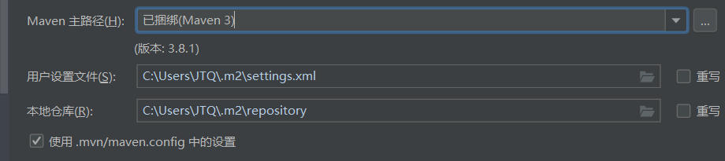
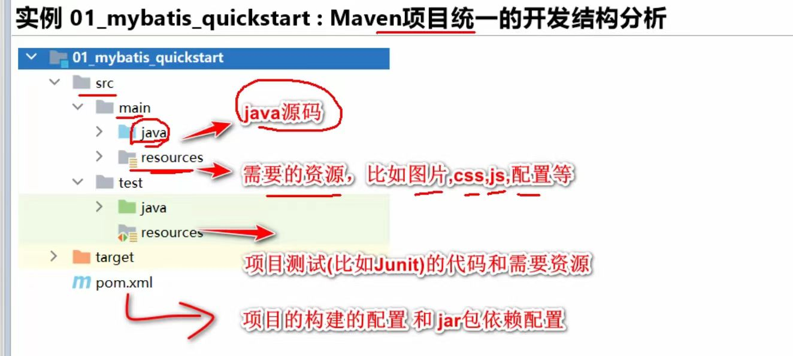
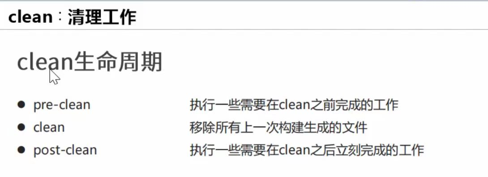
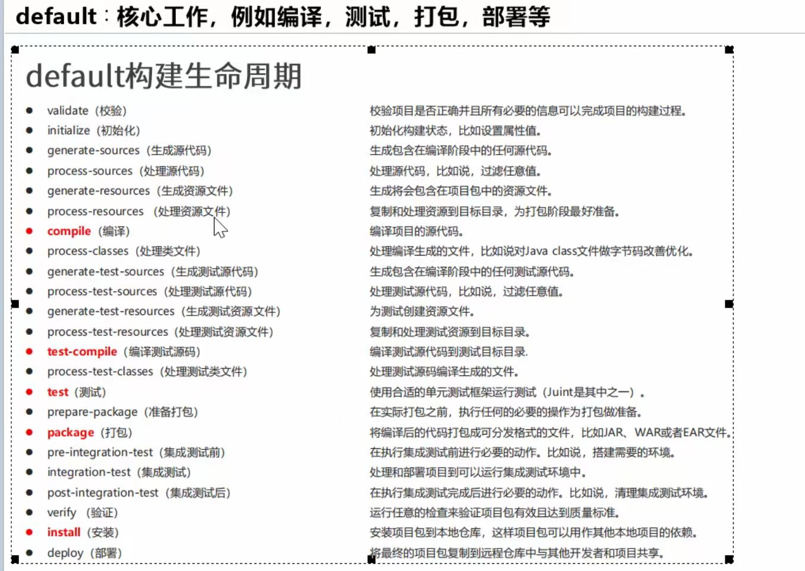
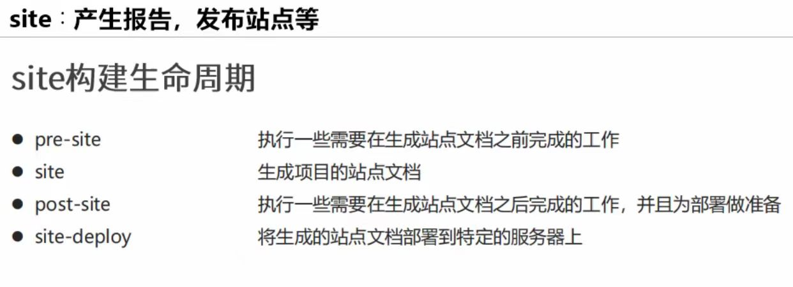
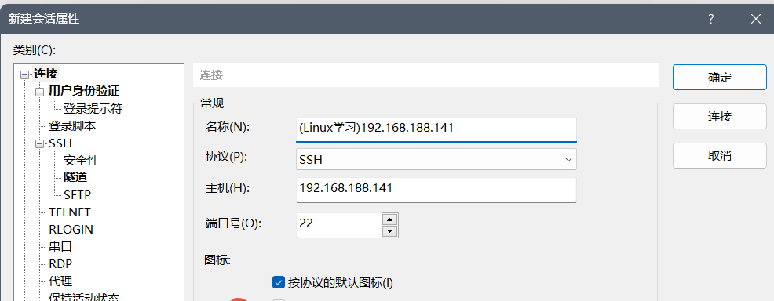
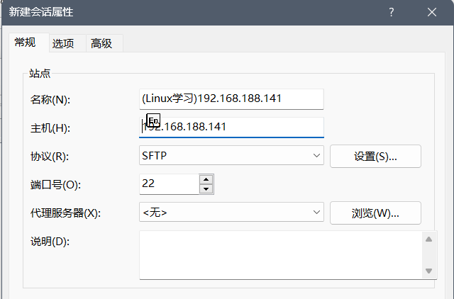
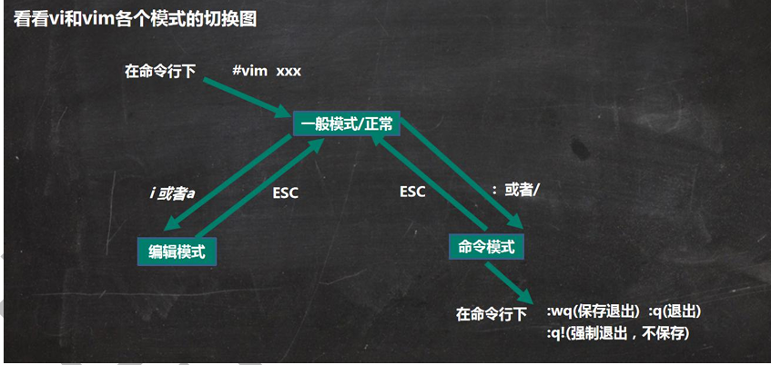
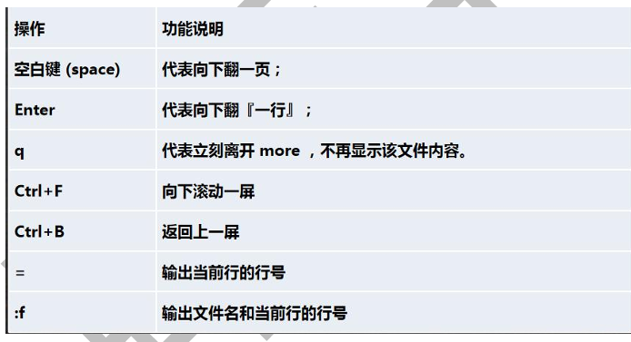

# Java常见问题

## Idea快捷键

xml注释快捷键： ctrl +/

idea运行快捷键：ctrl + shift +A

查看接口的子接口和实现类;ctrl +alt+b 或者ctrl+h

代码格式化： ctrl +alt+C/L

增强for循环快捷键: iter

迭代器：itit

包围方式（如try catch）:ctrl +alt +T

重写方法：ctrl+O

实现方法：ctrl +I

生成：alt+insert

在方法和类上加注释：/** +Enter

跳转类/文件：ctr（+shift）+N

全局查找：ctrl+shift+F

大小写转换：ctrl+shift+u

换行：ctrl+shift+s

引入变量：shift+A / ctrl+alt+V (也就是.var的快捷键)


ctrl+G:跳转到某一行
Ctrl + E 介绍： 显示最近打开的文件记录列表
ctrl+shift+d：删除行
ctr+d:复制所选行到下一行
ctrl+end/home:跳转结尾或开头


快速选中一行:

(1)鼠标连点3下

(2)`end`键将[光标](https://so.csdn.net/so/search?q=光标&spm=1001.2101.3001.7020)移到行尾 ， `ctrl+w` 选中行  ==慎用==：也是电脑关闭活动窗口的快捷键

(3)`end`键将光标移到行尾 ， `shift + home` 选中行

(4)`home` 键 光标移到行首、然后 点击`shift +end`


## 其他快捷键

新建文件夹：ctrl +shift +N

重命名：F2		

查看属性：alt+enter

浏览器检查页面：ctrl +shift +i

@WebServlet(urlPatterns = {"/ok1","/ok2"})  扩展名访问不带斜杠

## Idea好用插件

1.Power Mode 3：敲代码有类似于烟花动画


## idea设置：

### 1.模板

设置->编辑器->文件和代码模板->在include的File Header中设置作者和时间

```text
/**
  *@author ${USER}
  *@date ${DATE}
  */
```

然后在帮助->编辑自定义VM选项，会打开一个idea64.exe.vmoptions文件，加入下面一行代码，${USER}就会变为下面设置的值

```java
-Duser.name= jtq
```

2.


## 问题集合一

### 1.为什么输入流是read，输出流是write

 流的概念一直让人比较混淆。输入输出流是相对于[内存](https://so.csdn.net/so/search?q=内存&spm=1001.2101.3001.7020)而言的，程序运行在内存当中，文件保存在磁盘里面，如果读一个文件，从磁盘到内存当中，属于输入流。如果从程序中输出到文件中，便是内存写入到磁盘，是输出流。

### 2.toString()方法

1.toString()方法在Object类里定义的，其返回值类型为String类型，返回类名和它的引用地址
在进行==String类与其他类型的连接操作时，自动调用==toString()方法，demo如下：

```java
Date now = new Date();
System.out.println("now = " + now);//相当于下一行代码
System.out.println("now = " + now.toString());
```


实际应用中，可以根据需要在用户自定义类型中重写toString()方法，如==Stirng类重写了toString()方法，返回字符串的值==，dome如下

```java
System.out.println(s1);//相当于下一行代码
System.out.println(s1.toString());
```

基本数据类型转换为String类型是，调用了==对应包装类==的toString()方法，demo如下：

```java
int a = 10；
System.out.println("a = " + a);
```

2. 通过java.lang.Object类的toString()定义来看实际使用中会出现什么情况？
   这是jdk里面的源码

```java
public String toString() {
     return getClass().getName() + "@" + Integer.toHexString(hashCode());
}
```


2.在实际使用会出现什么情况

```java
Person p1 = new Person();
System.out.println(p1.toString());//TestEquals.Person@15db9742
System.out.println(p1);//TestEquals.Person@15db9742 因为输出的时候回默认调用Objec类toString()方法
```

当我们打印一个对象的引用时，实际是==默认调用这个对象的toString()方法==
当打印的对象所在类没有重写Object中的toString()方法时，默认调用的是Object类中toString()方法。
返回此对象所在的类及对应的堆空间对象实体的首地址值
当我们打印对象所 在类重写了toString()，调用的就是已经重写了的toString()方法，一般重写是将类对象的属性信息返回。

```java
//手动实现
public String toString(){
return " Person:name=" + name +" age=" + age;
}
```

### 3.获取当前时间

```java
long start = System.currentTimeMillis();
long end = System.currentTimeMillis();
System.out.println("RunTime="+(end-start));
```

### 4.输入函数

```java
//import java.util.Scanner;
Scanner scanner = new Scanner(System.in);

//一定要读取到有效字符后才可以结束输入，对输入有效字符之前遇到的空格键、Tab键或Enter键等结束符，
// next()方法会自动将其去掉，只有在输入有效字符之后，next()方法才将其后输入的空格键、
// Tab键或Enter键等视为分隔符或结束符。所以next方法不能得到带空格的字符串。
String next = scanner.next();
System.out.println("next的值是:"+next);
//nextLine()方法的结束符只是Enter键，即nextLine()方法返回的是Enter键之前的所有字符，它是可以得到带空格的字符串的。
//nextLine()自动读取了被next()去掉的Enter作为它的结束符,需要之后加一个nextLine()语句，
// 将被next()去掉的Enter等结束符过滤掉
scanner.nextLine();
String s = scanner.nextLine();
System.out.println("s的值是："+s);
int i = scanner.nextInt();
```

### 5.java里面内置的包放在哪里，比如说java.io在哪里，路径是什么

D:\Software\Java\jre\lib，你安装的java的路径，这个是我的路径。
==rt.jar==（runtime缩写），用压缩包打开，看到有个java文件，打开它，你就看到io util什么的包了


### 6.使用@Test测试

import org.junit.Test;

### 7.手动执行

编译：javac 类名.java

运行：java  类名  //注意不带.class

### 8.数组转列表

Arrays.asList(数组名)；

### 9.获取类加载路径

获取文件路径中文乱码问题暂未解决

```java
public class Main {
    public static void main(String[] args) {
        System.out.println("Hello world!");
    }
    @Test
    public void classPath() {


        File file = new File(this.getClass().getResource("/").getPath());
        //看到类的加载路径
        System.out.println("file=" + file);
    }
}
```

### 10.java中做字符串非空判断，为什么要同时判断字符串不为null和不等于空串？

简而言之就是 : null的出现是声明了对象，判断没有给对象开辟空间； “”空是判断给对象开辟了空间但没有值的情况，[String类](https://so.csdn.net/so/search?q=String类&spm=1001.2101.3001.7020)型同时具备这两种情况，所以都要进行判断，已达到万无一失。

```java
//判断字符串为空串

if (str != null && !"".equals(str))
if (str != null && str.length() != 0)
```

## 问题集合二

### 1.灵魂拷问：Java如何获取数组和字符串的长度？length还是length()？

按理说，数组和字符串都是对象，访问长度都用 length() 方法就好了。为什么数组偏偏剑走偏锋用的 length 字段呢？

首先呢，我们必须要明白：数组是一个容器，当它被创建后，不仅元素的类型是确定的，元素的个数也是确定的。换句话说，数组的长度是确定的，不可能再变长或者变短。因此，数组可以使用一个字段（length）来表示长度。

既然数组没必要定义成一个类，也就没有必要再定义一个 length() 方法来获取数组的长度了，直接用 length 这个字段就可以了，不是吗？

为什么字符串 String 类会有 length() 方法呢？来看一下源码就明白了。

```java
  /**
   \* Returns the length of this string.
   \* The length is equal to the number of Unicode
   \* code units in the string.
   */
   public int length() {
     return value.length;

   }
```

length() 方法返回的正是字符数组 value 的长度（length），value 本身是 private 的，因此很有必要为 String 类提供一个 public 级别的方法来供外部访问字符的长度。

### 2.JAVA中数组属于类吗？

大家都知道，Java的数据类型可以分为两种：基本类型和引用类型。那么数组属于哪一种类型呢？很显然，数组肯定不属于基本类型，因为基本类型只有那8种（byte、char、short、int、long、float、double、boolean）。那么数组就应该属于引用类型了，也就是说每一个数组实例都是一个对象，这些对象同属于一个类。

结论：

1. 数组是有对应的类，这个类是在JVM运行时创建的，所以没有对应的class 文件。
2. 数组的类名是：[ 开头的，和普通类的不一样。
3. 数组类中不包含任何成员和变量（可以通过getClass拿到 Class 对象来查看），数组的长度length是通过JVM的指令 arraylength 直接得到的。
4. 数组的类和一般类在JVM中是区分对待的，JVM会对数组类做一些特殊的操作，比如数组类的对象创建是通过JVM指令直接执行的，比如 newarray- 创建一个数组对象，multianewarray-创建多个数组对象。
5. 数组类并不是只有一个类，而是会有很多个。数组类的类型是由数组的内容和维度同时决定的。比如：int[] 的类名是：[I ；int\[][] 的类名是:[[I （其中的 I 是 int 类型的在虚拟机指令中数据类型）。这是两个不同的类。

==补充：==

什么是引用类型？

在Java中，引用类型是指一种变量类型，它们用于==引用对象==而不是存储实际的数据值。当我们创建一个对象时，实际上在堆内存中分配了一块内存空间，并返回了一个指向该内存空间的引用。这个引用就是我们在代码中操作对象的句柄。数组和字符串都是引用类型


# 1.JavaWeb


### 1.快速入门

细节：开发一个Servlet 需要实现Servlet接口，而HttpServlet抽象类实现了Servlet接口，实际上是经常继承HttpServlet来开发

（1）常规web.xml配置

（2）注解配置，例：@WebServlet(urlPatterns={"/ok1","/ok2"})在Servlet类上使用，不用再在web.xml中配置，==也可以省略urlPatterns==

​	`@WebServlet` 中的 value 和 urlPatterns 等价的行为，并不是通过 Spring 框架的 @AliasFor 来实现的，而是通过 **Java EE** 规范的特性实现的

（3）当Servlet的url-pattern配置了“/”或“/*”，会覆盖tomcat的DefaultServlet，当其他url-patten都匹配不上时才会走这个Servlet,这样可以拦截到其他静态资源，不建议这样设置

（4）在 Java Web 项目中，`/WEB-INF` 目录下的资源文件无法直接通过浏览器访问，这是由于 Servlet 容器（例如 Tomcat）对该目录的访问进行了特殊的限制

HelloServlet.java

```java
/**
 * 老韩解读
 * 1. 开发一个Servlet 需要 实现Servlet接口
 * 2. 实现Servlet接口的方法5个,另外自定义两个方法doPost,doGet
 */
public class HelloServlet implements Servlet {

    private int count = 0; //属性

	//1初始化 servlet,当创建HelloServlet 实例时，会调用init方法 该方法只会被调用一次
    @Override
    public void init(ServletConfig servletConfig) throws ServletException {
        System.out.println("init() 被调用");
    }


     // 返回ServletConfig 也就是返回Servlet的配置
    @Override
    public ServletConfig getServletConfig() {
        return null;
    }

    /**
     * 1. service方法处理浏览器的请求(包括get/post)
     * 2. 当浏览器每次请求Servlet时，就会调用一次service
     * 3. 当tomcat调用该方法时，会把http请求的数据封装成实现ServletRequest接口的request对象
     * 4. 通过servletRequest 对象，可以得到用户提交的数据
     * 5. servletResponse 对象可以用于返回数据给tomcat->浏览器
     */
    @Override
    public void service(ServletRequest servletRequest,
                        ServletResponse servletResponse) throws ServletException, IOException {

        count++;
        //如果count的值，在不停的累计，说明HelloServlet是单例的
        System.out.println("hi HelloServlet~ count= " + count);
        //Tomcat每处理一次http请求，就生成一个新的线程
        System.out.println("当前线程id= " + Thread.currentThread().getId());

        //思考->如何从servletRequest对象来获取请求方式->
        //1. ServletRequest 没有得到提交方式的方法  “public interface HttpServletRequest extends ServletRequest{}” 
        //2. ServletRequest 看看ServletRequest子接口有没有相关方法 
        //3. 老师小技巧：ctrl+alt+b => 可以看到接口的子接口和实现子类
        //4. 把servletReqeust转成 HttpServletRequest引用
        //5. 仍然是Java基础的OOP
        HttpServletRequest httpServletRequest = (HttpServletRequest) servletRequest;
        String method = httpServletRequest.getMethod();
        if("GET".equals(method)) {
            doGet(); //用doGet() 处理GET请求
        } else if("POST".equals(method)) {
            doPost(); //用doPost() 处理POST请求
        }
    }

    // 用于响应get请求的
    public void doGet() {
        System.out.println("doGet() 被调用..");
    }

    //用于响应post请求的
    public void doPost() {
        System.out.println("doPost() 被调用..");
    }
    
	//返回servlet信息，使用较少
    @Override
    public String getServletInfo() {
        return null;
    }

     //1. 该方法是在servlet销毁时，被调用 2. 只会调用一次
    @Override
    public void destroy() {
        System.out.println("destroy() 被调用...");
    }
}

```

HiServlet.java

```java
//继承HttpServlet类，根据需要重写方法
public class HiServlet extends HttpServlet {
    
    @Override
    public void init(ServletConfig config) throws ServletException {
        System.out.println("注解方式 HiServlet init()被调用");
        //super.init(config);  //现在不写也不会出错,因为暂时没用到父类的方法来获取ServletConfig
    }

    //重写HttpServlet的doGet 和 doPost
    //alt +insert

    //处理doGet请求
    @Override
    protected void doGet(HttpServletRequest req, HttpServletResponse resp) throws ServletException, IOException {
        System.out.println("HiServlet doGet()...");
    }
    //处理doPost
    @Override
    protected void doPost(HttpServletRequest req, HttpServletResponse resp) throws ServletException, IOException {
        System.out.println("HiServlet doPost()...");
    }
}
```


WEB-INF/web.xml

```xml
<?xml version="1.0" encoding="UTF-8"?>
<web-app xmlns="http://xmlns.jcp.org/xml/ns/javaee"
         xmlns:xsi="http://www.w3.org/2001/XMLSchema-instance"
         xsi:schemaLocation="http://xmlns.jcp.org/xml/ns/javaee http://xmlns.jcp.org/xml/ns/javaee/web-app_4_0.xsd"
         version="4.0">

    <!--老韩小技巧: web.xml主要用来配置该web应用使用到的Servlet
        老师解读
        1. servlet-name: 给Servlet取名(程序员决定), 该名字唯一
        2. servlet-class: Servlet的类的全路径: Tomcat在反射生成该Servlet需要使用
        3. url-pattern: 这个就是该servlet访问的url的配置(路径)
        4. 这时我们应该这样访问servlet http://localhost:8080/servlet/helloServlet
        5. url-pattern 取名是程序员决定的
        6. load-on-startup 表示在tomcat 启动时，会自动的加载servlet实例

        小技巧： alt+r => 老师配置
    -->
    <!-- 配置HelloServlet -->
    <servlet>
        <servlet-name>HelloServlet</servlet-name>
        <servlet-class>com.hspedu.servlet.HelloServlet</servlet-class>
        <!--配置信息,而不是硬编码到程序-->
        <init-param>
            <param-name>username</param-name>
            <param-value>hsp</param-value>
        </init-param>
        <!--<load-on-startup>1</load-on-startup>-->
    </servlet>
    <servlet-mapping>
        <servlet-name>HelloServlet</servlet-name>
        <url-pattern>/helloServlet</url-pattern>
    </servlet-mapping>
     <!-- 配置其他Servlet -->
     <!-- 省略... -->
    
     <!--配置整个网站的信息-->
    <context-param>
        <param-name>website</param-name>
        <param-value>http://www.hanshunping.net</param-value>
    </context-param>
    <context-param>
        <param-name>company</param-name>
        <param-value>韩顺平教育</param-value>
    </context-param>
</web-app>
```

#### Ⅰ.servletConfig

ServletConfig类是为Servlet程序配置信息的类

Servlet程序默认是第一次访问的时候创建，ServletConfig在每一个Servlet程序创建时，就创建一个对应的ServletConfig对象

用法：

（1）获取Servlet程序的servlet-name的值

（2）获取初始化参数init-parm

（3）获取ServletContext对象。两种方式：getServletContext()和getServletConfig().getServletContext(),本质都一样

```java
public class DBServlet extends HttpServlet {
    /**
     * 老师梳理ServletConfig config 使用流程
     * 1. 当DBServlet对象初始化时, tomcat会同时创建一个 ServletConfig对象
     * 2. 这时如果DBServlet init() 方法中你调用 super.init(config);
     * 3. 调用 父类 GenericServlet的init方法
     * 		public void init(ServletConfig config) throws ServletException {
     * 			this.config = config;
     * 			this.init();
     * 			}
     * 这时就会把 Tomcat创建的 ServletConfig对象赋给 GenericServlet的属性 config
     * 4. 因此如果你重写init()方法，记住如果你想在其它方法通过 getServletConfig() 方法获取ServletConfig
     * , 则一定要记住 调用  super.init(config);
     */
    @Override
    public void init(ServletConfig config) throws ServletException {
        //ConcurrentHashMap, 是一个线程安全的容器.
        System.out.println("init" + config);
        super.init(config);
    }

    protected void doPost(HttpServletRequest request, HttpServletResponse response) 
        throws ServletException, IOException {

        /**
         * 老韩解读
         * 1. getServletConfig() 方法是 GenericServlet的
         * 2. 返回的 servletConfig对象是 GenericServlet private transient ServletConfig config;
         * 3. 当一个属性被 transient 修饰，表示该属性不会被串行化(有些重要信息，不希望保存到文件)
         */
        ServletConfig servletConfig = getServletConfig();
        System.out.println("doPost=" + servletConfig);
        String servletName = servletConfig.getServletName();
        String username = servletConfig.getInitParameter("username");
        String pwd = servletConfig.getInitParameter("pwd");
        System.out.println("ServletName= " + servletName);
        System.out.println("初始化参数username= " + username);
        System.out.println("初始化参数pwd= " + pwd);
        ------------------------------------------------------------
         //1.获取到ServletContext对象
        ServletContext servletContext = getServletContext();
        //2. 获取website
        String website = servletContext.getInitParameter("website");
        String company = servletContext.getInitParameter("company");
        //3. 获取项目的工程路径
        String contextPath = servletContext.getContextPath();
        //4. 获取项目发布会，正在的工作路径
        //   /表示我们的项目(发布后)的 根路径 D:\hspedu_javaweb\servlet\out\artifacts\servlet_war_exploded
        String realPath = servletContext.getRealPath("/");
        System.out.println("项目路径= " + contextPath);// /servlet
        System.out.println("website= " + website);
        System.out.println("company= " + company);
        System.out.println("项目发布后的绝对路径= " + realPath); 
        ---------------------------------------------------------------
            
         //从servletContext获取 visit_count 属性 k-v
         Object visit_count = servletContext.getAttribute("visit_count");
         //判断visit_count是否为null
         if (visit_count == null) {//说明是第1次访问网站
             servletContext.setAttribute("visit_count", 1);
             visit_count = 1;
         } else { //是第二次或以后
             //取出visit_count属性的值+1
             visit_count = Integer.parseInt(visit_count + "") + 1;
             //放回到servletContext
             servletContext.setAttribute("visit_count", visit_count);
         }

        //输出显示
        response.setContentType("text/html;charset=utf-8");
        PrintWriter writer = response.getWriter();
        writer.print("<h1>新网站被访问的次数是" + visit_count + "</h1>");
        writer.flush();
        writer.close();
    }

    protected void doGet(HttpServletRequest request, HttpServletResponse response) 
        throws ServletException, IOException {
        doPost(request, response);
    }
}
```

#### Ⅱ.servletContext

在一个web工程，只有一个ServletContext对象实例，是在web工程启动时创建，在web工程停止时销毁，即所有的Servlet共享同一个ServletContext对象

ConcurrentHashMap是一个线程安全的容器

用法：

(1)获取web.xml中配置的上下文参数contex-param

(2)获取当前工程路径 如/servlet

(3)获取工程部署后在服务器硬盘上的绝对路径

(4)像Map一样存取数据，多个servlet共享，底层是ConcurrentHashMap是一个线程安全的容器

```java
//分析GenericServlet的getServletContext（）方法
public abstract class GenericServlet implements Servlet, ServletConfig, Serializable {
    
    public void init(ServletConfig config) throws ServletException {
        this.config = config;
        this.init();   //之所以调用以下这个方法，是因为servlet创建时会自动调用这个带参的init方法，而下面无参的init方法需要手动调用
        			   //这样如果以后在子类重写下面无参init方法就会执行了，如果没有this.init();就不会执行了
        			   //super.init(config);  // 子类这样调用父类的方法，其实这里this代表的还是子类对象
    }

    public void init() throws ServletException {
    }
    
    public ServletConfig getServletConfig() {
        return this.config;
    }
    
	public ServletContext getServletContext() {
    	return this.getServletConfig().getServletContext();  
    //其实这里调用的是另一个实现了ServletConfig的实现类的getServletContext()方法，不是自己调用自己，最开始理解错了，因为在idea看到		//只有GenricServlet类实现了ServletConfig接口（其他实现类也有只是看不到），误以为this.getServletConfig()是GenricServlet对象
    
    //经过调试发现是StandardWrapperFacade类，不过这个是由 Servlet容器内部提供的实现类，这个实现类并没有直接暴露给开发者
	}
}
```


#### Ⅲ.HttpServletRequest


```java
//解决接收参数的中文乱码问题, 老师提示，写在 getParameter前.
request.setCharacterEncoding("utf-8");
//1. 获取表单的数据[单个数据]
//username=tom&pwd=&hobby=hsp&hobby=spls
String username = request.getParameter("username");
String pwd = request.getParameter("pwd");
//2. 获取表单一组数据
String[] hobbies = request.getParameterValues("hobby");
```


#### Ⅳ.HttpServletResponse

```java
//返回接收到的信息， 给浏览器回显
//本质就是在http响应头，加上 Content-Type: text/html;charset=utf-8
//说 text/html 表示返回的数据类型，浏览器会根据这个类型来解析数据，text/plain 表示返回的数据，请浏览器使用文本方式解析
// application/x-tar 表示返回的是文件，浏览器就会以下载文件的方式处理

//处理返回参数中文乱码，要写在前面
response.setContentType("text/html;charset=utf-8");
PrintWriter writer = response.getWriter();
writer.print("<h1>提交的用户名= " + username + "</h1>");
writer.flush();
writer.close();
```


### 2.请求转发与重定向

区别：（1）请求转发是一次http请求，多个servlet共享request域中的数据，服务器处理转发，可以转发到/WEB-INF目录下的资源，不能转发到web工程外的资源

​		因为浏览器地址栏会停止在第一个servlet，如果刷新页面，会再次发出请求（并且会带数据），所以在支付页面下，不要使用请求转发，否则会造成重复支付

```java
//请求转发
// “/manageServlet”写的是 要转发的servlet的url， “/”会被解析成 “/servlet”
// forward(request, response) 表示把当前servlet的request对象和response对象，传递给下一个servlet使用
RequestDispatcher requestDispatcher =request.getRequestDispatcher("/manageServlet");
requestDispatcher.forward(request, response);
```

​	 （2）重定向是两次http请求，返回302状态码，浏览器处理转发，不能重定向到/WEB-INF目录下的资源，但是可以重定向到web工程外的资源

```java
String contextPath = getServletContext().getContextPath();
System.out.println("contextPath= " + contextPath);
//response.sendRedirect("/servlet/downServletNew");
response.sendRedirect(contextPath + "/downServletNew");
//response.sendRedirect("http://www.baidu.com");
```


### 3.监听器与过滤器

chain.doFilter(request,request)


# 2.多进程

# 3.数据流

# 4.数据库

# 5.Maven

## (1)maven配置镜像

在settings.xml文件进行配置 \<mirrors/>

```xml
<mirror>
    <id>aliyunmaven</id>
    <mirrorOf>*</mirrorOf>
    <name>阿里云公共仓库</name>
    <url>https://maven.aliyun.com/repository/public</url>
</mirror>
```

## (2)直接使用idea自带的maven

本地仓库所在目录,也可以选中右侧重写，进行自定义位置



## (3)maven项目结构

如果用maven创建的javaweb项目结构不太一样



## (4)构建生命周期

构建生命周期的三大过程：clean,default(核心工作，例如编译，测试，打包，安装等)，site(产生报告，发布站点等)

项目构建生命周期分很多阶段，并不是每次都完整执行，而是根据用户的要求来执行







## (5)插件

1.默认插件

Maven 提供了一些默认插件，这些插件在执行常见的 Maven 生命周期（如 `clean`, `compile`, `package`, `install` 等）时会自动使用，无需手动引入。

也可以手动引入一些默认插件，用来指定插件版本

2.自定义插件

使用自定义插件，如果需要自定义插件行为（如指定版本或配置参数），则需要手动在 `pom.xml` 中引入插件

手动引入插件时，通常需要绑定到 Maven 生命周期的特定阶段，某些插件默认绑定到特定阶段。例如，`maven-compiler-plugin` 默认绑定到 `compile` 阶段。

对于不默认绑定的插件，必须通过 ` <phase>` 显式指定阶段。

```xml
	 <!--在bulid时，添加自定义插件-->
	<build>   	
        <plugins>
            <plugin>
                 <!--插件坐标-->
                <groupId>org.apache.maven.plugins</groupId>
                <artifactId>maven-source-plugin</artifactId>
                <version>2.2.1</version>
                <!--自定义执行哪些操作-->
                <executions>
                    <execution>
                        <goals>
                            <!--对主程序源码打包-->
                            <goal>jar</goal>
                            <!--对测试源码打包-->
                            <goal>test-jar</goal>
                        </goals>
                        <!--指定执行阶段-->
                        <phase>generate-test-resources</phase>
                    </execution>
                </executions>
            </plugin>
        </plugins>
    </build>
```


# 6.Redis


## (1)下载安装redis

下载好redis6.2.6.tar.gz压缩包后，放到linux机器下/opt目录中

解压：tar -zxvf XXX.tar.gz

cd进入解压后目录，执行编译和安装指令：make && make install

```java
//默认安装在/usr/local/bin目录下
//redis-server：Redis 服务器启动命令 redis-cli：客户端，操作入口
[root@host001 redis-6.2.6]# ls /usr/local/bin
redis-benchmark  redis-check-aof  redis-check-rdb  redis-cli  redis-sentinel  redis-server
```

## (2)Redis后台启动&使用

1. 在解压后的目录里里拷贝一份redis.conf 到其他目录, 比如 /etc 目录, 注意执行保证能够定位到 redis.conf cp redis.conf /etc/redis.conf

2. 修改/etc/redis.conf 后台启动设置daemonize no 改成yes, 并保存退出，表示守护进程在后台运行

   ```java
   # By default Redis does not run as a daemon. Use 'yes' if you need it.
   # Note that Redis will write a pid file in /var/run/redis.pid when daemonized.
   # When Redis is supervised by upstart or systemd, this parameter has no impact.
   daemonize yes
       
   //也可以修改默认端口
   # Accept connections on the specified port, default is 6379 (IANA #815344).
   # If port 0 is specified Redis will not listen on a TCP socket.
   port 6379
   ```

   

3.  Redis 启动：(./)redis-server /etc/redis.conf 或者使用绝对路径：/usr/local/bin/redis-server /etc/redis.conf

   ```java
   //可以看到/usr/local/bin在PATH里。也就是全局环境变量，所以可以在任何目录下使用命令：redis-server /etc/redis.conf
   [root@host001 bin]# echo $PATH
   /usr/local/bin:/usr/local/sbin:/usr/bin:/usr/sbin:/bin:/sbin:/root/bin
   ```

   ```java
   //查看是否成功启动： ps -aux |grep redis    默认是6379端口
   [root@host001 bin]# ps -aux |grep redis
   root      22226  0.1  0.4 162412  9956 ?        Ssl  11:31   0:00 ./redis-server 127.0.0.1:6379
   root      22283  0.0  0.0 112724   984 pts/1    S+   11:37   0:00 grep --color=auto redis
   ```

4. 用客户端访问：redis-cli ，  关闭Redis进程：redis-cli shutdown

   如果修改了默认端口，需要指定端口号，对应客户端访问：redis-cli -p 端口号，  关闭Redis进程：  redis-cli -p 端口号 shutdown

   ```java
   //也可以进入reids服务，直接使用shutdown关闭Redis进程
   [root@host001 bin]# redis-cli
   127.0.0.1:6379> shutdown
   not connected> 
   ```

   

## (3)redis指令

1.对键值进行操作
//set指令，和hashmap很像，如果字符串中有空格则必须要用双引号，
//get指令
//clear清除屏幕信息
//help 指令名 获取使用帮助

//keys * ： 查看当前库所有key (匹配：keys*1)
//exists key：判断某个 key 是否存在
//type key ：查看你的key是什么类型
//del key ： 删除指定的key数据，会产生阻塞
//unlink key ;也是删除。不会产生阻塞，类似于异步操作
//expire key seconds :设置值的过期时间，秒为单位，默认永久不失效
//ttl key 查看还有多少秒过期，-1表示永不过期，-2表示已过期，其他数字表示还剩多少秒过期


2.对DB(数据库)操作
//select： 命令切换数据库,redis 安装后，默认有16个库,0-15,默认操作的是 redis 的 0号库

//dbsize：查看当前数据库的key的数量

//flushdb：清空当前库，内存和磁盘都清空

//flushall：清空全部库，内存和磁盘都清空


3.Redis 五大数据类型/结构

Redis 数据存储格式 :redis 自身是一个 Map，其中所有的数据都是采用 key:value 的形式存储,其中 key 是字符串，value 是数据，数据支持多种类型/结构

五种常用数据类型：string 、hash、 list、 set、 sorted_set；

(1)String 是 Redis 最基本的类型，一个key对应一个value,一个Redis中字符串value最多可以是512M。 String 类型是二进制安全的,Redis的string可以包含任何数据。比如jpg图片或者序列化 的对象。

```java
//string常用指令
set  <key><value>添加键值对
get  <key>查询对应键值
append <key><value>将给定的<value> 追加到原值的末尾
strlen <key>获得值的长度
setnx <key><value>只有在 key 不存在时设置 key 的值
incr <key> 将 key 中储存的数字值(字符串)增1， 只能对数字值操作，如果为空，新增值为1
decr <key> 将 key 中储存的数字值(字符串)减1 ， 只能对数字值操作，如果为空，新增值为-1
incrby / decrby <key><步长>将 key 中储存的数字值增减。自定义步长
mset <key1><value1><key2><value2> ....., 同时设置一个或多个 key-value 对
mget <key1><key2><key3> ..... 同时获取一个或多个 value
msetnx <key1><value1><key2><value2> ...同时设置一个或多个key-value 对，当且仅当所有给定 key 都不存在, 原子性，有一个失败则都失败
getrange <key><起始位置><结束位置>, 获得值的范围，类似java中的substring，包括起始和结束位置(索引从0开始)，负数偏移量表示从字符串的末尾开			始计数，-1，-2分别表示最后一个字符和倒数第二个字符
setrange <key><起始位置><value> 用 <value> 覆写<key>所储存的字符串值，相当于从<起始位置>后挨个对应的值被新值取代(包括起始位置)。
setex <key><过期时间><value> 设置键值的同时，设置过期时间，单位秒。
getset <key><value> , 以新换旧，设置了新值同时获得旧值
```

（2）List类型；Redis 列表是简单的字符串列表，按照插入顺序排序。你可以添加一个元素到列表的头 部(左边)或者尾部(右边)。 2. 底层是个双向链表，对两端的操作性能高，通过索引下标的操作中间的节点性能较差

```java
lpush/rpush <key><value1><value2><value3> .... 从左边/右边插入一个或多个值
lpop/rpop <key>从左边/右边吐出一个值
rpoplpush <key1><key2>从<key1>列表右边吐出一个值，插到<key2>列表左边
lrange <key><start><stop> 按照索引下标获得元素(从左到右)，如：lrange mylist 0-1，0 左边第一个，-1右边第一个，（0-1表示获取所有）
lindex <key><index>按照索引下标获得元素(从左到右)
llen <key>获得列表长度
linsert <key> before <value><newvalue>在<value>的前面插入<newvalue>插入值
lrem <key> <n> <value>从左边删除 n 个 value(从左到右)
lset<key> <index> <value>将列表 key 下标为 index 的值替换成 value
```

(3)set类型：set提供的功能与list类似是一个列表的功能，特殊之处在于set是可以自动排 重的, 即值是不允许重复的

```java
sadd <key><value1><value2> ..... 将一个或多个 member 元素加入到集合 key 中，已经存在的member 元素将被忽略
smembers <key>取出该集合的所有值。
sismember <key><value>判断集合<key>是否为含有该<value>值，有 1，没有 0
scard<key>返回该集合的元素个数。
srem <key><value1><value2> .... 删除集合中的某个元素。
spop <key>随机从该集合中吐出一个值。
srandmember <key><n>随机从该集合中取出n个值。不会从集合中删除 。
smove <source><destination>value 把集合中一个值从一个集合移动到另一个集合
sinter <key1><key2>返回两个集合的交集元素。
sunion <key1><key2>返回两个集合的并集元素。
sdiff <key1><key2>返回两个集合的差集元素(key1中的，不包含key2中的)
```

(4)hash类型： Redis hash 是一个键值对集合，hash 适合用于存储对象， 类似Java里面的 Map

```java
hset <key><field><value>给<key>集合中的 <field>键赋值<value>
hget <key1><field>从<key1>集合<field>取出 value
hmset <key1><field1><value1><field2><value2>... 批量设置 hash 的值
hmget <key1><field1> <field2>... 批量取出 hash 的 filed 值
hexists<key1><field>查看哈希表 key 中，给定域 field 是否存在
hkeys <key>列出该 hash 集合的所有 field
hvals <key>列出该 hash 集合的所有 value
hincrby <key><field><increment>为哈希表 key 中的域 field 的值加上增量 
hsetnx <key><field><value>将哈希表 key 中的域 field 的值设置为 value ，当且仅当域 field 不存在
```

(5)有序集合Zset(sortedset):Redis 有序集合zset与普通集合set非常相似，是一个没有重复元素的字符串集合。不同之处是有序集合的每个成员都关联了一个评分(score),这个评分(score)被用来按照 从最低分到最高分的方式排序集合中的成员。集合的成员是唯一的，但是评分可以是重复,因为元素是有序的, 所以也可以很快的根据评分(score)或者次序(position)来获取一个范围的元素,访问有序集合的中间元素也是非常快的, 你能够使用有序集合作为一个没有重复成员的列表。

```java
zadd <key><score1><value1><score2><value2>… 将一个或多个 member 元素及其 score 值加入到有序集 key 当中。
zrange <key><start><stop> [WITHSCORES]返回有序集key中,下标在<start><stop>之间的元素，带WITHSCORES，可以让分数一起和值返回到结果集
zrevrang <key><start><stop> [WITHSCORES] 同上，取出顺序相反
zscore <key><member> 返回有序集 key 中，成员 member 的 score 值
zrangebyscore key min max [withscores]返回有序集 key 中，所有 score 值介于min 和 max 之间(包括等于 min或 max)的成员。有序集成员按 		score 值递增(从小到大)次序排列。
zrevrangebyscore key max min [withscores] 同上，改为从大到小排列。
zincrby <key><increment><value>为元素的score加上增量
zrem <key><value>删除该集合下，指定值的元素
zcount <key><min><max>统计该集合，分数区间内的元素个数
zrank <key><value>返回该值在集合中的排名，从0开始。
```


## (4)Redis配置

1.保护模式

## (5)Redis发布订阅

 发布订阅操作 

```java
1、PUBLISH channel msg 将信息 message 发送到指定的频道 channel 

2、SUBSCRIBE channel [channel ...] 订阅频道，可以同时订阅多个频道 

3、UNSUBSCRIBE [channel ...]取消订阅指定的频道, 如果不指定频道，则会取消订阅所有频道 

4、PSUBSCRIBE pattern [pattern ...] 订阅一个或多个符合给定模式的频道，每个模式以 * 作为匹配符，比如 it* 匹配所 有 以 it 开头的频道(it.news 	、it.blog 、it.tweets 等等)， news.* 匹配所有 以 news. 开 头的频道(news.it 、 news.global.today 等等)，诸如此类 

5、PUNSUBSCRIBE [pattern [pattern ...]] 退订指定的规则, 如果没有参数则会退订所有规则
```

## (6)Jedis

 Java 程序操作Redis的工具，

```java
<!--引入jedis依赖-->
    <dependency>
    <groupId>redis.clients</groupId>
    <artifactId>jedis</artifactId>
    <version>3.2.0</version>
    </dependency>
```

jedis实践

设置开放的端口号 firewall-cmd --add-port=6379/tcp --permanent 

●重启防火墙 firewall-cmd--reload 

●查看防火墙 firewall-cmd--list-all

```java
public class Jedis_ {

    //连接Redis
    //1. 如果Redis配置了密码,则需要进行身份校验
    //2. 因为需要连接到redis端口,比如6379, 就需要配置防火墙，放开端口
    //3. 注意修改bind，支持远程连接.
    
    
    @Test
    public void con() {

        //在linux终端通过ifconfig获取
        Jedis jedis = new Jedis("192.168.198.135", 6379);

        jedis.auth("foobared");
        String res = jedis.ping();
        System.out.println("连接成功 ping 返回结果=" + res);
        jedis.close();//关闭当前连接,注意并没有关闭Redis
    }

    //key操作
    @Test
    public void key() {

        Jedis jedis = new Jedis("192.168.198.135", 6379);

        jedis.auth("foobared");
        //设置key
        jedis.set("k1", "v1");
        jedis.set("k2", "v2");
        jedis.set("k3", "v3");

        //获取key
        Set<String> keys = jedis.keys("*");

        for (String key : keys) {
            System.out.println("key==>" + key);
        }

        //判断key是否存在，ttl
        System.out.println(jedis.exists("k1"));//T
        System.out.println(jedis.ttl("k2"));//-1
        System.out.println(jedis.get("k3"));//v3

        //关闭连接
        jedis.close();

    }

    //string
    @Test
    public void string() {

        Jedis jedis = new Jedis("192.168.198.135", 6379);

        jedis.auth("foobared");
        //批量设置k-v
        jedis.mset("k1", "jack", "k2", "scott", "k3", "hsp");
        //批量获取v
        List<String> mget = jedis.mget("k1", "k2");
        for (String s : mget) {
            System.out.println("s-->" + s);
        }
        jedis.close();
    }

    //list
    @Test
    public void list() {
        Jedis jedis = new Jedis("192.168.198.135", 6379);
        jedis.auth("foobared");
        //添加list数据
        jedis.lpush("name_list", "jack", "tom", "nono");
        List<String> name_list = jedis.lrange("name_list", 0, -1);
        for (String name : name_list) {
            System.out.println("name--->" + name);
        }
        //关闭连接
        jedis.close();
    }

    //set
    @Test
    public void set() {

        Jedis jedis = new Jedis("192.168.198.135", 6379);
        jedis.auth("foobared");

        jedis.sadd("city", "北京", "上海");
        jedis.sadd("city", "广州");
        jedis.sadd("city", "深圳");

        Set<String> smembers = jedis.smembers("city");
        for (String city : smembers) {
            System.out.println("city-->" + city);
        }
        jedis.close();
    }

    //hash
    @Test
    public void hash() {

        Jedis jedis = new Jedis("192.168.198.135", 6379);
        jedis.auth("foobared");

        //设置
        jedis.hset("hash01", "name", "李白");
        jedis.hset("hash01", "age", "30");


        //获取
        String name = jedis.hget("hash01", "name");
        System.out.println("name=>" + name);

        //先构建一个map,然后加入
        Map<String, String> maps = new HashMap<String, String>();
        maps.put("job", "java工程师");
        maps.put("name", "smith");
        maps.put("email", "smith@qq.com");
        jedis.hset("hash02", maps);

        //取出看看
        List<String> person =
                jedis.hmget("hash02", "job", "name", "email");
        for (String s : person) {
            System.out.println("s===>" + s);
        }


        jedis.close();

    }

    //zset-有序集合
    @Test
    public void zset() {

        Jedis jedis = new Jedis("192.168.198.135", 6379);
        jedis.auth("foobared");

        //添加
        jedis.zadd("hero", 1, "关羽");
        jedis.zadd("hero", 2, "张飞");
        jedis.zadd("hero", 5, "黄忠");
        jedis.zadd("hero", 3, "赵云");
        jedis.zadd("hero", 4, "马超");


        //取出
        Set<String> heroes = jedis.zrange("hero", 0, -1);//按照评分从小到大
        //Set<String> heroes = jedis.zrevrange("hero", 0, -1);//按照评分从大到小
        for (String hero : heroes) {
            System.out.println("hero= " + hero);
        }
        jedis.close();
    }
}

```

## (7)springboot整合redis

1.控制类

```java

@RestController
@RequestMapping("/redisTest")
public class RedisTestController {


    //装配RedisTemplate
    @Resource
    private RedisTemplate redisTemplate;

    //编写第一个测试方法
    //演示设置数据和获取数据
    @GetMapping("/t1")
    public String t1() {

        //设置值到redis
        redisTemplate.opsForValue().set("book", "天龙八部~");
        //从redis获取值
        String book = (String) redisTemplate.opsForValue().get("book");
        return book;
    }

    //编写方法,演示如何操作list,hash,set,zset
    @GetMapping("/t2")
    public String t2() {
        //list-存
        redisTemplate.opsForList().leftPush("books", "笑傲江湖");
        redisTemplate.opsForList().leftPush("books", "hello,java");

        //list-取出
        List books = redisTemplate.opsForList().range("books", 0, -1);
        String booksList = "";
        for (Object book : books) {
            System.out.println("book-->" + book.toString());
            booksList += book.toString() + " ";
        }
        //hash
        //redisTemplate.opsForHash()
        //set
        //redisTemplate.opsForSet()
        //zset
        //redisTemplate.opsForZSet()
        return booksList;
    }

    //编写一个方法,获取所有的key
    @GetMapping("/t3")
    public String t3() {
        Set keys = redisTemplate.keys("*");
        for (Object key : keys) {
            System.out.println("key--->" + key.toString());
        }
        return "OK";
    }


    //编写方法,获取通过客户端添加的数据-会出现异常
    //需要保持一致，比如RedisTemplate读取的数据,应当是RedisTemplate存放的数据
    @GetMapping("/t4")
    public String t4() {

        String val = (String) redisTemplate.opsForValue().get("book");

        System.out.println("val= " + val);

        return val;
    }
}
```


2.设置配置类

（1）是对要使用的RedisTemplate bean对象的配置, 可以理解成是一个常规配置. 

（2）同学们想一想我们以前学习过一个JdbcTemplate,设计理念类似

（3）如果不配置,springboot 会使用默认配置, 这个默认配置, 会出现一些问题, 比如: redisTemplate 的 key 序列化等, 问题所以通常我们需要配置

（4）如果没有提供RedisConfig 配置类 ,springboot 会使用默认配置, 但是会存在问题

（5）Unrecognized token 'beijing': was expecting ('true', 'false' or 'null') 看报错，是jason转换异常，实际上是因为redisTemplate在做	数据存储的时候会把存 储的内容序列化，所以，redisTemplate读取的时候也会反序列化，而在redis客户端 set 的时候并不会做序列化，因此set的进去的值在	用redisTemplate读的时候就会报类 型转换异常了

```java
@EnableCaching
@Configuration
public class RedisConfig extends CachingConfigurerSupport {

    @Bean
    public RedisTemplate<String, Object> redisTemplate(RedisConnectionFactory factory) {
        RedisTemplate<String, Object> template =
                new RedisTemplate<>();
        System.out.println("template=>" + template);//这里可以验证..
        RedisSerializer<String> redisSerializer =
                new StringRedisSerializer();
        Jackson2JsonRedisSerializer jackson2JsonRedisSerializer =
                new Jackson2JsonRedisSerializer(Object.class);
        ObjectMapper om = new ObjectMapper();
        om.setVisibility(PropertyAccessor.ALL, JsonAutoDetect.Visibility.ANY);
        om.activateDefaultTyping(
                LaissezFaireSubTypeValidator.instance,
                ObjectMapper.DefaultTyping.NON_FINAL,
                JsonTypeInfo.As.WRAPPER_ARRAY);
        jackson2JsonRedisSerializer.setObjectMapper(om);
        template.setConnectionFactory(factory);
        //key序列化方式
        template.setKeySerializer(redisSerializer);
        //value序列化
        template.setValueSerializer(jackson2JsonRedisSerializer);
        //value hashmap序列化
        template.setHashValueSerializer(jackson2JsonRedisSerializer);
        return template;
    }

    @Bean
    public CacheManager cacheManager(RedisConnectionFactory factory) {
        RedisSerializer<String> redisSerializer =
                new StringRedisSerializer();
        Jackson2JsonRedisSerializer jackson2JsonRedisSerializer = new Jackson2JsonRedisSerializer(Object.class);
        //解决查询缓存转换异常的问题
        ObjectMapper om = new ObjectMapper();
        om.setVisibility(PropertyAccessor.ALL, JsonAutoDetect.Visibility.ANY);
        om.activateDefaultTyping(
                LaissezFaireSubTypeValidator.instance,
                ObjectMapper.DefaultTyping.NON_FINAL,
                JsonTypeInfo.As.WRAPPER_ARRAY);
        jackson2JsonRedisSerializer.setObjectMapper(om);
        // 配置序列化（解决乱码的问题）,过期时间600秒
        RedisCacheConfiguration config = RedisCacheConfiguration.defaultCacheConfig()
                .entryTtl(Duration.ofSeconds(600))
                .serializeKeysWith(RedisSerializationContext.SerializationPair.fromSerializer(redisSerializer))
                .serializeValuesWith(RedisSerializationContext.SerializationPair.fromSerializer(jackson2JsonRedisSerializer))
                .disableCachingNullValues();
        RedisCacheManager cacheManager = RedisCacheManager.builder(factory)
                .cacheDefaults(config)
                .build();
        return cacheManager;
    }
}
```

3.在application.yml修改配置

```properties
#Redis服务连接ip
spring.redis.host=192.168.198.135
#Redis服务连接端口
spring.redis.port=6379
#Redis如果有密码需要配置，没有密码就不要写
spring.redis.password=foobared
#Redis数据库索引（默认为0）
spring.redis.database=0
#连接超时时间（毫秒）
spring.redis.timeout=1800000
#连接池最大连接数（使用负值表示没有限制）
spring.redis.lettuce.pool.max-active=20
#最大阻塞等待时间（负数表示没有限制）
spring.redis.lettuce.pool.max-wait=-1
#连接池中的最大空闲连接·
spring.redis.lettuce.pool.max-idle=5
#连接池中的最小空闲连接·
spring.redis.lettuce.pool.min-idle=0
```

## (8)Redis持久化

### Ⅰ.RDB(Redis DataBase)：

在指定的时间间隔内将内存中的数据集快照写入磁盘， 也就Snapshot快照，恢复时 将快照文件读到内存

1. dump.rdb 文件

在redis.conf 中配置文件名称, 默认为dump.rdb

```xml
dbfilename dump.rdb

#默认为Redis启动时命令行所在的目录下，进入到/usr/local/bin 目录下, 启动 Redis, 这个 ./ 就是 /usr/local/bin , 如果你在/root/ 目录下启
#动 Redis, 那么 ./ 就是 /root/ 下了 , 这点请小伙伴注意一把
#rdb 文件的保存路径, 也可以修改, 比如: "dir /root/", 演示一下
dir ./
```

2.默认快照配置

自动保存：

如果我们没有在配置文件开启 save 的注释, 那么在退出 Redis时, 也会进行备份, 更新 dump.rdb

格式：save 秒钟 写操作次数, 、禁用快照的话就给save传入空字符串,

手动保存：

save命令 ：save时只管保存，其它不管，全部阻塞。手动保存, 不建议。 

bgsave命令：Redis 会在后台异步进行快照操作， 快照同时还可以响应客户端请求。 

可以通过lastsave 命令获取最后一次成功执行快照的时间(unix时间戳), 可以使用工具转换

其他配置：

 stop-writes-on-bgsave-error：当Redis无法写入磁盘的话(比如磁盘满了), 直接关掉Redis的写操作。推荐yes

 rdbcompression：对于存储到磁盘中的快照，可以设置是否进行压缩存储。如果是的话，redis会采用 LZF 算法进行压缩。如果你不想消耗CPU来进行压缩的话，				可以设置为关闭此功能, 默认yes

 rdbchecksum： 在存储快照后, 还可以让redis使用CRC64算法来进行数据校验，保证文件是完整的 3、但是这样做会增加大约10%的性能消耗，如果希望获取到最大				的性能提升，可以关闭 此功能, 推荐yes

 动态停止RDB：redis-cli config set save""，也可以通过redis-cli config get save查看值

### Ⅱ.AOF(Append Only File)

以日志的形式来记录每个写操作(增量保存)，将Redis执行过的所有写指令记录下来(比 如 set/del 操作会记录, 读操作get不记录,只许追加文件但不可以改写文件 redis 启动之初会读取该文件重新构建数据、redis 重启的话就根据日志文件的内容将写指令从前到后执行一次以完成数据的恢复工作

1.开启AOF和配置文件名称

```java
//需要在redis.conf 中开启AOF和配置文件名称,默认为 appendonly.aof
//AOF文件的保存路径，同RDB的路径一致。AOF和RDB同时开启，系统默认取AOF的数据，即不读取dump.rdb,但也会在dump.rdb存数据
appendonly yes
    
appendfilename "appendonly.aof"
```

修复异常aof文件：redis-check-aof --fix appendonly.aof


2.同步频率配置设置

appendfsync always：始终同步，每次Redis的写入都会立刻记入日志；性能较差但数据完整性比较好

appendfsync everysec： 每秒同步，每秒记入日志一次，如果宕机，本秒的数据可能丢失。

appendfsync no： redis 不主动进行同步，把同步时机交给操作系统


3.rewrite 重写

AOF 文件越来越大，需要定期对AOF文件进行重写达到压缩 set a c1; 保留最后一条指令就可以了，旧的AOF文件含有无效命令会被忽略，保留最新的数据命令 , 比如 setaa1;setab1;   多条写命令可以合并为一个 , 比如 set a c1b b1 c c1 ，AOF 重写降低了文件占用空间 ，更小的AOF文件可以更快的被redis加

重写触发配置：

(1)手动触发： 直接调用bgrewriteaof 命令

(2)自动触发： auto-aof-rewrite-min-size : AOF 文件最小重写大小, 只有当 AOF 文件大小大于该值时候才能重写, 默认配置64MB；

​			auto-aof-rewrite-percentage  : 当前 AOF 文件大小和最后一次重写后的大小之间的比率等于 或者大于指定的增长百分比，如100代表当前AOF文			件是上次重写的两倍时候才重写


## (9)Redis事务锁机制秒杀

Redis 事务是一个单独的隔离操作：事务中的所有命令都会序列化、按顺序地执行 ,事务在执行的过程中，不会被其他客户端发送来的命令请求所打断,Redis 事务的主要作用就是串联多个命令防止别的命令插队,并不具有原子性，一个操作失败不影响其他事务成功执行

Redis 事务三特性：

1.单独的隔离操作：事务中的所有命令都会序列化、按顺序地执行 ；事务在执行的过程中，不会被其他客户端发送来的命令请求所打断

2.没有隔离级别的概念：队列中的命令(指令), 在没有提交前都不会实际被执行

3.不保证原子性 事务执行过程中, 如果有指令执行失败，其它的指令仍然会被执行, 没有回滚


事务相关指令 Multi、Exec、discard：

1)从输入Multi命令(进入组队阶段)开始，输入的命令都会依次进入命令队列中，但不会执行(类似Mysql 的 start transaction 开启事务) 交事务) 

2)输入Exec命令(进入执行阶段)后，Redis会将之前的命令队列中的命令依次执行(类似Mysql 的 commit 提交事务)

3)组队的过程中可以通过discard来放弃组队(类似Mysql 的rollback 回顾事务) 

4)老韩说明:Redis事务和Mysql事务本质是完全不同的, 老师用Mysql的做类似说明, 是 为了让小伙伴好理解

5)如果在组队阶段报错, 会导致exec失败, 那么事务的所有指令都不会被执行,这个情况可以理解为又原子性

  如果组队成功, 但是指令有不能正常执行的, 那么exec提交, 会出现有成功有失败情况, 也就是事务得到部分执行, 这种情况下,Redis事务不具备原子性.


事务冲突及解决方案：

1)悲观锁:悲观锁(Pessimistic Lock), 顾名思义，就是很悲观，每次去拿数据的时候都认为别人会修改，所以每次在拿数据的时候都会上锁,这样别人/其它请求		想拿这个数据就会block直到它拿到锁。 悲观锁是锁设计理念, 传统的关系型数据库里边就用到了很多这种锁机制，比如行锁，表锁等，读锁，写锁等，都是在		做操作之前先上锁

2)乐观锁:乐观锁(Optimistic Lock), 顾名思义，就是很乐观，每次去拿数据的时候都认为别人不会修改，所以不会上锁,但是在更新的时候会判断一下在此期间别人有		没有去更新这个数据，可以使用版本号等机制。乐观锁在进行版本修改时，是需要原子性的

​		乐观锁适用于多读的应用类型，这样可以提高吞吐量。Redis就是利用这种check-and-set机制实现事务的


watch和unwatch:

watch 

1)基本语法:watch key [key ...] 

2)在执行multi之前，先执行watch ,可以监视一个(或多个)key ，如果在 事务执行之前这个(或这些)key 在其他客户端被其他命令所改动，那么事务将被打断. 

3)这里可以结合乐观锁机制进行理解

unwatch 

1）取消 watch 命令对所有 key 的监视。 

2）如果在执行 watch 命令后，exec 命令或discard 命令先被执行了的话，那么就不 需要再执行unwatch 了


## (10)火车票抢购练习


ab工具模拟并发

LUA脚本


1.SecKillRedis.java

```java
public class SecKillRedis {

    /**
     * 编写一个测试方法-看看是否能够连通到指定的Redis
     */

    @Test
    public void testRedis() {

        Jedis jedis = new Jedis("192.168.198.135", 6379);
        //jedis.auth("foobared");//如果需要认证, 就使用auth
        System.out.println(jedis.ping());
        jedis.close();
    }

    /**
     * 秒杀过程/方法
     */

    /**
     * @param uid      用户id - 在后台生成
     * @param ticketNo 票的编号, 比如北京-成都的ticketNo 就是bj_cd
     * @return
     */
    public static boolean doSecKill(String uid, String ticketNo) {

        //- uid 和 ticketNo进行非空校验
        if (uid == null || ticketNo == null) {
            return false;
        }
        //- 连接到Redis, 得到jedis对象
        //Jedis jedis = new Jedis("192.168.198.135", 6379);

        //- 通过连接池获取到jedis对象/连接
        JedisPool jedisPoolInstance = JedisPoolUtil.getJedisPoolInstance();
        Jedis jedis = jedisPoolInstance.getResource();
        System.out.println("---使用的连接池技术----");

        //- 拼接票的库存key
        String stockKey = "sk:" + ticketNo + ":ticket";

        //- 拼接秒杀用户要存放到的set集合对应的key,这个set集合可以存放多个userId
        String userKey = "sk:" + ticketNo + ":user";

        //监控库存,这一步用来防止并发超卖,但是库存遗留仍未解决
        jedis.watch(stockKey);

        //- 获取到对应的票的库存, 判断是否为null
        String stock = jedis.get(stockKey);
        if (stock == null) {
            System.out.println("秒杀还没有开始, 请等待..");
            jedis.close(); //如果jedis是从连接池获取的,则这里的close就是将jedis对象/连接释放到连接池
            return false;
        }

        //- 判断用户是否重复秒杀/复购
        if (jedis.sismember(userKey, uid)) {
            System.out.println(uid + " 不能重复秒杀...");
            jedis.close();
            return false;
        }

        //- 判断火车票，是否还有剩余
        if (Integer.parseInt(stock) <= 0) {
            System.out.println("票已经卖完了, 秒杀结束..");
            jedis.close();
            return false;
        }

        ////- 可以购买
        ////1. 将票的库存量-1
        //jedis.decr(stockKey);
        ////2. 将该用户加入到抢购成功对应的set集合中
        //jedis.sadd(userKey, uid);

        //使用事务,完成秒杀
        Transaction multi = jedis.multi();

        //组队操作
        multi.decr(stockKey);//减去票的库存
        multi.sadd(userKey, uid);//将该用户加入到抢购成功对应的set集合中

        //执行
        List<Object> results = multi.exec();

        if(results == null || results.size() == 0) {
            System.out.println("抢票失败...");
            jedis.close();
            return false;
        }

        System.out.println(uid + " 秒杀成功..");
        jedis.close();
        return true;

    }
}
```

2.JedisPoolUtil.java

```java

/**
 * @author 韩顺平
 * @version 1.0
 * 使用连接池的方式来获取Redis连接
 */
public class JedisPoolUtil {
    
    //老师解读volatile作用
    //1. 线程的可见性: 当一个线程去修改一个共享变量时, 另外一个线程可以读取这个修改的值
    //2. 顺序的一致性: 禁止指令重排
    private static volatile JedisPool jedisPool = null;


    private JedisPoolUtil() {

    }

    //保证每次调用返回的 jedisPool是单例-这里老师使用了双重校验
    public static JedisPool getJedisPoolInstance() {

        if (null == jedisPool) {
            synchronized (JedisPoolUtil.class) {
                if (null == jedisPool) {
                    JedisPoolConfig jedisPoolConfig = new JedisPoolConfig();
                    //对连接池进行配置
                    jedisPoolConfig.setMaxTotal(200);
                    jedisPoolConfig.setMaxIdle(32);
                    jedisPoolConfig.setMaxWaitMillis(60 * 1000);
                    jedisPoolConfig.setBlockWhenExhausted(true);
                    jedisPoolConfig.setTestOnBorrow(true);
                    jedisPool = new JedisPool(jedisPoolConfig, "192.168.198.135", 6379, 60000);
                }
            }
        }
        return jedisPool;
    }

    //释放连接资源
    public static void release(Jedis jedis) {

        if(null != jedis) {
            jedis.close();//如果这个jedis是从连接池获取的,这里jedis.close(),就是将jedis对象/连接，释放到连接池
        }

    }

}
```


## (11)一主多从

## (12)集群使用


集群的jedis开发

```java
/**
 * @author 韩顺平
 * @version 1.0
 * 操作Redis集群
 */
public class JedisCluster_ {
    public static void main(String[] args) {

        /**
         * 老师解读
         * 1. 这里的set可以加入多个入口
         * 2. 因为我们没有做日志配置，输出时，有些提示,但是不影响使用
         * 3. 如果我们使用的是集群，需要把相关的端口都打开，否则会报错
         * 4. JedisCluster的构造器有多个，也可以直接传入HostAndPort 代码如下
         * public JedisCluster(HostAndPort node) {
         *         this(Collections.singleton(node));
         *     }
         *
         */
        Set<HostAndPort> set = new HashSet<HostAndPort>();
        set.add(new HostAndPort("192.168.198.135",6379));

        JedisCluster jedisCluster = new JedisCluster(set);
        jedisCluster.set("address","bj~北京");
        String address = jedisCluster.get("address");
        System.out.println("address-->" + address);
        jedisCluster.close();

    }
}
```

(13)缓存穿透/击穿/雪崩

(14)分布式锁

(15)ACL指令


# 7.Ngix

# 8.git

# 9.linux

## (1)安装使用

Ⅰ.在VMware上安装centos7.6,下载对应版本.iso镜像文件

1.新建虚拟机，选择典型安装->选择稍后安装操作系统->选择Linux,版本为Red Hat Enterprise Linux 7 64位->自定义虚拟机名称和位置->指定磁盘大小(20G就行)，选择将虚拟磁盘拆分为多个文件->下一步自定义硬件，1)内存分配2G; 2)处理器2*2; 3)新CD/DVD使用ISO镜像文件并导入; 4)网络适配器选择NAT模式；其他默认->然后点击完成,此时只是分配好磁盘空间，下一步开始安装系统

2.启动虚拟机，点击install centos 7,然后语言选择中文->软件选择：GNOME桌面，选中开发工具(自带gcc,jdk,mysql)、兼容性程序库传统 X Windows系统的兼容性这三个就可以，然后点击完成等待依赖检查，大概几分钟->安装位置：选择我要配置分区，然后点击完成，添加3个分区，/boot分区1G(标准分区，ext4),swap分区2G(标准分区，swap)，/分区17G(标准分区，ext4)，然后点击完成接受更改->KDUMP:为节省内存,暂时不开启->网络和主机名：打开以太网，自定义主机名->SECURITY POLICY:为了方便，暂时也关闭->最后开始安装，在安装的同时自定义ROOT(权限高)用户名和密码，两个都为root;再新建个用户(权限低，一般都以用户身份登录)，用户名和密码两个都为user001


桥接模式：虚拟系统和主机在同一个网段，且可以和局域网内所有主机相互访问，但是容易造成ip冲突

NAT模式：虚拟系统和主机不在同一个网段，通过网络地址转换/代理可以==单向访问==局域网内所有主机，不造成ip冲突

主机模式：独立的系统


Ⅱ.安装使用VMware Tools


在VMware的虚拟机菜单中点击安装VMware Tools，然后客户机桌面就会有一个zz.tar.gz的压缩包

可以拷贝到/opt目录下，然后在该目录下的终端使用解压命令 tar -zxvf zz.tar.gz会得到一个解压后的文件夹vmware-tools-distrib

cd进入该目录可以看到安装文件vmwareinstall.pl，然后在终端输入./vmwareinstall.pl进行安装,全部使用默认设置即可

注意：安装vmtools，需要有gcc,因为安装虚拟机时选择了带gcc的开发工具所以现在不需要额外去安装了


安装好后在设置->选项中开启共享文件夹，选中一个目录，然后在/mnt/hgfs目录下就可看到共享文件夹（看弹幕有的说不用安装VMware Tools也能用共享文件夹，可能和版本有关）

如果主机和客户机还不能使用共享剪切板，关闭一下客户机，把客户机隔离中的两个选项重新勾上再启动试试

## (2)具体用法

### 杂项

1.找回root密码，。。。。。

2.在linux下，隐藏文件是以.开头

3.选项可以组合使用，比如ls -al


### 常用指令

#### 1.帮助指令

基本语法：`man [命令或配置文件]`，如 man ls   

基本语法：`help 命令`  或者  `命令 --help`

#### 2.时间日期指令

(1)`date` 指令 显示当前时间，如：2025年 01月 26日 星期日 22:25:37 CST

​	date "+%Y-%m-%d %H:%M:%S"  自定义格式

(2)`cal [指定年份]` 默认显示本月日历,也可以在后面指定年份显示某一年的日历

#### 3.查找指令

(1)`find [搜索范围] [选项] 搜索内容` find指令及那个冲指定目录下递归遍历其各个子目录，将满足条件的文件或目录显示在终端

​	find /home -name hello.txt 按名字查找

​	find /home -user user001 查找属于某个用户的文件或目录

​	find /home -size +200M  按文件大小查找，+n代表大于,-n代表小于，n代表等于

(2)`locate 搜索文件`  locate 指令可以快速定位文件路径。locate指令利用事先建立的系统中所有文件名称及路径的locate数据库实现快速 定位给定的文件。	Locate指令无需遍历整个文件系统，查询速度较快。为了保证查询结果的准确度，管理员必须定期更新locate 时刻

​	特别说明: 由于locate 指令基于数据库进行查询，所以第一次运行前，必须使用==updatedb==指令创建locate数据库。

(3)`which 指令`可以查看指令在哪个目录

(4)`grep [选项] 查找内容 源文件`  过滤查找，通常与管道符"|"结合使用，"|"表示将前一个命令的处理结果输出传递给后面的命令处理

​	grep是一个用于基于正则表达式进行文本搜索和模式匹配的工具，常用于在文件中查找指定模式，并将匹配的行输出到终端

​	-n 显示匹配行及行号

​	-i 忽略字母大小写

​	grep "hello" /home/hello.txt或者cat /hello/hello.txt|grep "hello"

#### 4.解压和压缩指令

(1)gzip 文件 (用于压缩文件)， gunzip 文件.gz (用于解压的)

(2)zip 用于压缩文件， unzip 用于解压的

​	zip [-r(表示递归压缩，即压缩目录)] 指定压缩后包名.zip 指定要压缩的内容;

​	unzip [-d 指定解压到哪个目录] 压缩包名.zip

(3)tar [选项] XXX.tar.gz 打包的内容（可以有多个，用空格分开）

​	-c 产生.tar打包文件

​	-v 显示详细信息

​	-f 指定压缩后的文件名

​	-z 表示同时使用gzip的压缩或unzip解压

​	-x 解包.tar文件

​	压缩常用-zcvf ,解压常用-zxvf

​	案例1: 压缩多个文件，将 /home/pig.txt 和 /home/cat.txt 压缩成 pc.tar.gz;	 tar -zcvf pc.tar.gz /home/pig.txt /home/cat.txt 

​	案例2: 	将/home 的文件夹 压缩成 myhome.tar.gz; 	tar -zcvf myhome.tar.gz /home/ 	

​	案例3: 将 pc.tar.gz 解压到当前目录; 	tar -zxvf pc.tar.gz 

​	案例4: 将myhome.tar.gz 解压到 /opt/tmp2目录下;  	 (1) mkdir /opt/tmp2(2) tar -zxvf /home/myhome.tar.gz-C /opt/tmp2


### 1.常用工具

1）远程登录Xshell



2）远程文件传输Xftp



3）vi和vim编辑器


正常模式：

以 vim 打开一个档案就直接进入一般模式了(这是默认的模式)。在这个模式中， 你可以使用『上下左右』按键来 移动光标，你可以使用『删除字符』或『删除整行』来处理档案内容， 也可以使用『复制、粘贴』来处理你的文件数 据。 

插入模式:

 按下i,I, o, O, a,A等任何一个字母之后才会进入编辑模式, 一般来说按i即可. 

命令行模式:

 按下esc 再输入：或/在这个模式当中， 可以提供你相关指令，完成读取、存盘、替换、离开 vim 、显 示行号等的动作则是在此模式中达成的！




==常用指令==

正常模式：

(1)拷贝当前行 yy, 拷贝当前行向下的5行 5yy，并粘贴（输入p）。

(2)删除当前行 dd , 删除当前行向下的5行 5dd 

(3)跳转到该文档的最末行[G]和最首行[gg],将并将光标移动到指定行 ,如第20行 输入20G或20gg

(4)撤销操作 u 


命令行模式:

(1)在文件中查找某个单词 [命令行下 /关键字(也可以用 ?关键字 有一点区别) ， 回车查找 , 输入 n 就是查找下一个 ]，**取消高亮显示**：`:noh`

(2)设置文件的行号，取消文件的行号.[命令行下 :setnu 和 :setnonu]

(3)跳转到文件结尾，`:$`

(4)替换：`:%s/被替换的内容/替换后的内容`

### 2.用户管理

添加用户：useradd 用户名

指定新添加用户的家目录：useradd -d 指定目录 用户名；如useradd -d /home/test king

指定/修改密码：passwd 用户名

切换用户：su 用户名 ；`su` 是 **"substitute user"** 或 **"switch user"** 的缩写

在root下删除用户但是保存home下目录： userdel 用户名

在root下删除用户且不保存home下目录： userdel -r 用户名

查询用户信息指令：id 用户名

==用户组:==

类似于角色，系统可以对又共性/相同权限的用户进行统一管理

新增组：groupadd 组名

删除组：groupdel 组名

增加用户时指定所在组：useradd -g 组名 用户名，如果不指定默认会新建一个和用户名相同的组，且把用户分配到该组

修改用户的组：usermod -g 组名 用户名


### 3.运行级别

运行级别说明：

0 ：关机 

1 ：单用户【找回丢失密码】

2：多用户状态没有网络服务 

3：多用户状态有网络服务

4：系统未使用保留给用户 

5：图形界面 

6：系统重启 

常用运行级别是3和5 ，也可以指定默认运行级别

命令：init[0123456] 应用案例： 通过init 来切换不同的运行级别，比如动 5-3 

在centos7 以前， /etc/inittab 文件中 . 

centos7以后进行了简化 ，如下: multi-user.target:等价于runlevel 3;graphical.target: 等价于 runlevel 5 

#To view current default target, run: ==systemctl get-default==

#To set a default target, run: ==systemctl set-default TARGET.target==（如graphical.target，multi-user.target）

### 4.文件目录指令

(1)`pwd`  显示当前工作目录的绝对路径(print working directory)

(2)`ls [选项] [目录或文件]` 显示目录或文件的所有信息

​	ls -a 列出全部信息包括隐藏信息

​	ls -l 列出目录下文件的详细信息； ll也行

​	ls -h 显示更加人性化，如大小4096显示为4.0k

​	ls /home  列出指定目录

(3)`cd [参数] 切换到指定目录`（理解绝对路径和相对路径）

​	cd ~或cd 回到当前用户的家目录,中间有空格

​	cd ..回到上一级目录

(4)`mkdir [选项] 要创建的目录`  用于创建目录，默认只能创建一级目录

​	mkdir -p 多级目录 创建多级目录

(5)`rmdir [选项] 要删除的目录`  用于删除目录，注意只能删除空目录，也没有-rf这一用法，要删除非空目录可以用rm -r

(6)`touch 文件名称`	创建空文件

(7)`cp [选项] source文件 dest文件` 拷贝文件到指定目录

​	-r 递归复制整个文件夹

​	\cp [选项] source文件 dest文件  强制覆盖不提示

(8)`rm [选项] 指定移除的文件或目录`  移除指定文件或目录

​	-rf 递归删除整个文件夹，强制删除不会提示

(9)`mv source dest` 移动文件与目录或重命名

​	mv a.txt b.txt(相同目录下重命名)，mv /home/a.txt /opt(不同目录下移动文件),mv /home/a.txt /opt/b.txt(移动并且重命名)

(10)`cat [选项] 要查看的文件`  查看文件内容

​	-n 显示行号

​	cat只能浏览文件而不能修改文件，为了浏览方便一般会带上管道命令 |more ；即 cat [选项] 要查看的文件 |more

(11)`more 要查看的文件`  more 指令是一个基于VI编辑器的文本过滤器，它以全屏幕的方式按页显示文本文件的内容

​	

(10)`less 要查看的文件` 功能与more指令类似,less 指令在显示文件内容时，并不是一次将整个文件加载之后才显示，而是根据显示需要加载内容

​	

(11)`echo [选项] [输出内容]`  输出内容到控制台

​	echo $PATH;echo \$HOSTNAME;echo "hello,world!"

(12)`head 文件` 用于显示文件的开头部分内容，默认指令显示文件的前10行内容

​	head -n num(数字) 文件  查看文件的前num行内容

(13)`tail 文件` 用于输出文件的结尾部分，默认指令显示文件的前10行内容

​	tail -n num 文件 查看文件的后num行内容

​	tail -f 文件 实时追踪该文档的所有更新，比如多用户或多终端操作时

(14)`>输出重定向(重新覆盖)和>>追加` 类似与管道命令

 如：echo "hello">mydata.txt;

​	ls /home>mydata.txt;

​	cat 文件1>文件2

(15)`ln -s [原文件或目录] [软链接名]`  创建一个软链接，也就是快捷方式

(16)`history` 查看已经执行过的所有历史命令

​	history num(数字) 显示最近num条历史命令

​	!num(数字)  执行历史编号为num的指令

### 5.组和权限

在linux 中的每个用户必须属于一个组，不能独立于组外。

在linux中每个文件 有所有者、所在组、其它组的概念。

==修改文件所有者/所在组：==

(1)`chown [-R] 用户名 文件夹名` 修改文件所有者 ,-R 如果是目录 则使其下所有子文件或目录递归生效

(2)`chgrp 组名 文件名` 修改文件所在组

==rwx权限:==

rwx分别是可读可写可执行(read,write,execute)

rwx作用到文件：w只是可以修改,但是不代表可以删除该文件,删除一个文件的前提条件是对该文件所在的目录有写权限，才能删除该文件，==那重命名文件呢？==

rwx作用到目录：r代表可以产看目录里内容；w代表可以对目录内创建+删除+重命名目录；x代表可以进入该目录


如ls-l 中显示的内容如下：

-rwxrw-r-- 1 root root 1213 Feb 2 09:39 abc 

0-9 位说明 

第0位确定文件类型(d,-,l,c,b) 

-是普通文件；l是链接，相当于windows的快捷方式;d是目录，相当于windows的文件夹;c是字符设备文件，鼠标，键盘;b是块设备，比如硬盘 

第1-3位确定所有者（该文件的所有者）拥有该文件的权限。---User 

第4-6位确定所属组（同用户组的）拥有该文件的权限，---Group 

第7-9位确定其他用户拥有该文件的权限---Other

==修改权限==

通过chmod指令，可以修改文件或者目录的权限

(1)\+ 、-、= 变更权限 

u:所有者 g:所有组 o:其他人 a:所有人(u、g、o的总和) 

示例：1.chmod u=rwx,g=rx,o=x 文件/目录名;  2.chmod o+w 文件/目录名 ; 3.chmod a-x  案例演示 文件/目录名

(2)通过数字变更权限

可用数字表示为:r=4,w=2,x=1 因此rwx=4+2+1=7, 数字可以进行组合

示例：chmod u=rwx,g=rx,o=x 文件目录名 相当于 chmod 751 文件/目录名


# 10.JVM
