# 1.Spring

## (1)Spring快速入门

1.创建好项目后，引入5个基本的jar包（spring-besns/context/core/expression,还有一个日志包）

2.需要通过IOC获取的对象，==必须要有无参构造器==（底层反射调用），==也必须给属性提供setter方法==（在容器配置容器中直接给属性赋值，底层是调用setter方法）

```java
public class Monster {
    private Integer monsterId;
    private String name;
    private String skill;

    //全参构造器
    public Monster(Integer monsterId, String name, String skill) {
        this.monsterId = monsterId;
        this.name = name;
        this.skill = skill;
    }
    //无参构造器一定要写，Spring反射创建对象时，需要使用
    public Monster() { }

    public Integer getMonsterId() { return monsterId;}
    public void setMonsterId(Integer monsterId) {this.monsterId = monsterId;}
    public String getName() {return name;}
    public void setName(String name) { this.name = name;}
    public String getSkill() { return skill;  }
    public void setSkill(String skill) { this.skill = skill;}

    @Override
    public String toString() {return "Monster{" +"monsterId=" + monsterId + ", name='" + name + '\'' +
                ", skill='" + skill + '\'' +'}'; }
}
```

3.配置beans.xml文件

```java
<?xml version="1.0" encoding="UTF-8"?>
<beans xmlns="http://www.springframework.org/schema/beans"
       xmlns:xsi="http://www.w3.org/2001/XMLSchema-instance" xmlns:p="http://www.springframework.org/schema/p"
       xmlns:util="http://www.springframework.org/schema/util"
       xmlns:context="http://www.springframework.org/schema/context"
       xsi:schemaLocation="http://www.springframework.org/schema/beans http://www.springframework.org/schema/beans/spring-beans.xsd  http://www.springframework.org/schema/util
        http://www.springframework.org/schema/util/spring-util.xsd http://www.springframework.org/schema/context https://www.springframework.org/schema/context/spring-context.xsd">

    
    <!--
        老韩解读
        1. 配置monster对象/javabean
        2. 在beans中可以配置多个bean
        3. bean表示就是一个java对象
        4. class属性是用于指定类的全路径->spring底层使用反射创建
        5. id属性表示该java对象在spring容器中的id, 通过id可以获取到对象
        	如果只有一个该类的Bean对象，可以不指定id通过类型来获取
        6. <property name="monsterId" value="100"> 用于给该对象的属性赋值
    -->
    <bean class="com.hspedu.spring.bean.Monster" id="monster01">
        <property name="monsterId" value="100"/>
        <property name="name" value="牛魔王"/>
        <property name="skill" value="芭蕉扇"/>
    </bean>

    <bean class="com.hspedu.spring.bean.Monster" id="monster02">
        <property name="monsterId" value="1001"/>
        <property name="name" value="牛魔王~"/>
        <property name="skill" value="芭蕉扇~"/>
    </bean>
</beans>
```

4.编写测试文件

```java
//import org.springframework.context.support.ClassPathXmlApplicationContext;

@Test
    public void getMonster() {

        //老师解读
        //1. 创建容器 ApplicationContext
        //2. 该容器和容器配置文件关联，注意最好用用接口 ApplicationContext来接收
        ApplicationContext ioc =
                new ClassPathXmlApplicationContext("beans.xml");

        //3. 通过getBean获取对应的对象，通过Id来获取
        //   默认返回的是Object , 但是运行类型Monster
        //Object monster01 = ioc.getBean("monster01");
        Monster monster01 = (Monster) ioc.getBean("monster01");

        //4. 也可以再获取的时候，直接指定Class类型, 可以在次获取
        Monster monster011 = ioc.getBean("monster01", Monster.class);
        
        
        System.out.println("monster01=" + monster01 + " 运行类型=" + monster01.getClass());
        System.out.println("monster01=" + monster01 + "属性name=" + monster01.getName() +
                " monserid=" + monster01.getMonsterId());
        System.out.println("monster011=" + monster011);
        System.out.println("monster011.name=" + monster011.getName());


        //5. 查看容器注入了哪些bean对象,会输出bean的id
        System.out.println("================================");
        String[] beanDefinitionNames = ioc.getBeanDefinitionNames();
        for (String beanDefinitionName : beanDefinitionNames) {
            System.out.println("beanDefinitionName=" + beanDefinitionName);
        }
        System.out.println("================================");

        System.out.println("ok~~~");
    }
```


## (2)基于xml配置Bean

### Ⅰ.获取Bean的2种方式

（1）通过Id来获取

```java
Monster monster01 = (Monster) ioc.getBean("monster01");
//也可以再获取的时候，直接指定Class类型, 可以在次获取
Monster monster011 = ioc.getBean("monster01", Monster.class);
```

（2）通过类型来获取

```java
//按类型来获取Bean，要求ioc容器中的同一个类只能有一个，否则会抛出异常
//如果类实现了接口，也可以通过接口名.class来获取，同理父类应该也可以
Monster bean = ioc.getBean(Monster.class);
```

### Ⅱ.配置Bean基本介绍

#### （1）通过构造器配置

```xml
<!--配置Monster对象，并且指定构造器
    老师解读
    1. constructor-arg标签可以指定使用构造器的参数
    2. index表示构造器的第几个参数 从0开始计算的
    3. 除了可以通过index 还可以通过 name / type 来指定参数方式
    4. 解除大家的疑惑, 类的构造器，不能有完全相同类型和顺序的构造器，所以可以通过type来指定
    -->
    <bean id="monster03" class="com.hspedu.spring.bean.Monster">
        <constructor-arg value="200" index="0"/>
        <constructor-arg value="白骨精" index="1"/>
        <constructor-arg value="吸人血" index="2"/>
    </bean>

    <!--name值与全参构造器中的形参名匹配,与类中的属性名无关-->
	<bean id="monster04" class="com.hspedu.spring.bean.Monster">
        <constructor-arg value="200" name="monsterId"/>
        <constructor-arg value="白骨精" name="name"/>
        <constructor-arg value="吸人血" name="skill"/>
    </bean>
	<!--使用type来指定参数与index一样，也是按照顺序  -->
    <bean id="monster05" class="com.hspedu.spring.bean.Monster">
        <constructor-arg value="300" type="java.lang.Integer"/>
        <constructor-arg value="白骨精~" type="java.lang.String"/>
        <constructor-arg value="吸人血~" type="java.lang.String"/>
    </bean>
```

#### （2）通过p名称空间配置

```xml
//xmlns:p="http://www.springframework.org/schema/p"

 <!--通过p名称空间来配置bean
        老韩解读
        1. 将光标放在p , 输入alt+enter , 就会自动的添加xmlns
        2. 有时需要多来几次
    -->
    <bean id="monster06" class="com.hspedu.spring.bean.Monster"
          p:monsterId="500"
          p:name="红孩儿"
          p:skill="吐火"
    />
```


#### （3）依赖注入

##### Ⅰ.通过ref配置

1.注入其他bean对象

```xml
 <!--配置MemberServiceImpl对象
        老韩解读
        1. ref="memberDAO"表示  MemberServiceImpl对象属性memberDAO引用的对象是id=memberDAO
        的对象
        2. 这里就体现出spring容器的依赖注入
        3. 注意再spring容器中, 他是作为一个整体来执行的, 即如果你引用到一个bean对象, 对你配置的顺序没有要求
        4. 建议还是按顺序，好处是阅读的时候，比较方便
    -->
    <bean class="com.hspedu.spring.service.MemberServiceImpl" id="memberService">
        <property name="memberDAO" ref="memberDAO"/>
    </bean>
   <!--配置MemberDAOImpl对象-->
    <bean class="com.hspedu.spring.dao.MemberDAOImpl" id="memberDAO"/>

```

2.注入内部bean对象

```xml
    <!--配置MemberServiceImpl对象-使用内部bean-->
    <bean class="com.hspedu.spring.service.MemberServiceImpl" id="memberService2">
        <!--自己配置一个内部bean-->
        <property name="memberDAO">
            <bean class="com.hspedu.spring.dao.MemberDAOImpl"/>
        </property>
    </bean>
```

##### Ⅱ.自动装配Bean

```xml
 
    <!--配置OrderService对象
        老师解读
        1. autowire="byType" 表示 在创建 orderService时
           通过类型的方式 给对象属性 自动完成赋值/引用
        2. 比如OrderService 对象有 private OrderDao orderDao
        3. 就会在容器中去找有没有 OrderDao类型对象
        4. 如果有，就会自动的装配, 老师提示如果是按照 byType 方式来装配, 这个容器中，不能有两个
          的OrderDao类型对象
        5. 如果你的对象没有其他对象属性,  autowire就没有必要写
        6. 其它类推..

        7. 如果我们设置的是 autowire="byName" 表示通过名字完成自动装配
        8. 比如下面的 autowire="byName" class="com.hspedu.spring.service.OrderService"
           1) 先看 OrderService 属性 private OrderDao orderDao
           2) 再根据这个属性的setXxx()方法的 xxx 来找容器中bean对象id为 xxx 的
           3) public void setOrderDao() 就会找id=orderDao对象来进行自动装配
           4) 如果没有就装配失败

    -->
    <bean autowire="byName" class="com.hspedu.spring.service.OrderService"
          id="orderService"/>

    <!--配置OrderAction-->
    <bean autowire="byName" class="com.hspedu.spring.web.OrderAction" id="orderAction"/>

    <!--配置OrderDao对象-->
    <bean class="com.hspedu.spring.dao.OrderDao" id="orderDao"/>
   
```

##### Ⅲ.基于注解自动装配

```java
@Controller
public class UserAction {
    //xml配置 ref
    
    //老师说明 @Autowired
    //1)在IOC容器中查找待装配的组件的类型，如果有唯一的bean匹配(按照类型)，则使用该bean装配
    //2)如待装配的类型对应的bean在IOC容器中有多个，则使用待装配的属性的属性名作为id值再进行查找,
    //  找到就装配，找不到就抛异常
    //@Autowired

    //老师说明 @Resource
    //1) @Resource有两个属性是比较重要的,分是name和type,Spring将@Resource注解的name属性解析为bean的名字,
    //  而type属性则解析为bean的类型.所以如果使用name属性,则使用byName的自动注入策略,
    //  而使用type属性时则使用byType自动注入策略
    //  比如@Resource(name = "userService") 表示装配 id=userService对对象
    //  比如@Resource(type = UserService.class) 表示按照UserService.class类型进行装配, 这时要求容器中，只能有一个这样类型的对象
    //2) 如果@Resource 没有指定 name 和 type ,则先使用byName注入策略,
    //   如果匹配不上, 再使用byType策略, 如果都不成功，就会报错

    //=================================
    //老师说明： @Autowired + @Qualifier(value = "userService02") 组合也可以完成指定 name/id 来进行自动装配
    //指定id进行组装, 也可以使用@Autowired 和 @Qualifier(value = "userService02")
    // 这时，是装配的 id=userService02 , 需要两个注解都需要写上

    @Resource
    private UserService userService;

    public void sayOk() {
        System.out.println("UserAction 的sayOk()");
        System.out.println("userAction 装配的 userService属性=" + userService);
        userService.hi();
    }
}
```


##### Ⅳ.泛型依赖注入

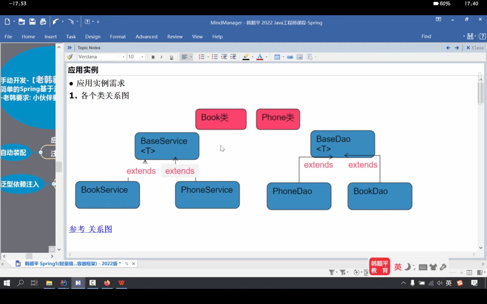

```java
public abstract class BaseDao<T> {
    public abstract void save();
}


public class BaseService<T> {
    @Autowired
    private BaseDao<T> baseDao;  //这一步是泛型依赖注入的关键

    public void save() {
        baseDao.save();
    }
}

@Repository
public class BookDao extends BaseDao<Book>{  //继承时需要指明泛型的类型
    @Override
    public void save() {
        System.out.println("BookDao 的 save()..");
    }
}

@Repository
public class PhoneDao extends BaseDao<Phone>{
    @Override
    public void save() {
        System.out.println("PhoneDao save()");
    }
}

@Service
public class BookService extends BaseService<Book>{
    //并没有写属性
}

@Service
public class PhoneService extends BaseService<Phone>{
    
}
```

测试文件：

```java
 //通过泛型依赖来配置Bean
    @Test
    public void setProByDependencyInjection() {

        ApplicationContext ioc =
                new ClassPathXmlApplicationContext("beans07.xml");
        PhoneService phoneService = ioc.getBean("phoneService", PhoneService.class);
        phoneService.save();  //PhoneDao save()

    }
```


#### （4）注入集合/数组类型


Master类：

```java
public class Master {

    private String name;//主人名

    private List<Monster> monsterList;
    private Map<String, Monster> monsterMap;
    private Set<Monster> monsterSet;
    //数组
    private String[] monsterName;
    //Java基础
    //这个Properties 是 Hashtable的子类 , 是key-value的形式
    //这里Properties  key和value 都是String
    private Properties pros;

    public String getName() {return name;}
    public void setName(String name) { this.name = name;}

    public List<Monster> getMonsterList() {return monsterList;}
    public void setMonsterList(List<Monster> monsterList) { this.monsterList = monsterList;}

    public Map<String, Monster> getMonsterMap() { return monsterMap;}

    public void setMonsterMap(Map<String, Monster> monsterMap) {this.monsterMap = monsterMap;}

    public Set<Monster> getMonsterSet() {return monsterSet;}
    public void setMonsterSet(Set<Monster> monsterSet) { this.monsterSet = monsterSet;}

    public String[] getMonsterName() {return monsterName; }
	public void setMonsterName(String[] monsterName) {this.monsterName = monsterName;}

    public Properties getPros() {return pros; }
    public void setPros(Properties pros) {  this.pros = pros;}

    @Override
    public String toString() {
        return "Master{" +"name='" + name + '\'' + ", monsterList=" + monsterList + ", monsterMap=" + monsterMap +
                ", monsterSet=" + monsterSet +", monsterName=" + Arrays.toString(monsterName) + ", pros=" + pros +'}';}
}
```

xml文件：

```xml
<!--配置Master对象
    体会 spring 容器配置特点 依赖注入-非常灵活
    -->
    <bean class="com.hspedu.spring.bean.Master" id="master">
        <property name="name" value="太上老君"/>
        <!--给list属性赋值-->
        <property name="monsterList">
            <list>
                <!--引用的对象-->
                <ref bean="monster01"/>
                <ref bean="monster02"/>
                <!--内部bean,没有必要分配id-->
                <bean class="com.hspedu.spring.bean.Monster">
                    <property name="name" value="老鼠精"/>
                    <property name="monsterId" value="100"/>
                    <property name="skill" value="吃粮食"/>
                </bean>
            </list>
        </property>
        <!--给map属性赋值-->
        <property name="monsterMap">
            <map>
                <entry>
                    <key>
                        <value>monster03</value>
                    </key>
                    <!--这里老师使用的外部bean,引入-->
                    <ref bean="monster03"/>
                </entry>
                <entry>
                    <key>
                        <value>monster04</value>
                    </key>
                    <ref bean="monster04"/>
                </entry>
            </map>
        </property>
        <!--给set属性赋值-->
        <property name="monsterSet">
            <set>
                <ref bean="monster05"/>
                <ref bean="monster06"/>
                <bean class="com.hspedu.spring.bean.Monster">
                    <property name="name" value="金角大王"/>
                    <property name="skill" value="吐水"/>
                    <property name="monsterId" value="666"/>
                </bean>
            </set>
        </property>
        <!--给数组属性赋值
        老师多说一句: array标签中使用 value 还是 bean , ref .. 要根据你的业务决定
        -->
        <property name="monsterName">
            <array>
                <value>小妖怪</value>
                <value>大妖怪</value>
                <value>老妖怪</value>
            </array>
        </property>
        <!--给Properties属性赋值 结构k(String)-v(String)-->
        <property name="pros">
            <props>
                <prop key="username">root</prop>
                <prop key="password">123456</prop>
                <prop key="ip">127.0.0.1</prop>
            </props>
        </property>
    </bean>
```

#### （5）使用utillist

```xml
// xmlns:util="http://www.springframework.org/schema/util"

<!--定义一个util:list 并且指定id 可以达到数据复用
    老师说明: 在使用util:list 名称空间时候，需要引入相应的标签, 一般来说通过alt+enter会自动加入
    , 如果没有就手动添加一下即可.
    -->
    <util:list id="myBookList">
        <value>三国演义</value>
        <value>红楼梦</value>
        <value>西游记</value>
        <value>水浒传</value>
    </util:list>
    <!--配置BookStore对象
	// private List<String> bookList;
		-->
    <bean class="com.hspedu.spring.bean.BookStore" id="bookStore">
        <property name="bookList" ref="myBookList"/>
    </bean>
```

#### （6）属性级联赋值

```xml
    <!--配置Dept对象-->
    <bean class="com.hspedu.spring.bean.Dept" id="dept"/>
    <!--配置Emp对象-->
    <bean class="com.hspedu.spring.bean.Emp" id="emp">
        <property name="name" value="jack"/>
        <property name="dept" ref="dept"/>
        <!--这里我希望给dept的name属性指定值[级联属性赋值]-->
        <property name="dept.name" value="Java开发部门"/>
    </bean>
```

#### （7）通过属性文件配置

src目录下的my.properties文件：

针对中文乱码，需要进行==unicode编码==进行转码

```properties
monsterId=1000
name=\u4e4c\u9f9f\u7cbe   
skill=\u7f29\u8116\u5b50
```

xml文件配置，加入==context:property-placeholder== 

```xml
//xmlns:context="http://www.springframework.org/schema/context"

<!--指定属性文件
     老师说明
     1. 先把这个文件修改成提示All Problem
     2. 提示错误，将光标放在context 输入alt+enter 就会自动引入namespace
     3. location="classpath:my.properties" 表示指定属性文件的位置
     4. 提示，需要带上 "classpath:"来定位
     5. 属性文件有中文，需要将其转为unicode编码-> 使用工具
     -->
    <context:property-placeholder location="classpath:my.properties"/>
    <!--配置Monster对象
    1.通过属性文件给monster对象的属性赋值
    2. 这时我们的属性值通过${属性名}
    3. 这里说的 属性名 就是 my.properties文件中的 k=v 的k
    -->
    <bean class="com.hspedu.spring.bean.Monster" id="monster1000">
        <property name="monsterId" value="${monsterId}"/>
        <property name="skill" value="${skill}"/>
        <property name="name" value="${name}"/>
    </bean>
```

#### （8）SpringEl表达式

```xml
 <!--配置一个monster对象-->
    <bean id="monster01" class="com.hspedu.spring.bean.Monster">
        <property name="monsterId" value="100"/>
        <property name="name" value="蜈蚣精~"/>
        <property name="skill" value="蜇人~"/>
    </bean>

    <!-- spring el 表达式使用
     老师解读
     1. 通过spel给bean的属性赋值
     -->
    <bean id="spELBean" class="com.hspedu.spring.bean.SpELBean">
        <!-- sp el 给字面量 -->
        <property name="name" value="#{'韩顺平教育'}"/>
        <!-- sp el 引用其它bean -->
        <property name="monster" value="#{monster01}"/>
        <!-- sp el 引用其它bean的属性值 -->
        <property name="monsterName" value="#{monster01.name}"/>
        <!-- sp el 调用普通方法(返回值)  赋值 -->
        <property name="crySound" value="#{spELBean.cry('喵喵的..')}"/>
        <!-- sp el 调用静态方法(返回值) 赋值 -->
        <property name="bookName" value="#{T(com.hspedu.spring.bean.SpELBean).read('天龙八部')}"/>
        <!-- sp el 通过运算赋值 -->
        <property name="result" value="#{89*1.2}"/>
    </bean>
```


### Ⅲ.通过工厂获取Bean

配置xml文件

```xml
<!--配置monster对象，通过FactoryBean获取
    老师解读
    1. class 指定使用的FactoryBean
    2. key表示就是 MyFactoryBean 属性key
    3. value就是你要获取的对象对应key
    -->
    <bean id="my_monster05" class="com.hspedu.spring.factory.MyFactoryBean">
        <property name="key" value="monster04"/>
    </bean>

<!--配置2个实例工厂对象-->
    <bean class="com.hspedu.spring.factory.MyInstanceFactory" id="myInstanceFactory"/>
    <bean class="com.hspedu.spring.factory.MyInstanceFactory" id="myInstanceFactory2"/>
    <!--配置monster对象, 通过实例工厂
    老韩解读
    1. factory-bean 指定使用哪个实例工厂对象返回bean
    2. factory-method 指定使用实例工厂对象的哪个方法返回bean
    3. constructor-arg value="monster03" 指定获取到实例工厂中的哪个monster
    -->
    <bean id="my_monster02" factory-bean="myInstanceFactory" factory-method="getMonster">
        <constructor-arg value="monster03"/>
    </bean>

    <bean id="my_monster03" factory-bean="myInstanceFactory2" factory-method="getMonster">
        <constructor-arg value="monster03"/>
    </bean>
        
<!--配置monster对象,通过静态工厂获取
    老师解读
    1. 通过静态工厂获取/配置bean
    2. class 是静态工厂类的全路径
    3. factory-method 表示是指定静态工厂类的哪个方法返回对象
    4. constructor-arg value="monster02" value是指定要返回静态工厂的哪个对象
    -->
    <bean id="my_monster01"
          class="com.hspedu.spring.factory.MyStaticFactory"
          factory-method="getMonster">
        <constructor-arg value="monster02"/>
    </bean>

    <bean id="my_monster04"
          class="com.hspedu.spring.factory.MyStaticFactory"
          factory-method="getMonster">
        <constructor-arg value="monster02"/>
    </bean>
```

#### （1）静态工厂

```java
public class MyStaticFactory {
    private static Map<String, Monster> monsterMap;

    //使用 static代码块 进行初始化
    //在java基础的时候，讲过的
    static  {
        monsterMap = new HashMap<>();
        monsterMap.put("monster01", new Monster(100,"牛魔王","芭蕉扇"));
        monsterMap.put("monster02", new Monster(200,"狐狸精","美人计"));
    }

    //提供一个方法,返回Monster对象
    public static Monster getMonster(String key) {
        return monsterMap.get(key);
    }
}

```

#### （2）实例工厂

```java
public class MyInstanceFactory {
    private Map<String, Monster> monster_map;

    //通过普通代码块进行初始化
    {
        monster_map = new HashMap<>();
        monster_map.put("monster03", new Monster(300, "牛魔王~", "芭蕉扇~"));
        monster_map.put("monster04", new Monster(400, "狐狸精~", "美人计~"));
    }

    //写一个方法返回Monster对象
    public Monster getMonster(String key) {
        return monster_map.get(key);
    }
}
```

#### （3）通过FactoryBean获取Bean

需要==实现接口FactoryBean<T>==,重写3个方法

```java
public class MyFactoryBean implements FactoryBean<Monster> {

    //这个就是你配置时候，指定要获取的对象对应key
    private String key;
    private Map<String, Monster> monster_map;

    {   //代码块，完成初始化
        monster_map = new HashMap<>();
        monster_map.put("monster03", new Monster(300, "牛魔王~", "芭蕉扇~"));
        monster_map.put("monster04", new Monster(400, "狐狸精~", "美人计~"));
    }

    public void setKey(String key) {
        this.key = key;
    }

    @Override
    public Monster getObject() throws Exception {
        return monster_map.get(key);
    }

    @Override
    public Class<?> getObjectType() {
        return Monster.class;
    }

    @Override
    public boolean isSingleton() {//这里指定是否返是单例
        return false;
    }
}
```


### Ⅳ.Bean更多信息

#### （1）Bean配置信息重用

```xml
  <!--配置Monster对象-->
    <bean id="monster10" class="com.hspedu.spring.bean.Monster">
        <property name="monsterId" value="10"/>
        <property name="name" value="蜈蚣精"/>
        <property name="skill" value="蜇人"/>
    </bean>

    <!--
    老韩解读
    1. 配置Monster对象
    2.但是这个对象的属性值和 id="monster10"对象属性一样
    3.parent="monster10" 指定当前这个配置的对象的属性值从 id=monster10的对象来
    -->

    <bean id="monster11" class="com.hspedu.spring.bean.Monster" parent="monster10"/>
---------------------------------------------------------------------------------------------------------
---------------------------------------------------------------------------------------------------------
<!--配置Monster对象
    1. 如果bean指定了 abstract="true", 表示该bean对象, 只能是用于被继承
    2. 本身这个bean就不能被获取/实例化
    -->
    <bean id="monster12" class="com.hspedu.spring.bean.Monster" abstract="true">
        <property name="monsterId" value="100"/>
        <property name="name" value="蜈蚣精~"/>
        <property name="skill" value="蜇人~"/>
    </bean>

    <bean id="monster13" class="com.hspedu.spring.bean.Monster" parent="monster12"/>


```

#### （2）Bean创建顺序

#### （3）单例与多实例

1.默认是单例singleton,==在启动容器时，默认就会创建==

2.当<bean scope="prototype">设置为多实例机制后，该bean是在getBean时才创建,不受lazy-init属性值影响

3.如果是单例singleton,同时希望在getBean时才创建,可以 指定懒加载 lazy-init="true"(注意默认是false

4.通常情况下,lazy-init 就使用默认值false,在开发看来,用空间换时间是值得的.

5.也可以用==注解形式==@Scope(value="prototype") ，singleton

```xml
 <!--配置Cat对象
        老师解读
        1. 在默认情况下 scope属性是 singleton,在ioc容器中, 只有一个这个bean对象,当程序员执行getBean时, 返回的的是同一个对象
        2. 如果我们希望每次getBean返回一个新的Bean对象，则可以scope="prototype"
        3. 如果bean的配置是 scope="singleton" lazy-init="true" 这时,ioc容器就不会提前创建该对象
           , 而是当执行getBean方法的时候，才会创建对象
    -->
    <bean id="cat" class="com.hspedu.spring.bean.Cat" scope="prototype" lazy-init="false">
        <property name="id" value="100"/>
        <property name="name" value="小花猫"/>
    </bean>
```

#### （4）Bean生命周期

Bean对象创建是由JVM完成的，然后执行如下方法

1.执行构造器

2.执行set方法

3.调用bean的初始化方法

4.使用bean

5.当容器关闭时，调用bean的销毁方法

```xml
<!--配置House对象，演示整个Bean的生命周期
    老师解读
    1. init-method="init" 指定bean的初始化方法 , 在setter方法后执行
    2. destroy-method="destroy" 指定bean的销毁方法, 在容器关闭的时候执行
    3. init方法,destroy方法执行的时机，有spring容器来控制
    -->
    <bean class="com.hspedu.spring.bean.House" id="house"
          init-method="init"
          destroy-method="destroy">
        <property name="name" value="北京豪宅"/>
    </bean>
```

```java
public class House {
    private String name;

    public House() { System.out.println("House() 构造器..."); }
    public String getName() {return name; }
	public void setName(String name) { System.out.println("House setName()=" + name);this.name = name;}

    //老师解读
    //1. 这两个个方法是程序员来编写的.名字任意
    //2. 根据自己的业务逻辑来写.
    public void init() { System.out.println("House init().."); }
    public void destroy() {System.out.println("House destroy()..");}

    @Override
    public String toString() {return "House{" +"name='" + name + '\'' +'}';}
}
```

测试文件

```java
 @Test
    public void testBeanLife() {

        ApplicationContext ioc =
                new ClassPathXmlApplicationContext("beans.xml");
        House house = ioc.getBean("house", House.class);
        System.out.println("使用house=" + house);
        //关闭容器
        //1. 这里又要考察大家的java基础
        //2. ioc的编译类型 ApplicationContext , 运行类型 ClassPathXmlApplicationContext
        //3. 因为ClassPathXmlApplicationContext 实现了 ConfigurableApplicationContext
        //4. ClassPathXmlApplicationContext 是有close
        //5. 将ioc 转成ClassPathXmlApplicationContext,再调用close
        //ioc.close();
        //关闭ioc容器.
        ((ConfigurableApplicationContext) ioc).close();
    }
```

#### （5）Bean后置处理器

后置处理器会在bean初始化方法调用前和初始化方法调用后被调用

需要实现BeanPostProcessor接口，然后重写两个方法

配置xml文件：

```xml
 <!--配置后置处理器对象
    老师解读
    1. 当我们在beans02.xml 容器配置文件 配置了 MyBeanPostProcessor
    2. 这时后置处理器对象，就会作用在该容器创建的Bean对象
    3. 已经是针对所有对象编程->切面编程AOP
    -->
    <bean class="com.hspedu.spring.bean.MyBeanPostProcessor" id="myBeanPostProcessor"/>
```


```java
public class MyBeanPostProcessor implements BeanPostProcessor {

    /**
     * 什么时候被调用: 在Bean的init方法前被调用
     * @param bean 传入的在IOC容器中创建/配置Bean，以Object类型接收，如需调用对象方法需要转型
     * @param beanName 传入的在IOC容器中创建/配置Bean的id
     * @return Object 程序员对传入的bean 进行修改/处理【如果有需要的话】 ,返回
     * @throws BeansException
     */

    @Override
    public Object postProcessBeforeInitialization(Object bean, String beanName) throws BeansException {
        System.out.println("postProcessBeforeInitialization().. bean="
                + bean + " beanName=" + beanName);

        //初步体验案例: 如果类型是House的统一改成 上海豪宅
        //对多个对象进行处理/编程==>切面编程
        if(bean instanceof House) {
            ((House)bean).setName("上海豪宅~");
        }
        return null;
    }
    /**
     * 什么时候被调用: 在Bean的init方法后被调用
     * @param bean  传入的在IOC容器中创建/配置Bean
     * @param beanName 传入的在IOC容器中创建/配置Bean的id
     * @return 程序员对传入的bean 进行修改/处理【如果有需要的话】 ,返回
     * @throws BeansException
     */
    
    @Override
    public Object postProcessAfterInitialization(Object bean, String beanName) throws BeansException {
        System.out.println("postProcessAfterInitialization().. bean="
                + bean + " beanName=" + beanName);
        return bean;
    }
}

```


## (3)注解配置Bean注意事项

启用注解配置bean需要==引入一个jar包==，在spring/libs下拷贝即可

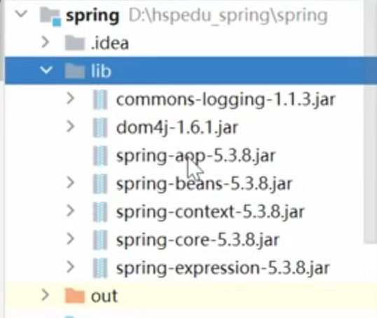

细节：

```java
//在xml文件中引入命名空间，并指定需要注解配置的软件包
//xmlns:context="http://www.springframework.org/schema/context"
 <context:component-scan
            base-package="com.hspedu.spring.aop.aspectj"/>
     
//常用的有四种
@Component
@Service
@Repository
@Controller
//默认的bean对象的id就是类名首字母小写。也可以使用注解的value属性指定id值，并且value可以省略
@Controller(value="userAction1")
@Controller("userAction2")
```

##更多用法## 

```xml
<!--配置容器要扫描的包
    老师解读
    1. component-scan 要对指定包下的类进行扫描, 并创建对象到容器
    2. base-package 指定要扫描的包
    3. 含义是当spring容器创建/初始化时，就会扫描com.hspedu.spring.component包
       下的所有的 有注解 @Controller / @Service / @Respository / @Component类
       将其实例化，生成对象，放入到ioc容器
    4. resource-pattern="User*.class" 表示只扫描com.hspedu.spring.component 和它的子包下的User打头的类
    5.注意是"User*.class",而不是"User*.java",说明是在out目录下扫描的

    -->
    <context:component-scan base-package="com.hspedu.spring.component" resource-pattern="User*.class"/>
```

```xml
    <!--
        需求：如果我们希望排除某个包/子包下的某种类型的注解，可以通过exclude-filter来指定
        1. context:exclude-filter 指定要排除哪些类
        2. type 指定排除方式 annotation表示按照注解来排除
        3. expression="org.springframework.stereotype.Service" 指定要排除的注解的全路径
    -->

    <context:component-scan base-package="com.hspedu.spring.component">
        <context:exclude-filter type="annotation" expression="org.springframework.stereotype.Service"/>
        <context:exclude-filter type="annotation" expression="org.springframework.stereotype.Repository"/>
    </context:component-scan>
```

```xml
      <!--
        需求：如果我们希望按照自己的规则，来扫描包/子包下的某些注解, 可以通过 include-filter
        1. use-default-filters="false" 表示不使用默认的过滤机制/扫描机制
        2. context:include-filter 表示要去扫描哪些类
        3. type="annotation" 按照注解方式来扫描/过滤
        4. expression="org.springframework.stereotype.Service" 指定要扫描的注解的全路径
    -->

    <context:component-scan base-package="com.hspedu.spring.component" use-default-filters="false">
       <context:include-filter type="annotation" expression="org.springframework.stereotype.Service"/>
       <context:include-filter type="annotation" expression="org.springframework.stereotype.Controller"/>
       <context:include-filter type="annotation" expression="org.springframework.stereotype.Repository"/>
    </context:component-scan>
```


## (4).AOP面向切面编程

AOP==底层是基于BeanPostProcessor 机制==的.即在Bean创建好后，根据是否需要AOP处理，决定返回代理对象，还是原生Bean

在返回代理对象时，就可以根据要代理的类和方法来返回。其实这个机制==本质就是在BeanPostProcessor机制+动态代理技术==

```java
启用AOP的SmartDog的Bean对象调用初始化方法前后，bean对象的实际运行类型
//postProcessBeforeInitialization被调用 smartDog bean= class com.hspedu.spring.aop.SmartDog
//postProcessAfterInitialization被调用 smartDog bean= class com.sun.proxy.$Proxy16
```


### 1.动态代理机制引入，尝试理解（真看不太明白）

```java
//TestVehicle.java
@Test
    public void proxyRun() {
        //创建Ship对象
        Vehicle vehicle = new Car();//Car继承了Vehicle

        //创建VehicleProxyProvider对象, 并且我们传入的要代理的对象
        VehicleProxyProvider vehicleProxyProvider =
                new VehicleProxyProvider(vehicle);

        //获取代理对象, 该对象可以代理执行方法
        //老师解读
        //1. porxy 编译类型 Vehicle
        //2. 运行类型 是代理类型 class com.sun.proxy.$Proxy9

        Vehicle proxy = vehicleProxyProvider.getProxy();  
        //proxy:com.hspedu.spring.proxy2.Car@5b87ed94
        //proxy.getClass()):com.sun.proxy.$Proxy4,有点看不明白
        //可以参考反射基础知识，输出cls与cls.getClass()的区别
        
        System.out.println("proxy的编译类型是 Vehicle");
        System.out.println("proxy的运行类型是 " + proxy.getClass()); 
        //proxy.run();
        String result = proxy.fly(10000);
        System.out.println("result=" + result);
         
        //解读/debug怎么 执行到 代理对象的 public Object invoke(Object o, Method method, Object[] args)
        //梳理完毕. proxy的编译类型是 Vehicle, 运行类型是 class com.sun.proxy.$Proxy9
        //所以当执行run方法时，会执行到 代理对象的invoke方法
```


```java
//VehicleProxyProvider.java
public class VehicleProxyProvider {

    //定义一个属性
    //target_vehicle 表示真正要执行的对象
    //该对象实现了Vehicle接口
    private Vehicle target_vehicle;

    //构造器
    public VehicleProxyProvider(Vehicle target_vehicle) {
        this.target_vehicle = target_vehicle;
    }

    //编写一个方法，可以返回一个代理对象, 该代理对象可以通过反射机制调用到被代理对象的方法
    //老师解读
    //1. 这个方法非常重要， 理解有一定难度
    public Vehicle getProxy() {

        //得到类加载器
        ClassLoader classLoader = target_vehicle.getClass().getClassLoader();
        //得到要代理的对象/被执行对象 的接口信息,底层是通过接口来完成调用
        Class<?>[] interfaces = target_vehicle.getClass().getInterfaces();

        //创建InvocationHandler 对象
        InvocationHandler invocationHandler = new InvocationHandler() {
            
            @Override
            public Object invoke(Object o, Method method, Object[] args)
                    throws Throwable {

                System.out.println("交通工具开始运行了....");
                Object result = method.invoke(target_vehicle, args);//不能用method.invoke(o, args)
                System.out.println("交通工具停止运行了....");
                return result;
            }
            /**
             * invoke 方法是将来执行我们的target_vehicle的方法时，会调用到
             * @param o 表示代理对象,即proxy
             * @param method 就是通过代理对象调用方法时，的哪个方法 代理对象.run()
             * @param args : 表示调用 代理对象.run(xx) 传入的参数
             * @return 表示 代理对象.run(xx) 执行后的结果.
             * @throws Throwable
             */
        };

        
        Vehicle proxy =
                (Vehicle)Proxy.newProxyInstance(classLoader, interfaces, invocationHandler);

        return proxy;
        
        //因为 InvocationHandler 是接口，所以我们可以通过匿名对象的方式来创建该对象
        /**
         * public interface InvocationHandler {
         *  public Object invoke(Object proxy, Method method, Object[] args)
         *         throws Throwable;
         * }
         * invoke 方法是将来执行我们的target_vehicle的方法时，会调用到
         */

        
        /*
          public static Object newProxyInstance(ClassLoader loader,
                                          Class<?>[] interfaces,
                                          InvocationHandler h)
          老师解读
          1. Proxy.newProxyInstance() 可以返回一个代理对象
          2. ClassLoader loader: 类的加载器.
          3. Class<?>[] interfaces 就是将来要代理的对象的接口信息
          4. InvocationHandler h 调用处理器/对象 有一个非常重要的方法invoke
         */

    }
}
```

### 2.AOP快速入门

理解：感觉AOP主要就是用==代理对象==和==接口==

#### Ⅰ.配置xml文件

```xml
//注意xml文件引入下面命名空间
// xmlns:context="http://www.springframework.org/schema/context"
// xmlns:aop="http://www.springframework.org/schema/aop"

	<context:component-scan
    base-package="com.hspedu.spring.aop.aspectj"/>

    <!-- 开启基于注解的AOP功能，否则@Aspect注解不会生效 -->
    <aop:aspectj-autoproxy/>
```

#### Ⅱ.编写切面类

```java
@Order(value = 1)
@Aspect //表示是一个切面类[底层切面编程的支撑(动态代理+反射+动态绑定...)]
@Component //会注入SmartAnimalAspect到容器
public class SmartAnimalAspect3 {

    //前置通知:希望将f1方法切入到SmartDog-getSum前执行-
    /**
     * 老师解读
     * 1. @Before 表示前置通知:即在我们的目标对象执行方法前执行
     * 2. value = "execution(public float com.hspedu.spring.aop.aspectj.SmartDog.getSum(float, float)
     * 指定切入到哪个类的哪个方法  形式是: 访问修饰符 返回类型 全类名.方法名(形参列表)
     * 3. showBeginLog方法可以理解成就是一个切入方法, 这个方法名是可以程序员指定  比如:showBeginLog
     * 4. JoinPoint joinPoint 在底层执行时，由AspectJ切面框架， 会给该切入方法传入 joinPoint对象
     * , 通过该方法，程序员可以获取到 相关信息
     *
     * @param joinPoint
     */
    @Before(value = "execution(public float com.hspedu.spring.aop.aspectj.SmartDog.getSum(float, float))")
    public void showBeginLog(JoinPoint joinPoint) {
        //通过连接点对象joinPoint 可以获取方法签名
        Signature signature = joinPoint.getSignature();
        System.out.println("SmartAnimalAspect3-切面类showBeginLog()-方法执行前-日志-方法名-" + signature.getName() + "-参数 "
                + Arrays.asList(joinPoint.getArgs()));
    }

    //返回通知：即把showSuccessEndLog方法切入到目标对象方法正常执行完毕后的地方
    //老韩解读
    //1. 如果我们希望把目标方法执行的结果，返回给切入方法
    //2. 可以再 @AfterReturning 增加属性 , 比如 returning = "res"
    //3. 同时在切入方法增加 Object res
    //4. 注意: returning = "res" 和 Object res 的 res名字一致
    @AfterReturning(value = "execution(public float com.hspedu.spring.aop.aspectj.SmartDog.getSum(float, float))", returning = "res")
    public void showSuccessEndLog(JoinPoint joinPoint, Object res) {
        Signature signature = joinPoint.getSignature();
        System.out.println("SmartAnimalAspect3-切面类showSuccessEndLog()-方法执行正常结束-日志-方法名-" + signature.getName() + " 返回的结果是=" + res);
    }


    //异常通知：即把showExceptionLog方法切入到目标对象方法执行发生异常的的catch{}
    @AfterThrowing(value = "execution(public float com.hspedu.spring.aop.aspectj.SmartDog.getSum(float, float))", throwing = "throwable")
    public void showExceptionLog(JoinPoint joinPoint, Throwable throwable) {
        Signature signature = joinPoint.getSignature();
        System.out.println("SmartAnimalAspect3-切面类showExceptionLog()-方法执行异常-日志-方法名-" + signature.getName() + " 异常信息=" + throwable);
    }

    //最终通知：即把showFinallyEndLog方法切入到目标方法执行后(不管是否发生异常,都要执行 finally{})
    @After(value = "execution(public float com.hspedu.spring.aop.aspectj.SmartDog.getSum(float, float))")
    public void showFinallyEndLog(JoinPoint joinPoint) {
        Signature signature = joinPoint.getSignature();
        System.out.println("SmartAnimalAspect3-切面类showFinallyEndLog()-方法最终执行完毕-日志-方法名-" + signature.getName());
    }


}
```

##### 1.切面表达式细节：

（1）若方法所在的目标类，接口类与该切面类在同一个包中可以省略包名

```java
 @Before(value = "execution(public float SmartDog.getSum(float, float))")
```

（2）可以用“*”代表任意修饰符，返回值，接口，类以及方法，可以用“..”匹配任意数量任意类型的参数

```java
 @Before(value = "execution(* SmartDog.*(..))")
 @Before(value = "execution(public * SmartDog.*(..))")
//下面这个表示第一个参数为float,后面任意
 @Before(value = "execution(public float SmartDog.*(float,..))")
```

（3）可以通过“&&”，“||”,“!”等操作符结合

（4）切入表达式可以指向类的方法，也可以指向接口的方法（这时会对==实现接口的所有类生效==）

（5）切入表达式也可以==对没有实验接口的类==进行切入（接口动态代理是基于jdk的Proxy,类的动态代理是基于Spring的CGlib）

```java
//1.JDK动态代理是面向接口的，只能增强实现类中接口中存在的方法。CGlib是面向父类的，可以增强父类的所有方法
//2.JDK得到的对象是JDK代理对象实例，而CGlib得到的对象是==被代理对象的子类==
@Test
    public void test3() {
        //得到spring容器
        ApplicationContext ioc =
                new ClassPathXmlApplicationContext("beans08.xml");
        //   <!-- 开启基于注解的AOP功能 -->  <aop:aspectj-autoproxy/>
        //在切面类中给Car配置一个前置通知 @Before(value = "execution(public void Car.run())")
        
        
        //如果没有实现接口，代理对象就不用接口来接收
        Car car = ioc.getBean(Car.class);
        //说明: car对象仍然是代理对象
        System.out.println("car的运行类型=" + car.getClass());
        car.run();
    }
```

##### 2.joinPoint用法

```java
@After(value = "execution(public void Car.run())")
    public void ok4(JoinPoint joinPoint) {
        //首先获取连接点方法签名
        Signature signature = joinPoint.getSignature();
        System.out.println("切面类的ok4()-执行的目标方法-" + signature.getName());
        //演示一下JoinPoint常用的方法.
        joinPoint.getSignature().getName(); // 获取目标方法名
        joinPoint.getSignature().getDeclaringType().getSimpleName(); // 获取目标方法所属类的简单类名
        joinPoint.getSignature().getDeclaringTypeName(); // 获取目标方法所属类的全类名（带完整路径）
        joinPoint.getSignature().getModifiers(); // 获取目标方法声明类型(public、private、protected)
        Object[] args = joinPoint.getArgs(); // 获取传入目标方法的参数，返回一个数组
        joinPoint.getTarget(); // 获取被代理的对象
        joinPoint.getThis(); // 获取代理对象自己
    }
```

##### 3.返回通知获取结果

```java
 @AfterReturning(value = "execution(public float SmartDog.getSum(float, float))", returning = "res")
 public void showSuccessEndLog(JoinPoint joinPoint, Object res) {...}
```

##### 4.异常通知获取异常信息

```java
@AfterThrowing(value = "execution(public float SmartDog.getSum(float, float))", throwing = "throwable")
 public void showExceptionLog(JoinPoint joinPoint, Throwable throwable) {...}
```

##### 5.环绕通知

```java
//@Aspect //表示是一个切面类[底层切面编程的支撑(动态代理+反射+动态绑定...)]
//@Component //会注入SmartAnimalAspect2到容器
public class SmartAnimalAspect2 {

    //演示环绕通知的使用-了解
    //老师解读
    //1. @Around: 表示这是一个环绕通知[完成其它四个通知的功能]
    //2. value = "execution(public float com.hspedu.spring.aop.aspectj.SmartDog.getSum(float, float)) 切入点表达式
    //3. doAround 表示要切入的方法 - 调用结构 try-catch-finally
    @Around(value = "execution(public float com.hspedu.spring.aop.aspectj.SmartDog.getSum(float, float))")
    public Object doAround(ProceedingJoinPoint joinPoint) {
        Object result = null;
        String methodName = joinPoint.getSignature().getName();
        try {
            //1.相当于前置通知完成的事情
            Object[] args = joinPoint.getArgs();
            List<Object> argList = Arrays.asList(args);
            System.out.println("AOP环绕通知[-前置通知]" + methodName + "方法开始了--参数有：" + argList);
            //在环绕通知中一定要调用joinPoint.proceed()来执行目标方法
            result = joinPoint.proceed();
            //2.相当于返回通知完成的事情
            System.out.println("AOP环绕通知[-返回通知]" + methodName + "方法结束了--结果是：" + result);
        } catch (Throwable throwable) {
            //3.相当于异常通知完成的事情
            System.out.println("AOP环绕通知[-异常通知]" + methodName + "方法抛异常了--异常对象：" + throwable);
        } finally {
            //4.相当于最终通知完成的事情
            System.out.println("AOP环绕通知[-后置通知]" + methodName + "方法最终结束了...");
        }
        return result;
    }
}
```

##### 6.切入表达式重用

```java

//定义一个切入点, 在后面使用时可以直接引用, 提高了复用性
@Pointcut(value = "execution(public float com.hspedu.spring.aop.aspectj.SmartDog.getSum(float, float)))")
public void myPointCut() {
}

@Before(value = "myPointCut()")
@AfterReturning(value = "myPointCut()", returning = "res")
@AfterThrowing(value = "myPointCut()", throwing = "throwable")
@After(value = "myPointCut()")
```

##### 7.切面类执行顺序

针对如果同一个方法，有多个切面在同一个切入点切入时，控制执行的优先级

基本语法：@order(value=n) ==n值越小，优先级越高==

```java
//有两个切面类启用时，运行结果，套娃，有点像过滤器
SmartAnimalAspect3-切面类showBeginLog()-方法执行前-日志-方法名-getSum-参数 [10.0, 2.0]
SmartAnimalAspect-切面类showBeginLog()-方法执行前-日志-方法名-getSum-参数 [10.0, 2.0]
方法内部打印result = 12.0
SmartAnimalAspect-切面类showSuccessEndLog()-方法执行正常结束-日志-方法名-getSum 返回的结果是=12.0
SmartAnimalAspect-切面类showFinallyEndLog()-方法最终执行完毕-日志-方法名-getSum
SmartAnimalAspect3-切面类showSuccessEndLog()-方法执行正常结束-日志-方法名-getSum 返回的结果是=12.0
SmartAnimalAspect3-切面类showFinallyEndLog()-方法最终执行完毕-日志-方法名-getSum
```

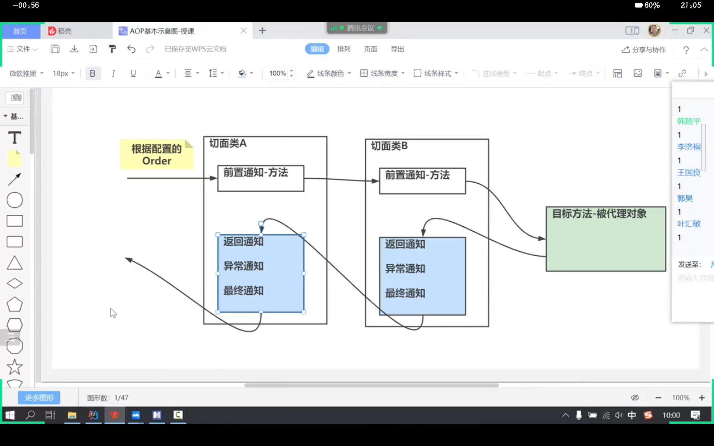

##### 8.基于xml配置AOP

```xml
<?xml version="1.0" encoding="UTF-8"?>
<beans xmlns="http://www.springframework.org/schema/beans"
       xmlns:xsi="http://www.w3.org/2001/XMLSchema-instance"
       xmlns:aop="http://www.springframework.org/schema/aop"
       xsi:schemaLocation="http://www.springframework.org/schema/beans http://www.springframework.org/schema/beans/spring-beans.xsd http://www.springframework.org/schema/context https://www.springframework.org/schema/context/spring-context.xsd http://www.springframework.org/schema/aop https://www.springframework.org/schema/aop/spring-aop.xsd">

    <!--使用XML配置，完成AOP编程-->
    <!--配置一个切面类对象-bean-->
    <bean class="com.hspedu.spring.aop.xml.SmartAnimalAspect" id="smartAnimalAspect"/>
    <!--配置一个SmartDog对象-bean-->
    <bean class="com.hspedu.spring.aop.xml.SmartDog" id="smartDog"/>
        
    <!--配置切面类, 细节一定要引入 xmlns:aop-->
    <aop:config>
        <!--配置切入点-->
        <aop:pointcut id="myPointCut" expression="execution(public float com.hspedu.spring.aop.xml.SmartDog.getSum(float, float)))"/>
        <!--配置切面的前置，返回, 异常, 最终通知-->
        <!--需要放在pointcut后面-->
        <aop:aspect ref="smartAnimalAspect" order="10">
            <!--配置前置通知-->
            <aop:before method="showBeginLog" pointcut-ref="myPointCut"/>
            <!--返回通知-->
            <aop:after-returning method="showSuccessEndLog" pointcut-ref="myPointCut" returning="res"/>
            <!--异常通知-->
            <aop:after-throwing method="showExceptionLog" pointcut-ref="myPointCut" throwing="throwable"/>
            <!--最终通知-->
            <aop:after method="showFinallyEndLog" pointcut-ref="myPointCut"/>
            <!--配置环绕通知-->
            <!--<aop:around method=""/>-->
        </aop:aspect>
    </aop:config>
</beans>
```


#### Ⅲ.编写测试类

注意：当spring 容器开启了<!- 开启基于注解的AOP功能-><aop.aspectj-autoproxy/>，我们获取注入的对象,==需要以接口的类型====来获取==，因为你注入的对			象.getClass()已经是代理类型了
	 当spring 容器开启了 <!- 开启基于注解的AOP功能 -> < aop:aspectj-autoproxy/>，我们获取注入的对象,也可以通过id来获取，但是也要转成接口类型

```java
//

@Test
    public void smartDogTestByProxy() {

        //得到spring容器
        ApplicationContext ioc =
                new ClassPathXmlApplicationContext("beans08.xml");
        //这里我们需要通过接口类型来获取到注入的SmartDog对象-就是代理对象
        SmartAnimalable smartAnimalable =
                ioc.getBean(SmartAnimalable.class);

        //也可以按下面这样写，只能用id来获取
        SmartAnimalable smartAnimalable2 = (SmartAnimalable)ioc.getBean("smartDog");

        //但是下面写法就会报错，不能使用Class类来获取
        //SmartAnimalable smartAnimalable4 = (SmartAnimalable)ioc.getBean("smartDog",SmartDog.class);
        //SmartAnimalable smartAnimalable5 = (SmartAnimalable)ioc.getBean(SmartDog.class);

        smartAnimalable.getSum(10, 2);


        //必须要用接口来获取，下面这样直接获取都会报错
        //原因是xml文件中开启基于注解的AOP功能，
        //SmartDog bean = ioc.getBean(SmartDog.class);
        //SmartDog bean1 = ioc.getBean("smartDog",SmartDog.class);
        
        //SmartDog bean2 = (SmartDog) ioc.getBean("smartDog");
        //java.lang.ClassCastException: com.sun.proxy.$Proxy19 cannot be cast to com.hspedu.spring.aop.aspectj.SmartDog


        smartAnimalable.getSum(10, 2);

        System.out.println("smartAnimalable运行类型="
                + smartAnimalable.getClass()); 
        //smartAnimalable运行类型=class com.sun.proxy.$Proxy19

    }
```

## (5)JdbcTemplate类

spring框架提供了一个操作数据库功能强大的类JdbcTemplate,我们可以通过ioc容器来配置jdbcTemplate对象，使用它来完成对数据库的操作


#### 1.快速入门

需要导入相关jar包

jdbc.properties文件 :

```
jdbc.user=root
jdbc.pwd=hsp
jdbc.driver=com.mysql.jdbc.Driver
jdbc.url=jdbc:mysql://localhost:3306/spring
```

JdbcTemplate_ioc.xml文件：

```xml
<?xml version="1.0" encoding="UTF-8"?>
<beans xmlns="http://www.springframework.org/schema/beans"
       xmlns:xsi="http://www.w3.org/2001/XMLSchema-instance"
       xmlns:context="http://www.springframework.org/schema/context"
       xsi:schemaLocation="http://www.springframework.org/schema/beans http://www.springframework.org/schema/beans/spring-beans.xsd http://www.springframework.org/schema/context https://www.springframework.org/schema/context/spring-context.xsd">

    <!--配置要扫描包-->
    //说明：这一步DAO使用jdbctemplate专用
    <context:component-scan
            base-package="com.hspedu.spring.jdbctemplate.dao"/>

    <!--引入外部的jdbc.properties文件-->
    <context:property-placeholder location="classpath:jdbc.properties"/>
    <!--配置数据源对象-DataSoruce-->
    //导入的jar包中的类
    <bean class="com.mchange.v2.c3p0.ComboPooledDataSource" id="dataSource">
        <!--给数据源对象配置属性值-->
        <property name="user" value="${jdbc.user}"/>
        <property name="password" value="${jdbc.pwd}"/>
        <property name="driverClass" value="${jdbc.driver}"/>
        <property name="jdbcUrl" value="${jdbc.url}"/>
    </bean>
    <!--配置JdbcTemplate对象-->
     //导入的jar包中的类
    <bean class="org.springframework.jdbc.core.JdbcTemplate" id="jdbcTemplate">
        <!--给JdbcTemplate对象配置dataSource-->
        <property name="dataSource" ref="dataSource"/>
    </bean>
	
    //特殊说明：这一步使用具名参数专用
    <!--配置NamedParameterJdbcTemplate对象-->
    <bean class="org.springframework.jdbc.core.namedparam.NamedParameterJdbcTemplate"
          id="namedParameterJdbcTemplate">
        <!--通过构造器，设置数据源-->
        <constructor-arg name="dataSource" ref="dataSource"/>
    </bean>
</beans>
```

MonsterDao.java文件：

```java
@Repository //将MonsterDao 注入到spring容器
public class MonsterDao {

    //注入一个属性
    @Resource
    private JdbcTemplate jdbcTemplate;

    //完成保存任务
    public void save(Monster monster) {
        //组织sql
        String sql = "INSERT INTO monster VALUES(?,?,?)";
        int affected = jdbcTemplate.update
                (sql, monster.getMonsterId(), monster.getName(), monster.getSkill());
        System.out.println("affected= " + affected);
    }
}
```

test文件：

```java
public class JdbcTemplateTest {
	//1.测试是否得到连接，不过后面貌似用不到
    @Test
    public void testDatasourceByJdbcTemplate() throws SQLException {
        //获取到容器
        ApplicationContext ioc =
                new ClassPathXmlApplicationContext("JdbcTemplate_ioc.xml");

        //com.mchange.v2.c3p0.ComboPooledDataSource
        //import javax.sql.DataSource;
        //ComboPooledDataSources实现了DataSource接口
        //这一步是个关键点,不太容易理解
        DataSource dataSource = ioc.getBean(DataSource.class);
        Connection connection = dataSource.getConnection();
        System.out.println("获取到connection= " + connection);
        connection.close();
        System.out.println("ok");
    }

    //2.测试通过JdbcTemplate对象完成添加数据
    @Test
    public void addDataByJdbcTemplate() {
        //获取到容器
        ApplicationContext ioc =
                new ClassPathXmlApplicationContext("JdbcTemplate_ioc.xml");

        //获取JdbcTemplate对象
        JdbcTemplate jdbcTemplate = ioc.getBean(JdbcTemplate.class);
        //1. 添加方式1
        //String sql = "INSERT INTO monster VALUES(400, '红孩儿', '枪法')";
        //jdbcTemplate.execute(sql);
        //2. 添加方式2，防止注入
        String sql = "INSERT INTO monster VALUES(?, ?, ?)";
        //affected表示 执行后表受影响的记录数
        int affected = jdbcTemplate.update(sql, 500, "红孩儿2", "枪法2");
        System.out.println("add ok affected=" + affected);//结果为1


    }

    //3.测试通过JdbcTemplate对象完成修改数据
    @Test
    public void updateDataByJdbcTemplate() {

        //获取到容器
        ApplicationContext ioc =
                new ClassPathXmlApplicationContext("JdbcTemplate_ioc.xml");

        //获取JdbcTemplate对象
        JdbcTemplate jdbcTemplate = ioc.getBean(JdbcTemplate.class);

        //组织SQL
        String sql = "UPDATE monster SET skill=? WHERE id=?";
        int affected = jdbcTemplate.update(sql, "美女计", 300);
        System.out.println("update ok affected= " + affected);//结果为1

    }

    //4.批量添加二个monster 白蛇精和青蛇精
    //这里有一个使用API的技巧
    /**
     * 老师说明
     * 1. 对于某个类， 有很多API, 使用的步骤
     * 2. 老韩的使用技巧（1） 先确定API名字 (2) 根据API提供相应的参数 [组织参数]
     *    (3) 把自己的调用思路清晰 (4) 根据API, 可以推测类似的用法和功能
     */

    /**
     * batch add data
     * 批量添加二个monster 白蛇精和青蛇精-update(sql,List<Object[]>)
     */
    @Test
    public void addBatchDataByJdbcTemplate() {
        ApplicationContext ioc = new ClassPathXmlApplicationContext("JdbcTemplate_ioc.xml");
        //得到JdbcTemplate bean
        JdbcTemplate jdbcTemplate = ioc.getBean(JdbcTemplate.class);//添加..

        //1. 先确定,猜测API名称 batchUpdate[如果出现问题，才重新玩]
        //public int[] batchUpdate(String sql, List<Object[]> batchArgs){}
        //2. 准备参数
        String sql = "INSERT INTO monster VALUES(?, ?, ?)";
        List<Object[]> batchArgs = new ArrayList<>();
        batchArgs.add(new Object[]{600, "老鼠精", "偷吃粮食"});
        batchArgs.add(new Object[]{700, "老猫精", "抓老鼠"});
        //3. 调用
        //说明：返回结果是一个数组，每个元素对应上面的sql语句对表的影响记录数
        int[] ints = jdbcTemplate.batchUpdate(sql, batchArgs);//ints = {1,1}
        //输出
        for (int anInt : ints) {
            System.out.println("anInt=" + anInt);
        }
        System.out.println("batch add ok..");
    }

    //5.查询id=100的monster并封装到Monster实体对象[在实际开发中，非常有用]

    @Test
    public void selectDataByJdbcTemplate() {
        ApplicationContext ioc = new ClassPathXmlApplicationContext("JdbcTemplate_ioc.xml");
        //得到JdbcTemplate bean
        JdbcTemplate jdbcTemplate = ioc.getBean(JdbcTemplate.class);
        //组织SQL
        //通过BeanPropertyRowMapper获取rowmapper 是一个接口，可以将查询的结果，封装到你指定的Monster对象中.

        //1. 确定API ： queryForObject()
        //public <T> T queryForObject(String sql, RowMapper<T> rowMapper, @Nullable Object... args)
        //2.准备参数
        //这里有一个细节: 你查询的记录的表的字段需要和 Monster的对象字段名保持一致
        String sql = "SELECT id AS monsterId, NAME, skill FROM monster WHERE id = 100";

        //使用RowMapper 接口来对返回的数据，进行一个封装-》底层使用的反射->setter
        //public class BeanPropertyRowMapper<T> implements RowMapper<T>P{...}

        // public BeanPropertyRowMapper(Class<T> mappedClass) {this.initialize(mappedClass);}
        // 注意要调用的构造器需要传入泛型类的class类型，底层需要用到反射
        RowMapper<Monster> rowMapper = new BeanPropertyRowMapper<>(Monster.class);
        //jdbcTemplate
        Monster monster = jdbcTemplate.queryForObject(sql, rowMapper);
        System.out.println("monster= " + monster);
        System.out.println("查询ok");

    }
    //6.查询id>=200的monster并封装到Monster实体对象

    /**
     * 查询多条记录
     */
    @Test
    public void selectMulDataByJdbcTemplate() {
        ApplicationContext ioc =
                new ClassPathXmlApplicationContext("JdbcTemplate_ioc.xml");
        //得到JdbcTemplate bean
        JdbcTemplate jdbcTemplate = ioc.getBean(JdbcTemplate.class);
        //组织SQL
        //通过BeanPropertyRowMapper获取rowmapper 是一个接口，可以将查询的结果，封装到你指定的Monster对象中.

        //1.    确定API
        //public <T> List<T> query(String sql, RowMapper<T> rowMapper, Object... args){}
        //2. 组织参数
        String sql = "SELECT id AS monsterId, NAME, skill FROM monster WHERE id >= ?";
        RowMapper<Monster> rowMapper = new BeanPropertyRowMapper<>(Monster.class);
        //3. 调用
        List<Monster> monsterList = jdbcTemplate.query(sql, rowMapper, 100);
        for (Monster monster : monsterList) {
            System.out.println("monster= " + monster);
        }
    }

    //7.查询返回结果只有一行一列的值，比如查询id=100的怪物名

    /**
     * 7.查询返回结果只有一行一列的值
     */
    @Test
    public void selectScalarByJdbcTemplate() {
        ApplicationContext ioc =
                new ClassPathXmlApplicationContext("JdbcTemplate_ioc.xml");
        //得到JdbcTemplate bean
        JdbcTemplate jdbcTemplate = ioc.getBean(JdbcTemplate.class);

        //1. 确定API
        //public <T> T queryForObject(String sql, Class<T> requiredType)
        //2. 提供参数
        String sql = "SELECT NAME FROM monster WHERE id = 100";
        //Class<T> requiredType 表示你返回的单行单列的数据类型

        String name =
                jdbcTemplate.queryForObject(sql, String.class);
        System.out.println("返回name= " + name);


    }

    //8.使用Map传入具名参数完成操作，比如添加 螃蟹精.:name 就是具名参数形式需要使用NamedParameterJdbcTemplate 类, 语句形式: String sql = "INSERT INTO monster VALUES(:my_id, :name, :skill)";

    /**
     * 使用Map传入具名参数完成操作，比如添加
     
       //特殊说明：这一步使用具名参数专用
        <!--配置NamedParameterJdbcTemplate对象-->
        <bean class="org.springframework.jdbc.core.namedparam.NamedParameterJdbcTemplate"
              id="namedParameterJdbcTemplate">
            <!--通过构造器，设置数据源-->
            <constructor-arg name="dataSource" ref="dataSource"/>
        </bean>
     */
    @Test
    public void testDataByNamedParameterJdbcTemplate() {
        ApplicationContext ioc =
                new ClassPathXmlApplicationContext("JdbcTemplate_ioc.xml");
        //得到NamedParameterJdbcTemplate bean
        NamedParameterJdbcTemplate namedParameterJdbcTemplate =
                ioc.getBean(NamedParameterJdbcTemplate.class);

        //1. 确定使用API
        //public int update(String sql, Map<String, ?> paramMap)
        //2. 准备参数 [:my_id, :name, :skill] 要求按照规定的名字来设置参数
        String sql = "INSERT INTO monster VALUES(:id, :name, :skill)";
        Map<String, Object> paramMap = new HashMap<>();
        //给paramMap填写数据
        paramMap.put("id", 800);
        paramMap.put("name", "蚂蚁精");
        paramMap.put("skill", "喜欢打洞");
        //3. 调用
        int affected = namedParameterJdbcTemplate.update(sql, paramMap);
        System.out.println("add ok affected=" + affected);


    }

    //使用sqlparametersoruce 来封装具名参数,还是添加一个Monster 狐狸精

    @Test
    public void operDataBySqlparametersoruce() {
        ApplicationContext ioc =
                new ClassPathXmlApplicationContext("JdbcTemplate_ioc.xml");
        //得到NamedParameterJdbcTemplate bean
        NamedParameterJdbcTemplate namedParameterJdbcTemplate =
                ioc.getBean(NamedParameterJdbcTemplate.class);

        //确定API
        //public int update(String sql, SqlParameterSource paramSource)
        
        //public class BeanPropertySqlParameterSource extends Abstract SqlParameterSource
        //构造器传入需要封装的对象
        //public BeanPropertySqlParameterSource(Object object){...}
        //准备参数
        String sql = "INSERT INTO monster VALUES(:monsterId, :name, :skill)";
        //注意具名参数需要与Monster对象属性对应
        Monster monster = new Monster(900, "大象精", "搬运木头");
        SqlParameterSource sqlParameterSource =
                new BeanPropertySqlParameterSource(monster);
        //调用
        int affected =
                namedParameterJdbcTemplate.update(sql, sqlParameterSource);

        System.out.println("add ok affected= " + affected);
    }


    //测试MonsterDAO
    @Test
    public void monsterDaoSave() {
        ApplicationContext ioc =
                new ClassPathXmlApplicationContext("JdbcTemplate_ioc.xml");

        MonsterDao monsterDao = ioc.getBean(MonsterDao.class);
        Monster monster = new Monster(1000, "小鸭精", "吃鱼");
        monsterDao.save(monster);
        System.out.println("MonsterDAO保存 ok ..");
    }
}
```

#### 2.声明式事务简述

使用Spring的声明式事务处理，可以将操作数据库的多个子步骤分别写成一个方法，然后统一 管理. 底层使用AOP(动态代理+动态绑定+反射+注解)

Ⅰ. @Transactional(propagation = Propagation.REQUIRES_NEW, isolation = Isolation.DEFAULT) 配置事务，==传播机制与隔离级别==

Ⅱ.@Transactional(timeout = 2)超时回滚

Ⅲ.新增xml配置

```xml
<!--配置事务管理器-对象
    1. DataSourceTransactionManager 这个对象是进行事务管理-debug源码
    2. 一定要配置数据源属性，这样指定该事务管理器 是对哪个数据源进行事务控制
    -->
    <bean class="org.springframework.jdbc.datasource.DataSourceTransactionManager" id="transactionManager">
        <property name="dataSource" ref="dataSource"/>
    </bean>

    <!--配置启动基于注解的声明式事务管理功能-->
    <tx:annotation-driven transaction-manager="transactionManager"/>
```


 tx_ioc.xml配置文件

```xml
<?xml version="1.0" encoding="UTF-8"?>
<beans xmlns="http://www.springframework.org/schema/beans"
       xmlns:xsi="http://www.w3.org/2001/XMLSchema-instance"
       xmlns:context="http://www.springframework.org/schema/context" xmlns:tx="http://www.springframework.org/schema/tx"
       xsi:schemaLocation="http://www.springframework.org/schema/beans http://www.springframework.org/schema/beans/spring-beans.xsd http://www.springframework.org/schema/context https://www.springframework.org/schema/context/spring-context.xsd http://www.springframework.org/schema/tx http://www.springframework.org/schema/tx/spring-tx.xsd">

    <!--配置要扫描的包-->
    <context:component-scan base-package="com.hspedu.spring.tx.dao"/>
    <context:component-scan base-package="com.hspedu.spring.tx.service"/>

    <!--引入外部的jdbc.properties文件-->
    <context:property-placeholder location="classpath:jdbc.properties"/>
    <!--配置数据源对象-DataSoruce-->
    <bean class="com.mchange.v2.c3p0.ComboPooledDataSource" id="dataSource">
        <!--给数据源对象配置属性值-->
        <property name="user" value="${jdbc.user}"/>
        <property name="password" value="${jdbc.pwd}"/>
        <property name="driverClass" value="${jdbc.driver}"/>
        <property name="jdbcUrl" value="${jdbc.url}"/>
    </bean>

    <!--配置JdbcTemplate对象-->
    <bean class="org.springframework.jdbc.core.JdbcTemplate" id="jdbcTemplate">
        <!--给JdbcTemplate对象配置dataSource-->
        <property name="dataSource" ref="dataSource"/>
    </bean>
    
    
    
    
    

    <!--配置事务管理器-对象
    1. DataSourceTransactionManager 这个对象是进行事务管理-debug源码
    2. 一定要配置数据源属性，这样指定该事务管理器 是对哪个数据源进行事务控制
    -->
    <bean class="org.springframework.jdbc.datasource.DataSourceTransactionManager" id="transactionManager">
        <property name="dataSource" ref="dataSource"/>
    </bean>

    <!--配置启动基于注解的声明式事务管理功能-->
    <tx:annotation-driven transaction-manager="transactionManager"/>
</beans>
```

TxTest.java

```java

public class TxTest {

    @Test
    public void queryPriceByIdTest() {
        //获取到容器
        ApplicationContext ioc =
                new ClassPathXmlApplicationContext("tx_ioc.xml");
        GoodsDao goodsDao = ioc.getBean(GoodsDao.class);

        Float price = goodsDao.queryPriceById(1);
        System.out.println("id=100 的price=" + price);
    }

    @Test
    public void updateBalance() {

        //获取到容器
        ApplicationContext ioc =
                new ClassPathXmlApplicationContext("tx_ioc.xml");
        GoodsDao goodsDao = ioc.getBean(GoodsDao.class);
        goodsDao.updateBalance(1, 1.0F);
        System.out.println("减少用户余额成功~");

    }

    @Test
    public void updateAmount() {
        //获取到容器
        ApplicationContext ioc =
                new ClassPathXmlApplicationContext("tx_ioc.xml");
        GoodsDao goodsDao = ioc.getBean(GoodsDao.class);
        goodsDao.updateAmount(1, 1);
        System.out.println("减少库存成功...");
    }

    //测试用户购买商品业务
    @Test
    public void buyGoodsTest() {
        //获取到容器
        ApplicationContext ioc =
                new ClassPathXmlApplicationContext("tx_ioc.xml");
        GoodsService goodsService = ioc.getBean(GoodsService.class);
        goodsService.buyGoods(1, 1, 1);
    }

    //测试用户购买商品业务
    @Test
    public void buyGoodsByTxTest() {
        //获取到容器
        ApplicationContext ioc =
                new ClassPathXmlApplicationContext("tx_ioc.xml");
        GoodsService goodsService = ioc.getBean(GoodsService.class);
        goodsService.buyGoodsByTx(1, 1, 1);//这里我们调用的是进行了事务声明的方法
    }

    //测试事务的传播机制
    @Test
    public void multiBuyGoodsByTxTest() {

        //获取到容器
        ApplicationContext ioc =
                new ClassPathXmlApplicationContext("tx_ioc.xml");

        MultiplyService multiplyService = ioc.getBean(MultiplyService.class);

        multiplyService.multiBuyGoodsByTx();
    }

    //测试声明式事务的隔离级别
    @Test
    public void buyGoodsByTxISOLATIONTest() {

        //获取到容器
        ApplicationContext ioc =
                new ClassPathXmlApplicationContext("tx_ioc.xml");

        GoodsService goodsService = ioc.getBean(GoodsService.class);

        goodsService.buyGoodsByTxISOLATION();
    }

    //测试timeout 属性
    @Test
    public void buyGoodsByTxTimeoutTest() {

        //获取到容器
        ApplicationContext ioc =
                new ClassPathXmlApplicationContext("tx_ioc.xml");

        GoodsService goodsService = ioc.getBean(GoodsService.class);

        goodsService.buyGoodsByTxTimeout(1,1,1);
    }
}
```

GoodsDao.java

```java

@Repository //将 GoodsDao-对象 注入到spring容器
public class GoodsDao {

    @Resource
    private JdbcTemplate jdbcTemplate;

    /**
     * 根据商品id,返回对应的价格
     * @param id
     * @return
     */
    public Float queryPriceById(Integer id) {
        String sql = "SELECT price From goods Where goods_id=?";
        Float price = jdbcTemplate.queryForObject(sql, Float.class, id);
        return price;
    }

    /**
     * 修改用户的余额 [减少用户余额]
     * @param user_id
     * @param money
     */
    public void updateBalance(Integer user_id, Float money) {
        String sql = "UPDATE user_account SET money=money-? Where user_id=?";
        jdbcTemplate.update(sql, money, user_id);
    }

    /**
     * 修改商品库存 [减少]
     * @param goods_id
     * @param amount
     */
    public void updateAmount(Integer goods_id, int amount){
        String sql = "UPDATE goods_amount SET goods_num=goods_num-? Where goods_id=?";
        jdbcTemplate.update(sql, amount , goods_id);
    }


    /**
     * 根据商品id,返回对应的价格
     * @param id
     * @return
     */
    public Float queryPriceById2(Integer id) {
        String sql = "SELECT price From goods Where goods_id=?";
        Float price = jdbcTemplate.queryForObject(sql, Float.class, id);
        return price;
    }

    /**
     * 修改用户的余额 [减少用户余额]
     * @param user_id
     * @param money
     */
    public void updateBalance2(Integer user_id, Float money) {
        String sql = "UPDATE user_account SET money=money-? Where user_id=?";
        jdbcTemplate.update(sql, money, user_id);
    }

    /**
     * 修改商品库存 [减少]
     * @param goods_id
     * @param amount
     */
    public void updateAmount2(Integer goods_id, int amount){
        String sql = "UPDATE goods_amount SET goods_num=goods_num-? Where goods_id=?";
        jdbcTemplate.update(sql, amount , goods_id);
    }
}

```

GoodsService.java

```java
@Service //将 GoodsService对象注入到spring容器
public class GoodsService {

    //定义属性GoodsDao
    @Resource
    private GoodsDao goodsDao;

    //编写一个方法，完成用户购买商品的业务, 这里主要是讲解事务管理

    /**
     * @param userId  用户id
     * @param goodsId 商品id
     * @param amount  购买数量
     */
    public void buyGoods(int userId, int goodsId, int amount) {

        //输出购买的相关信息
        System.out.println("用户购买信息 userId=" + userId
                + " goodsId=" + goodsId + " 购买数量=" + amount);

        //1.得到商品的价格
        Float price = goodsDao.queryPriceById(userId);
        //2. 减少用户的余额
        goodsDao.updateBalance(userId, price * amount);
        //3. 减少库存量
        goodsDao.updateAmount(goodsId, amount);

        System.out.println("用户购买成功~");

    }

    /**
     * @param userId
     * @param goodsId
     * @param amount
     * @Transactional 注解解读
     * 1. 使用@Transactional 可以进行声明式事务控制
     * 2. 即将标识的方法中的，对数据库的操作作为一个事务管理
     * 3. @Transactional 底层使用的仍然是AOP机制
     * 4. 底层是使用动态代理对象来调用buyGoodsByTx
     * 5. 在执行buyGoodsByTx() 方法 先调用 事务管理器的 doBegin() , 再调用 buyGoodsByTx()本身方法
     * 如果执行没有发生异常，则调用 事务管理器的 doCommit(), 如果发生异常 调用事务管理器的 doRollback()
     */
    @Transactional(propagation = Propagation.REQUIRES_NEW)
    public void buyGoodsByTx(int userId, int goodsId, int amount) {


        //输出购买的相关信息
        System.out.println("用户购买信息 userId=" + userId
                + " goodsId=" + goodsId + " 购买数量=" + amount);

        //1.得到商品的价格
        Float price = goodsDao.queryPriceById(userId);
        //2. 减少用户的余额
        goodsDao.updateBalance(userId, price * amount);
        //3. 减少库存量
        goodsDao.updateAmount(goodsId, amount);

        System.out.println("用户购买成功~");

    }


    /**
     * 这个方法是第二套进行商品购买的方法
     *
     * @param userId
     * @param goodsId
     * @param amount
     */
    @Transactional(propagation = Propagation.REQUIRES_NEW, isolation = Isolation.DEFAULT)
    public void buyGoodsByTx2(int userId, int goodsId, int amount) {


        //输出购买的相关信息
        System.out.println("用户购买信息 userId=" + userId
                + " goodsId=" + goodsId + " 购买数量=" + amount);

        //1.得到商品的价格
        Float price = goodsDao.queryPriceById2(userId);
        //2. 减少用户的余额
        goodsDao.updateBalance2(userId, price * amount);
        //3. 减少库存量
        goodsDao.updateAmount2(goodsId, amount);

        System.out.println("用户购买成功~");

    }

    /**
     * 老师说明
     * 1. 在默认情况下 声明式事务的隔离级别是 REPEATABLE_READ
     * 2. 我们将buyGoodsByTxISOLATION的隔离级别设置为 Isolation.READ_COMMITTED
     * ,表示只要是提交的数据，在当前事务是可以读取到最新数据
     */
    @Transactional(isolation = Isolation.READ_COMMITTED)
    public void buyGoodsByTxISOLATION() {

        //查询两次商品的价格
        Float price = goodsDao.queryPriceById(1);
        System.out.println("第一次查询的price= " + price);

        Float price2 = goodsDao.queryPriceById(1);
        System.out.println("第二次查询的price= " + price2);

    }

    /**
     * 老韩解读
     * 1. @Transactional(timeout = 2)
     * 2. timeout = 2 表示 buyGoodsByTxTimeout 如果执行时间超过了2秒
     *    , 该事务就进行回滚.
     * 3. 如果你没有设置 timeout, 默认是 -1，表示使用事务的默认超时时间,
     *    或者不支持
     */
    @Transactional(timeout = 2)
    public void buyGoodsByTxTimeout(int userId, int goodsId, int amount) {

        //输出购买的相关信息
        System.out.println("用户购买信息 userId=" + userId
                + " goodsId=" + goodsId + " 购买数量=" + amount);

        //1.得到商品的价格
        Float price = goodsDao.queryPriceById2(userId);
        //2. 减少用户的余额
        goodsDao.updateBalance2(userId, price * amount);

        //模拟超时
        System.out.println("=====超时开始4s=====");
        try {
            Thread.sleep(4000);
        } catch (InterruptedException e) {
            e.printStackTrace();
        }
        System.out.println("=====超时结束4s=====");

        //3. 减少库存量
        goodsDao.updateAmount2(goodsId, amount);

        System.out.println("用户购买成功~");


    }

}
```

MultiplyService.java

```java
@Service
public class MultiplyService {
    @Resource
    private GoodsService goodsService;


    /**
     * 老师解读
     * 1. multiBuyGoodsByTx 这个方法 有两次购买商品操作
     * 2. buyGoodsByTx 和 buyGoodsByTx2 都是声明式事务
     * 3. 当前buyGoodsByTx 和 buyGoodsByTx2 使用的传播属性是默认的 REQUIRED [这个含义老师前面讲过了
     *    即会当做一个整体事务进行管理 , 比如buyGoodsByTx方法成功，但是buyGoodsByTx2() 失败，会造成 整个事务的回滚
     *    即会回滚buyGoodsByTx]
     *
     * 4. 如果 buyGoodsByTx 和 buyGoodsByTx2 事务传播属性修改成 requires_new
     *    , 这时两个方法的事务是独立的，也就是如果buyGoodsByTx成功 buyGoodsByTx2失败
     *    , 不会造成 buyGoodsByTx回滚.
     *
     */
    @Transactional
    public void multiBuyGoodsByTx() {

        goodsService.buyGoodsByTx(1, 1, 1);
        goodsService.buyGoodsByTx2(1, 1, 1);
    }
}
```


# 2.SpringMvc

## (1)SpringMvc快速入门

==导入相关的jar包==

1.WEB-INF/web.xml文件：

```xml
<?xml version="1.0" encoding="UTF-8"?>
<web-app xmlns="http://xmlns.jcp.org/xml/ns/javaee"
         xmlns:xsi="http://www.w3.org/2001/XMLSchema-instance"
         xsi:schemaLocation="http://xmlns.jcp.org/xml/ns/javaee http://xmlns.jcp.org/xml/ns/javaee/web-app_4_0.xsd"
         version="4.0">
             
    <!--配置前端控制器/中央控制器/分发控制器
             1.用户的请求都会经过它的处理
             -->
    <servlet>
        <servlet-name>springDispatcherServlet</servlet-name>
        <servlet-class>org.springframework.web.servlet.DispatcherServlet</servlet-class>
        <!--在spring-webmvc的jar包下-->

        <!--配置属性 contextConfigLocation, 指定DispatcherServlet 去操作的spring配置文件-->
        <!--<init-param>-->
        <!--    <param-name>contextConfigLocation</param-name>-->
        <!--    <param-value>classpath:applicationContext-mvc.xml</param-value>-->
        <!--</init-param>-->
        <!--老师解读
        1. 如果我们没有配置 contextConfigLocation,即不在web.xml指定applicationContext-mvc.xml
        2. 默认按照这样的位置去定位spring配置文件 /WEB-INF/springDispatcherServlet-servlet.xml
          （与配置的servlet-name有关，与web.xml同一目录）
        -->

        <!--在web项目启动时，就自动的加载DispatcherServlet-->
        <load-on-startup>1</load-on-startup>
    </servlet>
    <servlet-mapping>
        <servlet-name>springDispatcherServlet</servlet-name>
        <!--老师说明
        1. 这里我们配置的url-pattern是 / ,表示用户的请求都经过 DispatcherServlet
        2. 这样配置也这次rest 风格的url请求
        -->
        <url-pattern>/</url-pattern>
    </servlet-mapping>
</web-app>
```

2.WEB-INF/springDispatcherServlet-servlet.xml文件：

```xml
<?xml version="1.0" encoding="UTF-8"?>
<beans xmlns="http://www.springframework.org/schema/beans"
       xmlns:xsi="http://www.w3.org/2001/XMLSchema-instance"
       xmlns:context="http://www.springframework.org/schema/context"
       xmlns:mvc="http://www.springframework.org/schema/mvc"
       xsi:schemaLocation="http://www.springframework.org/schema/beans http://www.springframework.org/schema/beans/spring-beans.xsd http://www.springframework.org/schema/context https://www.springframework.org/schema/context/spring-context.xsd http://www.springframework.org/schema/mvc https://www.springframework.org/schema/mvc/spring-mvc.xsd">

    <!--配置自动扫描包-->
    <context:component-scan base-package="com.hspedu.web"/>

    <!--配置视图解析器[默认视图解析器]-->
    <!--在spring-webmvc的jar包下-->
    <bean class="org.springframework.web.servlet.view.InternalResourceViewResolver">
        <!--配置属性前缀，后缀: prefix和suffix-->
        <property name="prefix" value="/WEB-INF/pages/"/>
        <property name="suffix" value=".jsp"/>
        <!--调整优先级，数字越小优先级越高-->
        <property name="order" value="10"/>
    </bean>
            
</beans>
```

3.控制器 UserServlet.java：

```java
//如果我们使用了SpringMVC, 在一个类上标识@Controller,表示将该类视为一个控制器，注入到容器,相当于handler处理器
@Controller
public class UserServlet {


    //编写方法，响应用户的请求

    /**
     * 老师解读
     * 1. login() 方法是用于响应用户的登录请求
     * 2. @RequestMapping(value = "/login") 类似我们以前在原生的Servlet
     *   配置 url-pattern, 就是给方法配置一个url映射
     * 3. 即当用户在浏览器输入 http://localhost:8080/web工程路径/login 就能够访问到login()
     * 4. return "login_ok"; 表示返回结果给视图解析器(InternalResourceViewResolver)
     *   , 视图解析器会根据配置，来决定跳转到哪个页面
     *
     *     <bean class="org.springframework.web.servlet.view.InternalResourceViewResolver">
     *
     *         <property name="prefix" value="/WEB-INF/pages/"/>
     *         <property name="suffix" value=".jsp"/>
     *     </bean>
     *
     *     根据上面的配置 return "login_ok"; 就是转发到 /WEB-INF/pages/login_ok.jsp
     */
    @RequestMapping(value = "/login")
    //@RequestMapping("/login")  //也可以省略value
    public String login() {

        System.out.println("login ok.......");
        return "login_ok";
        
        //如果没有配置默认和自定义视图解析器时会去看controller中的地址，相当于寻找@RequestMapping(value = "/login_ok")的方法，
        //然后找不到就会报错，相当于 return "forward:/login_ok"
       
    }
}

```

4.SpringMVC执行流程分析

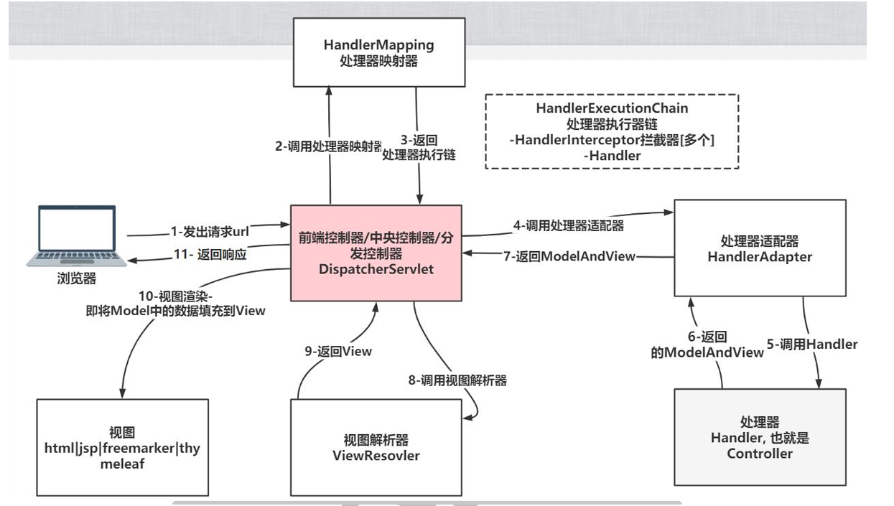

## (2)具体用法

### 1.RequestMapping注解

@RequestMapping注解可以指定控制器/处理器或某个方法的请求的url

UserHandler.java类：

```java
//@RequestMapping不仅可以修饰方法，也可以修饰类，当同时修饰类和方法时，请求的url就是组合/类请求值/方法请求值
@RequestMapping(value = "/user")
@Controller //UserHandler就是一个处理器/控制器,注入到容器
public class UserHandler { 

    //1.@RequestMapping注解可以修饰方法，还可以修饰类,另外还可以指定请求方式
    /**
     * 老韩解读
     * 1. buy()方法请求的url: http://ip:port/工程路径/user/buy
     * 2. method=RequestMethod.POST: 表示请求buy目标方法必须是 post，否则报错
     * 3. RequestMethod 四个常用选项 POST, GET, PUT, DELETE[后面我们会详解]
     * 4. SpringMVC 控制器默认支持GET和POST两种方式，即@RequestMapping(value = "/buy"),不指定method
     * 5. @PostMapping(value = "/buy")等价 @RequestMapping(value = "/buy",method = RequestMethod.POST)
     * 6.类似有@GetMapping,@PostMapping,@PutMapping,@DeleteMapping
     * @return
     */
 
    //@RequestMapping(value = "/buy",method = RequestMethod.POST)
    @PostMapping(value = "/buy")
    public String buy() {
        System.out.println("购买商品~");
        return "success";
    }

    //2.@RequestMapping可指定params和headers支持简单表达式
    /**
     *
     * 1.param1:表示请求必须包含名为param1的请求参数
     * 2.!=param1:表示请求不能包含名为param1的请求参数
     * 3.param1!=value1:表示请求包含名为param1的请求参数，但其值不能为value1
     * 4.{"param1=value1","param2"}:请求必须包含名为param1和param2的两个请求参数，
     *    且param1参数的值必须为value1
     *
     * 老韩解读
     * 1. params="bookId" 表示请求该目标方法时，必须给一个bookId参数, 值没有限定
     * 2. search(String bookId): 表示请求目标方法时, 携带的bookId=100, 就会将请求携带的 bookId对应的
     *     值 100, 赋给 String bookId
     * 3. params = "bookId=100" 表示必须给一个bookId参数, 而且值必须是100
     *
     * @return
     */

    @RequestMapping(value = "/find", params = "bookId=100", method = RequestMethod.GET)
    public String search(String bookId) {
        System.out.println("查询书籍 bookId= " + bookId);
        return "success";
    }


    //3.@RequestMapping支持Ant风格资源地址
    // /user/*/createUser:匹配/user/aaa/createUser、/user/bbb/createUser等URL
    // /user/**/createUser:匹配/user/createUser、/user/aaa/bbb/createUser等URL
    // /user/createUser??:匹配/user/createUseraa、/user/createUserbb等URL
    /**
     * 1.?：匹配文件名中的一个字符
     * 2.*：匹配文件名中的任意字符
     * 3.**:匹配多层路径
     * 4.Ant风格的url地址举例

     * 要求: 可以配置  /user/message/aa, /user/message/aa/bb/cc
     * 1. @RequestMapping(value = "/message/**") /** 可以匹配多层路径
     */

    @RequestMapping(value = "/message/**")
    public String im() {
        System.out.println("发送消息");
        return "success";
    }

    //4.@RequestMapping可配合@PathVariable映射URL绑定的占位符

    //要求： 我们希望目标方法获取到 username 和 userid, value="/xx/{username}" - @PathVariable("username")..
    //前端页面: <a href="user/reg/kristina/300">占位符的演示</a>
    //(value = "/reg/{username}/{userid}"): 表示kristina->{username}， 300=>{userid}
    @RequestMapping(value = "/reg/{username}/{userid}")
    public String register(@PathVariable("username") String name,
                           @PathVariable("userid") String id) {
        System.out.println("接收到参数--" + "username= " + name + "--" + "usreid= " + id);
        return "success";
    }

    //5.如果我们确定表单或者超链接会提交某个字段数据比如(email),要求提交的参数名和目标方法的参数名保持一致

    /**
     * hello3(String email)： 如果我们的请求参数有 email=xx, 就会将传递的值,赋给String email
     * ,要求名称保持一致, 如果不一致，那么接收不到数据, 而是null
     * @param email
     * @return
     */
    @GetMapping(value = "/hello3")
    public String hello3(String email) {
        System.out.println("hello3 " + email);
        return "success";
    }
}
```

### 2.REST风格

1.REST：即RepresentationalStateTransfer。(资源)表现层状态转化。是目前流行的请求方 式。它结构清晰,很多网站采用 

2.HTTP协议里面，四个表示操作方式的动词：GET、POST、PUT、DELETE。

  它们分别对应 四种基本操作：GET用来获取资源，POST用来新建资源，PUT用来更新资源，DELETE用来删除资源。

3.实例 传统的请求方法: getBook?id=1 GET delete?id=1 GET update POST add POST

4.说明：传统的url是通过参数来说明crud的类型（即只用post与get），rest是通过get/post/put/delete来说 明crud的类型

 ●==REST的核心过滤器== 

1.==当前的浏览器只支持post/get请求==，因此为了得到put/delete的请求方式需要使用Spring 提供的==HiddenHttpMethodFilter过滤器==进行转换.

2.HiddenHttpMethodFilter：浏览器form表单只支持GET与POST请求，而DELETE、PUT 等method并不支持，Spring添加了一个过滤器，可以将这些请求转换为标准的http方 法，使得支持GET、POST、PUT与DELETE请求 

3.HiddenHttpMethodFilter能==对post请求方式进行转换==为DELETE和PUT，因此我们需要特别的注意这一点 

4.这个过滤器需要在web.xml中配置


具体用法：

1.在web.xml添加HiddenHttpMethodFilter过滤器

```xml
 <!--配置HiddenHttpMethodFilter
    1. 作用是 把 以post方式提交的delete和put请求进行转换
    2. 配置url-pattern 是 /* 表示请求都经过 hiddenHttpMethodFilter过滤
    3. 后面通过debug源码，就看的很清楚
    -->
    <filter>
        <filter-name>hiddenHttpMethodFilter</filter-name>
        <filter-class>org.springframework.web.filter.HiddenHttpMethodFilter</filter-class>
    </filter>
    <filter-mapping>
        <filter-name>hiddenHttpMethodFilter</filter-name>
        <url-pattern>/*</url-pattern>
    </filter-mapping>
```

2.修改springDispatcherServlet-servlet.xml

```xml
  // 引入命名空间 xmlns:mvc="http://www.springframework.org/schema/mvc"
    <!--加入两个常规配置-->
    <!--支持SpringMVC的高级功能，比如JSR303校验, 映射动态请求-->
    <mvc:annotation-driven></mvc:annotation-driven>
    <!--将springmvc不能处理的请求，交给tomcat处理,比如css, js-->
    <mvc:default-servlet-handler/>
```

3.后端BookHandler.java

```java
@RequestMapping("/user")
@Controller
public class BookHandler {

    //查询[GET]
    @RequestMapping(value = "/book/{id}", method = RequestMethod.GET)
    public String getBook(@PathVariable("id") String id) {
        System.out.println("查询书籍 id=" + id);
        return "success";
    }

    //添加[POST]
    @PostMapping(value = "/book")
    public String addBook(String bookName) {
        System.out.println("添加书籍 bookName== " + bookName);//中文会出现乱码,后面会解决
        return "success";
    }

    //删除[DELETE]
    @RequestMapping(value = "/book/{id}", method = RequestMethod.DELETE)
    public String delBook(@PathVariable("id") String id) {
        System.out.println("删除书籍 id= " + id);
        //return "success"; //[如果这样返回会报错 JSPs only permit GET POST or HEAD],先不用管，是用jsp的问题
        //老师解读
        //1. redirect:/user/success重定向，这里的斜杠是在服务器端解析
        //2. 到浏览器会被解析成
        //HTTP/1.1 302 Found
        //Location:/springmvc/user/success
        return "redirect:/user/success";
    }

    //如果请求是 /user/success , 就转发到 success.jsp
    //successGenecal对应的url http://ip:port/springmvc/user/success
    @RequestMapping(value = "/success")
    public String successGenecal() {
        return "success";  //由该方法 转发到success.jsp页面
    }

    //修改[PUT]
    @PutMapping(value = "/book/{id}")
    public String updateBook(@PathVariable("id") String id) {
        System.out.println("修改书籍 id=" + id);
        return "redirect:/user/success";
    }
}
```

4.前端rest.jsp：先大概理解，主要就是请求时携带一个==name=“_method”的属性==，并赋值为“DELETE”或"PUT"

```jsp
<%--
  Created by IntelliJ IDEA.
  User: 韩顺平
  Version: 1.0
  Filename: rest
--%>
<%@ page contentType="text/html;charset=UTF-8" language="java" %>
<html>
<head>
    <title>rest </title>
<%--    引入jquery--%>
    <script type="text/javascript" src="script/jquery-3.6.0.min.js"></script>
    <script type="text/javascript">
        $(function () { //当页面加载完成后，就执行=> 如果你完全忘记，去回顾我们讲过的jquery
            //给删除超链接绑定一个点击事件
            $("#deleteBook").click(function (){
                //alert("点击。。。。");
                //我们自己定义给提交的行为
                $("#hiddenForm").attr("action", this.href);
                $(":hidden").val("DELETE");
                $("#hiddenForm").submit();
                return false; //改变点击超链接的行为, 不在提交
            })
        })
    </script>
</head>
<body>
<h3>Rest风格的crud操作案例</h3>
<br><hr>
    
<h3>rest风格的url 查询书籍[get]</h3>
<a href="user/book/200">点击查询书籍</a>
<br><hr>
    
<h3>rest风格的url 添加书籍[post]</h3>
<form action="user/book" method="post">
    name:<input name="bookName" type="text"><br>
    <input type="submit" value="添加书籍">
</form>
<br><hr>
    
<h3>rest风格的url, 删除一本书</h3>
<%--老韩解读
1. 默认情况下 <a href="user/book/600">删除指定id的书</a> 是get
2. 怎么样将 get 请求转成 springmvc 可以识别的 delete 就要考虑HiddenHttpMethodFilter机制
   public static final String DEFAULT_METHOD_PARAM = "_method";
   ---------------------------------------------------
   private static final List<String> ALLOWED_METHODS =
			Collections.unmodifiableList(Arrays.asList(HttpMethod.PUT.name(),
					HttpMethod.DELETE.name(), HttpMethod.PATCH.name()));
  ---------------------------------------------------
   if ("POST".equals(request.getMethod()) && request.getAttribute(WebUtils.ERROR_EXCEPTION_ATTRIBUTE) == null) {
			String paramValue = request.getParameter(this.methodParam);
			if (StringUtils.hasLength(paramValue)) {
				String method = paramValue.toUpperCase(Locale.ENGLISH);
				if (ALLOWED_METHODS.contains(method)) {
					requestToUse = new HttpMethodRequestWrapper(request, method);
				}
			}
		}
3. 上面代码可以看到 HiddenHttpMethodFilter 过滤器可以对以Post方式提交的delete,put,patch进行转换,成springmvc
   识别的 RequestMethod.DELETE / RequestMethod.PUT /...
4. 我们需要将 get <a href="user/book/600">删除指定id的书</a> 以post方式提交给后端handler, 这样过滤器还会生效
5. 我们可以同jquery来处理-引入jquery
--%>
//配合jquery使用
<a href="user/book/600" id="deleteBook">删除指定id的书</a>
<form action="" method="post" id="hiddenForm">
    <input type="hidden" name="_method"/>
</form>
<br><hr>
   
////其实上面调用jquery的做法与下面删除时直接用表单完成的操作效果一样
<h3>rest风格的url 修改书籍[put]~</h3>
<form action="user/book/666" method="post">
    <input type="hidden" name="_method" value="PUT">
    <input type="submit" value="修改书籍~">
</form>
</body>
</html>
```


==注意事项和细节说明== ：

1、HiddenHttpMethodFilter，在将post转成delete/put请求时，是按==_method==参数名来 读取的 

2、如果web项目是运行在Tomcat8及以上，会发现被过滤成DELETE和PUT请求，到达 控制器时能顺利执行，但是返回时（forward）会报HTTP405的错误提示：消息JSP只允许GET、POST或HEAD。

(1)解决方式1:使用Tomcat7 

(2)解决方式2:将请求转发（forward）改为请求重定向（redirect）:重定向到一个Handler， 由Handler转发到页面

3、页面测试时,如果出现点击修改书籍，仍然走的是删除url,是因为浏览器原因(缓存等原 因),换成chrome即可


### 3.SpringMVC映射请求数据与模型数据

SpringMVC映射请求数据：
1.获取参数值:@RequestParam

2.获取http请求消息头：@RequestHeader

3.获取javabean形式的数据

4.获取servlet api，需要在项目导入tomcat目录里的servlet-api.jar包

模型数据：
1.数据放入request中

（1）方式一：通过HttpServletRequest放入request中

（2）方式二：通过请求的方法参数Map<String,Object>放入request中

 (3)方式三：通过返回ModelAndView对象实现request域对象

注意：springmvc会==自动把获取的model模型，放入到request域中==（即不需要在上面三种方式中主动执行任何添加操作就可以在requeat域中得到master对象），名字就是master，==上面三种方式其实都是用来修改master的属性值==，不过可以用这三种方式添加其他没有传入的参数

2.数据放入session域

注意: 另外，master对象是默认放在request域，不会将数据模型自动放入session域中，==因此我们需要将master对象手动放入到session域==

3.当==Handler==的方法被标识==@ModelAttribute==,就视为一个前置方法

```java
@RequestMapping("/vote")
@Controller
public class VoteHandler {
  
    //SpringMVC映射请求数据：
    //1.获取参数值:@RequestParam
    /**
     * 老韩解读 @RequestParam(value="name", required=false)
     * 1. 获取到超链接传递的数据 请求 http://localhost:8080/springmvc/vote/vote01?name=xx
     * 2. @RequestParam 表示会接收提交的参数
     * 3. value="name" 表示提交的参数名是name
     * 4. required=false 表示该参数可以没有, 默认是true,表示必须有这个参数
     * 5. 当我们使用了@RequestParam(value="name", required=false)后就请求的参数名和方法的形参名可以不一致
     */
    @RequestMapping(value = "/vote01")
    public String test01(@RequestParam(value = "name", required = false) String username) {

        System.out.println("得到的username= " + username);
        //返回到一个结果
        return "success";
    }
    

    //2.获取http请求消息头：@RequestHeader
    /**
     * 需求: 获取http请求头信息, 获取到Accept-Encoding 和 Host
     * 1. 这里涉及到前面讲过的http协议,小伙伴可以进行回顾
     *
     * @RequestHeader("Http请求头字段")
     */
    @RequestMapping(value = "/vote02")
    public String test02(@RequestHeader("Accept-Encoding") String ae,
                         @RequestHeader("Host") String host) {
        System.out.println("Accept-Encoding= " + ae);
        System.out.println("Host= " + host);
        //返回到一个结果
        return "success";
    }

    //3.获取javabean形式的数据
    /**
     * 演示如果获取到提交数据->封装成java对象
     *
     * public class Master {
     *     private Integer id;
     *     private String name;
     *     private Pet pet;//对象的属性是另外一个对象[涉及级联]
     *     //setter和getter，toString方法...
     *     }
     * public class Pet {
     *     private Integer id;
     *     private String name;
     *     //setter和getter，toString方法...
     *     }
     *
     * @return 老师说明
     * 1. 方法的形参用对应的javabean类型来指定即可, SpringMVC会自动的进行封装
     * 2. 如果自动的完成封装, 要求提交的数据，参数名和对象的字段名保持一致
     * 3. 如果属性是对象，这里就是仍然是通过 字段名.字段名 比如Master [pet]
     * , 即提交的数据 参数名 是 pet.id pet.name， 这就是级联操作
     * 4. 如果提交的数据 的参数名和对象的字段名不匹配，则对象的属性值就是null
     * 5. 小伙伴疑惑，怎么就封装成功[底层仍然是反射+注解..]
     */
    //    <!--
    //     老韩解读
    //    1. 这是一个表单，表单的数据对应Master对象
    //    2. 提交的数据参数名和对象的字段名一致即可
    //       -->
    //<form action="vote/vote03" method="post">
    //     主人号:<input type="text" name="id"><br>
    //     主人名:<input type="text" name="name"><br>
    //     宠物号:<input type="text" name="pet.id"><br>
    //     宠物名:<input type="text" name="pet.name"><br>
    //    <input type="submit" value="添加主人和宠物">
    //</form>
    
    @RequestMapping(value = "/vote03")
    public String test03(Master master) {

        System.out.println("master=" + master);
        //返回结果
        return "success";
    }

    
    //4.获取servlet api，需要在项目导入tomcat目录里的servlet-api.jar包
    /**
     * 使用servlet api, 来获取提交的数据
     * @return
     */
    @RequestMapping(value = "/vote04")
    public String test04(HttpServletRequest request,
                         HttpServletResponse response,
                         HttpSession hs) {

        //获取到session，servlet原生的方式
        HttpSession session = request.getSession();
        System.out.println("session=" + session);
        //注意:通过参数传入的 hs 和 通request.getSession() 得到的对象是同一个
        System.out.println("hs= " + hs);

        String username = request.getParameter("username");
        String pwd = request.getParameter("pwd");
        System.out.println("username= " + username);
        System.out.println("pwd= " + pwd);
        //返回结果
        return "success";
    }
--------------------------------------------------------------------------------------------
--------------------------------------------------------------------------------------------
    //模型数据：
    //1.数据放入request中
    //（1）方式一：通过HttpServletRequest放入request中
    /**
     * 老韩解读
     * 1. 演示将提交的数据->springmvc封装到java对象->springmvc 会自动的将其放入到request域
     * 2. 这样我们就可以在跳转到的页面取出数据.
     * @return
     */
    
    @RequestMapping(value = "/vote05")
    public String test05(Master master, HttpServletRequest request) {

        //老韩解读
        //1. springmvc会自动把获取的model模型，放入到request域中，名字就是master
        //2. 也可以手动将master放入到request[一会在讲]
        request.setAttribute("address", "beijing");
        //System.out.println("master的值为"+request.getAttribute("master"));//master的值为null
        //request.setAttribute("master", "hahaha");
        //System.out.println("master的值为"+request.getAttribute("master")); //master的值为hahaha
        //为什么monster在vote_ok.jsp中的request域中不受影响？
    
        //第二次理解
        //其实三种方式原理一样，都是在最后把数据加入域中，只不过最后数据来源不同，三者分别是master本身，Map中的master值，ModelAndView中
        //的master值，所以在其他地方修改无效
    
    
    
         //第一次理解
        //通过上面的测试，可能是因为request域中的“master”是在最后才加入的，因为master本身没变，所以不受影响
        //这一点和后面的Map和ModelAndeView都不一样，
        //只能Map和ModelAndeView方法是在master自动放入request域之后才再一次把属性添加到request中
        //而该方法是在master自动放入request域之前把属性添加到request中，然后master又会再次自动放入request域
    
        //3. 如果我们希望修改master的属性值
        master.setName("nono");
        //4. 分析一下springmvc默认存放对象到request域中,属性名是
        //   request域 ("master", master) 属性名是类名/类型名 首字母小写
        //返回到一个结果
        return "vote_ok";
    }
    
     @RequestMapping(value = "/vote55")
    public String test55(Master master) {  //HttpServletRequest参数完全可以不带，springmvc会自动把master加入request域中
        
        master.setName("nono");
        return "vote_ok";
    }


    //（2）方式二：通过请求的方法参数Map<String,Object>放入request中
    /**
     * 演示通过Map<String,Object> 设置数据到request域
     *
     * @return
     */
    @RequestMapping(value = "/vote06")
    public String test06(Master master, Map<String, Object> map) {
        System.out.println("------test06-----");
        //老韩解读
        //1. 需求是通过map对象，添加属性到request中
        //2. 原理分析：springmvc会遍历map，然后将map的k-v, 存放到request域
        //System.out.println("address的值："+request.getAttribute("address"));//address的值：null
        map.put("address", "beijing...");
        System.out.println(map.get("master"));//Master{id=4, name='5', pet=Pet{id=6, name='7'}}
        master.setName("yesyes"); //这里可以理解为地址引用，map中的数据也会变，同样request域中的数据也会随着修改
        System.out.println(map.get("master"));///Master{id=4, name='yesyes', pet=Pet{id=6, name='7'}}
        
        
        //System.out.println("address的值："+request.getAttribute("address"));//address的值：null
        //这个测试应该可以说明为什么方式一中在request域中修改master不起作用，只能说明Map和ModelAndeView方法的属性值不是立刻放入				//request域中，而是在master自动放入request域之后才再一次把属性添加到request中

        //3.如果我们希望修改master的属性值
        //map.put("master", null);   //monster在request域中为空
        //返回到一个结果
        return "vote_ok";
    }


    //(3)方式三：通过返回ModelAndView对象实现request域对象
    /**
     * 演示通过返回ModelAndView对象，将数据放入到request域
     * @return
     */
    @RequestMapping(value = "/vote07")
    public ModelAndView test07(Master master) {

        System.out.println("----test07----");
        ModelAndView modelAndView = new ModelAndView();
        //放入属性到modelAndView对象,也是键值对
        modelAndView.addObject("address", "shanghai");
        //这里 modelAndView没有getObject方法，不过猜测master应该也已经自动加入进去了
        
        //1.如果我们希望修改master的属性值
        //master.setName("nono");  //这样也能修改request域中的数据，同Map一样
        //modelAndView.addObject("master", null);   //monster在request域中为空
        
        //可以把从数据库得到的数据->对象-》放入modelAndView[Service-dao-db]
        //这里指定跳转的视图名称
        modelAndView.setViewName("vote_ok");
        //返回结果
        return modelAndView;
    }

    //2.数据放入session域
    /**
     * 演示如何将数据设置到session域中
     * @return
     */
    @RequestMapping(value = "/vote08")
    public String test08(Master master, HttpSession httpSession) {
        System.out.println("----test08----");
        //master对象是默认放在request域
        //我们将master对象放入到session域
        httpSession.setAttribute("master", master);
        //这里和在request中添加对象不一样，如果不手动添加，session域中不会有master对象数据
        
        httpSession.setAttribute("address", "guangzhou");

        return "vote_ok";//请求转发
    }
    //3. @ModelAttribute,就视为一个前置方法
    /**
     * 老师解读
     * 1. 当Handler的方法被标识 @ModelAttribute,就视为一个前置方法
     * 2. 当调用该Handler的其它的方法时，都会先执行该前置方法
     * 3. 类似我们前面讲解Spring时，AOP的前置通知[底层是AOP机制]
     * 4. prepareModel前置方法，会切入到其它方法前执行..
     */
    @ModelAttribute
    public void prepareModel(){
        System.out.println("prepareModel()-----完成准备工作-----");
    }
}
```

vote_ok.jsp文件:

```jsp
<%@ page contentType="text/html;charset=UTF-8" language="java" %>
<html>
<head>
    <title>vote_ok </title>
</head>
<body>
<h1>获取的的数据显示页面</h1>
<hr>
取出 request域的数据-通过前面讲解的el表达式来获取即可
<br>
address: ${requestScope.address}<br>
主人名字= ${requestScope.master.name}
主人id= ${requestScope.master.id}
宠物名字= ${requestScope.master.pet.name}

<hr>
取出 session域的数据 <br>
address: ${sessionScope.address}<br>
主人名字= ${sessionScope.master.name}
主人信息= ${sessionScope.master}
</body>
</html>
```

### 4.自定义视图解析器

#### （1）自定义视图实例：

1.自定义视图:创建一个 View 的 bean,该 bean 需要继承自 ==AbstractView==,并实现==renderMergedoutputModel==方法.

2.并把自定义 View 加入到 IOC 容器中

3.自定义视图的视图处理器，使用 ==BeanNameViewResolver, 这个视图处理器也需要配置到ioc容器==

4.BeanNameViewResolver的调用优先级需要设置一下，设置 order 比Integer.MAX VALUE 小的值,以确保其在 InternalResourceViewResolver 之前被调用


WEB-INF/springDispatcherServlet-servlet.xml文件中添加

```xml
 <!--
        老师解读
        1. 配置自定义视图解析器BeanNameViewResolver
        2. BeanNameViewResolver可以去解析我们自定义的视图
        3. 配置 属性 order, 表示视图解析器执行的顺序, 值越小, 优先级越高
        4. 属性 order 的默认值是最低优先级 ，值为 Integer.MAX_VALUE
           int LOWEST_PRECEDENCE = 2147483647
    -->
    <bean class="org.springframework.web.servlet.view.BeanNameViewResolver">
        <property name="order" value="99"/>
    </bean>
```

GoodsHandler.java

//顺便演示直接指定要==请求转发==的或者是==重定向==的页面，这里要走默认视图解析器

//

//请求转发底层最后走的是org.springframework.web.servlet.view.InternalResourceView的renderMergedOutputModel方法（和默认视图解析器一样）

//重定向底层最后走的是org.springframework.web.servlet.view.RedirectView的renderMergedOutputModel方法

//自定义视图==最后==走的是com.hspedu.web.viewresolver.MyView的renderMergedOutputModel方法

```java

@RequestMapping("/goods")
@Controller
public class GoodsHandler {

    @RequestMapping(value = "/buy")
    public String buy() {
        System.out.println("------buy()-----");
        return "hspView";//待会再填写自定义视图名
    }

    /**
     * 演示直接指定要请求转发的或者是重定向的页面
     * @return
     */
    @RequestMapping(value = "/order")
    public String order() {
        System.out.println("=======order()=====");
        //请求转发到 /WEB-INF/pages/my_view.jsp
        //下面的 /WEB-INF/pages/my_view.jsp 被解析成 /springmvc/WEB-INF/pages/my_view.jsp
        //return "forward:/WEB-INF/pages/my_view.jsp";
        //return "forward:/aaa/bbb/ok.jsp";

        //直接指定要重定向的页面
        //1. 对于重定向来说，不能重定向到 /WEB-INF/ 目录下
        //2. redirect 关键字，表示进行重定向
        //3. /login.jsp 在服务器解析 /springmvc/login.jsp
        return "redirect:/login.jsp";

        // /WEB-INF/pages/my_view.jsp 被解析 /springmvc/WEB-INF/pages/my_view.jsp
        //return "redirect:/WEB-INF/pages/my_view.jsp";
    }
}
```

MyView.java

```java
//import org.springframework.web.servlet.view.AbstractView;

/**
 * 老师解读
 * 1. MyView继承了AbstractView, 就可以作为一个视图使用
 * 2. @Component(value = "myView"),该视图会注入到容器中, 名字/id是 myView
 */
@Component(value = "hspView")
public class MyView extends AbstractView {
    @Override
    protected void renderMergedOutputModel(Map<String, Object> model,
                                           HttpServletRequest request,
                                           HttpServletResponse response) throws Exception {

        //完成视图渲染
        //并且可以确定我们要跳转的页面 [请求转发] /WEB-INF/pages/my_view.jsp
        System.out.println("进入到自己的视图..");
        //老师解读
        //1. 下面就是进行请求转发到 /WEB-INF/pages/my_view.jsp
        //2. /WEB-INF/pages/my_view.jsp 会被springmvc解析
        //   /springmvc/WEB-INF/pages/my_view.jsp
        request.getRequestDispatcher("/WEB-INF/pages/my_view.jsp")
                .forward(request, response);
    }
}
```

#### （2）自定义视图解析器执行流程

1.SpringMVC 调用目标handler方法,返回自定义 View 在 IOC 容器中的 id

2.SpringMVC 调用 BeanNameViewResolver 解析视图:从 IOC 容器中获取 返回id 值对应的bean，即自定义的 View 的对象

3.SpringMVC 调用自定义视图的 renderMergedOutputModel 方法渲染视图

4.老韩说明: 如果在 SpringMVC 调用目标方法,返回自定义 View 在 IOC 容器中的 id,不存在则仍然按照默认的视图处理器机制处理.

#### （3）多个视图解析器执行流程

1.如果先执行默认视图解析器，那得到的view一定不为空，无论有没有找到视图后面的解析器都不再执行

2.如果先执行自定义视图解析器，如果找不到视图返回的view就为空，继续执行下一个视图解析器

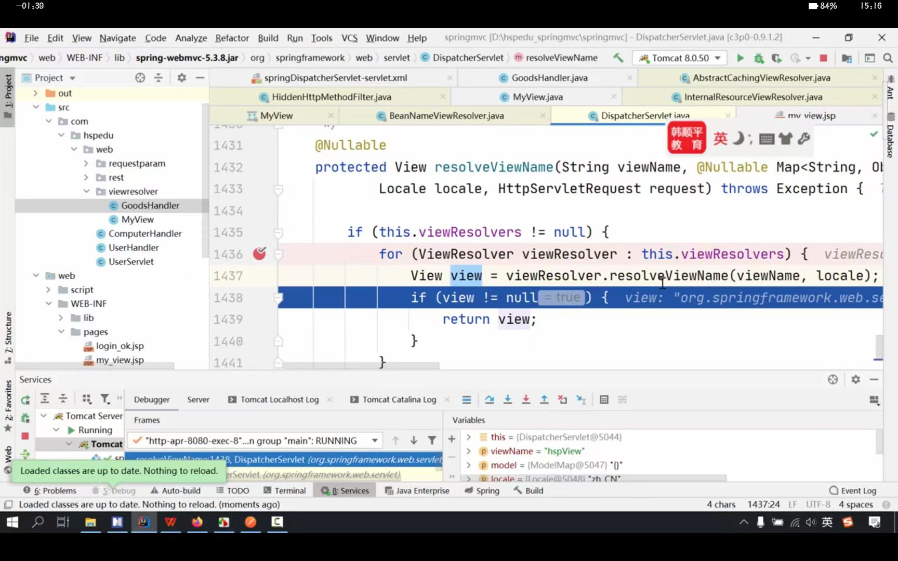

```java
//DispatcherServlet原代码
@Nullable
    protected View resolveViewName(String viewName, @Nullable Map<String, Object> model, Locale locale, HttpServletRequest request) throws Exception {
        if (this.viewResolvers != null) {
            Iterator var5 = this.viewResolvers.iterator();

            while(var5.hasNext()) {
                ViewResolver viewResolver = (ViewResolver)var5.next();
                View view = viewResolver.resolveViewName(viewName, locale);
                if (view != null) {
                    return view;
                }
            }
        }
        return null;
    }
```

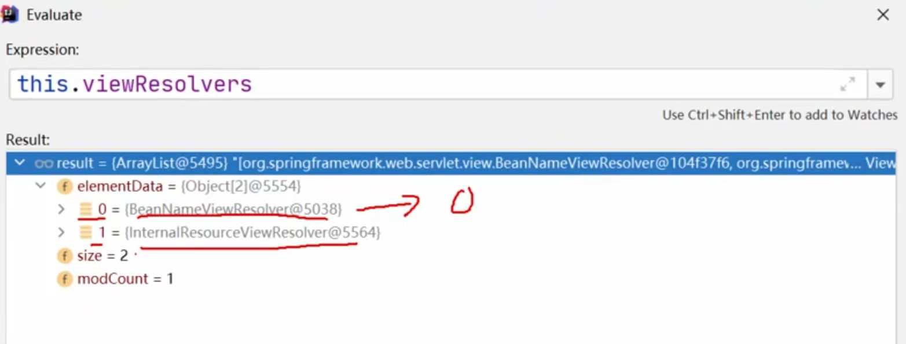

==下一步跳转后==默认视图解析器走的是org.springframework.web.servlet.view.AbstractCachingViewResolver（InternalResourceViewResolver继承了该类）的resolveViewName方法，然后通过拼接拿到视图

自定义视图解析器走的==resolveViewName==方法来查找ioc中的bean视图对象：

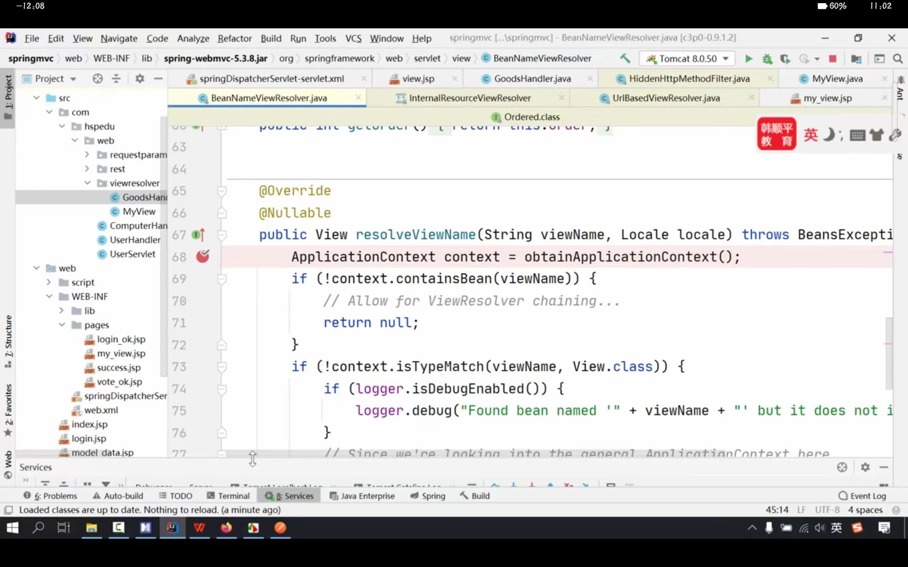

```java
 @Nullable
    public View resolveViewName(String viewName, Locale locale) throws BeansException {
        ApplicationContext context = this.obtainApplicationContext();
        if (!context.containsBean(viewName)) {
            return null;
        } else if (!context.isTypeMatch(viewName, View.class)) {   // MyView extends AbstractView 
            if (this.logger.isDebugEnabled()) {
                this.logger.debug("Found bean named '" + viewName + "' but it does not implement View");
            }

            return null;
        } else {
            return (View)context.getBean(viewName, View.class);//com.hspedu.web.viewresolver.MyView
        }
    }
```


### 5.数据处理

#### Ⅰ.数据格式化（类型转换）

在我们提交数据（比如表单时）SpringMVC会对提交的数据自动进行转换和处理，

1.==基本数据类型可以和字符串之间完成自动转换==，SpringMVC中内建了很多转换器（实现ConversionService接口,org.springframework.core.convert包下）,可完成大多数java类型的转换工作

2.==特殊数据类型和字符串之间的转换使用注解==，如对于日期和货币可以使用@DateTimeFormat和@NumberFormat注解，把这两个注解标记在字段上即可

#### Ⅱ.数据验证

1.需要引入验证和国际化相关的jar包

2.对输入的数据(比如表单数据)，进行必要的验证，并给出相应的提示信息，springMVC提供了很多实用的注解, 这些注解由JSR303 验证框架提供.

3.自定义验证错误信息

在springDispatcherServlet-servlet.xml添加

```xml
  <!-- 配置国际化错误信息的资源处理bean -->
    <bean id="messageSource" class=
            "org.springframework.context.support.ResourceBundleMessageSource">
        <!-- 配置国际化文件名字
            如果你这样配的话，表示messageSource会到 src/i18nXXX.properties去读取错误信息
         -->
        <property name="basename" value="i18n"></property>
    </bean>
```

i18n.properties

```java
//中文使用unicode编码
//格式: 验证规则.表单modelAttribute值.属性名=消息信息
NotEmpty.monster.name=\u7528\u6237\u540d\u4e0d\u80fd\u4e3a\u7a7a    //用户名不能为空
typeMismatch.monster.age=\u5e74\u9f84\u8981\u6c42\u5728\u0031\u002d\u0031\u0035\u0030\u4e4b\u95f4  //年龄在1-100之间
typeMismatch.monster.birthday=\u751f\u65e5\u683c\u5f0f\u4e0d\u6b63\u786e
typeMismatch.monster.salary=\u85aa\u6c34\u683c\u5f0f\u4e0d\u6b63\u786e
Range.monster.age=\u8fd9\u662f\u65b0\u7684\u9a8c\u8bc1\u9519\u8bef\u4fe1\u606f-\u5e74\u9f84\u57281-100\u4e4b\u95f4
    //这是新的验证错误信息-年龄在1-100之间
```

4.细节说明和注意事项 

(1)在需要验证的 Javabean的字段上加上相应的验证注解. 

(2)目标方法上,在 JavaBean类型的参数前, 添加 @Valid 注解. 告知 SpringMVC 该 bean 是需要验证的 

(3)在 @Valid 注解之后, 添加一个 Errors 或 BindingResult 类型的参数, 可以获取到验证的错误信息 

(4)需要使用 \<form:errors path="email"\>\</form:errors\> 标签来显示错误消息, 这个标签， 需要写在\<form:form\> 标签内生效.

(5)SpingMVC 验证时，会根据不同的验证错误, 返回对应的信息

(6)注解@NotNull 和 @NotEmpty 的区别说明                  

1)查看源码可以知道 : @NotEmpty Asserts that the annotated string, collection, map or array is not {@code null} or empty. 

2)查看源码可以知道 : @NotNull The annotated element must not be {@code null}. Accepts any type.==接受所有类型==

3）==如果是字符串验证空, 建议使用 @NotEmpty==

5.程序员在开发中，希望取消某个属性的绑定，也就是说，不希望接收到某个表单对应的属 性的值，则可以通过 @InitBinder 注解取消绑定. 

(1)编写一个方法, 使用@InitBinder 标识的该方法，可以对 WebDataBinder 对象进行初始 化。WebDataBinder 是 DataBinder 的子类，用于完成由表单字段到 JavaBean 属性的绑 定 

(2) @InitBinder 方法不能有返回值，它必须声明为void。

(3) @InitBinder 方法的参数通常是是 WebDataBinder


Monster.java

```java
public class Monster {
    private Integer id;

    //email是string,使用@NotEmpty
    @NotEmpty
    private String email;

    //@Range(min = 1,max = 100)
    //表示接收的age值，在 1-100之间

    @NotNull(message = "age不能为空")
    //@NotEmpty(message = "age不能为空") ,Integer类型就不能使用@NotEmpty注解，会报错
    @Range(min = 1,max = 100)
    private Integer age;
    
    //@NotEmpty 表示name不能为空
    //Asserts that the annotated string, collection, map or array is not {@code null} or empty.
    @NotEmpty
    private String name;

    @NotNull(message = "生日不能为空")         //非空提示
    @DateTimeFormat(pattern = "yyyy-MM-dd")  //指定格式，java基础中有说明。如果不按格式，则给出400界面
    private Date birthday;

    @NotNull(message = "薪水不能为空")
    @NumberFormat(pattern = "###,###.##")   
    private Float salary;

    public Monster(Integer id, String email, Integer age, String name, Date birthday, Float salary) {
        this.id = id;
        this.email = email;
        this.age = age;
        this.name = name;
        this.birthday = birthday;
        this.salary = salary;
    }

    public Monster() {
    }
    
    //getter方法和setter方法。。。

    @Override
    public String toString() {
        return "Monster{" +
                "id=" + id +
                ", email='" + email + '\'' +
                ", age=" + age +
                ", name='" + name + '\'' +
                ", birthday=" + birthday +
                ", salary=" + salary +
                '}';
    }
}
```


WEB-INf/pages/datavalid/monster_addUI.jsp

```jsp
<%@ taglib prefix="form" uri="http://www.springframework.org/tags/form" %>

<%@ page contentType="text/html;charset=UTF-8" language="java" %>
<html>
<head>
    <title>添加妖怪</title>
</head>
<body>
<h3>添加妖怪</h3>
<!-- 这里的表单，我们使用springMVC的标签来完成
特别说明几点:
1. SpringMVC 表单标签在显示之前必须在 request 中有一个 bean, 该 bean 的属性和表单标签的字段要对应!
request 中的 key值 为: form 标签的 modelAttribute 属性值， 比如这里的monster
2. SpringMVC 的 form:form 标签的 action 属性值中的 / 不代表 WEB 应用的根目录.所以不要用action="/save"，
<%--   也不要用action="<%request.getContextPath()%>/save"--%>,直接使用相对位置就i行了
注意上一步本质是用请求转发跳转到该界面，所以此时浏览器地址栏应该是:localhost:8080/springmvc/addMonsterUI

3. 这里老韩使用springmvc的标签的主要的目的是方便提示信息回显
4. modelAttribute标签如果取消也会报错，必须带上且在request 中有匹配的bean
-->
<form:form action="save" method="post" modelAttribute="monster">
    妖怪名字: <form:input path="name"/> <form:errors path="name"/>  <br><br>
    妖怪年龄~: <form:input path="age"/> <form:errors path="age"/> <br><br>
    电子邮件: <form:input path="email"/> <form:errors path="email"/>  <br><br>
    妖怪生日: <form:input path="birthday"/> <form:errors path="birthday"/> 要求以"9999-11-11"的形式<br><br>
    妖怪薪水: <form:input path="salary"/> <form:errors path="salary"/> 要求以"123,890.12"的形式<br><br>
    <input type="submit" value="添加妖怪"/>
</form:form>
</body>
</html>
```

MonsterHandler.java

```java
/**
 * @author 韩顺平
 * @version 1.0
 * MonsterHandler 处理器响应用户提交数据
 * @Scope(value = "prototype") 表示每次请求MonsterHandler会生成一个新的对象
 */
@Controller
@Scope(value = "prototype")
public class MonsterHandler {


    /**
     * 显示添加monster的界面
     * 1. 这里Map<String, Object> map
     * 2. 当我们向map添加的数据时，会默认存放到request域
     *
     * @param map
     * @return
     */
    @RequestMapping(value = "/addMonsterUI")
    public String addMonsterUI(Map<String, Object> map) {
        /**老韩解读:
         1. <form:form action="?" method="POST" modelAttribute="monster">
         //这里需要给request增加一个 monster，因为jsp 页面 的modelAttribute="monster"需要
         //这时是springMVC的内部的检测机制  即使是一个空的也需要，否则报错.
         */
        //老韩再次说明，如果你跳转的页面使用springmvc标签
        //就需要准备一个对象，放入request域中，这个对象的属性名 monster, 对应springmvc表单标签的 modelAttribute="monster"
       
        map.put("monster", new Monster());
        return "datavalid/monster_addUI";  //注意底层是请求转发
    }


    /**
     * 编写方法,处理添加妖怪
     * 1. springmvc可以将提交的数据，按照参数名和对象的属性名匹配
     * 2. 直接封装到对象中->老师前面讲解模型数据时，讲过
     * String => Integer
     * 3. @Valid Monster monster :表示对monster接收的数据进行校验
     * 4. Errors errors 表示如果校验出现错误，将校验的错误信息保存 errors
     * 5. Map<String, Object> map  表示如果校验出现错误, 将校验的错误信息保存 map 同时保存monster对象
     * 6. 校验发生的时机： 在springmvc底层，反射调用目标方法时，会接收到http请求的数据，然后根据注解来进行验证
     * , 在验证过程中，如果出现了错误，就把错误信息填充errors 和 map
     *
     * @param monster
     * @return
     */
    @RequestMapping(value = "/save")
    public String save(@Valid Monster monster, Errors errors, Map<String, Object> map) {
        System.out.println("----monster---" + monster);
        //我们为了看到验证的情况,我们输出map 和 errors
        System.out.println("===== map ======");
        for (Map.Entry<String, Object> entry : map.entrySet()) {
            System.out.println("key= " + entry.getKey() + " value=" + entry.getValue());
        }

        System.out.println("===== errors ======");
        if (errors.hasErrors()) {//判断是否有错误
            List<ObjectError> allErrors = errors.getAllErrors();
            for (ObjectError error : allErrors) {
                System.out.println("error=" + error);
            }
            return "datavalid/monster_addUI";
        }
        return "datavalid/success";
    }

    //取消绑定 monster的name表单提交的值给monster.name属性
    @InitBinder
    public void initBinder(WebDataBinder webDataBinder) {
        /**
         * 老师解读
         * 1. 方法上需要标注 @InitBinder  springmvc底层会初始化 WebDataBinder
         * 2. 调用 webDataBinder.setDisallowedFields("name") 表示取消指定属性的绑定
         *    即：当表单提交字段为 name时， 就不在把接收到的name值，填充到model数据monster的name属性
         * 3. 机制：springmvc 在底层通过反射调用目标方法时, 接收到http请求的参数和值,使用反射+注解技术
         *    取消对指定属性的填充
         * 4. setDisallowedFields支持可变参数，可以填写多个字段
         * 5. 如果我们取消某个属性绑定,验证就没有意义了,应当把验证的注解去掉, name属性会使用默认值null
         *  //@NotEmpty
         *  private String name;
         *
         */
        webDataBinder.setDisallowedFields("name");
    }
}
```


data_valid.jsp

```jsp
<%@ page contentType="text/html;charset=UTF-8" language="java" %>
<html>
<head>
    <title>SpringMVC[数据格式/验证等]</title>
</head>
<body>
<h1>SpringMVC[数据格式/验证等]</h1>
<hr>
<a href="<%=request.getContextPath()%>/addMonsterUI">添加妖怪</a>
</body>
</body>
</html>
```


错误信息输出展示

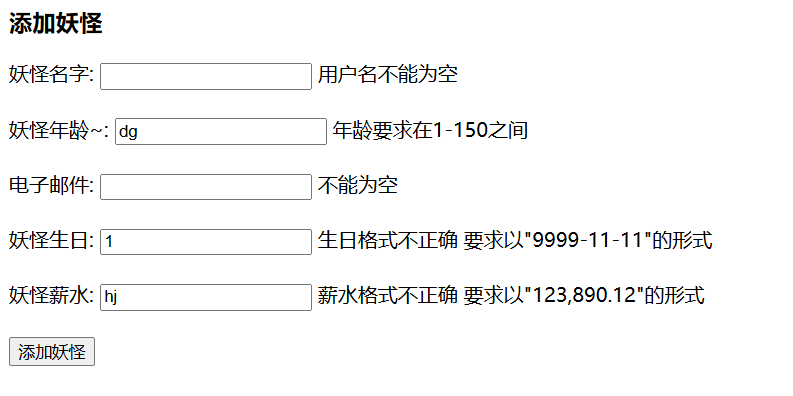

```text
/*
typeMismatch.monster.age
typeMismatch.monster.birthday
typeMismatch.monster.salary
NotEmpty.monster.name  默认是[不能为空]，但是在i18n.properties中自定义为[用户名不能为空]，所以最后输出自定义错误信息
NotEmpty.monster.email   默认是[不能为空]
*/

----monster---Monster{id=null, email='', age=null, name='', birthday=null, salary=null}
===== map ======
key= monster value=Monster{id=null, email='', age=null, name='', birthday=null, salary=null}
key= org.springframework.validation.BindingResult.monster value=org.springframework.validation.BeanPropertyBindingResult: 5 errors
Field error in object 'monster' on field 'age': rejected value [dg]; codes [typeMismatch.monster.age,typeMismatch.age,typeMismatch.java.lang.Integer,typeMismatch]; arguments [org.springframework.context.support.DefaultMessageSourceResolvable: codes [monster.age,age]; arguments []; default message [age]]; default message 
[Failed to convert property value of type 'java.lang.String' to required type 'java.lang.Integer' for property 'age'; nested exception is java.lang.NumberFormatException: For input string: "dg"]

Field error in object 'monster' on field 'birthday': rejected value [1]; codes [typeMismatch.monster.birthday,typeMismatch.birthday,typeMismatch.java.util.Date,typeMismatch]; arguments [org.springframework.context.support.DefaultMessageSourceResolvable: codes [monster.birthday,birthday]; arguments []; default message [birthday]]; default message [Failed to convert property value of type 'java.lang.String' to required type 'java.util.Date' for property 'birthday'; nested exception is org.springframework.core.convert.ConversionFailedException: Failed to convert from type [java.lang.String] to type [@javax.validation.constraints.NotNull @org.springframework.format.annotation.DateTimeFormat java.util.Date] for value '1'; nested exception is java.lang.IllegalArgumentException: Parse attempt failed for value [1]]

Field error in object 'monster' on field 'salary': rejected value [hj]; codes [typeMismatch.monster.salary,typeMismatch.salary,typeMismatch.java.lang.Float,typeMismatch]; arguments [org.springframework.context.support.DefaultMessageSourceResolvable: codes [monster.salary,salary]; arguments []; default message [salary]]; default message [Failed to convert property value of type 'java.lang.String' to required type 'java.lang.Float' for property 'salary'; nested exception is java.lang.NumberFormatException: For input string: "hj"]

Field error in object 'monster' on field 'name': rejected value []; codes [NotEmpty.monster.name,NotEmpty.name,NotEmpty.java.lang.String,NotEmpty]; arguments [org.springframework.context.support.DefaultMessageSourceResolvable: codes [monster.name,name]; arguments []; default message [name]]; default message [不能为空]
Field error in object 'monster' on field 'email': rejected value []; codes [NotEmpty.monster.email,NotEmpty.email,NotEmpty.java.lang.String,NotEmpty]; arguments [org.springframework.context.support.DefaultMessageSourceResolvable: codes [monster.email,email]; arguments []; default message [email]]; default message [不能为空]
===== errors ======
error=Field error in object 'monster' on field 'age': rejected value [dg]; codes [typeMismatch.monster.age,typeMismatch.age,typeMismatch.java.lang.Integer,typeMismatch]; arguments [org.springframework.context.support.DefaultMessageSourceResolvable: codes [monster.age,age]; arguments []; default message [age]]; default message [Failed to convert property value of type 'java.lang.String' to required type 'java.lang.Integer' for property 'age'; nested exception is java.lang.NumberFormatException: For input string: "dg"]

error=Field error in object 'monster' on field 'birthday': rejected value [1]; codes [typeMismatch.monster.birthday,typeMismatch.birthday,typeMismatch.java.util.Date,typeMismatch]; arguments [org.springframework.context.support.DefaultMessageSourceResolvable: codes [monster.birthday,birthday]; arguments []; default message [birthday]]; default message [Failed to convert property value of type 'java.lang.String' to required type 'java.util.Date' for property 'birthday'; nested exception is org.springframework.core.convert.ConversionFailedException: Failed to convert from type [java.lang.String] to type [@javax.validation.constraints.NotNull @org.springframework.format.annotation.DateTimeFormat java.util.Date] for value '1'; nested exception is java.lang.IllegalArgumentException: Parse attempt failed for value [1]]

error=Field error in object 'monster' on field 'salary': rejected value [hj]; codes [typeMismatch.monster.salary,typeMismatch.salary,typeMismatch.java.lang.Float,typeMismatch]; arguments [org.springframework.context.support.DefaultMessageSourceResolvable: codes [monster.salary,salary]; arguments []; default message [salary]]; default message [Failed to convert property value of type 'java.lang.String' to required type 'java.lang.Float' for property 'salary'; nested exception is java.lang.NumberFormatException: For input string: "hj"]

error=Field error in object 'monster' on field 'name': rejected value []; codes [NotEmpty.monster.name,NotEmpty.name,NotEmpty.java.lang.String,NotEmpty]; arguments [org.springframework.context.support.DefaultMessageSourceResolvable: codes [monster.name,name]; arguments []; default message [name]]; default message [不能为空]

error=Field error in object 'monster' on field 'email': rejected value []; codes [NotEmpty.monster.email,NotEmpty.email,NotEmpty.java.lang.String,NotEmpty]; arguments [org.springframework.context.support.DefaultMessageSourceResolvable: codes [monster.email,email]; arguments []; default message [email]]; default message [不能为空]

```

#### Ⅲ.其他处理

##### 1.中文乱码

（1）自定义过滤器

```java
public class MyCharacterFilter implements Filter {
    @Override
    public void init(FilterConfig filterConfig) throws ServletException {

    }
    @Override
    public void doFilter(ServletRequest servletRequest,
                         ServletResponse servletResponse,
                         FilterChain filterChain) throws IOException, ServletException {
        //这里加入对编码的处理
        servletRequest.setCharacterEncoding("utf-8");
        //放行请求，这个规则和前面老韩讲过的java web的过滤器一样
        filterChain.doFilter(servletRequest, servletResponse);
    }
    @Override
    public void destroy() {
    }
}
```

```xml
  <!--配置处理中文乱码的过滤器
    拦截所有请求，处理编码, 提醒，把过滤器配置到web.xml前面
    -->
    <filter>
        <filter-name>MyCharacterFilter</filter-name>
        <filter-class>com.hspedu.web.filter.MyCharacterFilter</filter-class>
    </filter>
    <filter-mapping>
        <filter-name>MyCharacterFilter</filter-name>
        <url-pattern>/*</url-pattern>
    </filter-mapping>
```

(2)springMvc自带过滤器

```xml
<!--配置Spring提供的过滤器，解决中文乱码问题-->

    <filter>
        <filter-name>CharacterEncodingFilter</filter-name>
        <filter-class>org.springframework.web.filter.CharacterEncodingFilter</filter-class>
        <init-param>
            <param-name>encoding</param-name>
            <param-value>utf-8</param-value>
        </init-param>
    </filter>
    <filter-mapping>
        <filter-name>CharacterEncodingFilter</filter-name>
        <url-pattern>/*</url-pattern>
    </filter-mapping>
```

##### 2.json数据处理


需要引入处理json需要的jar包，注意spring5.x 需要使用jackson-2.9.x.jar 的包

(1)==@ResponseBody==，表返回的数据是json格式

(2)用客户端发送json字符串数据，使用SpringMVC的 ==@RequestBody== 将客户端提交的json数据封装成JavaBean对象（如果前端是以表单形式添加的则不需要） ，再把这个javabean以json对象形式返回

(3) @ResponseBody 可以直接写在controller上，这

样对所有方法生效

(4) @ResponseBody + @Controller 可以直接写成 @RestController , 我们看一下源码!

```java
@Target({ElementType.TYPE})
@Retention(RetentionPolicy.RUNTIME)
@Documented
@Controller
@ResponseBody
public @interface RestController {
    @AliasFor(
        annotation = Controller.class
    )
    String value() default "";
}
```

(5)SpringMVC 处理 JSON-底层实现是依靠HttpMessageConverter来进行转换的,下图分别对应@RequestBody和@ResponseBody路径

​	当控制器处理方法使用到@RequestBody/@ResponseBody(对目标方法进行标注) 或HttpEntity\<T>/ResponseEntity\<T>(作为目标方法的入参或返回值)时, Spring 首先根据请求头或响应头的 Accept 属性选择 匹配的 HttpMessageConverter, 进而根据参数类型或泛型类型的过滤得到匹配的 HttpMessageConverter, 若找不到可用的 HttpMessageConverter 将报错

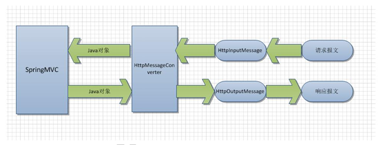

(6)文件下载：在SpringMVC 中，通过返回ResponseEntity\<T>的类型，可以实现文件下载的功能

提示：当在web目录下添加在资源文件时，要检查下资源文件是否在out目录下存在，有时重新部署不生效就需要重新启动一下tomcat

(7)文件上传：需要引入所需的jar包，

添加新的bean配置

```java
 <!--配置文件上传需要的bean-->
    <bean class="org.springframework.web.multipart.commons.CommonsMultipartResolver"
          id="multipartResolver"/>
    <!--由于CommonsMultipartResolver类实现了MultipartResolver接口,id需要用接口名，不然会报错。
        引入该bean的目的应该是为了这一步：MultipartFile file,
        --> 
```


Dog.java  //User类结合相似 private String userName; private Integer age;

```java
public class Dog {   
    private String name;
    private String address;

    public Dog(String name, String address) {
        this.name = name;
        this.address = address;
    }

    //注意要加一个无参构造器
    public Dog() {
    }
    

   setter,getter,tostring()方法...
}
```

JsonHandler.java

```java
@Controller
//@ResponseBody
//@RestController
public class JsonHandler {

    /**
     * 老师解读
     * 1. 目标方法 @ResponseBody，表返回的数据是json格式
     * 2. springmvc底层根据目标方法@ResponseBody, 返回指定格式, 根据的http请求来进行处理
     * 3. 底层原理我们在前面自定义@ResponseBody讲过, 这里原生的springmvc使用转换器
     * 4. HttpMessageConverter [一会老师debug]
     *
     * @return
     */
    @RequestMapping(value = "/json/dog")
    @ResponseBody
    public Dog getJson() {

        //返回对象
        //springmvc会根据你的设置，转成json格式数据返回
        Dog dog = new Dog();
        dog.setName("大黄狗");
        dog.setAddress("小新的家");
        return dog;

    }

    //编写方法，以json格式返回多个Dog
    @RequestMapping(value = "/json/dogs")
    @ResponseBody
    public List<Dog> getJsons() {

        List<Dog> dogs = new ArrayList<>();
        dogs.add(new Dog("大黄狗", "小新的家"));
        dogs.add(new Dog("大黄狗2", "小新2的家"));
        dogs.add(new Dog("大黄狗3", "小新3的家"));

        return dogs;

    }

    /**
     * 老师解读
     * 1. @RequestBody User user 在形参指定了 @RequestBody
     * 2. springmvc就会将提交的json字符串数据填充给指定Javabean
     *
     * @param user
     * @return
     */
    @RequestMapping(value = "/save2")
    @ResponseBody
    public User save2(@RequestBody User user) {
        //将前台传过来的数据 以json的格式相应回浏览器
        System.out.println("user~= " + user);
        return user;
    }

    //响应用户下载文件的请求
    @RequestMapping(value = "/downFile")  // ResponseEntity<byte[]>指定返回二进制数据
    //@ResponseBody   //加上@ResponseBody 不受影响，不过没必要
    public ResponseEntity<byte[]> downFile(HttpSession session)
            throws Exception {


        //1. 先获取到下载文件的inputStream，注意这里应该是out目录下/img
        InputStream resourceAsStream =
                session.getServletContext().getResourceAsStream("/img/2.jpg");

        //2. 开辟一个存放文件的byte数组, 这里老师使用byte[] 是可以支持二进制数据(图片，视频。)
        byte[] bytes = new byte[resourceAsStream.available()];
        //3. 将下载文件的数据，读入到byte[]
        resourceAsStream.read(bytes);

        //public ResponseEntity(@Nullable T body, @Nullable MultiValueMap<String, String> headers, HttpStatus status){}
        
        //4. 创建返回的HttpStatus
        HttpStatus httpStatus = HttpStatus.OK;
        //5. 创建 headers
        HttpHeaders headers = new HttpHeaders();
        
        //指定返回的数据，客户端应当以附件形式处理
        //文件下载响应头的设置： 
		//content-type 指示响应内容的格式 
		//content-disposition 指示如何处理响应内容。 一般有两种方式： inline：直接在页面显示 attchment：以附件形式下载
        headers.add("Content-Disposition", "attachment;filename=2.jpg");
        
        
        //构建一个ResponseEntity 对象1. 的http响应头headers 2. http响应状态 3. 下载的文件数据
        ResponseEntity<byte[]> responseEntity =
                new ResponseEntity<>(bytes, headers, httpStatus);
        //如果出现找不到文件，解决方法 rebuild project -> 重启tomcat
        return responseEntity;
    }
    
     //编写方法，处理文件上传的请求
    @RequestMapping(value = "/fileUpload")
    // @ResponseBody   //加上@ResponseBody 受影响,无法正常返回视图，只输出"success"，所以这里暂时不用@RestController
    public String fileUpload(@RequestParam(value = "file") MultipartFile file,
                             HttpServletRequest request, String introduce) throws IOException {

        System.out.println("cwiueghfcueiwg=-=----------------");
        //接收到提交的文件名
        String originalFilename = file.getOriginalFilename();
        System.out.println("你上传的文件名= " + originalFilename);
        System.out.println("introduce=" + introduce);
        //得到要把上传文件保存到哪个路径[全路径:包括文件名] ,实际上是存在out目录下的/img目录下
        String fileFullPath =
                request.getServletContext().getRealPath("/img/" + originalFilename);
        //创建文件
        File saveToFile = new File(fileFullPath);
        //将上传的文件，转存到saveToFile
        file.transferTo(saveToFile);
        return "success";

    }
}
```


fileUpload.jsp

```jsp
<%@ page contentType="text/html;charset=UTF-8" language="java" %>
<html>
<head>
    <title>文件上传</title>
</head>
<body>
<h1>文件上传的演示</h1>
<form action="<%=request.getContextPath()%>/fileUpload" method="post" enctype="multipart/form-data">
    文件介绍:<input type="text" name="introduce"><br>
    选择文件:<input type="file" name="file"><br>
    <input type="submit" value="上传文件">
</form>
</body>
</html>
```


Ⅰ.也可以浏览器直接访问http://localhost:8080/springmvc/json/dog进行测试。直接返回json数据格式

Ⅱ.也可以用接口工具直接发送json数据，在Headers上指定Content-Type:application/json,然后在Body上指定json数据

json.jsp

```jsp
<%@ page contentType="text/html;charset=UTF-8" language="java" %>
<html>
<head>
    <title>json提交</title>
    <!-- 引入jquery -->
    <script type="text/javascript" src="script/jquery-3.6.0.min.js"></script>

    <!-- 编写jquery代码和ajax请求 -->
    <script type="text/javascript">
        $(function () {
            //给id="getJson"绑定点击事件
            $("#getJson").click(function () {
                //console.log("ok ....")

                var url = this.href;
                var args = {"time": new Date};//这是老师要发送数据,为了防止页面缓存
                $.post(
                    url,
                    args,
                    function (data) {//data 就是返回的数据,是json格式=>如果是多个json数据，可以遍历
                        console.log("dataa= ", data);
                        console.log("dog.name=", data.name)
                        console.log("dog.addresss=", data.address)
                    },
                    "json"
                );
                return false;//这里我们返回false,就不使用href默认机制
            })

            //绑定按钮点击事件, 提交json数据
            //springmvc 可以在在台將json轉成對象
            $("button[name='butt1']").click(function () {
                //目标:将userName 和 age 封装成json字符串，发送给目标方法
                var url = "/springmvc/save2";
                var userName = $("#userName").val();
                var age = $("#age").val();
                //将json对象转成json字符串
                var args = JSON.stringify({"userName": userName, "age": age});
                $.ajax({
                    url: url,
                    data: args,
                    type: "POST",
                    success: function (data) {
                        console.log("返回的data= ", data);
                    },
                    //下面这个contentType参数,是指定发送数据的编码和格式
                    contentType: "application/json;charset=utf-8"
                })
            })
        })
    </script>

</head>
<body>
<h1>请求一个json数据</h1>
<%--老师处理
1.当用户点击超链接时，我们发出一个ajax请求
2. 接收到请求后，我们查看这个数据
3. 使用老韩前面讲过的jquery发出ajax请求知识
--%>
<a href="<%=request.getContextPath()%>/json/dog" id="getJson">点击获取json数据</a>

    
    
//使用jquery来提交json字符串数据
<h1>发出一个json数据</h1>
u:<input id="userName" type="text"><br/>
a:<input id="age" type="text"><br/>
<button name="butt1">添加用户</button>

    
    
<h1>下载文件的测试 </h1>
<a href="<%=request.getContextPath()%>/downFile">点击下载文件</a>
</body>
</html>
```


### 6.自定义拦截器


SpringMVC也可以使用拦截器对请求进行拦截处理，用户可以自定义拦截器来实现特定 的功能. 自定义的拦截器必须实现==HandlerInterceptor==接口 ，在配置拦截器时，可以指定该拦截器对哪些请求生效，哪些请求不生效


自定义拦截器的三个方法 

1. preHandle()：这个方法在业务处理器处理请求之前被调用，在该方法中对用户请求 request 进行处理。如果preHandle方法返回false,则不再执行目标方法,afterCompletion方法也不再调用，可以在此==指定返回页面== 。若preHandle返回true,则afterCompletion方法在渲染视图之后被执行
2. postHandle()：这个方法在目标方法处理完请求后执行，postHandle在目标方法被执行后执行.可以在方法中访问到目标方法返回的 ModelAndView对象
3. afterCompletion()：这个方法在完全处理完请求后被调用，可以在该方法中进行一些资源 清理的操作。

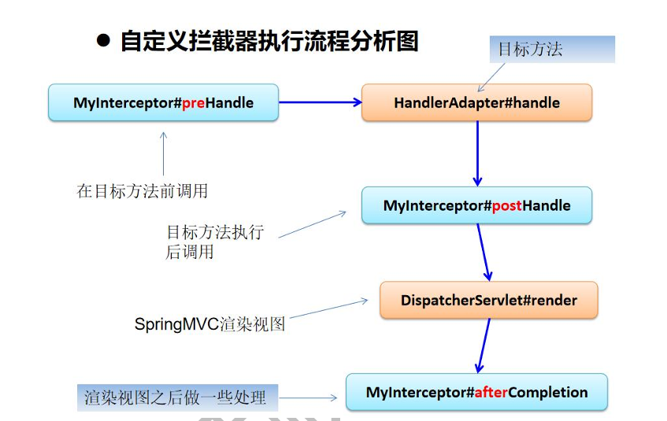


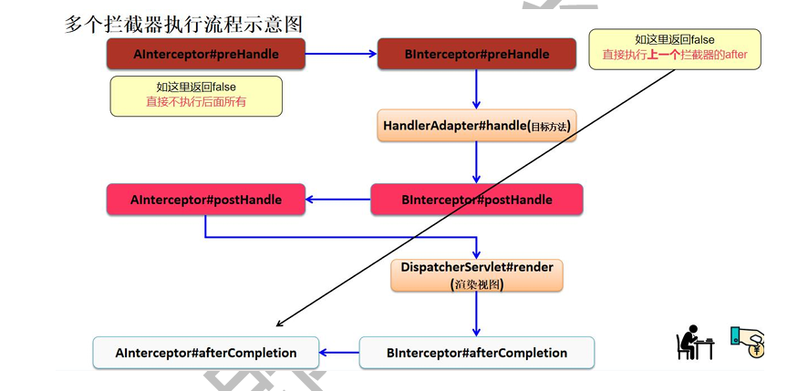

配置拦截器，与过滤器位置不一样，不在web.xml

```xml
<!--配置自定义拦截器-spring配置文件-->
    <mvc:interceptors>
        <!--
        老韩解读
        1. 第一种配置方式
        2. 使用ref 引用到对应的myInterceptor01
        3. 这种方式，会拦截所有的目标方法
        -->
        <!--<ref bean="myInterceptor01"/>-->

        <!--老韩解读
        1. 第二种配置方式
        2. mvc:mapping path="/hi" 指定要拦截的路径
        3. ref bean="myInterceptor01" 指定对哪个拦截器进行配置
        -->
        <!--<mvc:interceptor>-->
        <!--    <mvc:mapping path="/hi"/>-->
        <!--    <ref bean="myInterceptor01"/>-->
        <!--</mvc:interceptor>-->

        <!--老韩解读
        1. 第3种配置方式
        2. mvc:mapping path="/h*" 通配符方式 表示拦截 /h 打头的路径
        3. mvc:exclude-mapping path="/hello" /hello不拦截
        4. ref bean="myInterceptor01" 指定对哪个拦截器配置
        -->
        

        <!--老师解读
        1.配置2个拦截器
        2.多个拦截器在执行时，是按配置文件中的顺序执行
        -->
         <mvc:interceptor>
            <mvc:mapping path="/h*"/>
            <mvc:exclude-mapping path="/hello"/>
            <ref bean="myInterceptor01"/>
        </mvc:interceptor>
        
        <mvc:interceptor>
            <mvc:mapping path="/h*"/>
            <ref bean="myInterceptor02"/>
        </mvc:interceptor>
    </mvc:interceptors>
```

MyInterceptor01.java

```java
@Component
public class MyInterceptor01 implements HandlerInterceptor {

    /**
     * 老师解读
     * 1. preHandle() 在目标方法执行前被执行
     * 2. 如果preHandle() 返回false , 不再执行目标方法
     * 3. 该方法可以获取到request, response, handler
     * 4. 这里根据业务，可以进行拦截，并指定跳转到哪个页面
     */
    @Override
    public boolean preHandle(HttpServletRequest request, HttpServletResponse response, Object handler) throws Exception {
        System.out.println("--MyInterceptor01--preHandle()---");
        //获取到用户提交的关键字
        String keyword = request.getParameter("keyword");
        if("病毒".equals(keyword)) {
            //请求转发到warning
            request.getRequestDispatcher("/WEB-INF/pages/warning.jsp")
                    .forward(request,response);

            return false;
        }
        System.out.println("得到到keyword= "+ keyword);
        return true;
    }

    /**
     * 老师解读
     * 1. 在目标方法执行后，会执行postHandle
     * 2. 该方法可以获取到 目标方法，返回的ModelAndView对象
     */
    @Override
    public void postHandle(HttpServletRequest request, HttpServletResponse response, Object handler, ModelAndView modelAndView) throws Exception {
        System.out.println("--MyInterceptor01--postHandle()--");
    }

    /**
     * 老师解读
     * 1. afterCompletion() 在视图渲染后被执行, 这里可以进行资源清理工作
     */
    @Override
    public void afterCompletion(HttpServletRequest request, HttpServletResponse response, Object handler, Exception ex) throws Exception {
        System.out.println("--MyInterceptor01--afterCompletion()--");
    }
}
```

MyInterceptor02.java

```java
@Component
public class MyInterceptor02 implements HandlerInterceptor {

    @Override
    public boolean preHandle(HttpServletRequest request, HttpServletResponse response, Object handler) throws Exception {
        System.out.println("--MyInterceptor02--preHandle--");
        return true;
    }

    @Override
    public void postHandle(HttpServletRequest request, HttpServletResponse response, Object handler, ModelAndView modelAndView) throws Exception {
        System.out.println("--MyInterceptor02--postHandle--");
    }

    @Override
    public void afterCompletion(HttpServletRequest request, HttpServletResponse response, Object handler, Exception ex) throws Exception {
        System.out.println("--MyInterceptor02--afterCompletion--");
    }
}
```


目标方法

```java
@Controller
public class FurnHandler {

    @RequestMapping(value = "/hi")
    public String hi(User user) {

        System.out.println("---FurnHandler--hi()---");
        return "success";
    }

    @RequestMapping(value = "/hello")
    public String hello() {
        System.out.println("---FurnHandler--hello()---");
        return "success";
    }

    @RequestMapping(value = "/ok")
    public String ok() {
        System.out.println("---FurnHandler--ok()---");
        return "success";
    }
}
```


### 7.异常处理

Spring MVC 通过 ExceptionHandlerResolver接口处理程序的异常，包括 Handler 映射、数据 绑定以及目标方法执行时发生的异常。

1. 局部异常处理机制：主要处理本Handler类中用 @ExceptionHandler 注解定义的方法。

2. 全局异常处理机制： ExceptionHandlerMethodResolver内部若在本类找不到对应@ExceptionHandler注解的话，会找@ControllerAdvice 类中定义的的@ExceptionHandler 注解方法, 这样就相当于一个全局异常处理器

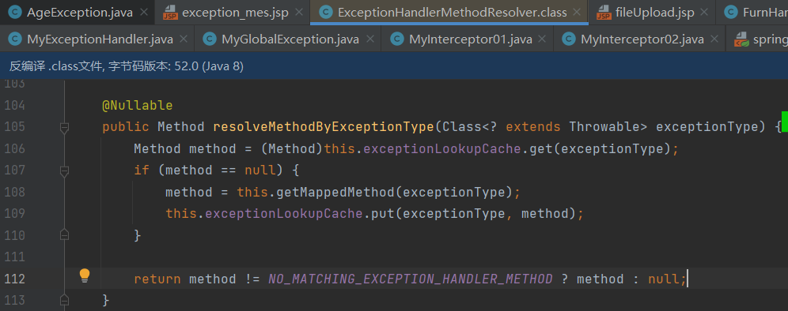

3. 异常处理时优先级：局部异常 >全局异常>统一异常处理>tomcat的默认处理机制
4. 如果不进行异常处理，就会使用tomcat的默认处理机制
5. 自定义异常：通过@ResponseStatus 注解可以自定义异常的说明（主要是tomcat的默认处理机制使用），和默认异常一样都可以放在局部或全局异常部位处理，应该也可以统一处理
6. 统一处理异常信息： 如果希望对所有异常进行统一处理，可以使用 SimpleMappingExceptionResolver， 它将异常类名映射为视图名，即发生异常时使用对应的视图报告异常，需要在ioc容器中配置

```xml
 <!--配置统一处理异常Bean-->
    <bean class="org.springframework.web.servlet.handler.SimpleMappingExceptionResolver">
        <property name="exceptionMappings">
            <props>
                <!--这里的key是异常全类名，“arrEX”相当于handler中返回的视图，即跳转到/WEB-INF/pages/arrEx.jsp-->
                <!--<prop key="java.lang.ArrayIndexOutOfBoundsException">arrEx</prop>-->
                <prop key="java.lang.Exception">allEx</prop>
            </props>
        </property>
    </bean>
```

局部异常处理MyExceptionHandler.java

```java
@Controller
public class MyExceptionHandler {


    /**
     * 老师解读
     * 1. localException 方法处理局部异常
     * 2. 这里老师处理ArithmeticException.class,NullPointerException.class
     * 3. Exception ex: 生成的异常对象，会传递给ex, 通过ex可以得到相关的信息
     *    , 这里程序员可以加入自己的业务逻辑
     * @return
     */
    @ExceptionHandler({ArithmeticException.class,NullPointerException.class,NumberFormatException.class})
    public String localException(Exception ex, HttpServletRequest request){
        System.out.println("局部异常信息是-" + ex.getMessage());
        //如何将异常的信息带到下一个页面.
        request.setAttribute("reason", ex.getMessage());
        return "exception_mes";
    }

    /**
     * 老师解读
     * 1. 编写方法，模拟异常, 算术异常
     * 2. 如果我们不做异常处理，是由tomcat默认页面显示
     *
     * @param num
     * @return
     */
    @RequestMapping(value = "/testException01")
    public String test01(Integer num) {
        int i = 9 / num;
        return "success";
    }

    @RequestMapping(value = "/testGlobalException")
    public String global(){
        //老韩解读
        //1. 这里我们模拟了一个异常 NumberFormatException
        //2. 该异常没有在局部异常处理，按照异常处理机制，就会交给全局异常处理类处理
        int num = Integer.parseInt("hello");
        return "success";
    }

    @RequestMapping(value = "/testException02")
    public String test02(){
        throw new AgeException("年龄必须在1-120之间~~~");
    }

    //统一处理异常信息
    @RequestMapping(value = "/testException03")
    public String test03(){
        int[] arr = new int[]{3,9,10,190};
        //抛出一个数组越界的异常 ArrayIndexOutOfBoundsException,由于在局部和全局异常中未对该异常进行处理，所以交给统一异常处理
        System.out.println(arr[90]);
        return "success";
    }

    //对未知异常进行统一处理
    //如果发生了没有归类的异常， 可以给出统一提示页面
    @RequestMapping(value = "/testException04")
    public String test04(){
        String str = "hello";
        //这里会抛出 StringIndexOutOfBoundsException
        char c = str.charAt(10);
        return "success";
    }
}
```

全局异常MyGlobalException.java

```java
@ControllerAdvice
public class MyGlobalException {

    /**
     * 老师解读
     * 1. 全局异常就不管是哪个Handler抛出的异常，都可以捕获 , @ExceptionHandler({异常类型})
     * 2. 这里老师处理的全局异常是NumberFormatException.class,ClassCastException.class
     * 3. Exception ex 接收抛出的异常对象
     *
     * @return
     */
    //
    @ExceptionHandler({NumberFormatException.class, ClassCastException.class, AgeException.class})
    public String globalException(Exception ex, HttpServletRequest request) {
        System.out.println("全局异常处理-" + ex.getMessage());
        //如何将异常的信息带到下一个页面.
        request.setAttribute("reason", ex.getMessage());
        return "exception_mes";
    }

}
```

自定义异常类型 AgeException.java

```java
@ResponseStatus(reason = "年龄需要在1-120之间", value = HttpStatus.BAD_REQUEST)
public class AgeException extends RuntimeException {

    public AgeException() {
    }

    public AgeException(String message) {
        super(message);
    }
}
```

exception_mes.jsp

```jsp
<%@ page contentType="text/html;charset=UTF-8" language="java" %>
<html>
<head>
    <title>异常信息提示</title>
</head>
<body>
<h1>朋友, 程序发生了异常...</h1>
异常信息- ${requestScope.reason}
</body>
</html>
```


### 8.springmvc源码流程分析

...

# 3.Mybatis

MyBatis中文手册网址：https://mybatis.net.cn/

maven中央仓库：https://mvnrepository.com


## 1.快速入门

==项目架构创建==：

创建新的maven项目mybatis,把项目的src目录删除，让mybatis项目当做父项目，然后==在该项目下添加新模块方式==创建其他新的项目(仍然是maven项目，新项目在mybatis的目录下，整个项目会存在多个pom.xml文件)为子模块，这样子模块项目可以使用父项目的pom.xml引入


MyBatis 工作示意图：

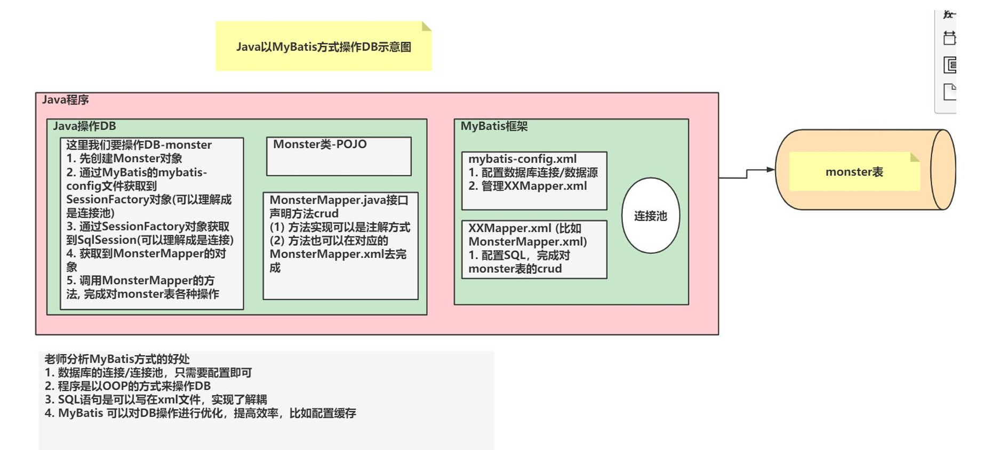

项目整体结构如下：

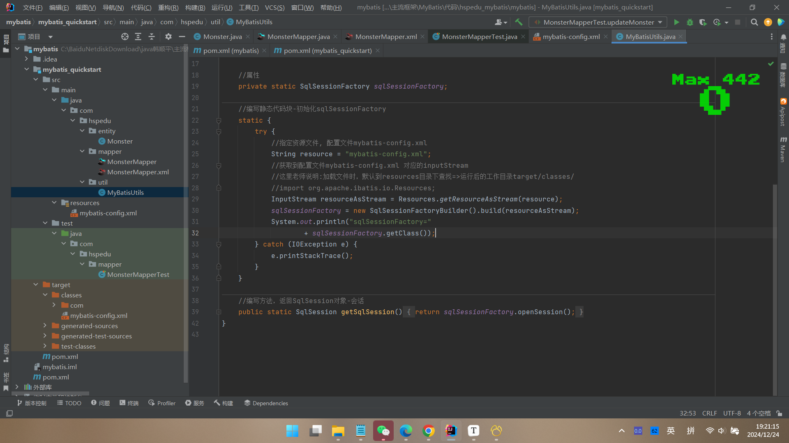

 创建mybatis 数据库-monster表：

```txt
 CREATE TABLE `monster` (
`id` INT NOT NULL AUTO_INCREMENT,
 `age` INT NOT NULL,
 `birthday` DATE DEFAULT NULL,
 `email` VARCHAR(255) NOT NULL ,
 `gender` TINYINT NOT NULL,
 `name` VARCHAR(255) NOT NULL,
 `salary` DOUBLE NOT NULL,
 PRIMARY KEY(`id`)
 ) CHARSET=utf8
```

父项目mybatis下的pom.xml文件

```xml
<?xml version="1.0" encoding="UTF-8"?>
<project xmlns="http://maven.apache.org/POM/4.0.0"
         xmlns:xsi="http://www.w3.org/2001/XMLSchema-instance"
         xsi:schemaLocation="http://maven.apache.org/POM/4.0.0 http://maven.apache.org/xsd/maven-4.0.0.xsd">
    <modelVersion>4.0.0</modelVersion>

    <!--老师解读
    1. 将mybatis作为父项目管理多个子模块/子项目
    2. 父项目的完整的坐标 groupId[组织名]+artifactId[项目名]
    3. 后面该父项目会管理多个子模块/子项目 , 将来父项目中的引入的依赖可以直接给子项目用
       , 这样开发简单，提高复用性，也便于管理
    4. <packaging>pom</packaging> 表示父项目以多个子模块/子项目管理工程

    -->
    <groupId>com.hspedu</groupId>
    <artifactId>mybatis</artifactId>
    <packaging>pom</packaging>
    <version>1.0-SNAPSHOT</version>
    <!--老师
       modules指定管理的哪些子模块
    -->
    <modules>
        <module>mybatis_quickstart</module>
    </modules>

    <!--加入依赖-->
    <dependencies>
        <!--mysql依赖-->
        <dependency>
            <groupId>mysql</groupId>
            <artifactId>mysql-connector-java</artifactId>
            <version>5.1.49</version>
        </dependency>
        <!--mybatis依赖-->
        <dependency>
            <groupId>org.mybatis</groupId>
            <artifactId>mybatis</artifactId>
            <version>3.5.7</version>
        </dependency>
        <!--junit依赖-->
        <dependency>
            <groupId>junit</groupId>
            <artifactId>junit</artifactId>
            <version>4.12</version>
            <!--如果这里有一个scope-test 表示该jar的作用范围在test目录, 后面老韩还有有专门讲解maven -->
            <!--<scope>test</scope>-->
        </dependency>
    </dependencies>

    <!--在build中配置resources，来防止我们资源导出失败的问题
        老韩解读：
        1. 不同的idea/maven 可能提示的错误不一样
        2. 不变应万变，少什么文件，就增加相应配置即可
        3. 含义是将 src/main/java目录和子目录 和 src/main/resources目录和子目录
        的资源文件 xml 和 properties在build项目时，导出到对应的target目录下
    -->
    <build>
        <resources>
            <resource>
                <directory>src/main/java</directory>
                <includes>
                    <include>**/*.xml</include>
                </includes>
            </resource>
            <resource>
                <directory>src/main/resources</directory>
                <includes>
                    <include>**/*.xml</include>
                    <include>**/*.properties</include>
                </includes>
            </resource>
        </resources>
    </build>
</project>
```

子项目mybatis_quickstart下的pom.xml文件

```xml
<?xml version="1.0" encoding="UTF-8"?>
<project xmlns="http://maven.apache.org/POM/4.0.0"
         xmlns:xsi="http://www.w3.org/2001/XMLSchema-instance"
         xsi:schemaLocation="http://maven.apache.org/POM/4.0.0 http://maven.apache.org/xsd/maven-4.0.0.xsd">

    <!--老韩解读
        1. parent指定了该模块的父项目的完整坐标 groupId+artifactId
        2. artifactId 子模块的名称
        3. 当前模块的groupId 就是 com.hspedu
        4. 这里配置后, 该模块就可以使用/引用到父项目的依赖
    -->
    <parent>
        <artifactId>mybatis</artifactId>
        <groupId>com.hspedu</groupId>
        <version>1.0-SNAPSHOT</version>
    </parent>
    <modelVersion>4.0.0</modelVersion>

    <artifactId>mybatis_quickstart</artifactId>


</project>
```

注意：mybatis-config.xml放在子模块的src/resources目录下，进行全局配置，只能有一个这样的配置文件

前几行有模板可以参考，

```xml
<?xml version="1.0" encoding="UTF-8" ?>
<!DOCTYPE configuration
        PUBLIC "-//mybatis.org//DTD Config 3.0//EN"
        "http://mybatis.org/dtd/mybatis-3-config.dtd">
<configuration>

    <!--配置MyBatis自带的日志输出-查看原生的sql-->
    <!--注意该日志配置要放在最前面，不然会报错-->
    <settings>
        <setting name="logImpl" value="STDOUT_LOGGING"/>
    </settings>

    <!--配置别名-->
    <!--为java类型设置一个缩写名字，降低冗余的全类名书写-->
    <typeAliases>
        <typeAlias type="com.hspedu.entity.Monster" alias="Monster"/>
    </typeAliases>


    
    <environments default="development">
        <environment id="development">
            <!--配置事务管理器-->
            <transactionManager type="JDBC"/>
            <!--配置数据源-->
            <dataSource type="POOLED">
                <!--配置驱动-->
                <property name="driver" value="com.mysql.jdbc.Driver"/>
                <!--配置连接mysql-url
                老韩解读:
                1. jdbc:mysql 协议
                2. 127.0.0.1:3306 : 指定连接mysql的ip+port
                3. mybatis: 连接的DB
                4. useSSL=true 表示使用安全连接
                5. "&amp;" 表示'&' 防止解析错误,相当于转义
                6. useUnicode=true : 使用unicode 作用是防止编码错误
                7. characterEncoding=UTF-8 指定使用utf-8, 防止中文乱码
                8. 老韩温馨提示：不要背，直接使用即可
				
				9.目前不知道原因，开启SSL会报错，所以需要设置useSSL=false
                -->
                <property name="url" value="jdbc:mysql://127.0.0.1:3306/mybatis?useSSL=false&amp;useUnicode=true&amp;characterEncoding=UTF-8"/>
                <property name="username" value="root"/>
                <property name="password" value="root"/>
            </dataSource>
        </environment>
    </environments>
    <!--老师说明
    1. 这里我们配置需要关联的Mapper.xml,注意路径是分隔符号'/'，而不是'.'
    2. 这里我们可以通过选中文件，然后右键复制根路径 Path from source root
    3.注意这里是在target下面对应的目录中查找，如果运行时提示找不到xx.xml文件，注意检查target下面资源是否已经拷贝过来
    -->
    <mappers>
        <mapper resource="com/hspedu/mapper/MonsterMapper.xml"/>
    </mappers>
</configuration>
```

Monste.java

```java
public class Monster {
    //属性-和表字段有对应关系
    private Integer id;
    private Integer age;
    private String name;
    private String email;
    private Date birthday;
    private double salary;
    private Integer gender;

    public Monster() {
    }

    public Monster(Integer id, Integer age, String name, String email, Date birthday, double salary, Integer gender) {
        this.id = id;
        this.age = age;
        this.name = name;
        this.email = email;
        this.birthday = birthday;
        this.salary = salary;
        this.gender = gender;
    }

    getter,setter,tostring()方法...
}
```

MonsterMapper.java

```java
/**
 * 1. 这是一个接口
 * 2. 该接口用于声明操作monster表的方法
 * 3. 这些方法可以通过注解或者xml文件来实现
 */
public interface MonsterMapper {

    //添加monster
    public void addMonster(Monster monster);

    //根据id删除一个Monster
    public void delMonster(Integer id);

    //修改Monster
    public void updateMonster(Monster monster);

    //查询-根据id
    public Monster getMonsterById(Integer id);

    //查询所有的Monster
    public List<Monster> findAllMonster();
}
```

MonsterMapper.xml

前几行有模板可以参考，

```xml
<?xml version="1.0" encoding="UTF-8" ?>
<!DOCTYPE mapper
        PUBLIC "-//mybatis.org//DTD Mapper 3.0//EN"
        "http://mybatis.org/dtd/mybatis-3-mapper.dtd">

<!--老师解读
1. 这是一个mapper.xml 文件
2. 该文件可以去实现对应的接口的方法
3. namespace 指定该xml文件和哪个mapper接口对应!!!
-->
<mapper namespace="com.hspedu.mapper.MonsterMapper">
   <!--配置addMonster
       1. id="addMonster" 就是接口的方法名
       2. parameterType="com.hspedu.entity.Monster" 放入的形参的类型
       3. 注意"com.hspedu.entity.Monster" 可以简写
       4. 写入sql语句=> 老师建议，现在sqlyog 写完成-测试通过，再拿过来
       5. (`age`, `birthday`, `email`, `gender`, `name`, `salary`) 表的字段
       6. (#{age}, #{birthday}, #{email}, #{gender}, #{name}, #{salary}) 是从传入的monster对象属性值
       7. 这里 #{age} age 对应monster对象的属性名，其它一样
       8.useGeneratedKeys取出由数据库内部生成的主键自动赋值给添加后的monster对象，keyProperty指定主键（仅适用insert和update操作）

       9. com.hspedu.entity.Monster 可以简写，在mybatis-config.xml文件中配置类型别名
   -->
    <insert id="addMonster" parameterType="Monster" useGeneratedKeys="true" keyProperty="id">
        INSERT INTO `monster`
        (`age`, `birthday`, `email`, `gender`, `name`, `salary`)
        VALUES (#{age}, #{birthday}, #{email}, #{gender}, #{name}, #{salary})
    </insert>

    <!--配置/实现delMonster方法
    1. 这里 java.lang.Integer 这是Java类型， 可以简写成 Integer
    2. 这里写入delete
    -->
    <delete id="delMonster" parameterType="Integer">
        DELETE FROM `monster` WHERE id = #{id}
    </delete>

    <!--配置实现 updateMonster

    -->
    <update id="updateMonster" parameterType="Monster">
        UPDATE `monster`
        SET `age`=#{age} , `birthday`= #{birthday}, `email` = #{email},
        `gender` = #{gender} , `name`= #{name}, `salary` = #{salary}
        WHERE id = #{id}
    </update>

    <!--配置/实现getMonsterById-->
    <select id="getMonsterById" resultType="Monster">
        SELECT * FROM `monster` WHERE id = #{id}
    </select>

    <!--配置/实现findAllMonster-->
    <!--使用resultType，如果返回的是集合，那么也应该设置集合包含的类型，而不是集合本身的类型-->
    <select id="findAllMonster" resultType="Monster">
        SELECT * FROM `monster`
    </select>
</mapper>
```

工具类MyBatisUtils.java

```java
/**
 * @author 韩顺平
 * @version 1.0
 * MyBatisUtils 工具类，可以得到SqlSession
 */
public class MyBatisUtils {

    //属性
    private static SqlSessionFactory sqlSessionFactory;

    //编写静态代码块-初始化sqlSessionFactory
    static {
        try {
            //指定资源文件, 配置文件mybatis-config.xml
            String resource = "mybatis-config.xml";
            //获取到配置文件mybatis-config.xml 对应的inputStream
            //这里老师说明:加载文件时，默认到resources目录下查找=>运行后的工作目录target/classes/
            //import org.apache.ibatis.io.Resources;
            InputStream resourceAsStream = Resources.getResourceAsStream(resource);
            sqlSessionFactory = new SqlSessionFactoryBuilder().build(resourceAsStream);
            //sqlSessionFactory=class org.apache.ibatis.session.defaults.DefaultSqlSessionFactory
            System.out.println("sqlSessionFactory="
                    + sqlSessionFactory.getClass());
        } catch (IOException e) {
            e.printStackTrace();
        }
    }

    //编写方法，返回SqlSession对象-会话
    public static SqlSession getSqlSession() {
        return sqlSessionFactory.openSession();
    }
}
```

测试类MonsterMapperTest.java

```java
public class MonsterMapperTest {
    //属性
    private SqlSession sqlSession;
    private MonsterMapper monsterMapper;

    /**
     * 老师解读
     * 1. 当方法标注 @Before, 表示在执行你的目标测试方法前，会先执行该方法
     * 2. 这里在测试的时候，可能小伙伴们会遇到一些麻烦，老师说了解决方案
     */
    //编写方法完成初始化
    @Before
    public void init() {
        //获取到sqlSession
        sqlSession = MyBatisUtils.getSqlSession();
        //获取到到MonsterMapper对象 class com.sun.proxy.$Proxy7 代理对象
        //, 底层是使用了动态代理机制, 后面我们自己实现mybatis底层机制时，会讲到
        monsterMapper = sqlSession.getMapper(MonsterMapper.class);
        System.out.println("monsterMapper=" + monsterMapper.getClass());

    }

    @Test
    public void addMonster() {

        for (int i = 0; i < 2; i++) {
            Monster monster = new Monster();
            monster.setAge(10 + i);
            monster.setBirthday(new Date());
            monster.setEmail("kate@qq.com");
            monster.setGender(1);
            monster.setName("大象精-" + i);
            monster.setSalary(1000 + i * 10);
            monsterMapper.addMonster(monster);

            System.out.println("添加对象--" + monster);
            System.out.println("添加到表中后, 自增长的id=" + monster.getId());
        }

        //如果是增删改, 需要提交事务
        if(sqlSession != null) {
            sqlSession.commit();
            sqlSession.close();
        }

        System.out.println("保存成功...");

    }

    @Test
    public void delMonster() {

        monsterMapper.delMonster(2);

        //需要提交事务才能生效
        if(sqlSession != null) {
            sqlSession.commit();
            sqlSession.close();
        }

        System.out.println("删除成功...");

    }

    @Test
    public void updateMonster() {

        Monster monster = new Monster();
        monster.setAge(50);
        monster.setBirthday(new Date());
        monster.setEmail("king3@qq.com");
        monster.setGender(0);
        monster.setName("老鼠精-01");
        monster.setSalary(2000);
        monster.setId(3);

        monsterMapper.updateMonster(monster);

        if(sqlSession != null) {
            sqlSession.commit();
            sqlSession.close();
        }

        System.out.println("修改成功...");

    }

    @Test
    public void getMonsterById() {

        Monster monster = monsterMapper.getMonsterById(3);
        System.out.println("monster=" + monster);

        //查询可以不用提交，不过需要关闭一下连接
        if(sqlSession != null) {
            sqlSession.close();
        }
        System.out.println("查询成功~");
    }


    @Test
    public void findAllMonster() {

        List<Monster> monsters = monsterMapper.findAllMonster();
        for (Monster monster : monsters) {
            System.out.println("monster-" + monster);
        }
        if(sqlSession != null) {
            sqlSession.close();
        }
        System.out.println("查询成功~");
    }
}
```


## 2.原生API&注解方式

在前面项目的基础上，增删改查就是通过使用Mybatis的原生API来完成的，就是通过SqlSession接口的方法来完成


（2）注解方式

如果是通过注解的方式，可不再使用MonsterMapper.xml,但是也需要再mybatis-config.xml中注册含注解的类


# 4.SSM项目


# 5.springboot

## (1)快速入门：

确认开发环境是jdk8或以上，maven在3.5版本以上（如果速度慢，可以配置镜像）


创建一个普通的maven项目，先不需要引入web包

然后在pom.xml引入SpringBoot父工程和web项目场景启动器

pom.xml

```xml
<?xml version="1.0" encoding="UTF-8"?>
<project xmlns="http://maven.apache.org/POM/4.0.0" xmlns:xsi="http://www.w3.org/2001/XMLSchema-instance"
         xsi:schemaLocation="http://maven.apache.org/POM/4.0.0 https://maven.apache.org/xsd/maven-4.0.0.xsd">
  <modelVersion>4.0.0</modelVersion>
        
  <groupId>com.york</groupId>
  <artifactId>AirlineBooking</artifactId>
  <version>0.0.1-SNAPSHOT</version>
  <name>AirlineBooking</name>
  <description>航班订票系统</description>
    
   <!-- 引入SpringBoot父工程 -->           
  <parent>
      <groupId>org.springframework.boot</groupId>
      <artifactId>spring-boot-starter-parent</artifactId>
      <version>2.5.3</version>
      
  </parent>
    
   <!--按照spring-boot-dependencies-2.5.3.pom中的写法添加版本信息，仍然还需要显示引入下依赖只是可以不在依赖里指定版本号--> 
  <properties>
    <mysql.version>5.1.49</mysql.version>
  </properties>
    
  <dependencies>
       <!-- 引入web项目场景启动器:会自动导入和web开发相关的所有依赖--> 
    <dependency>
      <groupId>org.springframework.boot</groupId>
      <artifactId>spring-boot-starter-web</artifactId>
    </dependency>
      
    
    <!-- 修改版本仲裁/默认版本号
	（1）如果引入依赖，但是不指定版本号，引入的是父项目配置的默认版本<mysql.version>8.0.26</mysql.version>
	（2）引入依赖并指定版本号，会替代默认版本
	（3）引入依赖但不在这里指定版本，也可以在prpperties中按照spring-boot-dependencies-2.5.3.pom中的写法添加版本信息，
		也会替代默认版本 
	（4）为什么可以修改版本仲裁：根据依赖就近优先原则-->   
    <dependency>
      <groupId>mysql</groupId>
      <artifactId>mysql-connector-java</artifactId>
      <!-- <version>5.1.49</version> -->   
    </dependency>
      
  </dependencies>
             
             
</project>
```

启动程序Applicxation.java

```java
@SpringBootApplication  //注解表示这是一个springboot项目启动器
//@SpringBootApplication(scanBasePackages={"com.hspedu","com.xx"}) //指定springboot要扫描的包和子包
public class Application {
    public static void main(String[] args) {
        //下面三种启动方式都可以
        SpringApplication.run(Application.class, args);
        
        
        /*  //可以自定义springboot banner图案，
        SpringApplication app = new SpringApplication(AirlineBookingApplication.class);
        app.setBanner(new Banner() {
            @Override
            public void printBanner(Environment environment, Class<?> sourceClass, PrintStream out) {
                out.println("自定义 Banner 启动图案！");
            }
        });
        app.run(args);
        */


        /*        
        ConfigurableApplicationContext ioc = SpringApplication.run(AirlineBookingApplication.class, args);
        int beanDefinitionCount = ioc.getBeanDefinitionCount();
        String[] beanDefinitionNames = ioc.getBeanDefinitionNames();
        System.out.println("----------------------------------------------------");
        System.out.println("beanDefinitionCount"+beanDefinitionCount);
        for (String beanDefinitionName : beanDefinitionNames) {
            System.out.println("beanDefinitionName"+beanDefinitionName);
        }
        System.out.println("----------------------------------------------------");
        */
 
    }
}
```

controller/HelloController.java

```java
@Controller
public class HelloController {
    
    @ResponseBody
    @RequestMapping("/hello")
    public String hello(){
        return "hello springboot";
    }
}
```

注意：

(1)默认情况下Tomcat started on port 8080 with context path ''，通常需要自己再配置服务器路径

(2)@Controller类所在包或者更上一层目录应该和@SpringBootApplication启动类在同一个包下，这样默认配置才能扫描到@Controller类

(3)stater场景启动器：

​	Ⅰ.开发中我们引入相关场景的starter，这个场景的所有相关依赖都引入进来了，比如我们做web开发引入了该starter将导入与web开发相关的所有包

​	Ⅱ.所有场景启动器最基本的依赖就是spring-boot-starter,这个依赖就是SpringBoot自动配置的核心依赖


## (2)具体用法


#### 杂项

（1）切换tomcat和undertow

```xml
 	<dependency>
      <groupId>org.springframework.boot</groupId>
      <artifactId>spring-boot-starter-web</artifactId>
      <exclusions>
        <exclusion>
          <groupId>org.springframework.boot</groupId>
          <artifactId>spring-boot-starter-tomcat</artifactId>
        </exclusion>
      </exclusions>
    </dependency>

    <dependency>
      <groupId>org.springframework.boot</groupId>
      <artifactId>spring-boot-starter-undertow</artifactId>
    </dependency>
```

（2）引入lombok

```xml
 <dependency>
      <groupId>org.projectlombok</groupId>
      <artifactId>lombok</artifactId>
    </dependency>
```


#### 1.配置文件

常用配置类:

ServerProperties:@ConfigurationProperties(prefix = "server")

WebMvcProperties:@ConfigurationProperties(prefix = "spring.mvc")

WebMvcAutoConfiguration与,DispatcherServletAutoConfiguration


application.yml

```yml
server:
  port: 8080      #配置服务器端口和上下文路径
  tomcat:
      uri-encoding: UTF-8
  servlet:
    context-path: /chapter2


spring:
  mvc:
    view:  
      prefix: /   #配置默认视图解析器
      suffix: .html

```


#### 2.常用注解


配置类注解：

(1)==@Configuration==表示该类是个配置类，等价于配置文件，配置类本身也会当作bean对象被注入容器，然后==@Bean==方法返回的对象也会被注入容器中（bean对象名称默认为为方法名），也可以用@Bean("monster_nmw")来指定名字，在方法上使用==@Scope==("prototype")从容器中获取返回多实例,默认单例

@Configuration(proxyBeanMethods=false), 默认是true单实例，false为多实例

注意：proxyBeanMethods的设置是在调用配置类的@Bean方法才生效（直接从容器中获取不行），因此需要获取配置类的bean对象/组件，再调用@Bean方法

(2)==@Import==({Dog.class,Cat.class})在配置类上使用，也会把对应类注入容器中，默认组件名字就是对应类的全类名

(3)==@Conditional==扩展注解，可以用在配置类和@Bean方法上，在配置类使用时对所有的@Bean方法都进行约束

如@ConditionalOnBean(name="monster_nmw")表示当容器中有这样一个名字为"monster_nmw"的Bean，才会注入

@ConditionalOnMissingBean(name="monster_nmw")表示当容器中没有这样一个名字为"monster_nmw"的Bean，才会注入

(4)==@ImportResource==("classpath:beans.xml")，将beans.xml导入到配置类,注入到容器中


配置绑定：

细节：如果配置文件中有中文，需要转成unicode编码

​	 如果使用@ConfigurationProperties注解出现警告提示信息，可以引入下面依赖

```xml
 <dependency>
      <groupId>org.springframework.boot</groupId>
      <artifactId>spring-boot-configuration-processor</artifactId>
</dependency>
```


```java
@Component  //如果不使用@Component注解注入到容器中 ，也可以在其他配置类上使用注解@EnableConfigurationProperties(Furn.class)
@ConfigurationProperties(prefix = "furn01")  //这样会从配置文件读取数据，并调用对应setter方法进行赋值
public class Furn {
    private Integer id;
    private  String name;
    private  Double price;
    
    //在属性上使用注解读取，也可以从application配置文件读取自定义属性并赋值
    @Value("${my.website}")
    private String website;
    
//    getter和setter方法
}

//application配置文件中写入
furn01.id
furn01.name
furn01.price

my.website=https://www.baidu.com
```


#### 默认的静态资源根目录细节：

Spring Boot 默认扫描以下 4 个路径作为静态资源的根目录，按==优先级依次==查找文件：

1. `classpath:/META-INF/resources/`
2. `classpath:/resources/`
3. `classpath:/static/`
4. `classpath:/public/`

如果文件存在于多个目录中，Spring Boot 会优先返回路径列表中靠前的文件。


#### 常用类：

（1）ResourceProperties

```yml
#在配置文件中修改静态资源访问路径
spring:
  resources:
        static-locations: classpath:static/,file:static/
```


（2）ResourceHandlerRegistry

==细节：==如果使用 ResourceHandlerRegistry 配置静态资源，它会==覆盖== ResourceProperties 的自动配置。


（3）WebMvcConfigurationSupport

```java
@Configuration
public class InterceptorConfig extends WebMvcConfigurationSupport{
	
	@Bean
    public AuthorizationInterceptor getAuthorizationInterceptor() {
        return new AuthorizationInterceptor();
    }
	
    //注册拦截器
	@Override
    public void addInterceptors(InterceptorRegistry registry) {
        registry.addInterceptor(getAuthorizationInterceptor())
                .addPathPatterns("/**")  //所有静态资源也会被拦截
            	.excludePathPatterns("/static/**");     //有时候需要更大的范围
        super.addInterceptors(registry);
	}

    //修改默认静态资源路径
	@Override
    public void addResourceHandlers(ResourceHandlerRegistry registry) {
		registry.addResourceHandler("/**")   //定义哪些 URL 路径模式的请求应该由静态资源处理器来处理
        .addResourceLocations("classpath:/resources/")
        .addResourceLocations("classpath:/static/")
        .addResourceLocations("classpath:/admin/")
        .addResourceLocations("classpath:/front/")
        .addResourceLocations("classpath:/public/");
		super.addResourceHandlers(registry);
    }
}
```


 (4)WebMvcConfigurer

```java
@Configuration
public class InterceptorConfig implements WebMvcConfigurer{
		
    //注册拦截器
	@Override
    public void addInterceptors(InterceptorRegistry registry) {
        registry.addInterceptor(new LoginInterceptor())
                .addPathPatterns("/**").excludePathPatterns("/static/**");
	}
    
    //默认路径不需要手动配置
}
```

| 特性                     | `WebMvcConfigurer`          | `WebMvcConfigurationSupport`  |
| ------------------------ | --------------------------- | ----------------------------- |
| **类型**                 | 接口                        | 抽象类                        |
| **自动配置**             | 保留 Spring Boot 的自动配置 | 禁用 Spring Boot 的自动配置   |
| **扩展范围**             | 轻量级扩展，补充默认配置    | 全面接管，完全自定义 MVC 配置 |
| **使用场景**             | 对默认行为的小范围调整      | 对 MVC 配置有高度定制化需求   |
| **复杂度**               | 简单，适合一般应用          | 复杂，适合高度定制化场景      |
| **实现方式**             | 实现接口                    | 继承抽象类                    |
| **影响静态资源默认路径** | 不影响                      | 默认路径需手动配置            |


#### thymeleaf模板：

Ⅰ.如果你配置了不同的视图解析器（例如修改了前缀、后缀），那么 Spring 会使用你配置的视图解析器，而不会使用 Thymeleaf 的默认视图解析器

Ⅱ.**如果你配置了多个视图解析器**，Spring 会根据配置顺序来选择哪个视图解析器进行工作。通常，Spring 会根据视图解析器的顺序来处理视图解析

（1）首先需要导入thymeleaf模板依赖

```xml
<dependencies>
       <!--导入thymeleaf模板-->
    <dependency>
      <groupId>org.springframework.boot</groupId>
      <artifactId>spring-boot-starter-thymeleaf</artifactId>
    </dependency>
</dependencies>
```

```java
@GetMapping("/login")
public String login(){
    //在/templates目录下有admin.html文件
    //即便没有配置默认视图解析器，这里就会直接引用到thymeleaf下的模板文件即/templates/admin.html
    return "adminLogin"
}
```

(2)具体为什么能这样，可以看下面的源码，就是不知道如果再在配置文件中指定前缀和后缀会不会影响这样

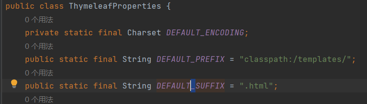


#### 拦截器与过滤器区别：

请求转发不经过过滤器，但需要经过拦截器

细节：这里DispatcherServlet和原生Servlet同级别，所以注入的原生servlet也不会被springboot的拦截器拦截

​	在servlet（如过滤器，DispatcherServlet）匹配全部是"/"或/*",在SpringBoot(如拦截器)是"/**"

​	如果注入了原生的servlet，那么此时原生Servlet和DispatcherServlet(一般是匹配所有路径)都在Spring容器中，根据精确优先原则/最长前缀匹配原则，如果匹配到了原生的Servlet，就不会再走DispatcherServlet这条路径了

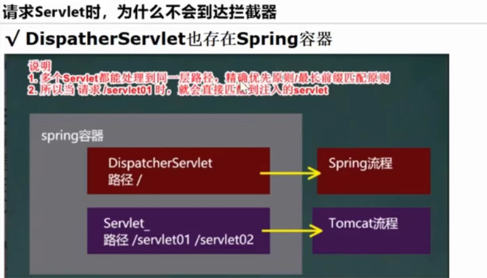


#### 自定义异常页面说明：

出现异常后请求转发到/error，然后根据"==error/错误状态码=="来匹配页面 【将错误页面命名为 错误状态码.html 放在模板引擎文件夹(/templates或/template)或静态资源路径下的 /error文件夹下】，发生此状态码的错误就会来到对应的页面；我们也可以使用4xx和5xx作为错误页面的文件名来匹配这种类型的所有错误，精确优先（优先寻找精确的状态码.html）

1) 有模板引擎的情况下，先寻找模板引擎文件夹下的资源,(先可以理解为只要在/templates/error下匹配到了就自动走模板引擎这条路，源代码怎么实现的不太理解）

2）没有用模板引擎的情况下，寻找4个默认静态资源路径下页面

3）没有找到自定义异常也页面，就使用默认的

4)匹配流程：/templates下的精确错误->静态资源下的精确错误->/templates下的模糊错误->静态资源下的模糊错误->默认的页面

5）注意这里走还是==默认异常==处理流程，只是自定义页面

6)如果项目中有全局异常或局部异常的话，执行顺序：局部异常>全局异常>默认异常

7）返回ModelAndView的model(是ModelMap类型）中有四条数据{timestamp="...",status=403,error=Forbidden,path=/err3}


#### servlet三大组件注入

1.注解方式

对于开发原生的Servlet,使用注解方式时，需要在启动页面使用@ServletCompontScan注解指定要扫描的原生servlet所在包，这样才会注入到spring容器

如：@ServletComponentScan(basePackages={"com.hsp.springboot","com.hsp.test"})

（1）@WebServlet(urlPatterns={"/ok1","/ok2"})注入Servlet

（2）@WebFilter(urlPatterns={"/css/\*","/images/\*"})注入Filter

（3）@WebListener注入监听器

2.使用RegistrationBean方法注入

```java
@Configuration
public class RegisterConfig {

    //注入servlet
    @Bean
    public ServletRegistrationBean servletTest(){
        //把自定义的servlet对象关联到ServletRegistrationBean对象中
        // public ServletRegistrationBean(T servlet, String... urlMappings) {...}
        return  new ServletRegistrationBean(new ServletTest(),"/ok1","/ok2");
    }

    //注入filter
    @Bean
    public FilterRegistrationBean filterTest(){

        //return  new ServletRegistrationBean(new FilterTest(),"/css/\*","/images/\*");
        
        //也可以用下面的方式
        FilterRegistrationBean filterRegistrationBean = new FilterRegistrationBean(new FilterTest());
        filterRegistrationBean.setUrlPatterns(Arrays.asList("/css/*","/images/*"));
        return filterRegistrationBean;
    }
    
    //注入listener
    @Bean
    public ServletListenerRegistrationBean listenerTest(){
      
        return  new ServletListenerRegistrationBean(new ListenerTest());
    }
}
```


#### 数据库开发

##### 默认数据源基本使用：

（1）进行数据库开发，先引入data-jdbc启动器(里面引入的数据源是HikariDataSource，也自动向容器中注入了JdbcTemplate),和mysql驱动

```xml
  <dependency>
      <groupId>org.springframework.boot</groupId>
      <artifactId>spring-boot-starter-jdbc</artifactId>
  </dependency>

    <dependency>
        <groupId>mysql</groupId>
        <artifactId>mysql-connector-java</artifactId>
    </dependency>
```

（2）在application.yml中配置

```yml
#  @ConfigurationProperties(prefix = "spring.datasource")
#  public class DataSourceProperties implements BeanClassLoaderAware, InitializingBean{}
spring:
  datasource:
        driverClassName: com.mysql.cj.jdbc.Driver
        url: jdbc:mysql://localhost:3306/airline?useUnicode=true&characterEncoding=utf-8&useJDBCCompliantTimezoneShift
					=true&useLegacyDatetimeCode=false&serverTimezone=GMT%2B8
        username: root
        password: root
```

(3)使用springboot的测试类，使用@SpringBootTest注解，需要先引入测试启动器

细节：使用测试类时依然需要有主程序，不然跑不起来

```xml
   <dependency>
      <groupId>org.springframework.boot</groupId>
      <artifactId>spring-boot-starter-test</artifactId>
      <scope>test</scope>
    </dependency>
```

(4)使用jdbctemplate

```java
@Resource
private JdbcTemplate jdbcTemplate;//之前已经引入了jdbc启动器，现在可以直接注入，默认数据源是HikariDataSource
```


##### Druid基本使用：

整合druid到SpringBoot方式

Ⅰ.自定义方式

（1）切换druid数据源，需要导入druid依赖，然后在配置类注入DruidDataSource，

注意：此时默认的HikariDataSource就失效了(@ConditionalOnMissingBean(DataSource.class))

（2）配置Druid监控功能

```xml
	<dependency>
      <groupId>com.alibaba</groupId>
      <artifactId>druid</artifactId>
      <version>1.1.22</version>
    </dependency>
```

```java
@Configuration
public class DruidDataSourceConfig {
   
    //编写方法，注入DruidDataSource
    //需要从配置文件读取数据源配置
    @ConfigurationProperties(prefix = "spring.datasource")
    @Bean
    public DataSource dataSource(){
        DruidDataSource druidDataSource = new DruidDataSource();
       //druidDataSource.setUrl();
       // druidDataSource.setUsername();
        //druidDataSource.setPassword();
        
        //设置filters属性，"stat"开启sql监控过滤信息，"wall"开启sql防火墙过滤信息
        //<property name="filters" value="stat,wall"/>
        druidDataSource.setFilters("stat，wall");
        return druidDataSource;
    }  
    
    
    //开启druid监控页功能，浏览器访问/druid/xx会自动跳转到/druid/lohin.html页面
    //此时只能看到数据源信息，其他监控功能还没配置无法看到
    //配置StatViewServlet,启用druid监控页功能
    @Bean
    public ServletRegistrationBean statViewServlet(){
        ServletRegistrationBean<StatViewServlet> registrationBean =
                new ServletRegistrationBean<>(new StatViewServlet(), "/druid/*");

        //public void addInitParameter(String name, String value)
        //设置init-parameter，设置用户名和密码
        registrationBean.addInitParameter("loginUsername","hsp");
        registrationBean.addInitParameter("loginPassword","666666");
        return registrationBean;
    }

    //配置WebStatFilter，用于采集web-jdbc关联的数据监控
    @Bean
    public FilterRegistrationBean webStatFilter(){
        FilterRegistrationBean<WebStatFilter> filterRegistrationBean = 
            new FilterRegistrationBean<>(new WebStatFilter());
        //默认对所有的url请求进行监控
        filterRegistrationBean.setUrlPatterns(Arrays.asList("/*"));
        //排除指定的url
        filterRegistrationBean.addInitParameter("exclusions","*.js,*.gif,*.jpg,*.png,*.css,*.ico,/druid/*");
        return filterRegistrationBean;
    }
    
    

}
```

Ⅱ.引入starter方式

（1）在pom.xml不用再引入druid依赖

（2）引入druid-spring-boot-starter，DruidDataSource自动注入容器中

（3）在application.yml中开启监控页和监控功能

```xml
<dependency>
      <groupId>com.alibaba</groupId>
      <artifactId>druid-spring-boot-starter</artifactId>
      <version>1.1.22</version>
    </dependency>
```

```yml
spring:
	#仍然也需要配置数据源
  	datasource:
    driverClassName: com.mysql.cj.jdbc.Driver
    url: jdbc:mysql://localhost:3306/airline?useUnicode=true&characterEncoding=utf-8&useJDBCCompliantTimezoneShift
   		 =true&useLegacyDatetimeCode=false&serverTimezone=GMT%2B8
    username: root
    password: root
    
    #@ConfigurationProperties("spring.datasource.druid")
    #public class DruidStatProperties{}
    druid:
      #开启druid监控页功能
      stat-view-servlet:
        enabled: true
        login-username: hsp
        login-password: 666666
        reset-enable: false
        #url-pattern:  不配置的话默认就是/druid/*
      #配置WebStatFilter，用于采集web-jdbc关联的数据监控
      web-stat-filter:
        enabled: true
        url-pattern: /*
        exclusions: "*.js,*.gif,*.jpg,*.png,*.css,*.ico,/druid/*"
      filter:
        stat: #开启sql监控
          slow-sql-millis: 1000
          log-slow-sql: true
          enabled: true
        wall: #开启sql防火墙
          enabled: true
          #config:
            #drop-table-allow: false  #不允许删除表
            #select-all-column-allow: false #不允许查询全部

```

#####  整合mybatis

(1)引入mybatis启动器

```xml
<dependency>
      <groupId>org.mybatis.spring.boot</groupId>
      <artifactId>mybatis-spring-boot-starter</artifactId>
      <version>2.1.1</version>
    </dependency>
```

(2)在mapper接口使用==@Mapper==注解就会扫描，并将Mapper接口对象注入,或者在主程序使用@MapperScan(basePackages = {"com.york.dao"})，扫描包下面	的所有mappeer接口

(3)@TableName("monster_test")指定实体类对应的表名,如果实体类Monster和表名monster(忽略首字母大小写)对应则可以省略该注解

(4)@TableId(type = IdType.*AUTO*)说明id对应的就是表的id字段，而且是主键,type = IdType.AUTO 主键类型是自增长

(4)解决时区问题

```java
//GMT就是格林尼治时间
@JsonFormat(pattern = "yyyy-MM-dd HH:mm:s",timezone="GMT+8")
private Data birthday
```

(5)使用MyBatisX插件，在mapper接口中输入mybatis提供的方法名（然后使用alt+enter,选择创建mybatis sql）快速开发，使用自动提示在mapper配置文件中自动实现对应sql操作

(6)在application.yml中指定mapper配置文件位置

```yml
#mybatis
mybatis:
  #指定mapper配置文件位置
  mapper-locations: classpath:mapper/*.xml
  #config-location: #可以指定mybatis-config.xml，用传统的方式来配置mybatis
  type-aliases-package: com.york.entity  #所在包指定类型别名，多个package用逗号或者分号分隔，可以在mapper配置文件简写为类名
  configuration:
    log-impl: org.apache.ibatis.logging.stdout.StdOutImpl  #开启标准日志输出
```


##### mybatis-plus使用

（1）引入mybatis-plus启动器,通常情况下不需要再引入mybatis或mybatis启动器了

```xml
  <dependency>
      <groupId>com.baomidou</groupId>
      <artifactId>mybatis-plus-boot-starter</artifactId>
      <version>3.4.3</version>
    </dependency>

<!-- <dependency>-->
    <!--  <groupId>org.mybatis.spring.boot</groupId>-->
    <!--  <artifactId>mybatis-spring-boot-starter</artifactId>-->
    <!--  <version>2.1.1</version>-->
    <!--</dependency>-->
    
    <!--<dependency>-->
    <!--  <groupId>com.baomidou</groupId>-->
    <!--  <artifactId>mybatis-plus</artifactId>-->
    <!--  <version>2.3</version>-->
    <!--</dependency>-->
    
    <!--<dependency>-->
    <!--  <groupId>com.baomidou</groupId>-->
    <!--  <artifactId>mybatisplus-spring-boot-starter</artifactId>-->
    <!--  <version>1.0.5</version>-->
    <!--</dependency>
```

(2)Mapper接口，继承BaseMapper\<Monster>接口；BaseMapper已经默认提供了很多crud方法，可以直接使用，不用再写对应mapper.xml

​	如果BaseMapper提供的方法不能满足业务需求，可以在开发新的方法，并在对应的mapper.xml进行配置

(3)Service接口，继承IService\<Monster>接口；对应ServiceImpl实现类，需要在实现Service接口的同时继承ServiceImpl<MonsterMapper,Monster>

  因为ServiceImpl类实现了IService接口的方法；也可以自己开发新的方法，然后在实现类中实现，==不要忘了在service接口用@Service注解进行注入==


```yml
mybatis-plus:
  mapper-locations: classpath*:mapper/*.xml
  #实体扫描，多个package用逗号或者分号分隔
  typeAliasesPackage: com.york.entity
  configuration:
    log-impl: org.apache.ibatis.logging.stdout.StdOutImpl  #开启标准日志输出
```


# 6.SpringBoot+vue项目


## (1)前端项目搭建

1.先下载node.js LTS并安装，安装后里面自带的npm可用于管理前端项目包依赖

2.创建vue项目

选择一个文件夹，在下面创建springboot_vue项目，指令vue create springboot_vue,可以使用空格进行选中，ctrl+c关闭服务

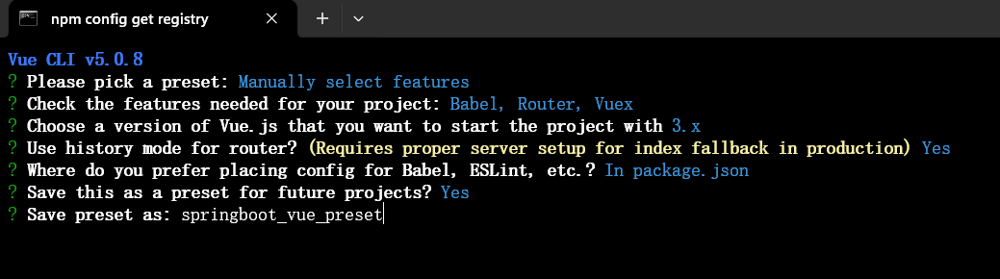

```txt
C:\Aa - 临时文件>vue create springboot_vue
?  Your connection to the default npm registry seems to be slow.
   Use https://registry.npmmirror.com for faster installation? Yes


Vue CLI v5.0.8
? Please pick a preset: Manually select features
? Check the features needed for your project: Babel, Router, Vuex
? Choose a version of Vue.js that you want to start the project with 3.x
? Use history mode for router? (Requires proper server setup for index fallback in production) Yes
? Where do you prefer placing config for Babel, ESLint, etc.? In package.json
? Save this as a preset for future projects? Yes
? Save preset as: springboot_vue_preset

🎉  Preset springboot_vue_preset saved in C:\Users\JTQ\.vuerc


Vue CLI v5.0.8
✨  Creating project in C:\Aa - 临时文件\springboot_vue.
🗃  Initializing git repository...
⚙️  Installing CLI plugins. This might take a while...


added 813 packages in 54s

104 packages are looking for funding
  run `npm fund` for details
npm notice
npm notice New major version of npm available! 10.7.0 -> 11.0.0
npm notice Changelog: https://github.com/npm/cli/releases/tag/v11.0.0
npm notice To update run: npm install -g npm@11.0.0
npm notice
🚀  Invoking generators...
📦  Installing additional dependencies...


added 9 packages in 4s

105 packages are looking for funding
  run `npm fund` for details
⚓  Running completion hooks...

📄  Generating README.md...

🎉  Successfully created project springboot_vue.
👉  Get started with the following commands:

 $ cd springboot_vue
 $ npm run serve


C:\Aa - 临时文件>

```

3.使用idea打开springboot_vue项目，并配置项目启动

1)直接将springboot_vue项目拖到idea

2)配置springboot_vue使用npm方式启动

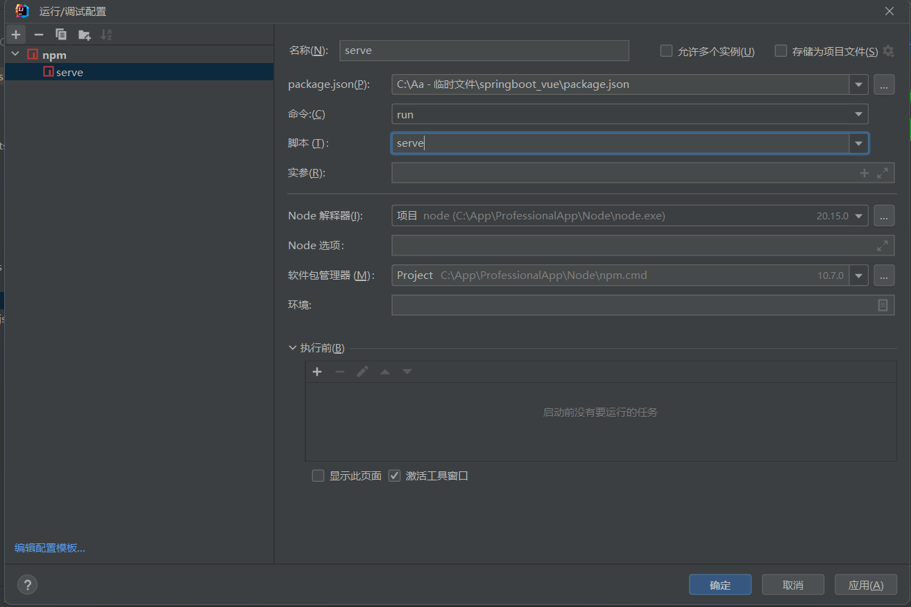

4.安装element-plus，在springboot_vue项目目录下输入指令npm install element-plus --save，可以通过npm list查看已安装的包

5.修改端口，默认也是8080，在vue.config.js添加一段代码

```java
const { defineConfig } = require('@vue/cli-service')
module.exports = defineConfig({
  transpileDependencies: true
})

//下面代码自己加入，实现修改端口
module.exports={
  devServer:{
    port:10000//启动端口
  }
}
```


## (2)后端项目

1.创建springboot-furn的maven项目

2.引入依赖

```xml
<?xml version="1.0" encoding="UTF-8"?>
<project xmlns="http://maven.apache.org/POM/4.0.0"
         xmlns:xsi="http://www.w3.org/2001/XMLSchema-instance"
         xsi:schemaLocation="http://maven.apache.org/POM/4.0.0 http://maven.apache.org/xsd/maven-4.0.0.xsd">
    <modelVersion>4.0.0</modelVersion>

    <groupId>com.hspedu</groupId>
    <artifactId>springboot-furn</artifactId>
    <version>1.0-SNAPSHOT</version>
    <!--导入springboot父工程-规定写法-->
    <parent>
        <artifactId>spring-boot-starter-parent</artifactId>
        <groupId>org.springframework.boot</groupId>
        <version>2.5.3</version>
    </parent>
    <dependencies>
        <!--引入web starter-->
        <dependency>
            <groupId>org.springframework.boot</groupId>
            <artifactId>spring-boot-starter-web</artifactId>
        </dependency>

        <!--引入mysql驱动: 这里老师使用版本仲裁 8.0.26-->
        <dependency>
            <groupId>mysql</groupId>
            <artifactId>mysql-connector-java</artifactId>
        </dependency>


        <!--引入配置处理器 -->
        <dependency>
            <groupId>org.springframework.boot</groupId>
            <artifactId>spring-boot-configuration-processor</artifactId>
        </dependency>

        <!--引入lombok-->
        <dependency>
            <groupId>org.projectlombok</groupId>
            <artifactId>lombok</artifactId>
        </dependency>

        <!--引入test starter-->
        <dependency>
            <groupId>org.springframework.boot</groupId>
            <artifactId>spring-boot-starter-test</artifactId>
        </dependency>

        <!--引入druid依赖-->
        <dependency>
            <groupId>com.alibaba</groupId>
            <artifactId>druid</artifactId>
            <version>1.1.17</version>
        </dependency>

        <!--引入mybatis-plus starter-->
        <!-- https://mvnrepository.com/artifact/com.baomidou/mybatis-plus-boot-starter -->
        <dependency>
            <groupId>com.baomidou</groupId>
            <artifactId>mybatis-plus-boot-starter</artifactId>
            <version>3.4.3</version>
        </dependency>


        <!--引入hibernate-validator - 支持了JSR303的数据校验
        老师提醒: 如果小伙伴没有提示6.1.0.Final
        请手动填写
        -->
        <dependency>
            <groupId>org.hibernate</groupId>
            <artifactId>hibernate-validator</artifactId>
            <version>6.1.0.Final</version>
        </dependency>
    </dependencies>

</project>
```

3.application.xml配置

```yml
server:
  port: 8080  #默认也是8080
spring:
  datasource:
    driver-class-name: com.mysql.cj.jdbc.Driver
    username: root
    password: hsp
    url: jdbc:mysql://localhost:3306/springboot_vue?useSSL=true&useUnicode=true&characterEncoding=UTF-8
mybatis-plus:
  configuration:
    #这里我们配置输出底层的sql,方便我们观察sql
    log-impl: org.apache.ibatis.logging.stdout.StdOutImpl
```

4.具体代码

（1）Result\<T>类

```java
package com.hspedu.furn.util;

import lombok.Data;

/**
 * @author 韩顺平
 * @version 1.0
 * 老韩说明
 * 1. Result<T> 自定义泛型类
 * 2. Result<T> 对象就是后端返回给前端的数据，是以json格式返回
 */
public class Result<T> {
    private String code; //状态码
    private String msg; //对状态说明
    private T data; // 返回时，携带的数据, 为了扩展性好，老师使用泛型

    public String getCode() {return code;}

    public void setCode(String code) {this.code = code;}

    public String getMsg() {return msg;}

    public void setMsg(String msg) {this.msg = msg;}

    public T getData() {return data;}

    public void setData(T data) {this.data = data;}

    //无参构造器
    public Result() { }

    //带参构造器-指定返回的data
    public Result(T data) {
        this.data = data;
    }

    //编写方法-返回需要的Result对象-表示成功的Result
    public static Result success() {
        Result result = new Result<>();
        result.setCode("200");
        result.setMsg("success");
        return result;
    }

    //编写方法-返回需要的Result对象-表示成功的Result,同时可以携带数据
    //如果需要在static方法使用泛型，需要在 static <T>
    public static <T> Result<T> success(T data) {
        Result<T> result = new Result<>(data);
        result.setCode("200");
        result.setMsg("success");
        return result;
    }

    //编写方法-返回需要的Result对象-表示失败的Result
    public static Result error(String code, String msg) {
        Result result = new Result<>();
        result.setCode(code);
        result.setMsg(msg);
        return result;
    }

    //编写方法-返回需要的Result对象-表示失败的Result,同时可以携带数据
    public static <T> Result<T> error(String code, String msg, T data) {
        Result<T> result = new Result<>(data);
        result.setCode(code);
        result.setMsg(msg);
        return result;
    }
}
```

(2)分页查询

MybatisPlusConfig.java

```java
@Configuration
public class MybatisPlusConfig {
    /**
     * 老师梳理
     * 1、注入MybatisPlusInterceptor 对象/bean
     * 2. 在MybatisPlusInterceptor bean 加入分页插件 PaginationInnerInterceptor
     */
    @Bean
    public MybatisPlusInterceptor mybatisPlusInterceptor() {
        MybatisPlusInterceptor interceptor = new MybatisPlusInterceptor();
        //这里分页需要指定数据库类型,因为不同的DB,分页SQL语句不同
        interceptor.addInnerInterceptor(new PaginationInnerInterceptor(DbType.MYSQL));
        return interceptor;
    }
}
```

```java
 /**
     * @param pageNum  显示第几页 ,默认1
     * @param pageSize 每页显示几条记录 , 默认5
     * @return
     */
    @GetMapping("/furnsByPage")
    public Result listFurnsByPage(@RequestParam(defaultValue = "1") Integer pageNum,
                                  @RequestParam(defaultValue = "5") Integer pageSize) {

        //这里通过page方法，返回Page对象, 对象中就封装了分页数据
        Page<Furn> page = furnService.page(new Page<>(pageNum, pageSize));
        //这里我们注意观察，返回的page数据结构是如何的?这样你才能指定在前端如何绑定返回的数据
        return Result.success(page);
    }

    //方法: 可以支持带条件的分页检索

    /**
     * @param pageNum  显示第几页
     * @param pageSize 每页显示几条记录
     * @param search   检索条件: 家居名 , 默认是“”, 表示不带条件检索，正常分页
     * @return
     */
    @GetMapping("/furnsBySearchPage")
    public Result listFurnsByConditionPage(
            @RequestParam(defaultValue = "1") Integer pageNum,
            @RequestParam(defaultValue = "5") Integer pageSize,
            @RequestParam(defaultValue = "") String search) {

        //先创建QueryWrapper, 可以将我们的检索条件封装到QueryWrapper
        QueryWrapper<Furn> queryWrapper = Wrappers.query();
        //判断search 是否有内容
        if (StringUtils.hasText(search)) {
            //这里的column对应表中的字段
            queryWrapper.like("name", search);
        }

        Page<Furn> page = furnService.page(new Page<>(pageNum, pageSize), queryWrapper);

        return Result.success(page);
    }


    //我们编写方法,使用LambdaQueryWrapper封装查询条件，完成检索

    @GetMapping("/furnsBySearchPage2")
    public Result listFurnsByConditionPage2(
            @RequestParam(defaultValue = "1") Integer pageNum,
            @RequestParam(defaultValue = "5") Integer pageSize,
            @RequestParam(defaultValue = "") String search) {

       

		//老师说明:关于lambda表达式, 我们这里使用的是 类名::实例方法
        //老韩解读

        //1. Furn::getName 就是通过lambda表达式引用实例方法 getName
        //2. 这里就是把  Furn::getName 赋给 SFunction<T,R> 函数式接口 ? 函数式接口老韩一会再说明
        //3. 看看  SFunction<T,R> 源码
        /**
         * @FunctionalInterface
         * public interface SFunction<T, R> extends Function<T, R>, Serializable {
         * }
         * 父接口
         * @FunctionalInterface
         * public interface Function<T, R> {
         *    R apply(T t); //抽象方法: 表示根据类型T的参数，获取类型R的结果
         *
         *    //后面还有默认实现方法
         * }
         *4. 传入 Furn::getName 后, 就相当于实现了 SFunction<T, R> 的apply方法
         *5. 底层会根据 传入的 Furn::getName 去得到该方法的对应的属性映射的表的字段, 可以更加灵活
         *6. 老师回顾一下mybatis 在xxMapper.xml 中有 ResultMap 会体现 Bean的属性和表的字段的映射关系
         * <resultMap id="IdenCardResultMap" type="IdenCard">
         *         <id property="id" column="id"/>
         */


        //创建LambdaQueryWrapper，封装检索询件
        LambdaQueryWrapper<Furn> lambdaQueryWrapper = Wrappers.<Furn>lambdaQuery();

        //判断search
        if (StringUtils.hasText(search)) {
            //后面老师会解读 Furn::getName, 这里会引出一系列的知识点.
            //lambdaQueryWrapper.like(Furn::getName,search);

            //老韩换一个写法-小伙伴可能会清晰, 这时使用依然是正确
            SFunction<Furn, Object> sf = Furn::getName;
            lambdaQueryWrapper.like(sf, search);
        }

        Page<Furn> page = furnService.page(new Page<>(pageNum, pageSize), lambdaQueryWrapper);
        log.info("page={}", page.getRecords());
        return Result.success(page);
    }

```

