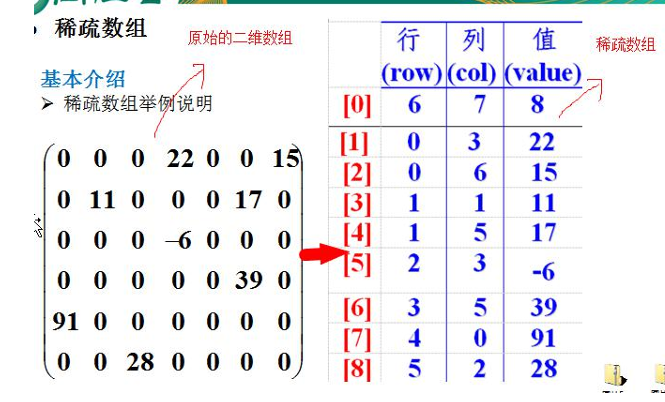
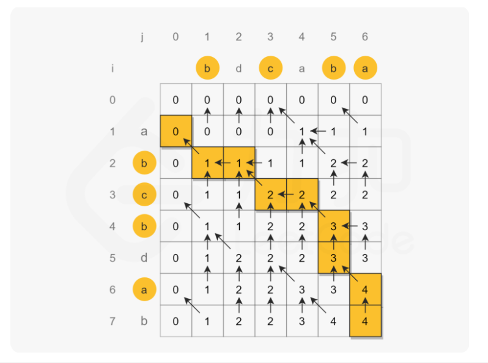
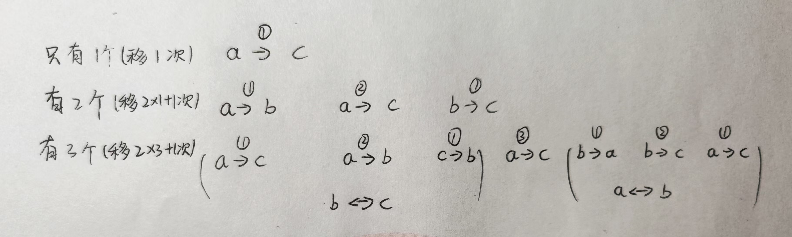

# 数据结构与算法

## 1.常用方法

### (1)字符串处理

1.替换： str.replaceAll("java","替换后字符")

2.数据类型转换：例如，将字符串转换为整型`int`，可以使用`Integer.parseInt()`方法；将字符串转换为浮点型`double`，可以使用`Double.parseDouble()	`			  方法等。

3.基本类型转字符串：`integer.toString()`;在Java中，基本类型和引用类型不能直接进行转换，必须使用包装类来实现。例如将一个int类型的值转换为String类			  型，必须首先将其转换为Integer类型，然后再转换为String类型。

4.str.getBytes与str.toCharArray区别：返回`字节数组`(默认为平台默认编码，通常是UTF-8)与`字符数组`(用不到编码，因为字符串是由字符构成的不需要转换)


### (2)输入输出

1.格式化输出：System.out.printf("%d\t%d\t%d\t\n", a,b,c);

2.输入：Scanner scanner = new Scanner(System.in);


### （3）随机数生成

> 使用 Math.random()：
> double randomValue = Math.random(); // 生成 [0.0, 1.0) 之间的随机数
> int randomValue = (int)(Math.random() * (max - min + 1)) + min;  // 生成 [min, max] 范围内的随机整数

> 使用 Random 类：
> Random random = new Random();
> int randomValue = random.nextInt(100);  // 生成 [0, 100) 之间的随机整数
>
> int randomValue = random.nextInt(max - min + 1) + min;  // 生成 [min, max] 范围内的随机整数
> boolean randomBool = random.nextBoolean();  // 生成随机布尔值
> double randomValue = random.nextDouble();  // 生成 [0.0, 1.0) 之间的随机浮点数


## 2.数据结构

### (1)稀疏数组

稀疏数组的处理方法是:

1)记录数组一共有几行几列，有多少个不同的值

2)把具有不同值的元素的行列及值记录在一个小规模的数组中，从而缩小程序的规模



```java

```


### (2)队列

1.数组模拟队列

2.数组模拟环形队列(通过取模的方式来实现即可)

1)尾索引的下一个为头索引时表示队列满，即将队列容量空出一个作为约定,这个在做判断队列满的 时候需要注意 (rear+1)%maxSize==front 满]

2)rear == front [空]

```java
// 添加数据到队列时
//将 rear 后移, 这里必须考虑取模
rear = (rear + 1) % maxSize;

// 获取队列的数据, 出队列
 front = (front + 1) % maxSize;

//求出当前队列有效数据的个数
publicintsize(){
 //rear=2
 //front=1
 //maxSize=3
 return(rear+maxSize-front)%maxSize;
 }
```


### (3)链表

1.单链表

(1)反转链表

```java
public static void reverseList(HeroNode heroNode){
    if(heroNode.next==null ||heroNode.next.next==null){
        return;
    }
    HeroNode cur = heroNode.next;
    //HeroNode next = null;
    HeroNode reverseNode = new HeroNode(0,'','');
    //遍历原来的链表，每遍历一个节点，就将其取出，并放在新的链表reverseHead的最前端
    while(cur!=null){
        //next =cur.next;
        cur.next = reverseNode.next;
        reverseNode.next = cur;
        //cur =next;
        cur =cur.next;
    }
    herNode.next = reverseNode.next;
}
```


2.双向链表


## 3.算法


### 扩展：

#### (1) 如何将HashMap中的数据根据键值排序后输出


>  按 Value 升序/降序排序（存入 LinkedHashMap）
>
> 1.将 `HashMap` 的 `entrySet` 转换为 `List`。
>
> 2.使用 `Collections.sort()` 对 `List` 按 `value` 进行排序。
>
> 3.将排序后的 `List` 存入 `LinkedHashMap`（保持排序顺序


> 使用 Stream API（Java 8+，更简洁）
>
> ---
>
> //呃，这种方法最后一步collect有点太复杂了，建议用第二种就好了容易理解
>
> Map<String, Integer> sortedMap = map.entrySet()
>         .stream()
>         .sorted(Map.Entry.comparingByValue())  // 按值升序
>         .collect(LinkedHashMap::new, (m, v) -> m.put(v.getKey(), v.getValue()), Map::putAll);
>
> System.out.println(sortedMap); // {banana=2, date=3, apple=5, cherry=8}
>
> ----
>
> 另一种方式：
>
> // 直接对 map.entrySet() 进行排序
> List<Map.Entry<String, Integer>> sortedEntries = map.entrySet()
>         .stream()
>         .sorted(Map.Entry.comparingByValue()) // 按值排序
>         .collect(Collectors.toList()); // 转换为 List
>
> // 输出排序后的结果
> sortedEntries.forEach(entry -> 
>     System.out.println(entry.getKey() + " -> " + entry.getValue()));
>
> ---
>
> `Set` 不能排序，但 Stream 可以，Set 本身是**无序**的，`Stream 只是数据的视图，不改变原集合，
>
> 所以Stream.sorted() 不会改变 Set 本身的无序性，它只是创建了一个**有序的视图**，最终存入 `List` **才是有序的**。


> ```java
> list.sort(Map.Entry.comparingByValue());//Map.Entry.comparingByValue()生成一个按 `Value` 进行比较的 Comparator。默认是升序
> 
> //list.sort(Map.Entry.comparingByValue(Comparator.reverseOrder()));**按 `Value` 降序** 排序
> ```
>
> 等价于：
>
> ```java
> Comparator<Map.Entry<String,Integer>> comparator = (e1, e2) -> e1.getValue().compareTo(e2.getValue());
> 
> //Comparator comparator = ... ;也可以不带泛型，不过可能会导致类型安全问题，因为编译器无法检查可能导致 `ClassCastException`
> 
> list.sort(comparator);
> ```


```java
import java.util.*;

public class HashMapSortByValue {
    public static void main(String[] args) {
        Map<String, Integer> map = new HashMap<>();
        map.put("apple", 5);
        map.put("banana", 2);
        map.put("cherry", 8);
        map.put("date", 3);

        // 1. 获取 entrySet 并转换成 List
        List<Map.Entry<String, Integer>> list = new ArrayList<>(map.entrySet());

        // 2. 按值（Value）升序排序
        list.sort(Map.Entry.comparingByValue());

        // 3. 重新存入 LinkedHashMap（保持排序顺序）
        Map<String, Integer> sortedMap = new LinkedHashMap<>();
        for (Map.Entry<String, Integer> entry : list) {
            sortedMap.put(entry.getKey(), entry.getValue());
        }

        System.out.println(sortedMap); // {banana=2, date=3, apple=5, cherry=8}
    }
}

```


#### (2)split正则表达式


1.方括号`[]`表示字符类，用于匹配==其中任意一个==字符。例如:`[abc]`匹配`'a'`、`'b'` 或 `'c'`;  `[0-9]` 匹配任何数字;  `[a-zA-Z]` 匹配任何英文字母

2.`\p{Punct}` 是 **Unicode 正则表达式** 语法，表示 **匹配所有标点符号**，等价于 **所有的 `.,!?;:'"` 及其他符号**。

3.`\s` 代表 **空白字符**，包括：空格（`' '`）,制表符（`\t`）,换行符（`\n`）,回车符（`\r`）,垂直制表符（`\v`）,换页符（`\f`）

4. '+'代表一个或多个，'*'代表0个或多个


> 如
>
> String[] words = line.split("[\\\p{Punct}\\\s]+"); //多次匹配所有标点符号或空格
>
> String[] result = str.split("\\\s+");  //`\\s+` 匹配 **一个或多个空白字符**
>
> String[] result = str.split("\\\\."); //按小数点拆分
>
> String[] result = str.split("[\^a-zA-Z]+"); //按非字母字符拆分（`[^a-zA-Z]+`），适用于 **提取纯单词**，和"[\\\p{Punct}\\\s]+"作用差不多


空字符串在正则分割时，`split` 方法返回的是一个 **包含一个空字符串的数组**。

这意味着，空字符串 `""` 被当作一个元素放入返回的数组中，而不会返回一个空数组

所以如果读取一个文件，在文本内容的末尾有几行用换行打出来的空行，这种情况下会读出空字符串，bf.readLine()不会返回null

> String[] result = "".split("[\\p{Punct}\\s]+");
> System.out.println(Arrays.toString(result));   //[""]
>
> 这意味着，空字符串 `""` 被当作一个元素放入返回的数组中，而不会返回一个空数组。


### (1)最长公共子序列


一个字符串的 **子序列** 是指这样一个新的字符串：它是由原字符串在不改变字符的相对顺序的情况下删除某些字符（也可以不删除任何字符）后组成的新字符串。

- 例如，`"ace"` 是 `"abcde"` 的子序列，但 `"aec"` 不是 `"abcde"` 的子序列。

两个字符串的 **公共子序列** 是这两个字符串所共同拥有的子序列。




```java
 public int longestCommonSubsequence(String text1, String text2) {
        int m=text1.length(),n=text2.length();
        int[][] dp =new int[m+1][n+1];

        for(int i=1;i<=m;i++){
            for(int j=1;j<=n;j++){
                if(text1.charAt(i-1)==text2.charAt(j-1)){
                    dp[i][j]=dp[i-1][j-1]+1;

                }else{
                    dp[i][j]=Math.max(dp[i-1][j],dp[i][j-1]);
                }
            }
        }
        return dp[m][n];
     
		// 回溯获取 LCS
        StringBuilder str = new StringBuilder();
        int i = m, j = n;
        while(i>0&&j>0){
            if(text1.charAt(i-1)==text2.charAt(j-1)){
                str.append(text1.charAt(i-1));
                i--;
                j--;
            }else if (dp[i - 1][j] >= dp[i][j - 1]) {
                i--;  // 向上移动
            } else {
                j--;  // 向左移动
            }

           
        }
       //return str.reverse().toString();
    }
```


### (2)爬楼梯

假设你正在爬楼梯。需要 `n` 阶你才能到达楼顶。

每次你可以爬 `1` 或 `2` 个台阶。你有多少种不同的方法可以爬到楼顶呢

```java
public int climbStairs(int n) {
        if(n<3){
            return n;
        }
        return climbStairs(n-1) + climbStairs(n-2);
    }

```

但是使用递归方法在n比较大的时候会超时，原因是多了很多重复的计算。

```java
public int climbStairs(int n) {
        if(n<3){
            return n;
        }
        int[] result = new int[n+1];
        result[1]=1;
        result[2]=2;
        for(int i = 3; i<=n; i++){
            result[i] = result[i-1]+result[i-2];
            
        }
        return result[n];

```


### (4)兔子繁殖问题

有一对兔子，从出生后第三个月起每个月都生一对兔子，小兔子长到第三个月后每个月又生一对兔子，假如兔子都不死，计算第N个月有多少对兔子

注意观察：前五个月兔子对数分别是：1，1，2，3，5

本质还是斐波那契数列


### (5)读取文件查找字符串类

#### 1.统计文件出现某个单词的出现次数


> **`Pattern.compile(String regex, int flags)`**
>
> - **`regex`**：要匹配的正则表达式
> - **`flags`**：匹配模式，`Pattern.CASE_INSENSITIVE` 代表忽略大小写
>
> ---
>
> #### **`"\\b" + Pattern.quote(word) + "\\b"`**
>
> 这里构造了一个正则表达式：
>
> - **`\\b`**：**单词边界**，确保匹配的是完整的单词，而不是 "java" 误匹配到 "javascript"
> - `Pattern.quote(word)`: 确保 `word` 作为**普通文本**匹配，而不是正则表达式
>   - 例子：如果 `word = "c++"`，正则中 `+` 是特殊字符，直接拼接 `\bword\b` 可能会报错
>   - 解决方案：`Pattern.quote("c++")` 转义后变成 `\Qc++\E`，确保 `+` 只是普通字符
>
> ---
>
> Matcher matcher = pattern.matcher(line);
>
> 创建一个 `Matcher` 对象，用于匹配 `line` 这行文本,检查 `line` 中是否包含 `pattern`（即 `word`）
>
> 
>
> `matcher.find()` 用于**查找下一个匹配的子串**。
>
> 每次调用 `find()`，匹配的位置会向后移动，直到找不到新的匹配项返回 `false`。
>
> `matcher.find()` 会找到 `line` 里所有符合 `pattern` 的 **匹配项**
>
> ---
>
> 为避免查找的字符串被分割成两行，也可以用StringBuilder来把读取的行信息拼接到一个完整的字符串上
>
> StringBuilder text = new StringBuilder();
>
> text.append(line).append(" ");


```java
public static int countWordInFile(String filePath, String word) {
        int count = 0;
        String line;
        // 正则表达式，确保匹配完整单词（\bword\b）
        Pattern pattern = Pattern.compile("\\b" + Pattern.quote(word) + "\\b", Pattern.CASE_INSENSITIVE);

        try (BufferedReader br = new BufferedReader(new FileReader(filePath))) {
            while ((line = br.readLine()) != null) {
                Matcher matcher = pattern.matcher(line);
                while (matcher.find()) {
                    count++;
                }
            }
        } catch (IOException e) {
            System.out.println("文件读取失败: " + e.getMessage());
        }
        return count;
    }
```


#### 2.统计单词

从一个文本中读取数据，并统计分析数据中各个单词出现的次数

> BufferReader bf = new BufferReader(new FileReader(filepath))
>
> ---
>
> String[] words = line.split("[\\\p{Punct}\\\s]+");  //也可以用("`[^a-zA-Z]+`”）
>
> word = word.toLowerCase();
>
> ---
>
> e.printStackTrace();主要用于**打印异常的详细堆栈信息**,在控制台中输出
>
> ---
>
> 
>
> map.put(word,map.getOrDefault(word,0)+1);
>
> `getOrDefault(K key, V defaultValue)` 是 **Java `Map` 接口** 提供的方法，用于在 **获取键对应的值时**，如果键不存在，则返回指定的默认值。

```java
public void  analyzeText(String  filepath){
		
		String line;
		Map<String,Integer> map = new HashMap();
	
		try(BufferReader bf = new BufferReader(new FileReader(filepath))){
			while((line=bf.readline())!=null){
				String[] words = line.split("[\\p{Punct}\\s]+");
				for(String word: words){
					word = word.toLowerCase();
                    map.put(word,map.getOrDefault(word,0)+1);
					

                    //        Boolean flag =true;
                    //        for(String key : map.keySet){
                    //            if(key.eauals(word)){
                    //                map.put(key,map.get(key)+1);
                    //                flag =false;
                    //            }
                    //        }
                    //        if(flag){
                    //            map.put(word,1);
                    //        }
					
				}				
				
			}
	
		}catch(Exception e) {
			e.printStackTrace();
		}
		
		for(Map.Entry<String,Integer>entry: map.entrySet()){
				
				System.out.println("单词"+entry.getKey()+", 出现"+entry.getValue()+"次")；
			}
    //--------------------------------------------------------------------
    //如果需要排序输出可以按照下面方式
    
       //List<Map.Entry<String, Integer>> entries = new ArrayList<>(map.entrySet());
       //entries.sort(Map.Entry.comparingByValue());

        List<Map.Entry<String, Integer>> list = map.entrySet()
                .stream()
                //.sorted(Map.Entry.comparingByValue(Comparator.reverseOrder()))
                .sorted(((o1, o2) -> o2.getValue().compareTo(o1.getValue())))
                .collect(Collectors.toList());
        list.forEach(elment-> System.out.println(elment.getKey()+"->"+elment.getValue()));

        LinkedHashMap<String, Integer> linkedHashMap = new LinkedHashMap<>();
        for (Map.Entry<String, Integer> entry : list) {
            linkedHashMap.put(entry.getKey(),entry.getValue());
        }
        System.out.println(linkedHashMap);
    
     
    
}
```


#### 3.


### (6)递归类

#### 1.递归查找后代

现有一个·Cat类，有id,parentId,name三个字段，现在给你一个List<Cat>,要求找出name=xxx的cat即其所有后代

```java
import java.util.ArrayList;
import java.util.List;

public class CatHierarchy {
    
     public static void main(String[] args) {
        List<Cat> cats = new ArrayList<>();
        cats.add(new Cat(1, 0, "Tom"));
        cats.add(new Cat(2, 1, "Jerry"));
        cats.add(new Cat(3, 1, "Mickey"));
        cats.add(new Cat(4, 2, "Minnie"));
        cats.add(new Cat(5, 3, "Donald"));
        cats.add(new Cat(6, 5, "Goofy"));

        String targetName = "Tom";
        List<Cat> result = search(cats, targetName);

        System.out.println("Cat and its descendants:");
        for (Cat cat : result) {
            System.out.println("ID: " + cat.getId() + ", Name: " + cat.getName());
        }
    }
    
    
    
    

    // 找到目标Cat以及所有后代
    public static List<Cat> search(List<Cat> cats, String targetName) {
        List<Cat> result = new ArrayList<>();
      
        for (Cat cat : cats) {
            if (cat.getName().equals(targetName)) {
               
                result.add(targetCat);
            	searchChild(cats, cat.getId(), result);
            }
        }
        
        return result;
    }

    
    // 递归查找后代
    private static void searchChild(List<Cat> cats, int parentId, List<Cat> result) {
        for (Cat cat : cats) {
            if (cat.getParentId() == parentId) {
                result.add(cat);  // 加入当前子代
                searchChild(cats, cat.getId(), result); // 递归查找当前子代的后代
            }
        }
        
        
        //下面代码和上面一样
        /**
        List<Cat> collect = cats.stream()
                .filter(cat -> (cat.getParentId() == parentId))
                .collect(Collectors.toList());

        for (Cat cat : collect) {
            list.add(cat);
            searchChild(list,cats, cat.getId());
        }
        */
        
    }  
}

@Data
class Cat{
    private int id;
    private int parentId;
    private String name;
    //...
}
```

 

#### 2.汉诺塔




```java
public class test3 {
    private static int moveCount = 0; // 记录移动次数

    public static void main(String[] args) {
        int n = 3; // 盘子的数量
        hanoi(n, 'A', 'C', 'B'); // A 是起始柱，C 是目标柱，B 是辅助柱
    }

    public static void hanoi(int n, char from, char to, char aux) {
        if (n == 1) {
            moveCount++;
            System.out.println("第 " + moveCount + " 次移动: 移动盘子 1 从 " + from + " 到 " + to);
            return;
        }
        hanoi(n - 1, from, aux, to); // 先将 n-1 个盘子从 from 移动到 aux
        moveCount++;
        System.out.println("第 " + moveCount + " 次移动: 移动盘子 " + n + " 从 " + from + " 到 " + to);
        hanoi(n - 1, aux, to, from); // 再将 n-1 个盘子从 aux 移动到 to
    }
}
```

> 第 1 次移动: 移动盘子 1 从 A 到 C
> 第 2 次移动: 移动盘子 2 从 A 到 B
> 第 3 次移动: 移动盘子 1 从 C 到 B
> 第 4 次移动: 移动盘子 3 从 A 到 C
> 第 5 次移动: 移动盘子 1 从 B 到 A
> 第 6 次移动: 移动盘子 2 从 B 到 C
> 第 7 次移动: 移动盘子 1 从 A 到 C

#### 3.快速排序


#### 4.希尔排序


## 4.sql语句

(1)一张学生成绩表score，，有name,course,grade三个字段，用一条SQL语句查出每门课都大于80的学生姓名

> SELECT name
> FROM score
> GROUP BY name
> HAVING MIN(grade) > 80;


> SELECT DISTINCT name
> FROM score s1
> WHERE NOT EXISTS (
>     SELECT 1
>     FROM score s2
>     WHERE s1.name = s2.name AND s2.grade <= 80
> );


> SELECT DISTINCT name
> FROM score s1
> WHERE name NOT IN (
>     SELECT name
>     FROM score s2 
>     WHERE s2.grade <= 80
> );


# java八股

分组1：

1.八种基本的数据类型


## 1.Spring


控制反转：(inversion of control,简称ioC)是一种设计思想，他将对象的创建和依赖关系的管理从程序代码中转移到外部容器中


Spring是一个开源的Java框架，旨在简化Java应用程序的开发,

Spring框架的核心思想是“依赖注入”（Dependency Injection）和“面向切面编程”（Aspect-Oriented Programming）


**Spring Boot**：简化了Spring应用程序的配置和部署，使得开发者可以快速启动一个Spring应用


